# python 方面

## 零散总结

1. 树的层次遍历就是图的 bfs，n 个节点，n+1 条边的连通图其实就是树

## 树

小红书上那道轰炸题目，见题目汇总里面，提到了树的最大独立集，在此记录一下

### 最大独立集

独立集是个集合 ，集合中的任意两个节点都没有路径，也就是不能直接到达，而众多独立集中，节点最多的叫做最大独立集。

由于树是无环连通图，最大独立集问题可以在多项式时间内解决（使用动态规划）。

#### 算法实现：树形 DP

##### DP 状态定义

对于树中的每个节点 `u`，定义两个状态：

- `dp[u][0]`：不选择节点 `u` 时，以 `u` 为根的子树的最大独立集大小
- `dp[u][1]`：选择节点 `u` 时，以 `u` 为根的子树的最大独立集大小

如果选择节点 u，则不能选择其直接子节点

`dp[u][1] = 1 + sum(dp[v][0] for v in children[u]])`

如果不选择节点 u，则子节点可选可不选（取最大值）

`dp[u][0] = sum(max(dp[v][0], dp[v][1]) for v in children[u]])`

# 机器学习

分类和回归都属于监督学习，有时候一个东西又能做分类又能做回归。

## 回归与分类

- 回归通常使用均方误差损失 MSE，其定义符合回归的直观需求，和回归的输出特性一样（不要求 Y 的特点区间）。并且 MSE 对分类不敏感，比如会将-0,5 和 0.5 处理成一样的。
- 而分类任务需要衡量概率分布的差异，因此往往用交叉熵损失。

另外，分类的概率都 ∈(0,1)，并且所有分类的概率和为 1，回归则没有这个限制。

逻辑回归可以预测新数据的分类，属于**判别式分类模型。**

不能预测新数据的分类方法，属于**生成式分类模型**

（聚类中叫做归纳聚类和非归纳聚类，前者能预测新的）

## 线性回归

只是一次函数关系的，没有更高次。

- 线性：两个变量之间的关系**是**一次函数关系的——图象**是直线**，叫做线性。
- 非线性：两个变量之间的关系**不是**一次函数关系的——图象**不是直线**，叫做非线性。
- 回归：人们在测量事物的时候因为客观条件所限，求得的都是测量值，而不是事物真实的值，为了能够得到真实值，无限次的进行测量，最后通过这些测量数据计算**回归到真实值**，这就是回归的由来。

### 正则化 L1,L2

L1，L2，本质都是调整权重，表现出来是删小减大，一般优先考虑 L2 回归，当维度高并且很稀疏时再考虑 L1

**L1 正则**，Lasso 回归，容易得到稀疏矩阵，**(Lasso 回归)可以使得一些特征的系数变小,甚至还使一些绝对值较小的系数直接变为 0**，

)

**L2 正则**，岭回归，**会将较大的权重缩小**，让平滑一些，不容易得到稀疏矩阵


**ElasticNet 综合了 L1 正则化项和 L2 正则化项**，以下是它的公式：

^2+\lambda\sum_{j=1}^{n}\theta_j^2]+\lambda\sum_{j=1}^{n}|\theta|))

：：补充

从最大后验的角度来看，L1L2 正则化相当于给参数引入了一个先验分布，L1 对应拉普拉斯分布，L2 对应高斯分布。

因为**argmin[损失函数 + 正则项] = argmax[似然函数 × 先验分布]**

没有正则化时：损失函数 = 只看预测误差

有了正则化后：损失函数 = 预测误差 + λ × 参数大小的惩罚

**等价于：我不只看你这次预测准不准，还要看你的参数是不是太大。我认为参数不应该太大，这是我的先验信念。 （相当于告诉模型，我认为参应该长什么样子）**

| 操作         | 频率学派视角   | 贝叶斯学派视角           |
| ------------ | -------------- | ------------------------ |
| 加 L2 正则项 | 惩罚大参数     | 认为参数服从高斯分布     |
| 加 L1 正则项 | 产生稀疏解     | 认为参数服从拉普拉斯分布 |
| 目标         | 最小化损失函数 | 最大化后验概率           |

L2：高斯分布（正常分布）→ 参数值集中在 0 附近但不为 0

L1：拉普拉斯分布 → 参数值要么接近 0，要么明显不为 0

## 逻辑回归 LR

说是回归，其实主要用来做分类。用线性回归的输出直接分类的效果差，因此先将线性回归的输出作为 sigmoid 的输入，这样输出为（0，1）之间，再通过设置概率阈值进行分类。

线性回归的输出 $Y = aX + b$ 是连续值（范围$-\infty \sim +\infty$），无法直接用于分类（如预测类别 0/1）。强行用阈值分割会导致对异常值敏感且解释性差。

**ps：：**

- 线性回归的输出是连续值（范围$(-\infty, +\infty)$），而分类任务需要离散的类别标签（如 0/1）。 直接使用回归输出作为分类概率缺乏合理性，因为概率需满足$[0,1]$范围且总和为 1。回归输出可能超出此范围，无法解释为概率。
- 线性回归对异常值敏感，如果直接用来分类，那因为异常点太大，又通过 MSE 放大误差，导致分类的结果被异常点干扰大

线性回归的输出 $Y = aX + b$ 是连续值（范围$-\infty \sim +\infty$），无法直接用于分类（如预测类别 0/1）。强行用阈值分割会导致对异常值敏感且解释性差。

通过 Sigmoid 函数将线性回归的输出映射到 **[0,1]**，表示概率：

$$
S = \sigma(Y) = \frac{1}{1 + e^{-Y}} = \frac{1}{1 + e^{-(aX + b)}}
$$

- 当 $Y \to +\infty$，$S \to 1$；当 $Y \to -\infty$，$S \to 0$。
- 输出$S$可解释为样本属于正类的概率 $P(Y=1|X)$。
- 决策边界是线性超平面 $aX + b = 0$（即 Sigmoid 输入为 0 时输出恰为 0.5）

### 为什么是 Sigmoid 函数

**概率解释**：输出天然满足概率定义 $S \in [0,1]$。

**可导性**：导数简单：$\sigma'(z) = \sigma(z)(1 - \sigma(z))$，便于梯度下降优化。

**广义线性模型**：逻辑回归是广义线性模型（GLM）的特例。

### 损失函数

**损失函数（交叉熵损失）**

$$
\mathcal{L} = -\sum_{i} \left[ y_i \log(S_i) + (1-y_i) \log(1-S_i) \right]
$$

- $y_i$：真实标签（0 或 1）
- $S_i$：预测概率
- 
- **优化方法**
  梯度下降法迭代更新参数：

  $$
  a \leftarrow a - \eta \cdot \frac{\partial \mathcal{L}}{\partial a}
  $$

### 逻辑回归的扩展

| 扩展方向             | 说明                                                                    |
| -------------------- | ----------------------------------------------------------------------- |
| **多分类**     | 通过 Softmax 函数推广（One-vs-Rest 或 Multinomial Logistic Regression） |
| **非线性边界** | 添加多项式特征或核方法                                                  |
| **正则化**     | 加入 L1/L2 正则项（如 Lasso 或 Ridge）                                  |

---

### 与其他模型的对比

| 特性               | 逻辑回归      | 线性回归        |
| ------------------ | ------------- | --------------- |
| **输出类型** | 概率（0~1）   | 连续值          |
| **损失函数** | 交叉熵损失    | 均方误差（MSE） |
| **应用场景** | 二分类/多分类 | 回归问题        |

### 逻辑回归为什么用交叉熵损失函数：

因为交叉熵对错误的惩罚更严重

- 真实标签：$y=1$（属于正类），
- 模型预测：$\hat{y}$表示预测为正类的概率。

**交叉熵** ：
模型会优先修正那些预测概率严重错误的样本（如真实为 1 但预测接近 0），从而快速提升分类准确性。因为交叉熵的损失值对预测概率 **y'** 的 **敏感度是非线性的** ，且在极端错误（如 **y'**≈**0** 但 **y**=**1**）时损失会急剧增大。

ps：：差异越大，梯度通常也大，而梯度一大，其参数变换幅度就大，表现为模型更关注极端错误的样本。

**MSE** ：
模型可能对严重错误“不敏感”，反而花更多精力优化那些已经接近正确的预测，因为 MSE 对$\hat{y}=0.6$和$\hat{y}=0.4$的惩罚相同（当分类阈值为 0.5 时），但前者分类正确，后者错误）。

| 预测概率$\hat{y}$ | MSE 损失$(1-\hat{y})^2$   | 交叉熵损失$-\log(\hat{y})$ |
| ------------------- | --------------------------- | ---------------------------- |
| $\hat{y}=0.9$     | $(1-0.9)^2 = 0.01$        | $-\log(0.9) \approx 0.1$   |
| $\hat{y}=0.5$     | $(1-0.5)^2 = 0.25$        | $-\log(0.5) \approx 0.69$  |
| $\hat{y}=0.1$     | $(1-0.1)^2 = 0.81$        | $-\log(0.1) \approx 2.3$   |
| $\hat{y}=0.01$    | $(1-0.01)^2 \approx 0.98$ | $-\log(0.01) \approx 4.6$  |

#### **观察结论**

1. **MSE 的惩罚** ：

- 当预测完全错误（$\hat{y} \to 0$时），损失趋近于 1， **增长缓慢** 。
- 例如，$\hat{y}$从 0.5 降到 0.1 时，MSE 仅从 0.25 增加到 0.81。

1. **交叉熵的惩罚** ：

- 当预测完全错误（$\hat{y} \to 0$时），损失趋近$+\infty$， **增长极快** 。
- 例如，$\hat{y}$从 0.5 降到 0.1 时，交叉熵从 0.69 暴增到 2.3。

#### 为什么交叉熵更严厉

- **数学原因** ：
  交叉熵中的$-\log(\hat{y})$函数在$\hat{y} \to 0$时梯度极大（导数$\frac{d}{d\hat{y}}(-\log(\hat{y})) = -\frac{1}{\hat{y}} \to -\infty$），模型会强烈修正这种错误。
  _（对比 MSE 的梯度$\frac{d}{d\hat{y}}(1-\hat{y})^2 = -2(1-\hat{y})$，在$\hat{y}=0$时梯度仅为$-2$。）_
- **分类任务的本质** ：
  分类需要明确区分“对”和“错”，交叉熵通过**对数函数**对错误预测施加指数级增长的惩罚，迫使模型快速修正严重错误。而 MSE 的对称性惩罚（对$\hat{y}>1$和$\hat{y}<0$同样惩罚）不适合概率输出。

### 逻辑回归的扩展

1。逻辑回归本来是二分类，如果多分类，可以把其当成要进行多个二分类之后的结果，这样看有点像决策树，但总之还是以二分类来依次划分，并求出最大概率结果

- 当有 K 个类别是，需要训练 K 个二分类 LR 模型，第 i 个模型负责区分类别 i 和其他所有类别，最后选择概率最高的类别为训练结果。

2。使用 softmax 回归，即多项逻辑回归，将多个线性输出转化为概率分布

| 特性                     | OvR（One-vs-Rest）       | Softmax 回归           |
| ------------------------ | ------------------------ | ---------------------- |
| **模型数量**       | **K** 个二分类模型 | 1 个多分类模型         |
| **输出概率归一化** | 否（需单独校准）         | 是（天然归一化）       |
| **适用场景**       | 类别数多或分布不平衡     | 类别数较少或需精确概率 |
| **计算效率**       | 并行训练，但总计算量大   | 单模型，更高效         |

### 优化方法

一阶方法：梯度下降、随机梯度下降、mini 随机梯度下降法

二阶方法：牛顿法，二阶泰勒展开加 Hessian 矩阵（x 的二阶导数矩阵），收敛快，计算量大；拟牛顿法是通过一个特殊表达式来模拟 Hessian 矩阵或它的逆。

#### 特征离散化

连续转化成离散的：非线性，速度快，鲁棒性，特征交叉

**特征离散化（Feature Discretization）** 是指将 **连续型特征** （如年龄、收入、温度等）转换为 **离散的分段或类别** （如“青年/中年/老年”、“低/中/高收入”）。

- 原始连续特征：年龄 = [18, 25, 30, 35, 40, ...]
- 离散化后：年龄分段 = ["18-25", "26-35", "36-45", ...]

好处：

1. **非线性**：将连续特征分段后，每段可单独学习一个权重，从而捕捉非线性模式。
2. **速度快**：稀疏向量内积乘法运算速度快，计算结果方便存储,容易扩展。
3. **鲁棒性**：同一分段内的值被视为相同，增强模型稳定性，同时异常值被处理在两端。
4. **特征交叉**：离散化后可直接构造交叉特征（如“青年+低收入”），提高表达能力。

## 随机森林

bagging 思想：并行，随机有放回地取出一部分样本训练，通过多次这样的结果，进行投票获取平均值作为结果输出.

**基本流程**

1. **Bootstrap 抽样** ：

- 从原始训练集（大小为 N）中**有放回地随机抽取**N 个样本（允许重复），形成一个子训练集（称为 Bootstrap 样本集）。
- 重复此过程 m 次，生成 m 个独立的子训练集。

  **2. 并行训练基分类器** ：
- 对每个子训练集，独立训练一个基分类器（如决策树、SVM 等）。
- 每个分类器的训练过程互不干扰。

3. **聚合预测结果** ：

- 分类任务：通过 **投票机制** （如多数表决）决定最终类别。
- 回归任务：通过**平均预测值**输出结果。

### **核心优势**

- **降低方差** ：通过多次重采样和模型平均，减少模型对特定训练数据的过拟合。
- **适合高方差模型** ：如深度较大的决策树。

随机森林：多个树的 bagging 模型，希望多，准确，针对性强，同样的数据通过多个树模型（取什么树模型也是随机的），取树模型的投票为最终结果。

**Bagging**策略来源于 bootstrap aggregation：从样本集（假设样本集 N 个数据点）中重采样选出 Nb 个样本（有放回的采样，样本数据点个数仍然不变为 N），在所有样本上，对这 n 个样本建立分类器（ID3\C4.5\CART\SVM\LOGISTIC），重复以上两步 m 次，获得 m 个分类器，最后根据这 m 个分类器的投票结果，决定数据属于哪一类，不同分类器的投票过程互不干扰。

### 决策树

ps：：决策树像是 if else 不断判断，每个节点划分一个特征属性。

树什么时候停：

1. 当前的节点的样本全是同一个类别时，就不用划分了；
2. 当前节点样本的特征值一致，或者没有可用的特征（已经用过了）
3. 没有满足符合条件的样本（节点中没有样本，空节点）

熵衡量信息量，**信息熵越低，纯度越高**，信息量越少——熵越低，越有序，越一样，所以纯度高。

树不需要归一化，因为其特征选择是阶跃的，不可导，并且其按特征值排序，数值缩放不会影响分类节点的位置。因为上述两点，所以不用归一化。

#### 决策树剪枝

预剪枝和后剪枝

预剪枝：在想分裂节点时拿验证集做测试，分裂后准确率不提高就不分裂。——可能欠拟合

后剪枝：无视过拟合，让节点生长，再自底向上尝试剪枝，若剪枝后验证集的分类准确率提高，则减掉，否则保留。——精确，但是计算量大。

#### 三个决策树

**ID3**

**核心思想** ：使用 **信息增益（Information Gain）** 来选择最优特征进行分裂，仅适用于分类。

**特点** ：

- 只能处理 **离散特征** ，不能直接处理连续值。
- 倾向于选择 **取值较多的特征** （可能导致过拟合）。
- **无剪枝策略** ，容易过拟合。

**C4.5（ID3 的改进版）**

- 由 Ross Quinlan 于 1993 年提出， **适用于分类问题** 。

**核心改进** ：

- 使用 **信息增益率（Gain Ratio）** 代替信息增益， **减少对多值特征的偏好** ，因此适用于更复杂的数据。
- **支持连续特征** （通过二分法离散化），**支持缺失值处理** 。
- **引入剪枝（Pruning）** ，防止过拟合。

信息增益率本质：是在信息增益的基础之上乘上一个惩罚参数。特征个数较多时，惩罚参数较小（0.1)；特征个数较少时，惩罚参数较大(0.5).——这以平衡取值少和取值多的特征。

**但是，又会导致\*\***信息增益率偏向取值较少的特征。\*\*

使用信息增益率：基于以上缺点，并不是直接选择信息增益率最大的特征，而是现在候选特征中找出信息增益高于平均水平的特征，然后在这些特征中再选择信息增益率最高的特征

**CART（Classification and Regression Trees）**

- 由 Breiman 等人于 1984 年提出， **可用于分类和回归** 。

基尼系数：**表示在样本集合中一个随机选中的样本被分错的概率**。现在一个袋子里有 3 种颜色的球若干个，伸手进去掏出 2 个球，颜色不一样的概率。**Gini(D)越小，数据集 D 的纯度越高，（更适合作为划分标准）**

**核心特点** ：

- **二叉树结构** （每个节点只分两支，不同于 ID3/C4.5 的多分支）。
- **分类任务** ：使用 **基尼指数（Gini Index）** 选择最优特征。
- **回归任务** ：使用 **均方误差（MSE）** 选择最优分裂点。
- **支持剪枝** （成本复杂度剪枝）。

#### 三个决策树总结

**ID3**：取值多的属性，更容易使数据更纯，其信息增益更大。
训练得到的是一棵庞大且深度浅的树：不合理。

**C4.5**：采用信息增益率替代信息增益。

**CART**：以基尼系数替代熵，最小化不纯度，而不是最大化信息增益。

| 算法           | 适用任务  | 分裂标准                          | 树结构 | 连续值    | 缺失值    | 剪枝    | 主要缺点               |
| -------------- | --------- | --------------------------------- | ------ | --------- | --------- | ------- | ---------------------- |
| **ID3**  | 分类      | 信息增益                          | 多叉树 | ❌ 不支持 | ❌ 不支持 | ❌ 无   | 偏向多值特征，易过拟合 |
| **C4.5** | 分类      | 信息增益比                        | 多叉树 | ✔️ 支持 | ✔️ 支持 | ✔️ 有 | 计算复杂度高           |
| **CART** | 分类+回归 | 基尼指数（分类）<br />MSE（回归） | 二叉树 | ✔️ 支持 | ✔️ 支持 | ✔️ 有 | 可能不稳定             |

CATR 最通用，是随机森林和 GBDT 的核心组件

### 随机森林的随机，体现在三个方面：

**(1) 样本随机性**

- 每棵树的训练数据通过 Bootstrap 抽样生成（有放回采样）。
- **未被抽中的样本** （约 37%的概率）称为 **OOB（Out-of-Bag）数据** ，可用于验证模型性能。

**(2) 特征随机性**

- 每棵树的每个节点分裂时，从全部 M 个特征中 **随机选取 m 个候选特征** （通常取 `m = sqrt(M)`或 `log2(M)`）。
- 从这 m 个特征中选择最优分裂点（如基于信息增益、Gini 系数）。

**(3) 分类器随机性（可选）**

- 随机选择不同类型的基分类器（如混合决策树和逻辑回归），但实践中较少使用。

总的来说就是随机选择样本数，随机选取特征，随机选择分类器，建立多颗这样的决策树，然后通过这几课决策树来投票，决定数据属于哪一类(**投票机制有一票否决制、少数服从多数、加权多数**)——因此，这些基分类器要**好而不同**

### 构建随机森林

构建随机森林的关键是选择最优的 m（从 M 个特征选择 m 个候选特征），这个以来袋外错误率，oob error

oob：每此取样有大约 1/3 的数据不会被取到，这 1/3 数据被称为袋外数据 oob（out of bag）

#### 过拟合问题

- 随机森林的过拟合主要取决于 **单棵树的深度** （如 `max_depth`）和 **特征随机性** （`max_features`），而非树的数量。
- 但树的数量过多时，模型会逐渐拟合训练数据的细节（包括噪声），尤其是当单棵树本身已经过深时。

因此，当过拟合时，可以尝试减少树的数量

| 树的数量 (`n_estimators`) | 对过拟合的影响             | 原因分析                                                                       |
| --------------------------- | -------------------------- | ------------------------------------------------------------------------------ |
| **增加**              | ❌**可能加剧过拟合** | 更多树会增强模型对训练数据的记忆能力（尤其是深度大的树），导致对噪声过度拟合。 |
| **减少**              | ✅**可能缓解过拟合** | 限制树的数量会降低模型复杂度，减少对训练数据的过度拟合倾向。                   |

更有效的方法如下：减小复杂度和通用性，增强随机性。

**(1) 控制单棵树的复杂度**

- **减小 `max_depth`** ：限制树的深度（如从 `None`改为 `5-10`）。
- **增大 `min_samples_split`** ：节点分裂所需的最小样本数（如从 `2`改为 `5-10`）。
- **增大 `min_samples_leaf`** ：叶节点的最小样本数（如从 `1`改为 `3-5`）。

**(2) 增强随机性**

- **减小 `max_features`** ：每棵树分裂时使用的特征数（如从 `sqrt(n_features)`改为 `log2(n_features)`）。
- **启用 `bootstrap`** ：确保每棵树使用 Bootstrap 抽样（默认开启）。

**(3) 其他策略**

- **增加训练数据量** ：过拟合的根本原因是数据不足。
- **使用早停（Early Stopping）** ：监控 OOB 误差或验证集误差，停止训练当误差不再下降。

### 随机森林对方差敏感

- **对样本方差敏感** ：由于依赖 Bootstrap 抽样，样本分布的小幅变化可能导致模型差异较大。
- **降低方差** ：通过多棵树平均投票，显著减少模型整体方差。
- **保持低偏差** ：单棵树可以深度生长而不剪枝（因多样性抵消过拟合风险），就是说单棵树的性能要好，这样投票才好。

ps：：方差衡量数据分布，方差越大，分布越离散（数据点离均值越远），如果样本方差大，那取样时候的样本差异会变大，导致模型之间的差异变大。结论就是，单个决策树对方差敏感，但多个树共同决策，可以有效降低模型方差。

### 随机森林优缺点

**优点：**

- 在当前的很多数据集上，相对其他算法有着很大的优势，表现良好。
- 它能够处理很高维度（feature 很多）的数据，并且不用做特征选择(因为特征子集是随机选择的)。
- 在训练完后，它能够给出哪些 feature 比较重要。
- 训练速度快，容易做成并行化方法(训练时树与树之间是相互独立的)。
- 在训练过程中，能够检测到 feature 间的互相影响。
- 对于不平衡的数据集来说，它可以平衡误差。
- 如果有很大一部分的特征遗失，仍可以维持准确度。

**缺点：不适合噪声过大的数据**

- 随机森林已经被证明在某些**噪音较大**的分类或回归问题上会过拟合。
- 对于有不同取值的属性的数据，取值划分较多的属性会对随机森林产生更大的影响，所以随机森林在这种数据上产出的属性权值是不可信的。

## Boosting

Boosting 方法训练基分类器时采用串行的方式，各个基分类器之间有依赖。它的基本思路是将基分类器层层叠加，每一层在训练的时候，对前一层基分类器分错的样本，给予更高的权重。测试时，根据各层分类器的结果的加权得到最终结果。

Bagging 与 Boosting 的串行训练方式不同，Bagging 方法在训练过程中，各基分类器之间无强依赖，可以进行并行训练。

### GBDT

梯度提升决策树，Boosting 思想，穿心训练，后面的弱分类器纠正前面弱分类器的残差（预测与真实值之间的误差，分类器一般是树）

将残差拟合问题转化为梯度下降问题，通过负梯度方向（即残差近似）指导新树的生成，常用 CART

ps：：弱分类器，准确率不高，但在 50%以上的分类器.

#### 优点和缺点

**优点**：精度高，灵活性好，可计算特征重要性，受异常值干扰小(因为使用损失函数梯度)

**缺点：** 速度慢，调参复杂（需要平衡学习率和树的数量， `learning_rate` 和 `n_estimators`），容易过拟合，对噪声敏感(残差拟合偏差)

#### 与 RF 对比

| **特性**         | **GBDT**                           | **随机森林**               |
| ---------------------- | ---------------------------------------- | -------------------------------- |
| **训练方式**     | 串行（Boosting）                         | 并行（Bagging）                  |
| **基学习器依赖** | 强依赖前一棵树的结果                     | 每棵树独立                       |
| **目标**         | 减少偏差（Bias）                         | 减少方差（Variance）             |
| **树结构**       | 浅层树（通常深度 ≤6）                   | 深层树（可能完全生长）           |
| **数据敏感性**   | 对异常值鲁棒，但对噪声敏感               | 对噪声和异常值均鲁棒             |
| **参数调优**     | 需调 `learning_rate`, `n_estimators` | 主要调 `n_estimators`          |
| **适用场景**     | 高精度需求（如 CTR 预测、排序）          | 快速原型、高维数据、抗过拟合需求 |

### AdaBoost

**核心思想** ：
通过串行训练多个 **弱分类器** （如决策树、线性模型），每次调整样本权重，使得后续分类器更关注之前分类错误的样本，最终加权投票得到强分类器。

**优点** ：

- 简单高效，对过拟合有一定抵抗能力。
- 可结合多种基分类器（如决策树、SVM）。

  **缺点** ：
- 对噪声和异常值敏感（因权重调整会放大噪声影响）。

#### AdaBoost 与 GBDT 对比

前者关注样本权重，后者关注概率

| **特性**         | **AdaBoost**                 | **GBDT**                     |
| ---------------------- | ---------------------------------- | ---------------------------------- |
| **核心思想**     | 调整样本权重，关注错误样本         | 拟合残差（负梯度），逐步逼近真实值 |
| **损失函数**     | 指数损失（分类）、平方损失（回归） | 支持多种损失（如 MSE、LogLoss）    |
| **基学习器**     | 任意弱分类器（如决策树、SVM）      | 固定使用决策树（通常为 CART）      |
| **样本权重**     | 动态调整样本权重                   | 样本权重固定，拟合残差             |
| **并行性**       | 串行训练                           | 串行训练                           |
| **异常值敏感性** | 高（权重放大异常值影响）           | 低（用梯度方向缓解影响）           |
| **典型应用**     | 二分类、人脸检测                   | 回归、排序、CTR 预测               |

#### **AdaBoost 与 GBDT/XGBoost/LightGBM 的区别**

| **特性**         | **AdaBoost**            | **GBDT/XGBoost/LightGBM**           |
| ---------------------- | ----------------------------- | ----------------------------------------- |
| **优化目标**     | 调整样本权重，关注错误样本    | 拟合残差（GBDT）或负梯度（XGBoost）       |
| **损失函数**     | 指数损失（分类）              | 可自定义（如 MSE、LogLoss）               |
| **基学习器**     | 任意弱分类器（如决策树、SVM） | 固定使用决策树                            |
| **样本权重**     | 动态调整                      | 固定权重，拟合残差                        |
| **并行化**       | 串行训练                      | XGBoost/LightGBM 支持并行（不是树的并行） |
| **异常值敏感性** | 高（权重放大异常值影响）      | 低（梯度下降对异常值鲁棒）                |
| **主要应用**     | 二分类、人脸检测              | 回归/分类/排序等通用任务                  |

- **AdaBoost** ：
  像老师批改作业，重点关注学生 **常错的题目** ，下次多练习这些题。
  **问题** ：如果作业中有错误答案（噪声），老师会过度关注错误方向。
- **GBDT/XGBoost/LightGBM** ：
  像学生 **每次只改正上次考试的错题** ，逐步逼近满分。
  **优势** ：更稳定，适合复杂任务。

---

预测房价

- **AdaBoost** ：

1. 第一棵树预测后，**高估的房子**会被标记
2. 第二棵树会**重点拟合这些高估样本**
3. 最终结果 = 树 1 预测 × 权重 1 + 树 2 预测 × 权重 2 + ...

- **Gradient Boosting** ：

1. 第一棵树预测后，计算 **残差** （真实价 - 预测价）
2. 第二棵树直接学习**残差的规律**
3. 最终结果 = 树 1 预测 + 树 2 预测 + ...（逐步累加修正）

### XGBoost

可用于分类和回归，其和后面的 LightGBM 都支持并行

XGBoost 是 GBDT 的高效改进版本，通过 **二阶梯度优化** 、**正则化**和 **工程优化** （如并行计算），显著提升模型性能和训练速度。

XGBoost 本质上还是一个 GBDT，但是力争把速度和效率发挥到极致，所以叫 X (Extreme) GBoosted。包括前面说过，两者都是 boosting 方法。

XGBoost 的并行主要体现在 **特征粒度** 的并行，而非树粒度的并行（因为 boosting 是串行生成树）。

#### **XGBoost 的关键改进（vs GBDT）**

损失函数，收敛速度，工程优化

1. **损失函数优化,** 在目标函数中显式加入 L1/L2 正则化，防止过拟合

```math
\text{Obj} = \sum_{i=1}^n L(y_i, \hat{y}_i) + \sum_{k=1}^K (\gamma T + \frac{1}{2}\lambda|w|^2)
```

2. 二阶泰勒展开，同时使用 **一阶梯度（g）** 和 **二阶梯度（h）** ，比 GBDT 的一阶梯度更精准

```math
\text{Obj}^{(t)} \approx \sum_{i=1}^n [g_i f_t(x_i) + \frac{1}{2}h_i f_t^2(x_i)] + \Omega(f_t)
```

3. 工程优化

| 改进项               | 说明                                   |
| -------------------- | -------------------------------------- |
| **特征预排序** | 提前对特征值排序并缓存，加速分裂点查找 |
| **并行化**     | 在特征粒度上并行计算，提升训练速度     |
| **稀疏感知**   | 自动学习缺失值的分裂方向               |
| **分块存储**   | 数据按列分块（Column Block），节省内存 |

#### 核心对比

| **特性**       | **XGBoost**             | **GBDT**           |
| -------------------- | ----------------------------- | ------------------------ |
| **损失函数**   | 支持自定义，含正则项（L1/L2） | 通常为均方误差或对数损失 |
| **梯度优化**   | 一阶 + 二阶导数（更精准）     | 仅一阶导数               |
| **正则化**     | 显式控制（γ, λ, α）        | 无（依赖剪枝和早停）     |
| **缺失值处理** | 自动学习缺失值方向            | 需手动处理               |
| **并行化**     | 特征预排序 + 多线程           | 串行训练                 |
| **基学习器**   | 支持线性模型和树              | 仅决策树                 |
| **速度**       | 更快（尤其大数据）            | 较慢                     |
| **过拟合控制** | 更强（正则项 + 子采样）       | 较弱                     |

#### XGBoost 思想

与 GBDT 一样，同样是拟合残差，用后面的树来拟合前面树的残差，像是学习只盯着上次考试没考出来的学。

- 不断地添加树，不断地进行特征分裂来生长一棵树，每次添加一个树，其实是学习一个新函数**f(x)**，去拟合上次预测的残差。
- 当我们训练完成得到 k 棵树，我们要预测一个样本的分数，其实就是根据这个样本的特征，在每棵树中会落到对应的一个叶子节点，每个叶子节点就对应一个分数
- 最后只需要将每棵树对应的分数加起来就是该样本的预测值

XGBoost 使用了和 CART 回归树一样的想法，利用贪婪算法，遍历所有特征的所有特征划分点，不同的是使用的目标函数不一样。具体做法就是分裂后的目标函数值比单子叶子节点的目标函数的增益，同时为了限制树生长过深，还加了个阈值，只有当增益大于该阈值才进行分裂。从而继续分裂，形成一棵树，再形成一棵树，**每次在上一次的预测基础上取最优进一步分裂/建树。**

凡是这种循环迭代的方式必定有停止条件，什么时候停止呢？简言之，设置树的最大深度、当样本权重和小于设定阈值时停止生长以防止过拟合。

### LightGMB

(请点击[https://github.com/Microsoft/LightGBM](https://github.com/Microsoft/LightGBM))

**LightGBM** （Light Gradient Boosting Machine）是微软开发的 **高性能梯度提升框架** ，基于 GBDT（梯度提升决策树）优化，主打**训练速度快**和 **内存消耗低** ，尤其适合大规模数据。

比 XGBoost 还好，速度快十倍，内存占 1/6，准确率也提升。

LightGBM 提出的主要原因就是为了解决 GBDT 在海量数据遇到的问题，让 GBDT 可以更好更快地用于工业实践。

LightGBM 的并行比 XGBoost 更激进，支持 **特征并行 + 数据并行** ：

**(1) 特征并行**

- **传统方法** ：每个机器保存全部数据，但只处理部分特征（通信成本高）。
- **LightGBM 优化** ：每个机器只保存 **本地特征的数据** ，通过投票选择最佳分裂特征，减少通信量。

**(2) 数据并行**

- **直方图合并** ：不同机器计算本地数据的直方图，合并后找全局最优分裂点。

#### 核心改进

1. 基于直方图的算法，**（Histogram-based）**

- **传统方法** （如 XGBoost）：
  对每个特征的所有取值排序，计算所有可能的分裂点（精确但计算量大）。
- **LightGBM** ：
  将连续特征 **离散化为直方图（bin）** ，仅对直方图的边界值计算分裂增益，大幅减少计算量。

减少就散复杂度，利好高维和大规模数据

2. 单边梯度采样 ，**（GOSS, Gradient-based One-Side Sampling）**

- **传统方法** ：对所有样本计算梯度，计算成本高。
- **LightGBM** ：
  - 保留 **梯度较大（预测不准）的样本** （更关键）。
  - 随机采样 **梯度较小（预测较准）的样本** （减少冗余计算）。

保持模型精度，并减少计算量。

3. 互斥特征捆绑，**（EFB, Exclusive Feature Bundling）**

- **问题** ：高维数据中，许多特征是 **稀疏且互斥的** （如用户 ID、类别型特征）。
- **LightGBM** ：
  自动检测互斥特征，将它们 **捆绑成一个特征** ，减少特征维度
- **优势** ：降低内存占用，加速训练。

ps：其他方面，LightGBM 进行进一步的优化。首先它抛弃了大多数 GBDT 工具使用的按层生长 (level-wise)的决策树生长策略，而使用了带有深度限制的按叶子生长 (leaf-wise)算法，也就是不强制要求层数，没必要追求每层都占满了。

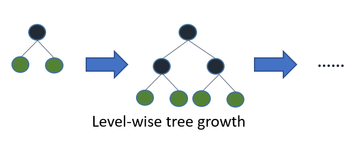

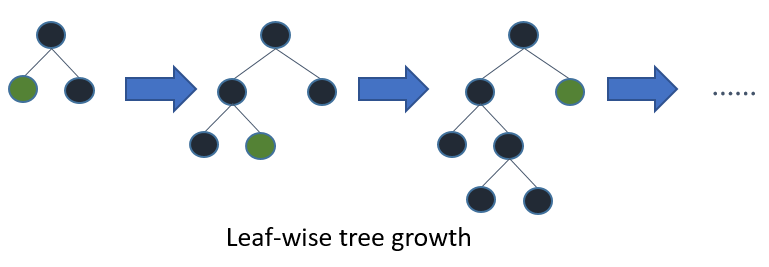

#### 与 XGBoost 和 GBDT 对比

| **特性**       | **LightGBM**                   | **XGBoost**      | **GBDT**    |
| -------------------- | ------------------------------------ | ---------------------- | ----------------- |
| **训练速度**   | ⚡**最快** （直方图+GOSS+EFB） | 中等（需预排序）       | 慢（串行计算）    |
| **内存占用**   | ✅**最低** （特征捆绑+直方图） | 较高（需存储排序数据） | 高（存储多棵树）  |
| **算法优化**   | 直方图 + GOSS + EFB                  | 二阶梯度 + 正则化      | 仅一阶梯度        |
| **并行计算**   | 特征并行 + 数据并行                  | 特征并行               | 不支持            |
| **缺失值处理** | 自动学习最优分裂方向                 | 自动学习               | 需手动填充        |
| **适用场景**   | 大数据（10W+样本）                   | 中小数据 + 高精度需求  | 小数据 + 简单任务 |

## SVM 总述

support vector machine，支持向量机，可以用来分类（主要是二分类），属于监督学习，思想是找到一个超平面，让分类后的两类数据间隔最大。

具体怎么最大，是根据支持向量来决定的，**离超平面距离最小的数据点，就是支持向量**，最大化支持向量距离超平面的距离，也就是能让两类数据分开。

但有时候这些支持向量并不好找，甚至有可能找不到，因此引入软间隔概念，允许一些点不遵循这个规则，不再强硬的划分所有点。

而有时候数据交错 ，无法找到超平面，这时候需要对数据进行升维，但是直接升维会引入过多计算量和大量的空间浪费（计算困难），因此常通过核函数将输入空间映射到高维特征空间，从而在高维特征空间构造出最优的超平面

也就是说，核函数是把原始数据映射到高维空间，他事先在低维上进行计算，而将实质上的分类效果表现在了高维上，**避免了直接在高维空间中的复杂计算。**

根据核函数不同，SVM 可以是线性分类器或非线性分类器

又因为可以一直往高维映射，所以是一定存在一组参数能让 SVM 分类器的训练误差为 0

### SVM核函数

最常用RBF径向基核函数，其中$\gamma$是一个关键超参数，控制着核的宽度和复杂性，当$γ$增大，则宽度变窄，每个支持向量的影响范围变小，所以决策边界更加复杂和曲折，易过拟合。

$γ$增大，易过拟合。

| 核函数名称                              | 数学公式                                                                                       | 主要超参数                                                    | 特点与适用场景                                                                                                     |
| --------------------------------------- | ---------------------------------------------------------------------------------------------- | ------------------------------------------------------------- | ------------------------------------------------------------------------------------------------------------------ |
| **线性核 (Linear Kernel)**        | $K(\mathbf{x}_i, \mathbf{x}_j) = \mathbf{x}_i^T \mathbf{x}_j$                                | 无                                                            | • 计算效率最高 ``• 相当于无核变换``• 适合高维特征、大数据量``• 不易过拟合                                      |
| **多项式核 (Polynomial Kernel)**  | $K(\mathbf{x}_i, \mathbf{x}_j) = (\gamma \mathbf{x}_i^T \mathbf{x}_j + r)^d$                 | •$d$: 多项式次数 ``• $\gamma$: 缩放因子``• $r$: 偏置项 | • 捕捉全局特征 ``• $d$越大越复杂``• 适合图像、文本数据                                                          |
| **径向基函数核 (RBF Kernel)**     | $K(\mathbf{x}_i, \mathbf{x}_j) = \exp(-\gamma |\mathbf{x}_i - \mathbf{x}_j|^2)$              | $\gamma$: 核宽度                                            | •**最常用** <br />``• 局部性强``<br />• 通用近似能力 <br />• $\gamma$↗→过拟合风险↗<br />• 默认首选 |
| **Sigmoid 核**                    | $K(\mathbf{x}_i, \mathbf{x}_j) = \tanh(\gamma \mathbf{x}_i^T \mathbf{x}_j + r)$              | •$\gamma$: 缩放因子``• $r$: 偏置项                      | • 源自神经网络 ``• 可能非正定``• 特殊场景使用                                                                   |
| **拉普拉斯核 (Laplacian Kernel)** | $K(\mathbf{x}_i, \mathbf{x}_j) = \exp(-\gamma |\mathbf{x}_i - \mathbf{x}_j|_1)$              | $\gamma$: 核宽度                                            | • 使用L1距离 ``• 对异常值更鲁棒``• 稀疏特征数据                                                                 |
| **卡方核 (Chi-Square Kernel)**    | $K(\mathbf{x}_i, \mathbf{x}_j) = \exp(-\gamma \sum \frac{(x_i^k - x_j^k)^2}{x_i^k + x_j^k})$ | $\gamma$: 核宽度                                            | • 专用于直方图数据 ``• 计算机视觉领域``• 分布比较                                                               |
| **字符串核 (String Kernel)**      | 基于子串匹配                                                                                   | 子串长度等                                                    | • 文本数据处理 ``• DNA序列分析``• 自然语言处理                                                                  |
|                                         |                                                                                                |                                                               |                                                                                                                    |

### SVM细说

**松弛变量：$\xi_i \geq 0$**

**作用** ：在 SVM 中引入松弛变量，允许部分样本“违反”最大间隔规则，使模型能处理**线性不可分数据**或 **噪声数据** 。

**原始 SVM 硬间隔约束：**

$y_i (w^T x_i + b) \geq 1 \quad (\forall i)$

**引入松弛变量后：**

$y_i (w^T x_i + b) \geq 1 - \xi_i \quad \text{其中} \quad \xi_i \geq 0$

**软间隔的优化目标：**

$\min_{w,b} \frac{1}{2} \|w\|^2 + C \sum_{i=1}^n \xi_i$

- $\xi_i$ 表示第 $i$ 个样本的“违反程度”：
  - $\xi_i = 0$：样本严格满足间隔约束（位于支持向量或正确侧）。
  - $0 < \xi_i < 1$：样本在间隔内但分类正确。
  - $\xi_i \geq 1$：样本被错误分类。
- **超参数 $C$** ：控制对误分类的惩罚强度：
- $C \to \infty$：退化为硬间隔 SVM（不允许错误）。
- $C$ 较小：允许更多错误，模型更简单。

#### SMO（Sequential Minimal Optimization）

**作用** ：SVM 的高效训练算法，用于求解对偶问题中的拉格朗日乘子 $\alpha_i$。

- 避免矩阵存储和求逆，内存效率高。
- 适合大规模数据集（如 LibSVM 的实现）。

| **概念**     | **松弛变量**                  | **SMO**                    |
| ------------------ | ----------------------------------- | -------------------------------- |
| **目的**     | 允许分类错误，增强模型鲁棒性        | 高效求解 SVM 对偶问题            |
| **数学形式** | 引入$\xi_i \geq 0$ 和超参数 $C$ | 分步优化拉格朗日乘子$\alpha_i$ |
| **应用场景** | 线性不可分数据或噪声数据            | 大规模 SVM 训练（如 LibSVM）     |
| **关键参数** | 惩罚系数$C$                       | 收敛容忍度、最大迭代次数         |

### 与 LR 的异同

| **对比维度**   | **SVM（支持向量机）**                   | **LR（逻辑回归）**                      | **相同点**                       |
| -------------------- | --------------------------------------------- | --------------------------------------------- | -------------------------------------- |
| **核心思想**   | 最大化分类间隔（几何间隔），依赖支持向量      | 最大化似然概率，输出属于某类的概率            | 均为监督学习，用于分类任务             |
| **损失函数**   | 合页损失（Hinge Loss）                        | 对数损失（Log Loss）                          | 均通过优化损失函数训练模型             |
| **输出结果**   | 直接输出类别（可通过概率校准间接输出概率）    | 直接输出概率（默认阈值 0.5 分类）             | 均可用于二分类（通过扩展支持多分类）   |
| **正则化**     | 通过间隔最大化隐式控制复杂度（类似 L2 正则）  | 需显式添加 L1/L2 正则化（如 `penalty`参数） | 均依赖超参数平衡模型复杂度与拟合能力   |
| **数据敏感性** | 对支持向量敏感，异常值可能影响超平面          | 对全体数据敏感，概率优化更鲁棒                | 性能均受特征缩放影响（如标准化）       |
| **核方法**     | 支持核技巧（线性/高斯/多项式等非线性分类）    | 仅线性分类（需手动特征工程实现非线性）        | 线性核 SVM 和 LR 的决策边界均为线性    |
| **计算效率**   | 训练复杂度高（尤其核函数时），适合小/中数据集 | 训练高效（梯度下降），适合大规模数据          | 均可用随机梯度下降（SGD）加速优化      |
| **多分类支持** | 需依赖 OVR（One-vs-Rest）或 OVO（One-vs-One） | 原生支持 OVR，也可用 Softmax 多分类           | 均需扩展策略处理多分类问题             |
| **应用场景**   | 高维数据（如文本）、小样本非线性分类          | 概率需求场景（如风控）、大规模线性分类        | 均广泛用于二分类任务（如垃圾邮件检测） |

#### **关键区别总结** ：

1. **损失函数** ：SVM 关注边界附近的样本（Hinge Loss），LR 关注全局概率分布（Log Loss）。
2. **非线性能力** ：SVM 通过核函数隐式处理非线性，LR 需显式特征工程。
3. **输出解释** ：LR 直接输出概率，SVM 需额外校准（如 Platt Scaling）。
4. **数据量适应性** ：LR 更适合大规模数据，SVM（尤其核方法）计算成本较高。

#### **选择建议** ：

- 需要**概率解释**或**处理大规模数据** → **LR**
- 数据维度高、样本少或需要**非线性分类** → **SVM（核方法）**
- 线性可分且追求简单高效 → **线性 SVM** 或 **LR + L2 正则**

## 贝叶斯网络

### 概率图模型

概率图模型分为**贝叶斯网络（Bayesian Network）和马尔可夫网络（Markov Network）** 两大类。贝叶斯网络可以用一个有向图结构表示，马尔可夫网络可以表 示成一个无向图的网络结构。更详细地说，概率图模型包括了朴素贝叶斯模型、最大熵模型、隐马尔可夫模型、条件随机场、主题模型等，在机器学习的诸多场景中都有着广泛的应用。

**概率图模型（Probabilistic Graphical Model, PGM）** 是用图结构表示随机变量间概率关系的模型，分为两类：

- **有向图模型（贝叶斯网络）** ：用有向无环图表示因果关系（如贝叶斯网络）。
- **无向图模型（马尔可夫网络）** ：用无向图表示变量间的关联关系（如条件随机场）。

  **核心思想** ：
  将联合概率分布分解为局部条件概率的乘积，利用图结构降低计算复杂度。

### 贝叶斯模型

**频率派观点**

- **核心** ：参数是固定未知的，通过极大似然估计（MLE）求解。
- **局限性** ：无法量化参数的不确定性。

**贝叶斯学派**

- **核心** ：参数是随机变量，通过先验分布+数据 → 后验分布。
- **优势** ：提供概率化的不确定性评估。

**贝叶斯定理**

$$
P(A|B) = \frac{P(B|A)P(A)}{P(B)}
$$

从先验（$P(A)$）和似然（$P(B|A)$）推导后验（$P(A|B)$）。

**朴素贝叶斯**

即假设特诊间相互独立的贝叶斯网络

### 生成式与判别式模型

- **判别模型**(discriminative model)通过求解条件概率分布 P(y|x)或者直接计算 y 的值来预测 y。
  线性回归（Linear Regression）,逻辑回归（Logistic Regression）,支持向量机（SVM）, 传统神经网络（Traditional Neural Networks）,线性判别分析（Linear Discriminative Analysis），条件随机场（Conditional Random Field）
- **生成模型**（generative model）通过对观测值和标注数据计算联合概率分布 P(x,y)来达到判定估算 y 的目的。
  朴素贝叶斯（Naive Bayes）, 隐马尔科夫模型（HMM）,贝叶斯网络（Bayesian Networks）和隐含狄利克雷分布（Latent Dirichlet Allocation）、混合高斯模型

| **维度**       | **生成式模型（如贝叶斯网络）** | **判别式模型（如逻辑回归）**   |  |  |  |  |  |  |  |  |  |  |  |  |  |
| -------------------- | ------------------------------------ | ------------------------------------ | - | - | - | - | - | - | - | - | - | - | - | - | - |
| **目标**       | 建模联合概率$P(X,Y)$               | 建模条件概率$P(Y             | X)$ |  |  |  |  |  |  |  |  |  |  |  |  |  |
| **特点**       | 可生成数据，需假设数据分布           | 直接分类，对分布假设较弱             |  |  |  |  |  |  |  |  |  |  |  |  |  |
| **计算复杂度** | 通常更高（需估计全概率）             | 通常更低（仅关注决策边界）           |  |  |  |  |  |  |  |  |  |  |  |  |  |
| **典型算法**   | 朴素贝叶斯、HMM、GMM                 | SVM、逻辑回归、CRF                   |  |  |  |  |  |  |  |  |  |  |  |  |  |
| **优势场景**   | 数据缺失、小样本、生成新样本         | 高维数据、分类性能优先               |  |  |  |  |  |  |  |  |  |  |  |  |  |

### 西瓜例子

#### **问题设定**

我们有以下数据集（简化版）：

| 编号 | 颜色（绿=0，黑=1） | 敲声（闷=0，脆=1） | 纹理（模糊=0，清晰=1） | 是否甜（甜=1，不甜=0） |
| ---- | ------------------ | ------------------ | ---------------------- | ---------------------- |
| 1    | 1                  | 1                  | 1                      | 1                      |
| 2    | 1                  | 0                  | 1                      | 1                      |
| 3    | 0                  | 1                  | 1                      | 1                      |
| 4    | 0                  | 0                  | 0                      | 0                      |
| 5    | 1                  | 1                  | 0                      | 0                      |

**目标** ：
给定一个新西瓜的特征 `[颜色=1, 敲声=1, 纹理=0]`，判断它更可能是“甜”还是“不甜”。

---

#### **Step 1: 计算先验概率**

- **甜瓜（Y=1）** ：3/5 = 0.6
- **不甜瓜（Y=0）** ：2/5 = 0.4

#### **Step 2: 计算条件概率（似然）**

统计每个特征在甜/不甜情况下的分布：

**甜瓜（Y=1）** ：

- 颜色=1：2/3
- 敲声=1：2/3
- 纹理=1：3/3

  **不甜瓜（Y=0）** ：
- 颜色=1：1/2
- 敲声=1：1/2
- 纹理=1：0/2

（注：遇到概率为 0 时，用拉普拉斯平滑修正，此处暂不处理）

#### **Step 3: 对新样本 `[1, 1, 0]` 计算后验概率**

**甜瓜的联合概率** ：

- $P(Y=1) \times P(\text{颜色}=1 \mid Y=1) \times P(\text{敲声}=1 \mid Y=1) \times P(\text{纹理}=0 \mid Y=1) = 0.6 \times \frac{2}{3} \times \frac{2}{3} \times \frac{0}{3} = 0$

**不甜瓜的联合概率** ：

- $P(Y=0) \times P(\text{颜色}=1 \mid Y=0) \times P(\text{敲声}=1 \mid Y=0) \times P(\text{纹理}=0 \mid Y=0) = 0.4 \times \frac{1}{2} \times \frac{1}{2} \times \frac{2}{2} = 0.1$

#### **Step 4: 归一化后验概率**

- 总联合概率 = 0 + 0.1 = 0.1
- **甜的概率** ：0 / 0.1 = 0
- **不甜的概率** ：0.1 / 0.1 = 1

  **结论** ：该西瓜 **“不甜”** 。

---

#### **问题与修正（拉普拉斯平滑）**

若某特征值在训练集中未出现（如甜瓜的纹理=0），会导致概率为 0。
**解决方法** ：对每个特征值计数加 1（拉普拉斯平滑）：

修正后的条件概率：

- **甜瓜（Y=1）** ：
- 纹理=0：(0+1)/(3+2) = 1/5
- 纹理=1：(3+1)/(3+2) = 4/5

重新计算甜瓜的联合概率：

$0.6 \times \frac{2}{3} \times \frac{2}{3} \times \frac{1}{5} \approx 0.035$

不甜瓜的联合概率不变（0.1）。
归一化后：

- 甜的概率：0.035 / (0.035 + 0.1) ≈ 26%
- 不甜的概率：74%

  **最终结论** ：仍倾向于“不甜”，但概率更合理。

ps:拉普拉斯平滑：分子加一，分母加特征数量（这里就是有纹理或是没有纹理，2 个），提高鲁棒性，好让模型处理没有出现过的特征值。

1. 分子：该特征值出现的次数 + 1
2. 分母：该类别的样本总数 + 该特征可能的取值数量

## 马尔可夫

### 多个概念

| 概念                                              | 核心特点                                                                     | 主要用途                               | 关键区别                           |
| ------------------------------------------------- | ---------------------------------------------------------------------------- | -------------------------------------- | ---------------------------------- |
| **马尔可夫过程 (Markov Process)**           | 状态转移只依赖当前状态（无记忆性），不一定是离散的（如连续时间的马尔可夫链） | 随机过程建模（如排队论、金融时间序列） | **无隐藏状态** ，纯状态转移  |
| **马尔可夫模型 (Markov Model, MM)**         | 离散时间、离散状态的马尔可夫过程（如马尔可夫链）                             | NLP（n-gram 语言模型）、金融预测       | **显式状态序列** ，观测=状态 |
| **隐马尔可夫模型 (HMM)**                    | 状态不可观测，观测值依赖隐藏状态                                             | 语音识别、基因序列分析                 | **隐藏状态 + 观测序列**      |
| **马尔可夫网络 (Markov Random Field, MRF)** | 无向图模型，表示变量间的依赖关系（无方向性）                                 | 图像分割、社交网络分析                 | **无向图，全局依赖**         |
| **贝叶斯网络 (Bayesian Network, BN)**       | 有向无环图（DAG），表示因果或条件依赖                                        | 医学诊断、故障分析                     | **有向图，局部依赖**         |

- **有向 vs 无向** ：贝叶斯网络是有向图（因果），马尔可夫网络是无向图（相关）。
- **隐藏状态** ：HMM 有隐藏状态，普通马尔可夫模型没有。
- **时间 vs 空间** ：马尔可夫过程/模型关注时间序列，马尔可夫网络关注变量间的空间依赖。

#### 一句话总结

- **马尔可夫过程（Markov Process）** ：描述状态如何随时间随机变化（如股票涨跌）。
- **马尔可夫模型（Markov Model）** ：离散状态的马尔可夫过程（如预测明天天气）。
- **隐马尔可夫模型（HMM）** ：状态不可见，只能看到依赖状态的观测值（如通过语音推测文字）。
- **马尔可夫网络（MRF）** ：无向图描述变量间的依赖关系（如图像像素间的关联）。
- **贝叶斯网络（Bayesian Network）** ：有向图描述因果关系（如“吸烟 → 肺癌”）。

### 马尔科夫过程

马尔可夫过程（Markov process）是一类随机过程。最简单的马尔可夫过程就是一阶过程，**每一个状态的转移只依赖于其之前的那一个状态**，这个也叫作**马尔可夫性质**。

- 数学上是一个 **随机过程** ，可以是连续或离散时间。
- 满足 **马尔可夫性** ：P(未来 ∣ 现在,过去)=P(未来 ∣ 现在)

### 隐马尔可夫模型 HMM

##### 三大问题：

- 给定模型，如何有效计算产生观测序列的概率？换言之，如何**评估**模型与观测序列之间的匹配程度？
- 给定模型和观测序列，如何找到与此观测序列最匹配的状态序列？换言之，如何根据观测序列推断出隐藏的模型状态？
- 给定观测序列，如何调整模型参数使得该序列出现的概率最大？换言之，如何训练模型使其能最好地描述观测数据？

| 问题               | 描述                                                                                                                                          | 解法                                   | 应用                           |
| ------------------ | --------------------------------------------------------------------------------------------------------------------------------------------- | -------------------------------------- | ------------------------------ |
| **评估问题** | 给定模型**λ**=**(**A**,**B**,**π**)**，计算观测序列 **O** 的概率 **P**(**O**∥**λ**) | **前向算法** / 后向算法          | 语音识别（计算某句话的概率）   |
| **解码问题** | 给定**O** 和 **λ**，找最可能的隐藏状态序列 **Q**                                                                           | **Viterbi 算法**                 | 词性标注（找最可能的词性序列） |
| **学习问题** | 给定**O**，估计 **λ**=**(**A**,**B**,**π**)**                                                           | **Baum-Welch 算法（EM 的特例）** | 训练语音模型                   |

### 条件随机场 CRF

观测不再独立，比如要推断一张照片中的人在干什么，得知道与之相邻时间照片的标签信息。

- **定义** ：判别式无向图模型，直接建模 **P**(**Y|X**)（HMM 是生成式）。
- **关键点** ：
- **与 HMM 对比** ：
  - HMM 假设观测独立$（P(O_t\|Q_t)）$，CRF 无此限制。
  - CRF 可引入任意特征（如单词大写、后缀等）。
- **与 MEMM（最大熵马尔可夫模型）对比** ：
  - MEMM 有标注偏置问题（倾向于选择少转移的路径），CRF 无此问题。
- **应用** ：命名实体识别（NER）、词性标注。

#### **6. EM 算法、HMM、CRF 的比较**

| 方法              | 核心思想                           | 适用场景                          | 优缺点                   |
| ----------------- | ---------------------------------- | --------------------------------- | ------------------------ |
| **EM 算法** | 迭代优化（E 步求期望，M 步最大化） | 含隐变量的概率模型（如 GMM、HMM） | 可能局部最优，但通用性强 |
| **HMM**     | 生成式模型，假设观测独立           | 序列标注（语音、基因）            | 计算高效，但假设过强     |
| **CRF**     | 判别式模型，无独立性假设           | NLP（NER、分词）                  | 更灵活，但计算复杂度高   |

## LDA 潜在狄利克雷分配(不是降维)

### **LDA 模型是什么？**

**LDA（Latent Dirichlet Allocation）** 是一种**无监督**的主题模型，用于从文档集合中自动发现隐藏的“主题”（即词的分布）。

它可以将文档集 中每篇文档的主题以概率分布的形式给出，从而通过分析一些文档抽取出它们的主题（分布）出来后，便可以根据主题（分布）进行主题聚类或文本分类。同时，它是一种典型的词袋模型，即一篇文档是由一组词构成，词与词之间没有先后顺序的关系。此外，一篇文档可以包含多个主题，文档中每一个词都由其中的一个主题生成。

#### **5 个关键分布的理解**

LDA 的核心依赖以下概率分布：

1. **Dirichlet 分布（狄利克雷分布）**
   - 用于生成“文档-主题分布”和“主题-词分布”。
   - 性质：多项分布的共轭先验，保证采样结果仍为 Dirichlet 分布。
   - 参数：α**α**（控制文档的主题稀疏性），β**β**（控制主题的词稀疏性）。
2. **多项分布（Multinomial）**
   - 用于生成具体的“主题”和“词”。
   - 例如：一篇文档的主题分布 θ∼Dir(α)**θ**∼**Dir**(**α**)，再按 θ**θ** 采样主题。
3. **泊松分布（Poisson）**
   - 用于生成文档的长度（词的数量），但在 LDA 中通常假设文档长度固定。
4. **Categorical 分布（分类分布）**
   - 实际上是多项分布的特例（单次试验），用于生成单个词。
5. **共轭先验（Conjugate Prior）**
   - Dirichlet 分布是多项分布的共轭先验，简化后验计算。

### 冷启动

**冷启动问题** ：新用户或新物品缺乏历史行为数据，难以推荐。

#### **解决方案**

##### **（1）用户冷启动**

- **步骤** ：

1. 用 LDA 对所有物品（如文章、商品）提取主题分布 θitem。
2. 新用户注册时填写兴趣标签（如“科技”“体育”），映射到主题分布 θuser。
3. 推荐与 θuser 最相似的物品。

##### **（2）物品冷启动**

- **步骤** ：

1. 对新物品提取文本（如标题、描述），用训练好的 LDA 模型推断其主题分布 θitem。
2. 推荐给喜欢相似主题的用户。

##### **（3）混合策略**

- 结合主题模型与协同过滤：

  - 用主题分布补充用户-物品矩阵的稀疏部分。

  **优势** ：
- 无需依赖用户行为，仅需文本信息。
- 主题可解释性强（如“科技”“时尚”），便于人工调整。

### LDA 总结

| 问题                    | 方法                  | 核心要点                              |
| ----------------------- | --------------------- | ------------------------------------- |
| **LDA 是什么**    | 无监督主题模型        | Dirichlet 先验 + 文档-主题-词三层生成 |
| **确定 Topic 数** | 指标优化（Coherence） | 平衡可解释性与模型性能                |
| **解决冷启动**    | 基于文本的主题匹配    | 将用户/物品映射到语义主题空间         |

通过 LDA，可以将文本数据转化为低维主题表示，从而解决推荐系统中的语义理解和冷启动问题。

## EM

EM 算法，两个步骤交替进行

**第一步**是计算期望（E），利用对隐藏变量的现有估计值，计算其最大似然估计值；
**第二步**是最大化（M），最大化在 E 步上求得的最大似然值来计算参数的值。M 步上找到的参数估计值被用于下一个 E 步计算中，这个过程不断交替进行。

极大似然估计用一句话概括就是：知道结果，反推条件 θ。

### 似然函数

知道结果，寻求使该结果出现可能性最大的条件 。

### 采用 EM 算法的模型

用 EM 算法求解的模型一般有 GMM 或者协同过滤，k-means 其实也属于 EM。EM 算法一定会收敛，但是可能收敛到局部最优。由于求和的项数将随着隐变量的数目指数上升，会给梯度计算带来麻烦。

## 聚类算法

通常是无监督学习，模型将每个数据点划分到特定的组里

K-Means 和 GMM 都是通过 EM 算法来执行的

### K-Means，K 均值

K-均值是一个迭代算法，假设我们想要将数据聚类成 n 个组，其方法为:

- 首先选择 𝐾 个随机的点，称为聚类中心（cluster centroids）；
- 对于数据集中的每一个数据，按照距离 𝐾 个中心点的距离，将其与距离最近的中心点关联起来，与同一个中心点关联的所有点聚成一类。
- 计算每一个组的平均值，将该组所关联的中心点移动到平均值的位置。
- 重复步骤，直至中心点不再变化。

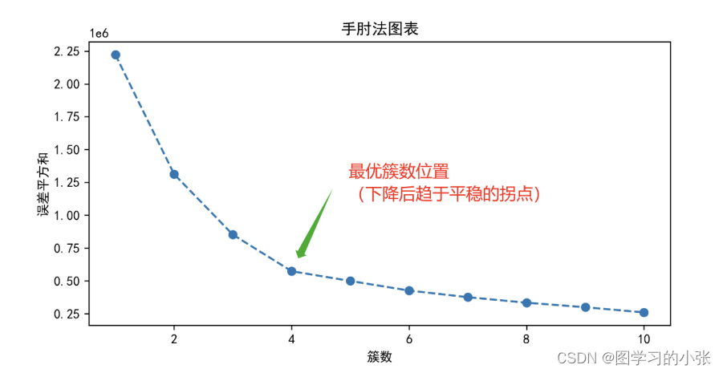

对于 K 值选择，常用手肘法，就是找到一个值，比如为 4，从 3 到 4，分类效果会有明显下降，但从 4 到 5，基本没什么变化，也就是说 4 是一个肘点。

### KNN 和 K-Means

KNN 是分类，属于监督学习，根据某个节点最近的 K 个邻居判断这个节点的类型。

K-Means 是聚类，属于无监督学习，先随机指定 K 个聚类中心，根据与聚类中心的距离更新当前节点的类别，更新后再根据平均值得到新的中心，再更新距离值，直到收敛。

### GMM

**用多个高斯分布函数的线形组合来对数据分布进行拟合。**

GMM 假设数据由多个高斯分布（正态分布）混合生成，每个高斯分布对应一个簇（类）。数据点的生成过程如下：

1. 随机选择一个高斯分布（簇），概率由权重 $π_k$ 决定。
2. 从该高斯分布中采样一个数据点。

$π_k$：第 K 个高斯分布的权重

也是通过 EM 算法来执行，更新下面三个参数

- **均值（μ）** ：分布的中心点（如 70 分）。
- **方差（σ²）** ：数据的波动范围（如方差小=成绩集中）。
- **权重（π）** ：这类数据占总数据的比例（如 A 类占 60%，B 类占 40%）。

### GMM 与 K-Means 相比

| 特性                   | GMM                        | K-Means             |
| ---------------------- | -------------------------- | ------------------- |
| **簇形状**       | 任意椭圆（协方差矩阵决定） | 仅球形              |
| **软聚类**       | 输出属于各簇的概率         | 硬分配（非 0 即 1） |
| **参数更新**     | EM 算法（优化似然函数）    | 最小化平方误差      |
| **异常值鲁棒性** | 更强（概率模型）           | 较弱（均值敏感）    |

高斯混合模型与 K 均值算法的相同点是：

- 它们都是可用于聚类的算法；
- 都需要 指定 K 值；
- 都是使用 EM 算法来求解；
- 都往往只能收敛于局部最优。

而它相比于 K 均值算法的优点是，可以给出一个样本属于某类的概率是多少；不仅仅可以用于聚类，还可以用于概率密度的估计；并且可以用于生成新的样本点。

## KNN

有监督的分类算法，根据最近的 K 个邻居的类型判断自己的类型。

所谓 K 近邻算法，即是给定一个训练数据集，对新的输入实例，在训练数据集中找到与该实例最邻近的 K 个实例（也就是上面所说的 K 个邻居），这 K 个实例的多数属于某个类，就把该输入实例分类到这个类中。

### 距离度量

**欧式距离：**就是数学中的两点之间距离， 最常见的两点之间或多点之间的距离表示法。

=\sqrt{(x_1-y_1)^2+(x_2-y_2)^2+...+(x_n-y_n)^2}=\sqrt{\sum_{i=1}^{n}(x_i-y_i)^2})

**曼哈顿距离**：坐标（x1, y1）的点 P1 与坐标（x2, y2）的点 P2 的曼哈顿距离为： 。

两个 n 维向量 a(x11,x12,…,x1n)与 b(x21,x22,…,x2n)间的曼哈顿距离


**余弦距离：** 几何中夹角余弦可用来衡量两个向量方向的差异，机器学习中借用这一概念来衡量样本向量之间的差异。

夹角余弦取值范围为[-1,1]。夹角余弦越大表示两个向量的夹角越小，夹角余弦越小表示两向量的夹角越大。当两个向量的方向重合时夹角余弦取最大值 1，当两个向量的方向完全相反夹角余弦取最小值-1。

**（方向重合是 1，相反是-1）**

=\frac{A*B}{||A||_2||B||_2})

- 在二维空间中向量 A(x1,y1)与向量 B(x2,y2)的夹角余弦公式：
  
- 两个 n 维样本点 a(x11,x12,…,x1n)和 b(x21,x22,…,x2n)的夹角余弦：
  

### 一些问题

1. 在 k-means 或 kNN，我们是用欧氏距离来计算最近的邻居之间的距离。为什么不用曼哈顿距离？
   **答：** 我们不用曼哈顿距离，因为它只计算水平或垂直距离，有维度的限制。另一方面，欧式距离可用于任何空间的距离计算问题。因为，数据点可以存在于任何空间，欧氏距离是更可行的选择。例如：想象一下国际象棋棋盘，象或车所做的移动是由曼哈顿距离计算的，因为它们是在各自的水平和垂直方向的运动。
2. KD-Tree 相比 KNN 来进行快速图像特征比对的好处在哪里?
   **答：** 极大的节约了时间成本．点线距离如果 >　最小点，无需回溯上一层，如果<,则再上一层寻找。

# 一些网络知识

## 激活函数

## 特征工程

### 1. 特征工程有哪些？

特征工程，顾名思义，是对原始数据进行一系列工程处理，将其提炼为特征，作为输入供算法和模型使用。从本质上来讲，特征工程是一个表示和展现数 据的过程。在实际工作中，**特征工程旨在去除原始数据中的杂质和冗余**，设计更高效的特征以刻画求解的问题与预测模型之间的关系。

主要讨论以下两种常用的数据类型。

1. 结构化数据。结构化数据类型可以看作关系型数据库的一张表，每列都 有清晰的定义，包含了数值型、类别型两种基本类型；每一行数据表示一个样本 的信息。
2. 非结构化数据。非结构化数据主要包括文本、图像、音频、视频数据， 其包含的信息无法用一个简单的数值表示，也没有清晰的类别定义，并且每条数 据的大小各不相同。

#### 1.1 特征归一化

为了消除数据特征之间的量纲影响，我们需要对特征进行归一化处理，使得 不同指标之间具有可比性。例如，分析一个人的身高和体重对健康的影响，如果 使用米（m）和千克（kg）作为单位，那么身高特征会在 1.6 ～ 1.8m 的数值范围 内，体重特征会在 50 ～ 100kg 的范围内，分析出来的结果显然会倾向于数值差别比 较大的体重特征。想要得到更为准确的结果，就需要进行特征归一化 （Normalization）处理，使各指标处于同一数值量级，以便进行分析。

对数值类型的特征做归一化可以将所有的特征都统一到一个大致相同的数值 区间内。最常用的方法主要有以下两种。

1. **线性函数归一化**（Min-Max Scaling）。它对原始数据进行线性变换，使 结果映射到[0, 1]的范围，实现对原始数据的等比缩放。归一化公式如下，其中*X*为原始数据， 分别为数据最大值和最小值。

   
2. **零均值归一化**（Z-Score Normalization）。它会将原始数据映射到均值为 0、标准差为 1 的分布上。具体来说，假设原始特征的均值为 μ、标准差为 σ，那么 归一化公式定义为

   

优点：**训练数据归一化后，容易更快地通过梯度下降找到最优解。**

当然，数据归一化并不是万能的。在实际应用中，通过梯度下降法求解的模 型通常是需要归一化的，包括线性回归、逻辑回归、支持向量机、神经网络等模 型。但对于决策树模型则并不适用。

#### 1.2 类别型特征

类别型特征（Categorical Feature）主要是指性别（男、女）、血型（A、B、 AB、O）等只在有限选项内取值的特征。类别型特征原始输入通常是字符串形 式，除了决策树等少数模型能直接处理字符串形式的输入，对于逻辑回归、支持 向量机等模型来说，类别型特征必须经过处理转换成数值型特征才能正确工作。

1. **序号编码**

   序号编码通常用于处理类别间具有大小关系的数据。例如成绩，可以分为 低、中、高三档，并且存在“高>中>低”的排序关系。序号编码会按照大小关系对 类别型特征赋予一个数值 ID，例如高表示为 3、中表示为 2、低表示为 1，转换后依 然保留了大小关系。
2. **独热编码(one-hot)**

   独热编码通常用于处理类别间不具有大小关系的特征。例如血型，一共有 4 个 取值（A 型血、B 型血、AB 型血、O 型血），独热编码会把血型变成一个 4 维稀疏 向量，A 型血表示为（1, 0, 0, 0），B 型血表示为（0, 1, 0, 0），AB 型表示为（0, 0, 1, 0），O 型血表示为（0, 0, 0, 1）。对于类别取值较多的情况下使用独热编码。
3. **二进制编码**

   二进制编码主要分为两步，先用序号编码给每个类别赋予一个类别 ID，然后 将类别 ID 对应的二进制编码作为结果。以 A、B、AB、O 血型为例，下图是二进制编码的过程。A 型血的 ID 为 1，二进制表示为 001；B 型血的 ID 为 2，二进制表示为 010；以此类推可以得到 AB 型血和 O 型血的二进制表示。

#### 1.3 高维组合特征的处理

为了提高复杂关系的拟合能力，在特征工程中经常会把一阶离散特征两两组 合，构成高阶组合特征。以广告点击预估问题为例，原始数据有语言和类型两种 离散特征，第一张图是语言和类型对点击的影响。为了提高拟合能力，语言和类型可 以组成二阶特征，第二张图是语言和类型的组合特征对点击的影响。

#### 1.4 文本表示模型

文本是一类非常重要的非结构化数据，如何表示文本数据一直是机器学习领 域的一个重要研究方向。

1. **词袋模型和 N-gram 模型**

   最基础的文本表示模型是词袋模型。顾名思义，就是将每篇文章看成一袋子词，并忽略每个词出现的顺序。具体地说，就是将整段文本以词为单位切分开， 然后每篇文章可以表示成一个长向量，向量中的每一维代表一个单词，而该维对 应的权重则反映了这个词在原文章中的重要程度。常用 TF-IDF 来计算权重。
2. **主题模型**

   主题模型用于从文本库中发现有代表性的主题（得到每个主题上面词的分布 特性），并且能够计算出每篇文章的主题分布。
3. **词嵌入与深度学习模型**

   词嵌入是一类将词向量化的模型的统称，核心思想是将每个词都映射成低维 空间（通常 K=50 ～ 300 维）上的一个稠密向量（Dense Vector）。K 维空间的每一 维也可以看作一个隐含的主题，只不过不像主题模型中的主题那样直观。

#### 1.5 其它特征工程

1. 如果某个特征当中有**缺失值**，缺失比较少的话，可以使用该特征的平均值或者其它比较靠谱的数据进行填充；缺失比较多的话可以考虑删除该特征。
2. 可以分析特征与结果的相关性，把相关性小的特征去掉。

#### 1.6 特征工程脑图


### 2. 机器学习优化方法

优化是应用数学的一个分支，也是机器学习的核心组成部分。实际上，机器 学习算法 = 模型表征 + 模型评估 + 优化算法。其中，优化算法所做的事情就是在 模型表征空间中找到模型评估指标最好的模型。不同的优化算法对应的模型表征 和评估指标不尽相同。

#### 2.1 机器学习常用损失函数

损失函数（loss function）是用来估量你模型的预测值 f(x)与真实值 Y 的不一致程度，它是一个非负实值函数,通常使用 L(Y, f(x))来表示，损失函数越小，模型的鲁棒性就越好。常见的损失函数如下：

1. **平方损失函数**

   Y-f(X)表示的是残差，整个式子表示的是残差的平方和，而我们的目的就是最小化这个目标函数值（注：该式子未加入正则项），也就是最小化残差的平方和。而在实际应用中，通常会使用均方差（MSE）作为一项衡量指标，公式如下：

   ^2)

   该损失函数一般使用在线性回归当中。
2. **log 损失函数**

   公式中的 y=1 表示的是真实值为 1 时用第一个公式，真实 y=0 用第二个公式计算损失。为什么要加上 log 函数呢？可以试想一下，当真实样本为 1 是，但 h=0 概率，那么 log0=∞，这就对模型最大的惩罚力度；当 h=1 时，那么 log1=0，相当于没有惩罚，也就是没有损失，达到最优结果。所以数学家就想出了用 log 函数来表示损失函数。

   最后按照梯度下降法一样，求解极小值点，得到想要的模型效果。该损失函数一般使用在逻辑回归中。
3. **Hinge 损失函数**

   $L_i = \sum_{\substack{j=1 \\ j \neq y_i}}^{C} \max\Big(0, \underbrace{f(x_i, W)_j}_{\text{错误类别分数}} - \underbrace{f(x_i, W)_{y_i}}_{\text{正确类别分数}} + \underbrace{\Delta}_{\text{边际}}\Big)$

   SVM 采用的就是 Hinge Loss，用于衡量分类错误程度,用于“最大间隔(max-margin)”分类。

#### 2.2 什么是凸优化

**凸函数**的严格定义为，函数 L(·) 是凸函数当且仅当对定义域中的任意两点 x，y 和任意实数 λ∈[0,1]总有：

$L(\lambda \mathbf{x} + (1-\lambda)\mathbf{y}) \leq \lambda L(\mathbf{x}) + (1-\lambda)L(\mathbf{y})$

该不等式的一个直观解释是，凸函数曲面上任意两点连接而成的线段，其上的任 意一点都不会处于该函数曲面的下方，如下图所示所示.

凸优化问题的例子包括支持向量机、线性回归等 线性模型，非凸优化问题的例子包括低秩模型（如矩阵分解）、深度神经网络模型等。

#### 2.3 正则化项

使用正则化项，也就是给 loss function 加上一个参数项，正则化项有**L1 正则化、L2 正则化、ElasticNet**。加入这个正则化项好处：

- 控制参数幅度，不让模型“无法无天”。
- 限制参数搜索空间
- 解决欠拟合与过拟合的问题。

详细请参考之前的文章：[线性回归--第 5 点](https://github.com/NLP-LOVE/ML-NLP/tree/master/Machine%20Learning/Liner%20Regression)

#### 2.4 常见的几种最优化方法

1. **梯度下降法**

   梯度下降法是最早最简单，也是最为常用的最优化方法。梯度下降法实现简单，当目标函数是凸函数时，梯度下降法的解是全局解。一般情况下，其解不保证是全局最优解，梯度下降法的速度也未必是最快的。梯度下降法的优化思想是用当前位置负梯度方向作为搜索方向，因为该方向为当前位置的最快下降方向，所以也被称为是”最速下降法“。最速下降法越接近目标值，步长越小，前进越慢。梯度下降法的搜索迭代示意图如下图所示：

   

   缺点：靠近极小值时收敛速度减慢；直线搜索时可能会产生一些问题；可能会“之字形”地下降。
2. **牛顿法**

   牛顿法是一种在实数域和复数域上近似求解方程的方法。方法使用函数 f (x)的泰勒级数的前面几项来寻找方程 f (x) = 0 的根。牛顿法最大的特点就在于它的收敛速度很快。具体步骤：

   - 首先，选择一个接近函数 f (x)零点的 x0，计算相应的 f (x0) 和切线斜率 f ' (x0)（这里 f ' 表示函数 f 的导数）。
   - 然后我们计算穿过点(x0, f (x0)) 并且斜率为 f '(x0)的直线和 x 轴的交点的 x 坐标，也就是求如下方程的解：

     +f(x_0)-x_0*f^{'}(x_0)=0)
   - 我们将新求得的点的 x 坐标命名为 x1，通常 x1 会比 x0 更接近方程 f (x) = 0 的解。因此我们现在可以利用 x1 开始下一轮迭代。

   由于牛顿法是基于当前位置的切线来确定下一次的位置，所以牛顿法又被很形象地称为是"切线法"。牛顿法搜索动态示例图：

   

   从本质上去看，牛顿法是二阶收敛，梯度下降是一阶收敛，所以牛顿法就更快。
   **缺点：**

   - 牛顿法是一种迭代算法，每一步都需要求解目标函数的 Hessian 矩阵的逆矩阵，计算比较复杂。
   - 在高维情况下这个矩阵非常大，计算和存储都是问题。
   - 在小批量的情况下，牛顿法对于二阶导数的估计噪声太大。
   - 目标函数非凸的时候，牛顿法容易受到鞍点或者最大值点的吸引。
3. **拟牛顿法**

   拟牛顿法是求解非线性优化问题最有效的方法之一，**本质思想是改善牛顿法每次需要求解复杂的 Hessian 矩阵的逆矩阵的缺陷，它使用正定矩阵来近似 Hessian 矩阵的逆，从而简化了运算的复杂度。** 拟牛顿法和梯度下降法一样只要求每一步迭代时知道目标函数的梯度。通过测量梯度的变化，构造一个目标函数的模型使之足以产生超线性收敛性。这类方法大大优于梯度下降法，尤其对于困难的问题。另外，因为拟牛顿法不需要二阶导数的信息，所以有时比牛顿法更为有效。如今，优化软件中包含了大量的拟牛顿算法用来解决无约束，约束，和大规模的优化问题。
4. **共轭梯度法**

   共轭梯度法是介于梯度下降法与牛顿法之间的一个方法，它仅需利用一阶导数信息，但克服了梯度下降法收敛慢的缺点，又避免了牛顿法需要存储和计算 Hesse 矩阵并求逆的缺点，共轭梯度法不仅是解决大型线性方程组最有用的方法之一，也是解大型非线性最优化最有效的算法之一。 在各种优化算法中，共轭梯度法是非常重要的一种。其优点是所需存储量小，具有步收敛性，稳定性高，而且不需要任何外来参数。

#### 2.5 降维方法

##### 2.5.1 线性判别分析（LDA）

线性判别分析（Linear Discriminant Analysis，LDA）是一种经典的降维方法。和主成分分析 PCA 不考虑样本类别输出的无监督降维技术不同，LDA 是一种监督学习的降维技术，数据集的每个样本有类别输出。

LDA 分类思想简单总结如下：

1. 多维空间中，数据处理分类问题较为复杂，LDA 算法将多维空间中的数据投影到一条直线上，将 d 维数据转化成 1 维数据进行处理。
2. 对于训练数据，设法将多维数据投影到一条直线上，同类数据的投影点尽可能接近，异类数据点尽可能远离。
3. 对数据进行分类时，将其投影到同样的这条直线上，再根据投影点的位置来确定样本的类别。

如果用一句话概括 LDA 思想，**即“投影后类内方差最小，类间方差最大”。**

假设有红、蓝两类数据，这些数据特征均为二维，如下图所示。我们的目标是将这些数据投影到一维，让每一类相近的数据的投影点尽可能接近，不同类别数据尽可能远，即图中红色和蓝色数据中心之间的距离尽可能大。

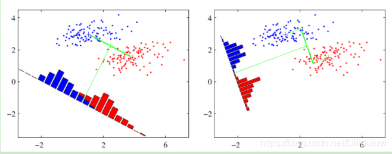

左图和右图是两种不同的投影方式。

**左图思路：让不同类别的平均点距离最远的投影方式。**

**右图思路：让同类别的数据挨得最近的投影方式。**

    从上图直观看出，右图红色数据和蓝色数据在各自的区域来说相对集中，根据数据分布直方图也可看出，所以右图的投影效果好于左图，左图中间直方图部分有明显交集。

    以上例子是基于数据是二维的，分类后的投影是一条直线。如果原始数据是多维的，则投影后的分类面是一低维的超平面。

**优缺点**

| 优缺点 | 简要说明                                                                                                                                                                      |
| :----: | :---------------------------------------------------------------------------------------------------------------------------------------------------------------------------- |
|  优点  | 1. 可以使用类别的先验知识；<br />2. 以标签、类别衡量差异性的有监督降维方式，相对于 PCA 的模糊性，其目的更明确，更能反映样本间的差异；                                         |
|  缺点  | 1. LDA 不适合对非高斯分布样本进行降维；<br />2. LDA 降维最多降到分类数 k-1 维；<br />3. LDA 在样本分类信息依赖方差而不是均值时，降维效果不好；<br />4. LDA 可能过度拟合数据。 |

##### 2.5.2 主成分分析（PCA）

1. PCA 就是将高维的数据通过线性变换投影到低维空间上去。
2. 投影思想：找出最能够代表原始数据的投影方法。被 PCA 降掉的那些维度只能是那些噪声或是冗余的数据。
3. 去冗余：去除可以被其他向量代表的线性相关向量，这部分信息量是多余的。
4. 去噪声，去除较小特征值对应的特征向量，特征值的大小反映了变换后在特征向量方向上变换的幅度，幅度越大，说明这个方向上的元素差异也越大，要保留。
5. 对角化矩阵，寻找极大线性无关组，保留较大的特征值，去除较小特征值，组成一个投影矩阵，对原始样本矩阵进行投影，得到降维后的新样本矩阵。
6. 完成 PCA 的关键是——协方差矩阵。协方差矩阵，能同时表现不同维度间的相关性以及各个维度上的方差。协方差矩阵度量的是维度与维度之间的关系，而非样本与样本之间。
7. 之所以对角化，因为对角化之后非对角上的元素都是 0，达到去噪声的目的。对角化后的协方差矩阵，对角线上较小的新方差对应的就是那些该去掉的维度。所以我们只取那些含有较大能量(特征值)的维度，其余的就舍掉，即去冗余。

**图解 PCA**

PCA 可解决训练数据中存在数据特征过多或特征累赘的问题。核心思想是将 m 维特征映射到 n 维（n < m），这 n 维形成主元，是重构出来最能代表原始数据的正交特征。

    假设数据集是m个n维，$(\boldsymbol x^{(1)}, \boldsymbol x^{(2)}, \cdots, \boldsymbol x^{(m)})$。如果$n=2$，需要降维到$n'=1$，现在想找到某一维度方向代表这两个维度的数据。下图有$u_1, u_2$两个向量方向，但是哪个向量才是我们所想要的，可以更好代表原始数据集的呢？

从图可看出，$u_1$比$u_2$好，为什么呢？有以下两个主要评价指标：

1. 样本点到这个直线的距离足够近。
2. 样本点在这个直线上的投影能尽可能的分开。

如果我们需要降维的目标维数是其他任意维，则：

1. 样本点到这个超平面的距离足够近。
2. 样本点在这个超平面上的投影能尽可能的分开。

**优缺点**

| 优缺点 | 简要说明                                                                                                                                                              |
| :----: | :-------------------------------------------------------------------------------------------------------------------------------------------------------------------- |
|  优点  | 1. 仅仅需要以方差衡量信息量，不受数据集以外的因素影响。　 2.各主成分之间正交，可消除原始数据成分间的相互影响的因素。3. 计算方法简单，主要运算是特征值分解，易于实现。 |
|  缺点  | 1.主成分各个特征维度的含义具有一定的模糊性，不如原始样本特征的解释性强。2. 方差小的非主成分也可能含有对样本差异的重要信息，因降维丢弃可能对后续数据处理有影响。       |

##### 2.5.3 比较这两种方法

**降维的必要性**：

1. 多重共线性和预测变量之间相互关联。多重共线性会导致解空间的不稳定，从而可能导致结果的不连贯。
2. 高维空间本身具有稀疏性。一维正态分布有 68%的值落于正负标准差之间，而在十维空间上只有 2%。
3. 过多的变量，对查找规律造成冗余麻烦。
4. 仅在变量层面上分析可能会忽略变量之间的潜在联系。例如几个预测变量可能落入仅反映数据某一方面特征的一个组内。

**降维的目的**：

1. 减少预测变量的个数。
2. 确保这些变量是相互独立的。
3. 提供一个框架来解释结果。相关特征，特别是重要特征更能在数据中明确的显示出来；如果只有两维或者三维的话，更便于可视化展示。
4. 数据在低维下更容易处理、更容易使用。
5. 去除数据噪声。
6. 降低算法运算开销。

**LDA 和 PCA 区别**

| 异同点 | LDA                                                                                                                 | PCA                                |
| :----: | :------------------------------------------------------------------------------------------------------------------ | :--------------------------------- |
| 相同点 | 1. 两者均可以对数据进行降维；<br />2. 两者在降维时均使用了矩阵特征分解的思想；<br />3. 两者都假设数据符合高斯分布； |                                    |
| 不同点 | 有监督的降维方法；                                                                                                  | 无监督的降维方法；                 |
|        | 降维最多降到 k-1 维；                                                                                               | 降维多少没有限制；                 |
|        | 可以用于降维，还可以用于分类；                                                                                      | 只用于降维；                       |
|        | 选择分类性能最好的投影方向；                                                                                        | 选择样本点投影具有最大方差的方向； |
|        | 更明确，更能反映样本间差异；                                                                                        | 目的较为模糊；                     |

### 3. 机器学习评估方法

混淆矩阵也称误差矩阵，是表示精度评价的一种标准格式，用 n 行 n 列的矩阵形式来表示。具体评价指标有总体精度、制图精度、用户精度等，这些精度指标从不同的侧面反映了图像分类的精度。下图为混淆矩阵

|          | 正类                | 负类                |
| -------- | ------------------- | ------------------- |
| 预测正确 | TP(True Positives)  | FP(False Positives) |
| 预测错误 | FN(False Negatives) | TN(True Negatives)  |

#### 3.1 准确率(Accuracy)

**准确率（Accuracy）。** 顾名思义，就是所有的预测正确（正类负类）的占总的比重。


准确率是分类问题中最简单也是最直观的评价指标，但存在明显的缺陷。比 如，当负样本占 99%时，分类器把所有样本都预测为负样本也可以获得 99%的准确 率。所以，当不同类别的样本比例非常不均衡时，占比大的类别往往成为影响准 确率的最主要因素。

#### 3.2 精确率（Precision）

**精确率（Precision）**，查准率。即正确预测为正的占全部预测为正的比例。个人理解：真正正确的占所有预测为正的比例。


#### 3.3 召回率(Recall)

**召回率（Recall）**，查全率。即正确预测为正的占全部实际为正的比例。个人理解：真正正确的占所有实际为正的比例。


为了综合评估一个排序模型的好坏，不仅要看模型在不同 Top N 下的 Precision@N 和 Recall@N，而且最好绘制出模型的 P-R（Precision- Recall）曲线。这里简单介绍一下 P-R 曲线的绘制方法。

P-R 曲线的横轴是召回率，纵轴是精确率。对于一个排序模型来说，其 P-R 曲 线上的一个点代表着，在某一阈值下，模型将大于该阈值的结果判定为正样本， 小于该阈值的结果判定为负样本，此时返回结果对应的召回率和精确率。整条 P-R 曲线是通过将阈值从高到低移动而生成的。下图是 P-R 曲线样例图，其中实线代表 模型 A 的 P-R 曲线，虚线代表模型 B 的 P-R 曲线。原点附近代表当阈值最大时模型的 精确率和召回率。

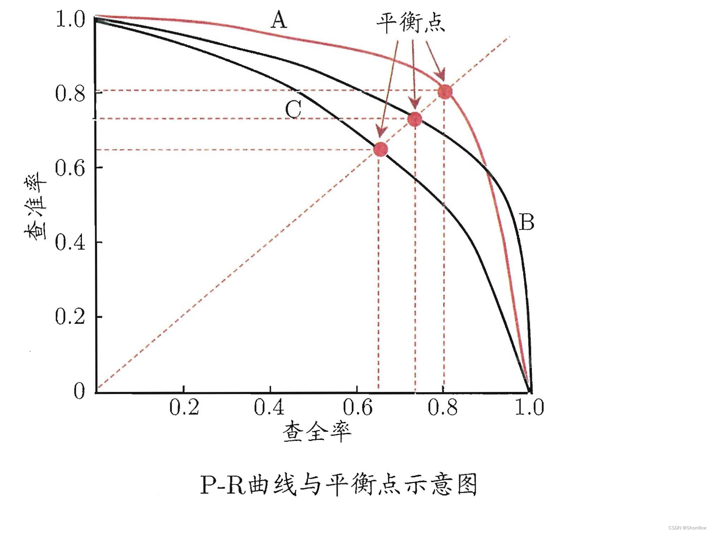

由图可见，当召回率接近于 0 时，模型 A 的精确率为 0.9，模型 B 的精确率是 1， 这说明模型 B 得分前几位的样本全部是真正的正样本，而模型 A 即使得分最高的几 个样本也存在预测错误的情况。并且，随着召回率的增加，精确率整体呈下降趋 势。但是，当召回率为 1 时，模型 A 的精确率反而超过了模型 B。**这充分说明，只用某个点对应的精确率和召回率是不能全面地衡量模型的性能，只有通过 P-R 曲线的 整体表现，才能够对模型进行更为全面的评估。**

#### 3.4 F1 值(H-mean 值)

F1 值（H-mean 值）。F1 值为算数平均数除以几何平均数，且越大越好，将 Precision 和 Recall 的上述公式带入会发现，当 F1 值小时，True Positive 相对增加，而 false 相对减少，即 Precision 和 Recall 都相对增加，即 F1 对 Precision 和 Recall 都进行了加权。


#### 3.4 ROC 曲线

ROC 曲线。接收者操作特征曲线（receiver operating characteristic curve），是反映敏感性和特异性连续变量的综合指标，ROC 曲线上每个点反映着对同一信号刺激的感受性。下图是 ROC 曲线例子。

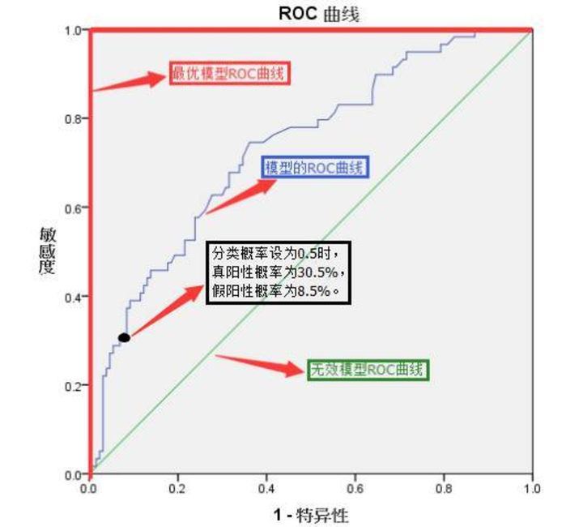

横坐标：1-Specificity，伪正类率(False positive rate，FPR，FPR=FP/(FP+TN))，预测为正但实际为负的样本占所有负例样本的比例；

纵坐标：Sensitivity，真正类率(True positive rate，TPR，TPR=TP/(TP+FN))，预测为正且实际为正的样本占所有正例样本的比例。

**真正的理想情况**，TPR 应接近 1，FPR 接近 0，即图中的（0,1）点。**ROC 曲线越靠拢（0,1）点，越偏离 45 度对角线越好**。

**AUC 值**

AUC (Area Under Curve) 被定义为 ROC 曲线下的面积，显然这个面积的数值不会大于 1。又由于 ROC 曲线一般都处于 y=x 这条直线的上方，所以 AUC 的取值范围一般在 0.5 和 1 之间。使用 AUC 值作为评价标准是因为很多时候 ROC 曲线并不能清晰的说明哪个分类器的效果更好，而作为一个数值，对应 AUC 更大的分类器效果更好。

从 AUC 判断分类器（预测模型）优劣的标准：

- AUC = 1，是完美分类器，采用这个预测模型时，存在至少一个阈值能得出完美预测。绝大多数预测的场合，不存在完美分类器。
- 0.5 < AUC < 1，优于随机猜测。这个分类器（模型）妥善设定阈值的话，能有预测价值。
- AUC = 0.5，跟随机猜测一样（例：丢铜板），模型没有预测价值。
- AUC < 0.5，比随机猜测还差；但只要总是反预测而行，就优于随机猜测。

**一句话来说，AUC 值越大的分类器，正确率越高。**

#### 3.5 余弦距离和欧式距离

**余弦距离：**几何中夹角余弦可用来衡量两个向量方向的差异，机器学习中借用这一概念来衡量样本向量之间的差异。

夹角余弦取值范围为[-1,1]。夹角余弦越大表示两个向量的夹角越小，夹角余弦越小表示两向量的夹角越大。当两个向量的方向重合时夹角余弦取最大值 1，当两个向量的方向完全相反夹角余弦取最小值-1。

**（方向重合是 1，相反是-1）**

=\frac{A*B}{||A||_2||B||_2})

- 在二维空间中向量 A(x1,y1)与向量 B(x2,y2)的夹角余弦公式：
  
- 两个 n 维样本点 a(x11,x12,…,x1n)和 b(x21,x22,…,x2n)的夹角余弦：
  

**欧式距离：** 在数学中，欧几里得距离或欧几里得度量是欧几里得空间中两点间“普通”（即直线）距离，如点 x = (x1,...,xn) 和 y = (y1,...,yn) 之间的距离为：

=\sqrt{(x_1-y_1)^2+(x_2-y_2)^2+...+(x_n-y_n)^2}=\sqrt{\sum_{i=1}^{n}(x_i-y_i)^2})

对于两个向量 A 和 B，余弦距离关注的是向量之间的角度关系，并不关心它们的绝对大小，其取值 范围是[−1,1]。当一对文本相似度的长度差距很大、但内容相近时，如果使用词频 或词向量作为特征，它们在特征空间中的的欧氏距离通常很大；而如果使用余弦 相似度的话，它们之间的夹角可能很小，因而相似度高。此外，在文本、图像、 视频等领域，研究的对象的特征维度往往很高，余弦相似度在高维情况下依然保 持“相同时为 1，正交时为 0，相反时为 −1”的性质，而欧氏距离的数值则受维度的 影响，范围不固定，并且含义也比较模糊。

#### 3.6 A/B 测试

AB 测试是为 Web 或 App 界面或流程制作两个（A/B）或多个（A/B/n）版本，在同一时间维度，分别让组成成分相同（相似）的访客群组（目标人群）随机的访问这些版本，收集各群组的用户体验数据和业务数据，最后分析、评估出最好版本，正式采用。

#### 3.7 模型评估方法

1. **Holdout 检验**

   Holdout 检验是最简单也是最直接的验证方法，它将原始的样本集合随机划分 成训练集和验证集两部分。比方说，对于一个点击率预测模型，我们把样本按照 70%～ 30% 的比例分成两部分，70% 的样本用于模型训练；30% 的样本用于模型 验证，包括绘制 ROC 曲线、计算精确率和召回率等指标来评估模型性能。

   Holdout 检验的缺点很明显，即在验证集上计算出来的最后评估指标与原始分 组有很大关系。为了消除随机性，研究者们引入了“交叉检验”的思想。
2. **交叉检验**

   k-fold 交叉验证：首先将全部样本划分成 k 个大小相等的样本子集；依次遍历 这 k 个子集，每次把当前子集作为验证集，其余所有子集作为训练集，进行模型的 训练和评估；最后把 k 次评估指标的平均值作为最终的评估指标。在实际实验 中，k 经常取 10。
3. **自助法**

   不管是 Holdout 检验还是交叉检验，都是基于划分训练集和测试集的方法进行 模型评估的。然而，当样本规模比较小时，将样本集进行划分会让训练集进一步 减小，这可能会影响模型训练效果。有没有能维持训练集样本规模的验证方法 呢？自助法可以比较好地解决这个问题。

   自助法是基于自助采样法的检验方法。对于总数为 n 的样本集合，进行 n 次有 放回的随机抽样，得到大小为 n 的训练集。n 次采样过程中，有的样本会被重复采 样，有的样本没有被抽出过，将这些没有被抽出的样本作为验证集，进行模型验 证，这就是自助法的验证过程。

#### 3.8 超参数调优

为了进行超参数调优，我们一般会采用网格搜索、随机搜索、贝叶斯优化等 算法。在具体介绍算法之前，需要明确超参数搜索算法一般包括哪几个要素。一 是目标函数，即算法需要最大化/最小化的目标；二是搜索范围，一般通过上限和 下限来确定；三是算法的其他参数，如搜索步长。

- **网格搜索**，可能是最简单、应用最广泛的超参数搜索算法，它通过查找搜索范 围内的所有的点来确定最优值。如果采用较大的搜索范围以及较小的步长，网格 搜索有很大概率找到全局最优值。然而，**这种搜索方案十分消耗计算资源和时间**，特别是需要调优的超参数比较多的时候。因此，在实际应用中，网格搜索法一般会先使用较广的搜索范围和较大的步长，来寻找全局最优值可能的位置；然 后会逐渐缩小搜索范围和步长，来寻找更精确的最优值。这种操作方案可以降低 所需的时间和计算量，但由于目标函数一般是非凸的，所以很可能会错过全局最 优值。
- **随机搜索**，随机搜索的思想与网格搜索比较相似，只是不再测试上界和下界之间的所有 值，而是在搜索范围中随机选取样本点。它的理论依据是，如果样本点集足够 大，那么通过随机采样也能大概率地找到全局最优值，或其近似值。随机搜索一 般会比网格搜索要快一些，但是和网格搜索的快速版一样，它的结果也是没法保证的。
- **贝叶斯优化算法**，贝叶斯优化算法在寻找最优最值参数时，采用了与网格搜索、随机搜索完全 不同的方法。网格搜索和随机搜索在测试一个新点时，会忽略前一个点的信息； 而贝叶斯优化算法则充分利用了之前的信息。贝叶斯优化算法通过对目标函数形 状进行学习，找到使目标函数向全局最优值提升的参数。

#### 3.9 过拟合和欠拟合

过拟合是指模型对于训练数据拟合呈过当的情况，反映到评估指标上，就是 模型在训练集上的表现很好，但在测试集和新数据上的表现较差。欠拟合指的是 模型在训练和预测时表现都不好的情况。下图形象地描述了过拟合和欠拟合的区别。

1. **防止过拟合：**
   - 从数据入手，获得更多的训练数据。
   - 降低模型复杂度。
   - 正则化方法，给模型的参数加上一定的正则约束。
   - 集成学习方法，集成学习是把多个模型集成在一起。
2. **防止欠拟合：**
   - 添加新特征。
   - 增加模型复杂度。
   - 减小正则化系数。

### 4. 检验方法

#### 4.1 KS 检验

Kolmogorov-Smirnov 检验是基于累计分布函数的，用于检验一个分布是否符合某种理论分布或比较两个经验分布是否有显著差异。

- 单样本 K-S 检验是用来检验一个数据的观测经验分布是否符合已知的理论分布。
- 两样本 K-S 检验由于对两样本的经验分布函数的位置和形状参数的差异都敏感，所以成为比较两样本的最有用且最常用的非参数方法之一。

检验统计量为：-F(x)|)

其中 )为观察序列值，)为理论序列值或另一观察序列值。

#### 4.2 T 检验

T 检验，也称 student t 检验，主要用户样本含量较小，总体标准差未知的正态分布。

t 检验是用 t 分布理论来推论差异发生的概率，从而比较两个平均数的差异是否显著。

t 检验分为单总体检验和双总体检验。

#### 4.3 F 检验

T 检验和 F 检验的由来：为了确定从样本中的统计结果推论到总体时所犯错的概率。F 检验又叫做联合假设检验，也称方差比率检验、方差齐性检验。是由英国统计学家 Fisher 提出。通过比较两组数据的方差，以确定他们的精密度是否有显著性差异。

#### 4.4 Grubbs 检验

一组测量数据中，如果个别数据偏离平均值很远，那么称这个数据为“可疑值”。用格拉布斯法判断，能将“可疑值”从测量数据中剔除。

#### 4.5 卡方检验

卡方检验就是统计样本的实际观测值与理论推断值之间的偏离程度，实际观测值与理论推断值之间的偏离程度就决定卡方值的大小，卡方值越大，越不符合；卡方值越小，偏差越小，越趋于符合，若两个值完全相等时，卡方值就为 0，表明理论值完全符合。

1. 提出原假设 H0：总体 X 的分布函数 F(x)；
2. 将总体 x 的取值范围分成 k 个互不相交的小区间 A1-Ak；
3. 把落入第 i 个区间 Ai 的样本的个数记做 fi，成为组频数，f1+f2+f3+...+fk = n；
4. 当 H0 为真时，根据假设的总体理论分布，可算出总体 X 的值落入第 i 个小区间 Ai 的概率 pi，于是 n\*pi 就是落入第 i 个小区间 Ai 的样本值的理论频数；
5. 当 H0 为真时，n 次试验中样本落入第 i 个小区间 Ai 的频率 fi/n 与概率 pi 应该很接近。基于这种思想，皮尔逊引入检测统计量：

   ^2}{np_i})

   在 H0 假设成立的情况下服从自由度为 k-1 的卡方分布。

**KS 检验与卡方检验**

**相同点：** 都采用实际频数和期望频数只差进行检验

**不同点：**

- 卡方检验主要用于类别数据，而 KS 检验主要用于有计量单位的连续和定量数据。
- 卡方检验也可以用于定量数据，但必须先将数据分组才能获得实际的观测频数，而 KS 检验能直接对原始数据进行检验，所以它对数据的利用比较完整。

## 优化

### 误差

训练误差和泛化误差，机器学习模型应关注降低泛化误差。

训练误差：模型在训练集上的误差

泛化误差：模型在测试集上的误差

一般来说，泛化误差会稍稍大于训练误差，由于⽆法从训练误差估计泛化误差，⼀味地降低训练误差并不意味着泛化误差⼀定会降低。

### 数据集和验证

数据集一般就分训练集，测试集，但有的会多加一个验证集，训练集训练的是模型参数。验证集用于评估不同超参数组合下模型的性能，帮助选择最优的超参数，而 **不直接参与训练** 。

- **训练集（Training Set）** ：用于训练模型（如 70%），通过优化损失函数学习数据规律。
- **验证集（Validation Set）** ：用于调参和模型选择（如 15%），选择最优超参数组合。
- **测试集（Test Set）** ：仅用于最终评估模型在未知数据上的泛化能力。

K 折交叉验证，用于数据不够的情况。把原始训练数据集分割成 K 个不重合的⼦数据集，然后我们做 K 次模型训练和验证。每⼀次，我们使⽤⼀个⼦数据集验证模型，并使⽤其他 K − 1 个⼦数据集来训练模型。

### 欠拟合和过拟合

欠拟合：训练误差大，模型没训练好，此时会有较大偏差

过拟合：测试误差远大于训练误差，模型对测试集太熟悉了，此时方差较大。

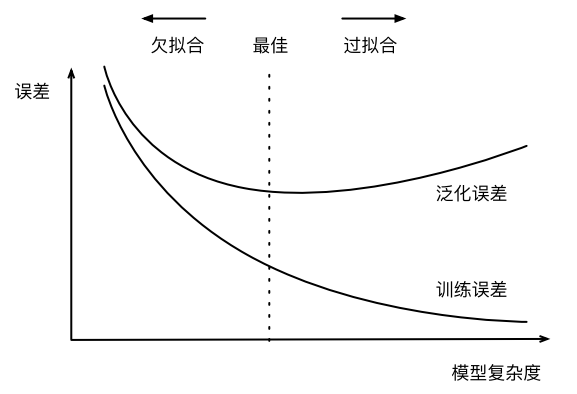

应对欠拟合：增加训练轮次，增加参数，让模型变复杂

应对过拟合：增加训练数据，减少训练轮次，减少参数，简化模型，正则化，dropout

### 梯度消失和梯度爆炸

梯度消失：多见于 sigmoid 和 tanh 激活函数，因为其一旦过大，导数会接近于 0，并且其导数本身的范围不超过 1，一旦连乘，会很快的逼近 0

梯度爆炸：常见与初始权重没选好，权重过大，连乘的时候就太大了。

在深层网络中，由于网络过深，如果初始得到的梯度过小，或者传播途中在某一层上过小，则在之后的层上得到的梯度会越来越小，即产生了梯度消失。梯度爆炸也是同样的

归一化可以解决反向传播时的梯度问题，一般用 BN，放在激活函数前面，让数据归一到一个更合适的区间，从而获得激活函数的更好的导数值，这样能有效缓解梯度消失或爆炸。

### 梯度下降算法

#### SGD

随机梯度下降，每次随机选取一个样本或很小一批样本计算梯度下降。

- batch_size=1，就是 SGD。
- batch_size=n，就是 mini-batch
- batch_size=m，就是 batch（批量梯度下降）

特点：

**高效** ：每次迭代只用一个样本，计算速度快，适合大规模数据。

**随机性** ：噪声帮助逃离局部最优，但可能导致收敛不稳定。

**学习率敏感** ：需谨慎选择学习率（过大不收敛，过小收敛慢）。

#### 优化 SGD

动量法：引入动量项，记录历史梯度的指数加权平均，可以加速收敛并减少震荡。旨在解决 SGD 的两个主要问题

1. **收敛速度慢** （在平坦区域梯度小，更新缓慢）。
2. **震荡剧烈** （在梯度方向变化大的区域，参数更新不稳定）。

动量法的核心思想是 **引入“惯性”** ，使参数更新方向不仅取决于当前梯度，还受历史梯度的影响，从而加速收敛并减少震荡。

- **SGD** ：在陡峭方向震荡，在平坦方向缓慢。
- **Momentum** ：在陡峭方向平滑，在平坦方向加速。

### AdaGrad 算法

**不同参数采用不同的学习率，可以有效处稀疏数据。**

根据⾃变量在每个维度的梯度值的⼤小来调整各个维度上的学习率，从而避免统⼀的学习率难以适应所有维度的问题。

**传统 SGD 的问题** ：所有参数使用相同的学习率，但不同参数的梯度可能差异很大（例如，某些特征稀疏，梯度较小）。

**AdaGrad 的改进** ：

- 对每个参数单独调整学习率。
- **历史梯度平方累积** ：对频繁更新的参数（梯度大），学习率降低；对稀疏更新的参数（梯度小），学习率保持较大。

### RMSProp

**主要解决了 AdaGrad 梯度过早衰减问题。**

**AdaGrad 的问题** ：累积所有历史梯度平方，导致学习率持续下降，可能过早停止训练。(后期难找到有用解)

**RMSProp 的改进** ：

1. 使用**指数衰减**计算梯度平方的移动平均，最近的梯度对调整学习率影响更大，较早的梯度影响逐渐衰减，而非简单累加（动态调整每个参数的学习率，就是对 AdaGrad 的改进再改进。）
2. 这样，较早的梯度影响会逐渐衰减，避免学习率无限减小。

### Adam

Momentum + RMSprop，已经内置了动量，没有动量参数

**Adam 算法在 RMSProp 的核心思想（对梯度平方做指数加权平均）基础上，进一步对小批量随机梯度本身（即梯度的一阶矩）也做了指数加权移动平均** 。换句话说，Adam 不仅像 RMSProp 那样自适应调整学习率，还引入了动量机制来优化梯度方向。

优点

1. **自适应学习率** ：自动调整不同参数的学习率，适合稀疏数据。
2. **动量加速** ：结合 Momentum，在梯度方向一致时加速收敛。
3. **偏差修正** ：解决初始训练阶段估计偏差问题。

### AdamW

对 Adam 的改进，转本针对权重衰减进行了优化。它在训练神经网络时能有效平衡收敛速度和模型泛化能力，尤其在处理大规模数据或复杂模型（如 Transformer、CNN）时表现突出。

：：总体来说，AdamW 可以直接衰减权重，而不是通过梯度更新，通过梯度更新的话，动量会对权重的影响过大，所以这样以改动，就能相对减少过拟合，峰值性能提升 1%~2%

#### **传统 Adam 的问题**

- **Adam** 的原始设计将 **L2 正则化（权重衰减）** 错误地耦合到了自适应学习率的计算中。具体表现为：
  - L2 正则化项（**λ**⋅**w**）会被纳入梯度更新公式，导致实际衰减效果与预期不符。
  - 尤其在训练后期，自适应学习率（如动量项）会削弱权重衰减的作用，可能引发过拟合。

#### **AdamW 的解决方案**

其将 L2 正则化从梯度更新中分离，直接对权重$w$施加衰减，使得权重衰减的作用不再受自适应学习率的影响，训练更稳定，泛化能力更强。：：？

### 提高模型稳定性

- 正则化（L2, L1, dropout）：模型方差大，很可能来自于过拟合。正则化能有效的降低模型的复杂度，增加对更多分布的适应性。
- 提前停止训练：提前停止是指模型在验证集上取得不错的性能时停止训练。这种方式本质和正则化是一个道理，能减少方差的同时增加的偏差。目的为了平衡训练集和未知数据之间在模型的表现差异。
- 扩充训练集：正则化通过控制模型复杂度，来增加更多样本的适应性。
- 特征选择：过高的特征维度会使模型过拟合，减少特征维度和正则一样可能会处理好方差问题，但是同时会增大偏差

### 改善模型思路

- **数据角度**
  增强数据集。无论是有监督还是无监督学习，数据永远是最重要的驱动力。更多的类型数据对良好的模型能带来更好的稳定性和对未知数据的可预见性。对模型来说，“看到过的总比没看到的更具有判别的信心”。
- **模型角度**
  模型的容限能力决定着模型可优化的空间。在数据量充足的前提下，对同类型的模型，增大模型规模来提升容限无疑是最直接和有效的手段。
- **调参优化角度**
  如果你知道模型的性能为什么不再提高了，那已经向提升性能跨出了一大步。 超参数调整本身是一个比较大的问题。一般可以包含模型初始化的配置，优化算法的选取、学习率的策略以及如何配置正则和损失函数等等。
- **训练角度**
  在越大规模的数据集或者模型上，诚然一个好的优化算法总能加速收敛。但你在未探索到模型的上限之前，永远不知道训练多久算训练完成。所以在改善模型上充分训练永远是最必要的过程。充分训练的含义不仅仅只是增大训练轮数。有效的学习率衰减和正则同样是充分训练中非常必要的手段。

## CNN

- **局部感知** ：卷积核滑动扫描局部区域（如图像的像素块）。
- **平移不变性** ：同一特征（如边缘、纹理）在不同位置共享权重。
- **层次化特征提取** ：浅层捕捉低级特征（边缘/颜色），深层组合为高级语义（物体/场景）。

sigmoid 适用于二分类任务的输出，CNN 慎用 sigmoid！

- 因为会有梯度消失问题，sigmoid 的导数往往接近 0，从而让权重无法更新。
- 而且 sigmoid 是指数运算，慢。

| CNN 层次结构 | 作用                                                       |
| ------------ | ---------------------------------------------------------- |
| 输入层       | 卷积网络的原始输入，可以是原始或预处理后的像素矩阵         |
| 卷积层       | 参数共享、局部连接，利用平移不变性从全局特征图提取局部特征 |
| 激活层       | 将卷积层的输出结果进行非线性映射                           |
| 池化层       | 进一步筛选特征，可以有效减少后续网络层次所需的参数量       |
| 全连接层     | 用于把该层之前提取到的特征综合起来。                       |

**CNN 能做图像识别任务，识别**可以看作多分类问题(**用 softmax**)，用别人训练好的 CNN 模型做 fine-tune

## RNN

循环神经网络（Recurrent Neural Network, RNN）是一类以序列（sequence）数据为输入，在序列的演进方向进行递归（recursion）且所有节点（循环单元）按链式连接的递归神经网络（recursive neural network）

RNN

- **时序依赖性** ：隐藏状态传递历史信息。
- **可变长度输入/输出** ：适应不同长度的序列（如句子翻译）。

**主要任务是自然语言处理 NLP，时间序列分析等任务**

| 特性               | CNN                           | RNN                      |
| ------------------ | ----------------------------- | ------------------------ |
| **数据依赖** | 空间/局部相关性（如图像像素） | 时序相关性（如句子词序） |
| **输入长度** | 固定尺寸（需 resize/pad）     | 可变长度（动态处理）     |
| **参数共享** | 空间共享（卷积核）            | 时间步共享（循环权重）   |
| **典型应用** | 图像、视频、网格数据          | 文本、语音、时间序列     |
| **主流变体** | ResNet、EfficientNet          | LSTM、GRU、Transformer   |

RNN 引入**记忆**，输出需要依赖于之前的输入，而不是独立的。eg：传统神经网络(包括 CNN)，输入和输出都是互相独立的。图像上的猫和狗是分隔开的，但有些任务，后续的输出和之前的内容是相关的。例如：我是中国人，我的母语是\_\_\_\_。这是一道填空题，需要依赖于之前的输入.

$H\*t=\phi(X*tW*{xh}+H*{t-1}W*{hh}+b_h) $

从以上公式我们可以看出，这⾥我们保存上⼀时间步的隐藏变量 ，并引⼊⼀个新的权重参数，该参数⽤来描述在当前时间步如何使⽤上⼀时间步的隐藏变量。具体来说，**时间步 t 的隐藏变量的计算由当前时间步的输⼊和上⼀时间步的隐藏变量共同决定。** $\phi$**函数其实就是激活函数。**

之前介绍的循环神经⽹络模型都是假设当前时间步是由前⾯的较早时间步的序列决定的，因此它们都将信息通过隐藏状态从前往后传递。有时候，当前时间步也可能由后⾯时间步决定。例如，
当我们写下⼀个句⼦时，可能会根据句⼦后⾯的词来修改句⼦前⾯的⽤词。**双向循环神经⽹络通过增加从后往前传递信息的隐藏层来更灵活地处理这类信息。** 下图演⽰了⼀个含单隐藏层的双向循环神经⽹络的架构。

在双向循环神经⽹络的架构中，设该时间步正向隐藏状态为 (正向隐藏单元个数为 h)，反向隐藏状态为 (反向隐藏单元个数为 h)。我们可以分别
计算正向隐藏状态和反向隐藏状态：

}+\overrightarrow{H}_{t-1}W_{hh}^{(f)}+b_h^{(f)}))

}+\overleftarrow{H}_{t-1}W_{hh}^{(b)}+b_h^{(b)}))

然后我们连结两个⽅向的隐藏状态 来得到隐藏状态 ，并将其输⼊到输出层。输出层计算输出 (输出个数为 q)：

### RNN 的 Loss 波动大.

由于 RNN 特有的 memory 会影响后期其他的 RNN 的特点，梯度时大时小，learning rate 没法个性化的调整，导致 RNN 在 train 的过程中，Loss 会震荡起伏，为了解决 RNN 的这个问题，在训练的时候，可以设置临界值，当梯度大于某个临界值，直接截断，用这个临界值作为梯度的大小，防止大幅震荡。

### **传统 RNN 的梯度问题**

- **梯度消失/爆炸原因** ：
- 传统 RNN 通过时间反向传播（BPTT）计算梯度，梯度是连乘形式：。
- 当时间步 t**t** 较大时，若雅可比矩阵 ∂hi∂hi−1**∂**h**i**−**1\*\***∂**h**i\*\* 的特征值持续大于 1 或小于 1，会导致梯度爆炸或消失。
- **后果** ：
- 梯度消失：难以更新早期时间步的权重，无法学习长期依赖。
- 梯度爆炸：可通过梯度裁剪缓解，但无法解决梯度消失。

## GRU

ps:门控循环单元，当时间步数较⼤或者时间步较小时，传统循环神经网络（RNN）中存在梯度消失/爆炸问题，门控循环神经网络（如 GRU 和 LSTM）通过引入门控机制有效缓解了传统循环神经网络（RNN）中的梯度消失/爆炸问题，从而能够捕捉长距离依赖关系。
感觉像是对数据多了选择，以前的是全都用，现在的 GRU 能更好捕捉长度更大的依赖关系。

在循环神经⽹络中的梯度计算⽅法中，我们发现，当时间步数较⼤或者时间步较小时，**循环神经⽹络的梯度较容易出现衰减或爆炸。虽然裁剪梯度可以应对梯度爆炸，但⽆法解决梯度衰减的问题。** 通常由于这个原因，循环神经⽹络在实际中较难捕捉时间序列中时间步距离较⼤的依赖关系。

**门控循环神经⽹络（gated recurrent neural network）的提出，正是为了更好地捕捉时间序列中时间步距离较⼤的依赖关系。** 它通过可以学习的⻔来控制信息的流动。其中，门控循环单元（gatedrecurrent unit，GRU）是⼀种常⽤的门控循环神经⽹络

GRU 它引⼊了**重置⻔（reset gate）和更新⻔（update gate）** 控制信息流动：

重置门 RG 决定是否忽略旧状态，以计算候选状态。

$$
r_t = \sigma(W_r \cdot [h_{t-1}, x_t])
$$

更新门 UG 决定把多少旧状态保留到更新状态。

$$
z_t = \sigma(W_z \cdot [h_{t-1}, x_t])
$$

## LSTM

我们的思想拥有持久性。LSTM 就是具备了这一特性。

另⼀种常⽤的⻔控循环神经⽹络：**⻓短期记忆（long short-term memory，LSTM）[1]。** 它⽐⻔控循环单元的结构稍微复杂⼀点，也是为了解决在 RNN 网络中梯度衰减的问题，是 GRU 的一种扩展。

LSTM 中引⼊了 3 个⻔，即输⼊⻔（input gate）、遗忘⻔（forget gate）和输出⻔（output gate），以及与隐藏状态形状相同的记忆细胞（某些⽂献把记忆细胞当成⼀种特殊的隐藏状态），从而记录额外的信息。

输入门，遗忘门，输出门

### LSTM 与 GRU 的区别

LSTM 与 GRU 二者结构十分相似，**不同在于**：

1. 新的记忆都是根据之前状态及输入进行计算，但是 GRU 中有一个重置门控制之前状态的进入量，而在 LSTM 里没有类似门；
2. 产生新的状态方式不同，LSTM 有两个不同的门，分别是遗忘门(forget gate)和输入门(input gate)，而 GRU 只有一种更新门(update gate)；
3. LSTM 对新产生的状态可以通过输出门(output gate)进行调节，而 GRU 对输出无任何调节。
4. GRU 的优点是这是个更加简单的模型，所以更容易创建一个更大的网络，而且它只有两个门，在计算性上也运行得更快，然后它可以扩大模型的规模。
5. LSTM 更加强大和灵活，因为它有三个门而不是两个。

### 激活函数

关于激活函数的选取，在 LSTM 中，遗忘门、输入门和输出门使用 Sigmoid 函数作为激活函数；在生成候选记忆时，使用双曲正切函数 Tanh 作为激活函数。

## 强化学习 RL

强化学习（Reinforcement Learning, RL）学习在特定场景怎么做能获得最大回报。

- 基本是以一种闭环的形式；
- 不会直接指示选择哪种行动（actions）；
- 一系列的 actions 和奖励信号（reward signals）都会影响之后较长的时间。

由 agent 进行 action，做的好有 reward，做的不好有 punishment

**Agent 可能做得好，也可能做的不好，环境始终都会给它反馈，agent 会尽量去做对自身有利的决策，通过反反复复这样的一个循环，agent 会越来越做的好，就像孩子在成长过程中会逐渐明辨是非，这就是强化学习。**

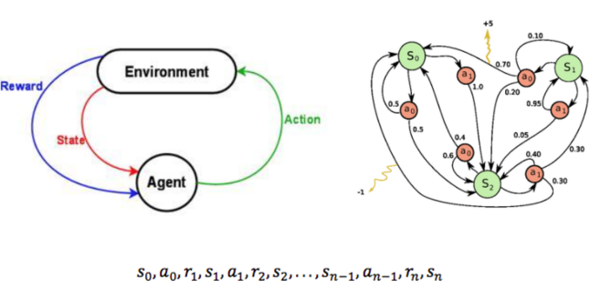

如上图左边所示，一个 agent(例如：玩家/智能体等)做出了一个 action，对 environment 造成了影响，也就是改变了 state，而 environment 为了反馈给 agent，agent 就得到了一个奖励(例如：积分/分数)，不断的进行这样的循环，直到结束为止。

### 3. 强化学习和监督学习、无监督学习的区别

1. 监督式学习就好比你在学习的时候，有一个导师在旁边指点，他知道怎么是对的怎么是错的。

   强化学习会在没有任何标签的情况下，通过先尝试做出一些行为得到一个结果，通过这个结果是对还是错的反馈，调整之前的行为，就这样不断的调整，算法能够学习到在什么样的情况下选择什么样的行为可以得到最好的结果。
2. 监督式学习输出的是之间的关系，可以告诉算法什么样的输入对应着什么样的输出。监督学习做了比较坏的选择会立刻反馈给算法。

   强化学习出的是给机器的反馈 reward function，即用来判断这个行为是好是坏。 另外强化学习的结果反馈有延时，有时候可能需要走了很多步以后才知道以前的某一步的选择是好还是坏。
3. 监督学习的输入是独立同分布的。

   强化学习面对的输入总是在变化，每当算法做出一个行为，它影响下一次决策的输入。
4. 监督学习算法不考虑这种平衡，就只是 exploitative。

   强化学习，一个 agent 可以在探索和开发（exploration and exploitation）之间做权衡，并且选择一个最大的回报。
5. 非监督式不是学习输入到输出的映射，而是模式(自动映射)。

   对强化学习来说，它通过对没有概念标记、但与一个延迟奖赏或效用（可视为延迟的概念标记）相关联的训练例进行学习，以获得某种从状态到行动的映射。

**强化学习和前二者的本质区别**:没有前两者具有的明确数据概念，它不知道结果，只有目标。数据概念就是大量的数据，有监督学习、无监督学习需要大量数据去训练优化你建立的模型。

|      | 监督学习         | 非监督学习     | 强化学习                                                       |
| ---- | ---------------- | -------------- | -------------------------------------------------------------- |
| 标签 | 正确且严格的标签 | 没有标签       | 没有标签，通过结果反馈调整                                     |
| 输入 | 独立同分布       | 独立同分布     | 输入总是在变化，每当算法做出一个行为，它影响下一次决策的输入。 |
| 输出 | 输入对应输出     | 自学习映射关系 | reward function，即结果用来判断这个行为是好是坏                |

# 模型或网络方面

## transformer

## pytorch

## tensorflow

## LLaVA

## DeepSeek

## CLIP

**CLIP（Contrastive Language-Image Pre-training）是由 OpenAI 于 2021 年提出的一种多模态预训练模型** ，其核心思想是通过对比学习将图像和文本映射到同一语义空间，实现跨模态的语义对齐。使得模型能够直接比较图像和文本的相似性。

：：所以这就是一个多模态模型，能同时获得图像和文本信息并将其对应，因此可以进行图像分类，文生图，图像标注，文本检索等功能，而且适用于零样本学习。其通过两个独立编码器，ViT 加 BERT，两个分别处理图像和文本，并且将其线性投影到同一 512 维空间，使图像和文本特征可以直接比较和对应。

## BERT

BERT（Bidirectional Encoder Representations from Transformers）是谷歌于 2018 年提出的 **预训练语言模型** ，通过双向 Transformer 架构和大规模无监督学习，显著提升了自然语言处理（NLP）任务的性能，成为 NLP 领域里程碑式的突破。

：：核心技术

- 核心是**双向编码**，同时处理左右上下文，以前基本都是单向，所以可以更好的捕捉语义和理解。
- 采用**掩码语言模型训练**，通过遮盖输入 15%的词，让模型猜测被遮盖的词，可以强制学习上下文关系——有点像 dropout，都是丢弃一部分，不过这个是为了更好的理解，也可以看成是喂给了他更多不同的数据，所以能处理这一种情况，也增强了总体性能。
- **下一句预测（NSP）。训练目标** ：给定两个句子 A 和 B，判断 B 是否是 A 的下一句（50%概率是真实下一句，50%是随机句子）。**目的** ：增强模型对句子间逻辑关系的理解（如因果、对比、列举），适用于问答、文本摘要等任务。
- **大模型无监督预训练**，训练集为 BooksCorpus（8 亿词）和英文维基百科（25 亿词），后续微调即可适应特定任务

## ViT

其是由谷歌在 2020 年提出的一种视觉模型，核心思想是**将自然语言处理（NLP）中取得巨大成功的 Transformer 架构几乎不做修改地直接应用于图像分类任务** 。

在此之前，计算机视觉领域几乎是卷积神经网络（CNN）的天下。ViT 的提出，挑战了 CNN 的统治地位，证明了一个纯 Transformer 的架构在足够数据预训练的情况下，可以在图像分类任务上达到 state-of-the-art (SOTA) 的水平。

所以需要先去看看 Transformer。

### 核心思想：将图像视为一个序列（Patch 序列）

这是 ViT 最根本、最革命性的思想。

- **NLP 中的 Transformer 如何处理数据？**
  它处理的是 **词元（Token）序列** 。例如，“I love apple” 会被分成 `[I, love, apple]` 三个 token，每个 token 被编码成一个向量，然后输入给 Transformer。
- **ViT 如何借鉴这一思想？**
  它将一张图像 **切割成若干个固定大小的、不重叠的图像块（Image Patches）** 。每个图像块就相当于 NLP 中的一个单词（Word/Token）。
  - **举例** ：一张 224x224x3 的图像，被切割成 196 个 16x16x3 的图像块 (224/16=14, 14x14=196)。每个图像块被展平成一个 16x16x3=768 维的向量。这 196 个向量就构成了一个“句子”，这个“句子”描述了整张图片。

### 三、为什么这样有效？

ViT 的有效性并非来自于某个神奇的局部操作，而是源于其整体架构带来的 **强大建模能力** 。

1. **强大的全局建模能力（Self-Attention 机制）**
   - **与 CNN 的对比** ：CNN 通过卷积核滑动，一次只能看到局部的一个小窗口（感受野），需要堆叠很多层才能逐步将感受野扩大到全局。这是一种间接的、渐进式的信息传递。
   - **ViT 的优势** ：在 ViT 的 **第一层** ， **自注意力机制（Self-Attention）就能让每个图像块（Patch）与所有其他图像块直接进行交互和信息融合** 。这意味着模型从一开始就拥有 **全局视野** ，能够直接建模图像中任意两个区域之间的关系，无论它们相隔多远。这对于理解图像的全局结构和长距离依赖（比如动物的头和尾巴的关系）非常有利。
2. **卓越的可扩展性（Scalability）**
   Transformer 架构被证明在 NLP 领域具有极强的可扩展性：模型越大、数据越多，性能几乎可以无限提升。ViT 将这一特性带到了 CV 领域。实验表明， **当在超大规模数据集（如 JFT-300M）上预训练后，ViT 的性能会随着模型参数量的增加而持续提升，最终超越最先进的 CNN** 。而大型 CNN 通常会面临难以训练和深度加深带来的梯度问题。
3. **预训练-微调范式的成功迁移**
   ViT 完美地继承了 NLP 中“在大规模无标注数据上预训练，然后在特定下游任务上微调”的范式。先在海量图像数据上学习通用的视觉表征，再通过微调适配到 ImageNet 等具体任务，这是其性能强大的关键

### 四、特点（优缺点）

**优点：**

- **高性能** ：在大数据预训练下，在多项视觉任务上达到 SOTA。
- **可扩展性强** ：易于通过增加层数、隐藏层维度等来扩大模型容量。
- **并行计算友好** ：Self-Attention 的计算本质是矩阵乘法，非常适合在 GPU/TPU 上进行加速，训练效率高。

**缺点与挑战：**

- **数据饥渴（Data-hungry）** ：ViT 的归纳偏置（Inductive Bias）远少于 CNN（CNN 内置了平移不变性和局部性先验）。因此， **在没有海量数据预训练的情况下，ViT 在小规模数据集（如 ImageNet-1k）上的表现通常不如同等规模的 CNN** ，因为它更容易过拟合。
- **计算复杂度高** ：Self-Attention 的计算复杂度是序列长度的平方（O(n²)）。当图像分辨率很高、Patch 数量很多时（比如 512x512 的图像会有 1024 个 Patch），计算量和内存占用会急剧上升。后续有很多工作（如 Swin Transformer）致力于解决这个问题。
- **缺乏局部性** ：虽然全局建模能力强，但一开始对图像底层的、局部的特征（如边缘、纹理）感知较弱。CNN 的卷积核天生就是优秀的局部特征提取器。

### 五、其思路在其他模型或例子中的体现

ViT “将非序列数据转化为序列并用 Transformer 处理” 的思路极具启发性，催生了一个新的研究领域，即 **“X-former”** ，引发了将 Transformer 应用于各类数据的浪潮。

：：X-former：基于原始 transformer 的一类模型的总称

1. **CV 领域的后续工作** ：

- **Swin Transformer** ：微软提出，引入了**滑窗（Shifted Windows）** 和 **层次化结构** ，让 Transformer 像 CNN 一样具有**多尺度特征**和 **线性计算复杂度** ，成为了一个强大的通用视觉骨干网络，在检测、分割等密集预测任务上表现极佳。
- **Detection Transformer (DETR)** ：Facebook 提出，将目标检测视为一个**集合预测（Set Prediction）** 问题。直接将图像特征序列输入 Transformer，输出一个预测框的集合，省去了传统检测器中锚框（Anchor）和非极大值抑制（NMS）等复杂后处理步骤。

1. **多模态领域** ：

- **CLIP / ALIGN** ：将图像和文本分别编码为序列，通过对比学习在同一个向量空间中对齐。其图像编码器就是 ViT 或其变体。
- **ViT 作为编码器** ：在各种图像生成（如 Diffusion Model）、图像描述（Image Captioning）、视觉问答（VQA）任务中，ViT 常常被用作强大的图像编码器，将图像转换为特征序列供后续模型（如 Transformer Decoder）处理。

1. **其他领域** ：

- **音频处理** ：将音频波形转换为频谱图，再将频谱图切块作为序列输入 Transformer。
- **点云处理** ：将三维点云中的每个点视为一个 token，组成序列。
- **时间序列预测** ：将一段时间的历史数据点视为一个序列，直接用 Transformer 进行建模。

## 其他相关知识

### Focal Loss，CE

CE：标准交叉熵，其容易被多数样本主导，导致对少样本（难样本）的分类性能下降

Focal Loss：动态调整样本权重，使模型更关注难分类样本，抑制易分类样本的过度贡献。

### MOE，专家混合模型

MoE（Mixture of Experts，混合专家模型）是一种将多个“专家”网络组合起来的机器学习架构，旨在通过分工协作提升模型性能与效率，尤其在处理大规模数据和复杂任务时表现出色。MoE 的核心思想是“分而治之”。它将输入数据分配给不同的专家子网络进行处理，每个专家专注于特定类型的数据或任务特征。最终，通过一个门控网络（Gating Network）对各个专家的输出进行加权组合，得到最终的预测结果。

：：参考了随机森林吗？随机森林这样可以有效预防过拟合，而且多个模型，每个模型适配不同的任务，其在该任务上的输出也会更加稳定，

关于大规模 Switch / DeepSpeed-MoE / Mixtral 网络，下列说法哪些正确?

1. 稀疏 MoE 典型做法是 Gating 网络为每个 token 选择 <= k 个专家，前向仅激活其参数——正确，使用 top-K，可以显著减少运算量
2. Capacity Factor 决定每批 token 可路由到单专家的上限;过低会导致"expert overflow"——正确，capacity factor 容量因子，决定的就是单个专家在前向传播时能处理的 token 上限。
3. Top-k routing（路由）使梯度仅更新被选中的专家，故若 k=1 易产生训练不稳定的专家孤岛——正确，所以不要让 K=1，以及添加浮在均衡，强制专家选择均匀化。
4. 与同规模稠密模型相比，MoE 在推理延迟必然更低，因为每 token 只经过少数专家——错误，情况比较复杂，专家通信也需要时间，Gating 网络计算也需要时间，当负载不均时可能也有瓶颈。

### Swish，Hard-Swish

相较原 Swish，Hard-Swish 被引入移动端模型的主要原因是

1. 能自动归—化通道
2. 使梯度裁剪更稳定
3. 减少分支判断数
4. 极大降低乘法与 exp 运算——正确

$ \text{Swish}(x) = x \cdot \sigma(\beta x) $，其中σ是Sigmoid函数，合并后为$ \text{Swish}(x) = \frac{x}{1 + e^{-\beta x}} $

$ \text{Hard Swish}(x) = x \cdot \frac{\text{ReLU6}(x + 3)}{6} $,整体式一个分段函数形式

$ \text{ReLU6}(z) = \min(\max(0, z), 6) $

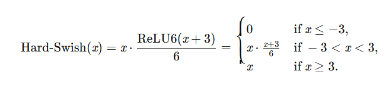

### Kosmos-2，多模态 grounding

关于 Kosmos-2 所引入的多模态 grounding 机制，哪几项正确？

| **选项**                                                                      | **正确性** |
| ----------------------------------------------------------------------------------- | ---------------- |
| 推理时模型既能解析输入中的位置 token，也能在输出中生成位置 token 完成指代           | ✅ 正确          |
| 模型用结构化标记（如 `<phrase>文本</phrase>` 后接位置 token）锚定文本到边界框位置 | ✅ 正确          |
| Kosmos-2 采用扩散模型解码框坐标，属于 encoder-decoder + diffusion 结构              | ❌ 错误          |
| 训练语料 GRIT 由网页图文对自动生成，提供短语-框配对的图文数据                       | ✅ 正确          |

Kosmos-2 是微软提出的下一代多模态大模型，其核心创新之一是 **多模态 Grounding 机制** ，旨在解决传统多模态模型中“文本与视觉信息割裂”的问题，通过将语言和视觉信号在统一语义空间中精准对齐，实现更细粒度的跨模态理解和生成。

- **解决模态割裂问题** ：传统模型（如 CLIP）仅学习文本和图像的全局匹配，无法定位具体视觉元素（如“图片中的红色气球”）。Kosmos-2 通过 Grounding 实现 **文本描述到视觉区域的精准映射** ，例如理解“穿蓝色衬衫的人”对应图像中的具体像素区域。
- **支持细粒度任务** ：为视觉问答（VQA）、图像标注、指令跟随等任务提供可解释的推理过程，例如回答“图中猫的颜色”时，模型需定位猫的位置并提取颜色特征。

### wav2vec 2.0,Gumbel-Softmax

在训练 wav2vec 2.0 时,为防止 Gumbel-Softmax 量化码簇塌陷(codebook collapse)，下列哪项技巧 最关键?

1. 增大模型隐藏維度$d_{model}$
2. 训练阶段加入 SpecAugment 时频遮挡
3. 将对比损失替换为 L2 重建损失
4. 对 Gumbel-Softmax 温度做逐步退火(annealing)——正确

**Gumbel-Softmax 的温度参数 **τ\*\*\*\* ：控制输出分布的“尖锐程度”：

- **τ**→**∞**：输出接近均匀分布，码字选择随机，无法学习有效离散表示。
- **τ**→**0**：输出接近 one-hot，但可能过早锁定到次优码字，导致塌陷。

**码簇塌陷(Codebook Collapse）：** 在离散量化（通过 Gumbel-Softmax 或 Vector Quantization, VQ）过程中，部分码字（codewords）可能被“废弃”（即极少或从不被使用），导致码本（codebook）的有效容量下降，模型只能依赖少数码字编码信息，损害表达能力.

：：失去多样性，特征表达不足，模型性能下降

| **选项**                              | **局限性**                                                                                              |
| ------------------------------------------- | ------------------------------------------------------------------------------------------------------------- |
| 增大模型隐藏维度$d_{model}$               | 仅增加模型容量，无法直接解决码字选择的不均匀问题，可能加剧过拟合。                                            |
| **训练阶段加入 SpecAugment 时频遮挡** | 提升数据多样性，但与码字利用无关，无法防止塌陷。                                                              |
| **将对比损失替换为 L2 重建损失**      | 重建损失可能弱化离散量化的目标（如 wav2vec 2.0 的对比学习依赖负样本区分），且 L2 损失本身不解决码字选择问题。 |

### 视觉编码器

视觉编码器（Vision Encoder）是计算机视觉和多模态人工智能模型中的核心组件，其作用是将原始视觉数据（如图像、视频帧）转换为高维语义向量（即“特征表示”），供后续任务（如分类、检测、生成或多模态融合）使用。也就是说，把图片转化成向量。

：：是普通的神经网络吗，不能说是，也不能说不是，区别如下

| **维度**     | **普通网络**                   | **视觉编码器**                                                                  |
| ------------------ | ------------------------------------ | ------------------------------------------------------------------------------------- |
| **设计目标** | 解决特定任务（如分类、检测）         | **提取通用视觉特征** ，供下游任务复用                                           |
| **输入输出** | 输入：图像；输出：任务预测（如类别） | 输入：图像；输出：**高维语义向量** （特征）                                     |
| **可复用性** | 通常为任务定制，难以迁移             | **预训练后可迁移**到多种任务（微调或零样本）                                    |
| **架构约束** | 灵活设计，无固定范式                 | 需平衡**特征表达能力**与 **计算效率** （如 ViT 的块分割、CNN 的层级结构） |
| **训练方式** | 监督学习为主（需标注数据）           | **支持自监督预训练** （如 MAE、DINO），减少对标注的依赖                         |

#### **一、视觉编码器的核心功能**

1. **特征提取**
   从原始像素中提取有意义的视觉特征，例如：
   - **低级特征** ：边缘、纹理、颜色等（由浅层网络捕捉）。
   - **高级特征** ：物体部件、整体结构、语义类别（由深层网络捕捉）。
   - ：：网络前期感受野小，后来通过池化慢慢增大感受野，便于捕捉全局特征。
2. **维度压缩**
   将高维像素数据（如 224×224 图像的 3×224×224=150,528 维）压缩为低维向量（如 768 维或 1024 维），降低计算复杂度。
3. **语义建模**
   通过层级结构逐步理解图像内容，例如：
   - 第一层识别局部模式（如条纹）。
   - 中间层组合模式为物体部件（如车轮）。
   - 深层组合部件为完整物体（如汽车）。

#### **主流视觉编码器类型**

根据架构设计，视觉编码器可分为以下几类：

**1. 卷积神经网络（CNN）编码器**

- **代表模型** ：ResNet、VGG、EfficientNet、ConvNeXt。
- **特点** ：
- 使用卷积层堆叠，通过局部感受野和参数共享高效提取空间特征。
- 典型结构：卷积层 → 池化层 → 全连接层（现代 CNN 常替换全连接层为全局平均池化）。
- **输出** ：通常为全局特征向量（如 ResNet-50 的 2048 维向量）或空间特征图（如 Faster R-CNN 的 ROI 特征）。

**2. 视觉 Transformer（ViT）编码器**

- **代表模型** ：ViT、Swin Transformer、DeiT、MAE。
- **特点** ：
- 将图像分割为固定大小的块（如 16×16 像素），视为“视觉 token”，通过自注意力机制建模全局关系。
- 典型结构：块嵌入（Patch Embedding）→ 位置编码 → 多层 Transformer 编码器。
- **输出** ：全局特征向量（如 ViT-Base 的 768 维向量）或块级特征（用于密集预测任务）。

**3. 混合架构编码器**

- **代表模型** ：CoAtNet、CvT、MobileViT。
- **特点** ：
- 结合 CNN 的局部归纳偏置和 Transformer 的全局建模能力。
- 例如：CvT 在 ViT 的块嵌入阶段使用卷积替代线性投影，增强局部特征提取。

**4. 自监督预训练编码器**

- **代表模型** ：MAE（掩码自编码器）、SimMIM、DINO。
- **特点** ：
- 通过自监督任务（如掩码图像重建、对比学习）预训练编码器，无需人工标注。
- 预训练后的编码器可迁移到下游任务（如分类、检测）进行微调。

### 模型权重

模型权重是数值矩阵或者张量，存在文件中（如 `.safetensors`、`.bin`）例如

- 线性层：包括权重矩阵$\mathbf{W} \in \mathbb{R}^{d_{\text{out}} \times d_{\text{in}}}$和偏置向量$B\in R^{d_{out}}$, **y**=**Wx**+**b**
- 注意力机制，查询矩阵 **Q**、键矩阵 **K**、值矩阵 **V** 等。

在训练过程中，通过反向传播和优化算法（如 Adam），模型不断调整权重值，最小化损失函数（如交叉熵损失），最终收敛到一组能泛化到新数据的参数。

HuggingFace 主推的模型权重文件类型为**Safetensors**格式，其内部存储格式文件，可以分片存储，并且按照默认大小分片。（如 2GB 一个文件）。

Safetensors：HuggingFace 主推的安全替代方案，尤其适合大模型（如 Qwen2 的数十亿参数）。

往往需要搭配索引文件使用，如 model.safetensors.index.json，其记录分片信息（如总文件数、每个分片的权重键名），优点如下。

- **安全性** ：避免 Python pickle 漏洞，加载更安全。
- **效率** ：通过内存映射读取，减少聂村占用，比传统 `.bin`文件加载更快，尤其在大模型上。
- **兼容性** ：HuggingFace 生态标准格式，支持 `transformers`库直接加载。

另外一种权重文件累心是**bin 文件，** 其是 pytorch 常用的文件格式，相比其 Safetensors 默认按照大小分片，bin 可能是单文件或自定义分片

| 格式                           | 优点                                       | 缺点                   | 典型场景                  |
| ------------------------------ | ------------------------------------------ | ---------------------- | ------------------------- |
| **Safetensors**          | 安全（避免 pickle 漏洞）、加载快、支持分片 | 依赖 HuggingFace 生态  | 大模型（如 Qwen2、Llama） |
| **PyTorch `.bin`**     | 兼容性强、支持自定义操作                   | 加载慢、存在安全风险   | 传统 PyTorch 模型         |
| **TensorFlow `.ckpt`** | TensorFlow 生态标准                        | 转换复杂、分片管理麻烦 | TensorFlow 模型           |

## 权重类型分类

以 Transformer 架构（如 Qwen2-5VL）为例，权重分为以下几类：

### **所有 Transformer 模型的** **核心权重分类** **高度一致**

#### **1. 嵌入层（Embedding Layer）**

- **词嵌入（Token Embedding）**
  将每个 token（如单词、子词）映射为高维向量（如 768 维）。例如，`vocab.json`定义了 token 到 ID 的映射，权重矩阵形状为 **V**×**D**，其中 **V** 是词汇表大小，**D** 是嵌入维度。
- **位置嵌入（Positional Embedding）**
  为序列中的每个位置分配向量，捕捉位置信息（如绝对位置或相对位置）。

#### **2. 注意力层（Attention Layers）**

- **自注意力（Self-Attention）**
  每个注意力头包含：
  - 查询矩阵 **Q**、键矩阵 **K**、值矩阵 **V**：形状均为 $D_{\text{model}} \times D_{\text{head}}$。
  - 输出投影矩阵 **O**：形状 $D_{head}×D_{model}。$
- **多头注意力（Multi-Head Attention）**
  多个注意力头的参数拼接后通过线性层投影。

#### **3. 前馈网络（Feed-Forward Network, FFN）**

- 两层全连接层：
  - 第一层：扩展维度（如$D_{model}$→$4D_{model}$
  - 第二层：压缩回原始维度（如 $4D_{model}→D_{model}$。::?
- 激活函数（如 GELU）的参数可能隐含在权重中。

#### **4. 层归一化（Layer Normalization）**

- 每个子层（注意力输出、FFN 输出）后接层归一化，包含：
  - 缩放参数 **γ**：形状$ D\_{model}。$
  - 偏移参数 **β**：形状$D_{model}。$

#### **5. 分类头（Classification Head）**

- 对于分类任务，最后接一个线性层，权重形状为 $D_{model}$×**C**，其中 **C** 是类别数。
- 对于生成任务（如 Qwen2-5VL），可能是语言模型头（LM Head），与词嵌入矩阵共享权重。

#### **6. 多模态权重（以 Qwen2-5VL 为例）**

- **视觉编码器** ：
  可能包含卷积层或 ViT（Vision Transformer）的权重，处理图像输入并生成视觉特征。
- **跨模态注意力** ：
  融合文本和视觉特征的注意力模块，权重结构与自注意力类似，但输入来自不同模态。
- **模态投影层** ：
  将视觉特征映射到文本嵌入空间的线性层。

### **不同 Transformer 模型的** **权重差异点**

尽管核心组件相似，但任务需求或架构创新会导致权重分类的扩展或调整：

#### **1. 编码器-解码器结构 vs. 纯解码器结构**

- **编码器-解码器（如 T5、BART）**
  额外包含：
  - **编码器-解码器注意力** ：解码器层中，查询来自解码器，键和值来自编码器输出。
  - **交叉注意力权重** ：形状与自注意力类似，但输入来源不同。
- **纯解码器（如 GPT、LLaMA）**
  仅包含自注意力，无交叉注意力。

#### **2. 多模态模型（如 Qwen2-5VL、Flamingo）**

- **视觉编码器权重** ：
  处理图像输入（如卷积层、ViT 的注意力权重），与文本编码器权重分离。
- **跨模态融合权重** ：
  - **模态投影层** ：将视觉特征映射到文本嵌入空间（如线性层 $D_{vision}→D_{text}$）。
  - **共注意力（Co-Attention）** ：同时对文本和视觉特征计算注意力，权重结构更复杂。

#### **3. 架构变体引入的特殊权重**

- **稀疏注意力（如 Longformer、BigBird）**
  引入局部注意力、全局注意力等模式，需额外权重控制稀疏连接。
- **混合专家模型（MoE，如 Switch Transformer）**
  包含：
  - **专家网络权重** ：多个子网络（专家）的独立权重。
  - **门控网络权重** ：决定输入分配到哪个专家的路由参数。
- **线性注意力（如 Performer）**
  用核方法近似注意力计算，引入可学习的核函数参数。

#### **4. 任务特定优化**

- **高效推理** ：
  - **量化权重** ：将 FP32 压缩为 INT8（如 GPTQ），需存储量化参数。
  - **低秩分解** ：用两个小矩阵近似大权重矩阵（如 LoRA 的 **A** 和 **B** 矩阵）。
- **长文本处理** ：
  - **旋转位置嵌入（RoPE，如 LLaMA 2）** ：引入旋转矩阵参数，增强位置编码的远距离建模能力。

| 模型类型                     | 核心权重分类                            | 特殊权重          |
| ---------------------------- | --------------------------------------- | ----------------- |
| **BERT**               | 嵌入层、自注意力、FFN、层归一化、分类头 | 无（纯编码器）    |
| **GPT**                | 嵌入层、自注意力、FFN、层归一化、LM 头  | 无（纯解码器）    |
| **T5**                 | 编码器-解码器注意力、交叉注意力         | 编码器-解码器结构 |
| **Qwen2-5VL**          | 视觉编码器、共注意力、模态投影层        | 多模态融合权重    |
| **Switch Transformer** | 专家网络、门控网络                      | MoE 相关权重      |

## Qwen2.5-VL-3B-instruct-V2

2025.9.1:配置模型的时候遇到了很大的问题，preprocessor_config.json 文件格式不对，导致一直识别不了，解决办法是将模型复制到 output 里面，然后重写这个文件，然后才能使用 AutoProcessor。
note:"image_processor_type": "Qwen2VLImageProcessor",这里的问题，原来这里是 Qwen2_5_VLImageProcessor,这样就会报错

：：这个文件在 Hugging Face 里面是对的，但是在 kaggle 里面的模型有问题,就没有这样一个东西

1️⃣ AutoProcessor 的加载逻辑（核心流程）

当你调用：

<pre class="overflow-visible!" data-start="174" data-end="241"><div class="contain-inline-size rounded-2xl relative bg-token-sidebar-surface-primary"><div class="sticky top-9"><div class="absolute end-0 bottom-0 flex h-9 items-center pe-2"><div class="bg-token-bg-elevated-secondary text-token-text-secondary flex items-center gap-4 rounded-sm px-2 font-sans text-xs"></div></div></div><div class="overflow-y-auto p-4" dir="ltr"><code class="whitespace-pre! language-python"><span><span>processor = AutoProcessor.from_pretrained(model_path)
</span></span></code></div></div></pre>

内部流程大致如下：

1. **读取 `preprocessor_config.json`**

<pre class="overflow-visible!" data-start="294" data-end="388"><div class="contain-inline-size rounded-2xl relative bg-token-sidebar-surface-primary"><div class="sticky top-9"><div class="absolute end-0 bottom-0 flex h-9 items-center pe-2"><div class="bg-token-bg-elevated-secondary text-token-text-secondary flex items-center gap-4 rounded-sm px-2 font-sans text-xs"></div></div></div><div class="overflow-y-auto p-4" dir="ltr"><code class="whitespace-pre! language-json"><span><span>{</span><span>
         </span><span>"image_processor_type"</span><span>:</span><span></span><span>"..."</span><span>,</span><span>
         </span><span>"processor_class"</span><span>:</span><span></span><span>"..."</span><span>
     </span><span>}</span><span>
     </span></span></code></div></div></pre>

2. **根据 `processor_class` 找到对应 Processor 类**
   - 这里 `processor_class` 决定要加载哪一个 Python 类：
     `<pre class="overflow-visible!" data-start="484" data-end="570"><div class="contain-inline-size rounded-2xl relative bg-token-sidebar-surface-primary">``<div class="sticky top-9"><div class="absolute end-0 bottom-0 flex h-9 items-center pe-2">``<div class="bg-token-bg-elevated-secondary text-token-text-secondary flex items-center gap-4 rounded-sm px-2 font-sans text-xs"></div>``</div></div>``<div class="overflow-y-auto p-4" dir="ltr"><code class="whitespace-pre! language-python">``<span><span>`from`<span>` transformers.models.qwen2_5_vl `<span>`import`<span>` Qwen2_5_VLProcessor
     `</code></div>``</div></pre>`
3. **根据 `image_processor_type` 进一步选择 ImageProcessor 类**
   - AutoProcessor 内部有一个映射表或者通过 `getattr` 动态查找：
     `<pre class="overflow-visible!" data-start="680" data-end="765"><div class="contain-inline-size rounded-2xl relative bg-token-sidebar-surface-primary">``<div class="sticky top-9"><div class="absolute end-0 bottom-0 flex h-9 items-center pe-2">``<div class="bg-token-bg-elevated-secondary text-token-text-secondary flex items-center gap-4 rounded-sm px-2 font-sans text-xs"></div>``</div></div>``<div class="overflow-y-auto p-4" dir="ltr"><code class="whitespace-pre! language-python">``<span><span>`getattr`<span>`(transformers.models.qwen2_5_vl, image_processor_type)
     `</code></div>``</div></pre>`
   - 也就是说，它会尝试找到 Python 中确实存在的类名。

### 微调，以 Qwen2.5VL 为例学习

在预训练模型的基础上，通过特定的数据进行额外训练，是模型能够适应特定的任务。

微调的目的：

1. **领域适应** ：让通用模型适应特定领域
2. **任务特定** ：优化模型在特定任务上的表现
3. **数据隐私** ：在私有数据上训练而不泄露
4. **计算效率** ：比从头训练节省大量资源

常用流程（不统一，但这里都写一下）：

环境准备与配置，数据准备，模型加载与配置（包括设置微调方法），训练循环，保存训练好的模型

### 微调关键技术

#### **全参数微调 vs 参数高效微调**

- **全参数微调** ：更新所有参数，效果好但资源消耗大
- **参数高效微调** ：只更新少量参数，资源消耗小
- **LoRA** ：低秩适应
- **Adapter** ：插入适配层
- **Prompt Tuning** ：学习提示词

| 数据量   | 推荐方法      | 说明             |
| -------- | ------------- | ---------------- |
| 大量数据 | 全参数微调    | 充分学习数据分布 |
| 中等数据 | LoRA + 全参数 | 平衡效果和效率   |
| 少量数据 | LoRA/Adapter  | 避免过拟合       |

不同微调任务有不同的微调方法

- **分类任务** ：微调分类头
- **生成任务** ：微调整个解码器
- **多模态任务** ：注意模态对齐

#### LoRA

原始权重 W → W + ΔW
其中 ΔW = BA (低秩分解)
B ∈ R^(d×r), A ∈ R^(r×k), r << min(d,k)

通过减少秩，从而减少计算量和占用空间。

### 微调性能优化技巧

#### 显存优化

深度学习训练中常用的这三个技术： **梯度累积** 、**混合精度**和 **梯度检查点** 。它们通常被一起使用，旨在解决大规模模型训练中的两个核心问题：**显存限制** 和 **训练速度** 。

##### 梯度累计

梯度累积是一种在**显存有限**的情况下，模拟**更大批量训练**的技术。它的核心思想是：将原本一个大批次（Batch）的数据，分成几个小批次（Mini-Batch），依次进行前向传播和损失计算，但 **不立即进行反向传播和参数更新** ，而是将多个小批次的梯度累积起来，在达到预设的累积步数后，用累积梯度的平均值（或总和）一次性更新模型参数。

**为什么需要梯度累计**：：Batch Size 大了会更稳定，突破了缓存太小的限制

- **核心目的** ：突破 GPU 显存对批量大小的限制。
- **背景** ：更大的批量大小（Batch Size）通常能带来更稳定的梯度估计和可能更高的训练效率，但需要更多的显存来存储中间激活值和梯度。
- **解决方法** ：通过累积多个小批次的梯度，最终参数更新的效果等价于使用 `(小批量大小 * 累积步数)` 的大批量，但显存占用仅与一个小批次的大小相关。

**如何工作？**

：：正常得到每一个 batch size 的梯度，反向传播，但是不要更新权重，而是等到走完了累计步数后，再取之前的所有的梯度去品均值，用累计的 n 个批次的梯度来更新模型参数，由于参数多了，所以训练更加稳定了，所以其稳定了训练过程，但也会略微延长时间

假设我们想实现等效批量大小为 64，但 GPU 最多只能放下批量大小为 16 的数据。

1. 设置累积步数 `accumulation_steps = 4` (64 / 16)。
2. 正常进行前 3 个批量大小为 16 的批次的前向传播和损失计算，并 **反向传播得到梯度** 。每次反向传播后， **不执行 `optimizer.step()`来更新权重，也不执行 `optimizer.zero_grad()`来清零梯度** ，这样梯度就会累加在模型参数上。
3. 处理第 4 个批次时，同样进行前向和反向传播，梯度再次累加。
4. 现在，我们已经累积了 4 个批次的梯度。这时，我们执行 `optimizer.step()` 来用累积的梯度（通常取平均）更新模型参数。
5. 更新完成后，再执行 `optimizer.zero_grad()` 将梯度清零，为下一轮的累积做准备。

##### 混合精度

混合精度训练是指在训练过程中，同时使用**单精度浮点数**和 **半精度浮点数** 。通常的做法是：

- 使用 FP16 进行计算和存储，以提升速度并减少显存占用。
- 但保留一份 FP32 的模型参数副本，用于参数更新，以保证数值稳定性和精度。
- **优点** ：大幅提升训练速度（利用 Tensor Cores），显著减少显存占用，允许训练更大模型或使用更大批次。
- **缺点** ：需要框架支持（如 PyTorch 的 `torch.cuda.amp`），可能存在数值不稳定的风险（但 AMP 等自动化工具已很好地解决了这个问题）。

##### 梯度检查点

梯度检查点，也称为 **激活重计算** ，是一种用**计算换显存**的极端技术。它通过只保存部分中间结果（检查点），在反向传播需要时重新计算其余中间结果，来大幅减少显存占用。

- **核心目的** ： **极端地减少显存占用** ，以训练**极其巨大**的模型。
- **背景** ：前向传播过程中产生的中间激活值（Intermediate Activations）是显存占用的主要来源之一，因为它们需要被保存下来用于反向传播的计算。模型越深，激活值占用的显存就越多。
- **优点** ：可以将显存占用从 O(n)（与网络深度 n 成正比）降低到 O(√n)， **牺牲计算时间** （因为需要重算）来换取 **极大的显存节省** ，是训练超大模型的必备技术。
- **缺点** ：显著增加了训练时间（通常增加 20%-30%），因为有一部分前向计算需要做两遍。

#### 训练加速

数据并行：(`nn.DataParallel` 和 `nn.DistributedDataParallel`)，其他还有学习率调度（不要使用不变的学习率）以及使用更快的优化器。

数据并行是一种**将模型复制到多个 GPU 上，并将一个批次的数据拆分到这些 GPU 上并行处理**的技术。每个 GPU 上都有一份完整的模型副本，各自处理一部分数据，最后汇总梯度并同步更新所有模型参数。

**注意** ：`nn.DataParallel`（DP）是较老的 API，存在性能瓶颈（主 GPU 是通信瓶颈）。 **现代 PyTorch 推荐使用 `nn.DistributedDataParallel`（DDP）** ，它采用多进程架构和环状通信，每个进程对应一个 GPU，通信效率远高于 DP，是当前分布式训练的主流选择。

- **核心目的** ： **利用多个 GPU 来大幅缩短单次迭代（Step）的时间** ，从而加速整个训练过程。
- **背景** ：单个 GPU 的计算能力和显存是有限的。当模型或数据集很大时，训练会非常缓慢。数据并行可以将工作负载分摊到多个 GPU 上，实现近乎线性的加速比。

### 微调总体流程

数据准备 → 模型配置 → LoRA 设置 → 训练循环 → 模型保存 → 推理测试

| 阶段               | 关键步骤              | 注意事项                             |
| ------------------ | --------------------- | ------------------------------------ |
| **数据准备** | 构建对话格式数据集    | 确保图像-文本对正确对齐              |
| **模型加载** | 8-bit 量化 + LoRA     | 选择合适的 target_modules            |
| **训练配置** | 梯度累积 + 学习率调度 | 小心选择 batch size 和 learning rate |
| **训练执行** | 监控 loss + 梯度裁剪  | 定期验证模型性能                     |
| **保存部署** | 保存适配器权重        | 保持基础模型不变                     |

## 零散汇总

### temperature,top_k,top_p

| 参数                               | 作用                            | 建议值           |
| ---------------------------------- | ------------------------------- | ---------------- |
| `do_sample`<br />--------------- | 是否启用随机采样                | `True`         |
| `temperature`                    | 控制输出多样性（值越高越随机）  | `0.7~1.0`      |
| `top_k`                          | 限制采样范围为概率最高的 K 个词 | `50`           |
| `top_p`                          | 核采样（累积概率超过 P 后停止） | `0.9~0.95`     |
| `seed`                           | 随机种子（固定则结果可复现）    | `None`（动态） |

#### 常用搭配

| **场景**             | **参数**  | **值**              | **说明**                                   |
| -------------------------- | --------------- | ------------------------- | ------------------------------------------------ |
| **高确定性**         | `do_sample`   | False（或 True + 低温度） | 禁用随机采样（或限制随机性），确保输出稳定。     |
| （问答、指令跟随）         | `temperature` | `0.3`                   | 降低随机性，优先选择高概率词。                   |
|                            | `top_k`       | `10`                    | 仅从概率最高的 10 个词中采样，避免低质量词。     |
|                            | `top_p`       | `0.9`                   | 累积概率阈值，进一步约束候选词范围。             |
|                            | `seed`        | `42`（可选）            | 固定随机种子，结果可复现（调试时推荐）。         |
| **平衡多样性与质量** | do_sample       | `True`                  | 启用随机采样，提升输出自然度。                   |
| （聊天、摘要）             | `temperature` | `0.7`                   | 适度随机，平衡逻辑性与多样性。                   |
|                            | `top_k`       | `50`                    | 从前 50 个高概率词中采样，覆盖常见合理选择。     |
|                            | `top_p`       | `0.95`                  | 累积概率阈值，保留长尾但合理的词。               |
|                            | `seed`        | `None`                  | 动态随机，每次输出可能不同（实际生成推荐）。     |
| **高随机性**         | `do_sample`   | `True`                  | 强制随机采样，探索更多可能性。                   |
| （创意写作、探索）         | `temperature` | `1.2`                   | 高随机性，允许低概率词出现（可能离题但创意强）。 |
|                            | `top_k`       | `100`                   | 扩大候选词范围，增加多样性。                     |
|                            | `top_p`       | `0.99`                  | 接近包含所有词，仅排除极低概率词。               |
|                            | `seed`        | `None`                  | 动态随机，充分体现模型创造力。                   |

#### 具体分析

- **`do_sample`（是否启用随机采样）**

当 `do_sample=False` 时，模型会使用 **贪心搜索（Greedy Search）** ，即每次选择概率最高的下一个词。这种解码方式是 **确定性的** ，只要输入相同，输出就完全一致。

而当 do_sample 为 True 时，则解码方式不确定，可以设置其他参数来改变输出结果

- temperature,（温度系数）

控制概率分布的平滑程度，输出多样性，0~1 之间，一般默认为 0，在 do_sample = True 的情况，需要改变其值，不然和没改一样。

| 温度值            | 效果                                                         | 适用场景                 |
| ----------------- | ------------------------------------------------------------ | ------------------------ |
| **0.0**     | 完全确定（贪心搜索）                                         | 问答、代码生成           |
| **0.3~0.7** | 轻微随机，保持逻辑性，概率分布更尖锐，高概率词更占优势       | 结构化输出（如指令跟随） |
| **0.8~1.0** | 适度随机，增加多样性，概率分布没那么尖锐，高概率词还是占优势 | 聊天、创意写作           |
| **>1.0**    | 高随机性，可能离题，概率分布更平滑，低概率词被选中的机会增加 | 探索性任务（如头脑风暴） |

- top_k（Top-k 采样）

  仅从**概率最高的 K 个词**中随机采样，排除低概率词。

**
`top_k=1`** → 等价于贪心搜索（只选概率最高的词）。

**
`top_k=50`** → 从前 50 个词中随机选（默认值通常为 50）。

太小了会范围首先，首选高频词，太高了则随机性高，会引入低质量词

- top_p

从**累积概率超过 P 的最小词集**中随机采样。

**`top_p=1.0`** → 包含所有词（无过滤）。

**`top_p=0.9`** → 只保留概率最高的词，直到它们的累积概率 ≥ 90%。

太小了会输出安全，词比较确定，过大会保留长尾词，可能低质量

- seed，随机种子

  控制随机数生成器的初始状态，使结果可复现。

**
`seed=None`** → 每次运行结果不同（动态随机）。

**
`seed=42`** → 固定随机性，输出完全一致（适合调试）。

当种子一定时，则输出会相同

### 模型变体与区别

以 Qwen2.5 的这些为例

1.5b：原始版
1.5b-instruct：指令微调版， 能更好理解自然语言指令
1.5b-instruct-awq：使用**AWQ**量化，显存占用更低
1.5b-instruct-gptq-int4：GPTQ 4-bit 量化版
1.5b-instruct-gptq-int8：GPTQ 8-bit 量化版，精度稍微高一低，但还是会降低性能。

#### **(1) 1.5B（基础模型）**

- **描述** ：这是原始的 **预训练基础模型** ，没有经过任何指令微调（instruct tuning）。
- **适用场景** ：
- 需要进一步微调（如领域适应、多任务学习）。
- 研究模型的基础能力（如语言建模、表征学习）。
- **显存占用** （FP16）：~3GB
- **推荐使用** ：如果你计划自己微调模型，或者研究基础语言模型的能力，可以选择这个版本。

#### **(2) 1.5B-instruct（指令微调版）**

- **描述** ：在基础模型（1.5B）上，经过 **指令微调（instruct tuning）** ，使模型能更好地遵循人类指令（如问答、对话、任务型生成）。
- **适用场景** ：
- 直接用于对话、问答、生成等任务。
- 适合不需要额外微调的场景。
- **显存占用** （FP16）：~3GB
- **推荐使用** ：如果你希望模型“开箱即用”，能理解并执行你的指令，优先选择这个版本。

#### **(3) 1.5B-instruct-awq（AWQ 量化版）**

- **描述** ：在 **1.5B-instruct** 的基础上，使用 **AWQ（Absolute 1st-Order Weight Quantization）** 量化技术，将模型权重从 FP16 压缩到更低精度（如 4-bit 或更低）。
- **特点** ：
- **显存占用极低** （~0.8GB 左右）。
- **推理速度更快** ，适合低资源设备（如消费级 GPU、边缘计算设备）。
- **精度损失较小** ，AWQ 是一种高效的量化方法。
- **适用场景** ：
- 硬件显存有限（如 4GB 或 8GB GPU）。
- 需要快速推理的场景。
- **推荐使用** ：如果你显存紧张，但希望保留较好的输出质量，优先选择 AWQ 量化版。

#### **(4) 1.5B-instruct-gptq-int4（GPTQ 4-bit 量化版）**

- **描述** ：使用 **GPTQ（General Purpose Quantization）** 算法，将模型量化到 **4-bit 精度** 。
- **特点** ：
- **显存占用极低** （~0.8GB 左右，与 AWQ 接近）。
- **推理速度较快** ，但可能比 AWQ 稍慢（取决于实现）。
- **精度损失可能略大** （尤其是对小模型）。
- **适用场景** ：
- 显存非常有限（如 4GB GPU 或 CPU 推理）。
- 需要极致的显存优化。
- **推荐使用** ：如果你显存极低，且可以接受一定的精度损失，可以选择这个版本。

#### **(5) 1.5B-instruct-gptq-int8（GPTQ 8-bit 量化版）**

- **描述** ：使用 **GPTQ 算法** ，将模型量化到 **8-bit 精度** 。
- **特点** ：
- **显存占用较低** （~1.5GB）。
- **精度损失较小** （比 4-bit 量化更好）。
- **推理速度适中** 。
- **适用场景** ：
- 显存中等（如 8GB GPU）。
- 需要平衡显存占用和输出质量。
- **推荐使用** ：如果你显存足够（如 8GB），但希望降低显存占用，同时保持较好的输出质量，可以选择这个版本。

### 类与函数

#### AutoModel\*，AutoTokenize，AutoProcessor

这三个都是 transformer 里面的工具类，分别用于加载模型、处理文本和多模态数据。以下是它们的详细介绍和使用方法

**1. AutoModelForCausalLM：**

- 用于加载 **因果语言模型（Causal Language Model）** ，如 GPT、Llama、Qwen 等。
- 这类模型的特点是 **自回归生成** （根据上文预测下一个词），适合文本生成任务（如对话、故事续写）。
- `torch_dtype`: 指定数据类型（如 `torch.float16` 节省显存）。
- `device_map`: 自动分配模型到 GPU/CPU（如 `"auto"` 或 `"cuda:0"`）。
- `trust_remote_code`: 允许加载模型自定义代码（如 Qwen 需要）。

**2. AutoTokenizer:**

- 给语言模型打辅助的，分词器，用于处理文本
- 用于将 **文本转换为模型可理解的输入（ID 序列）** ，并将模型输出（ID 序列）转换回文本。
- 处理分词（Tokenization）、添加特殊标记（如 `[CLS]`、`[SEP]`）、截断/填充等。

作用

- **分词** ：将文本拆分为子词（Subword）或字符。
- **特殊标记** ：自动添加 `[CLS]`、`[SEP]` 等模型需要的标记。
- **截断/填充** ：确保输入长度符合模型要求。

**3. AutoProcessor**

**作用**

- 用于 **多模态模型** （如文本+图像、文本+音频），同时处理多种输入类型。
- 例如，`VisionEncoderDecoderModel` 需要 `AutoProcessor` 来同时处理图像和文本。
- 多模态任务（如图像描述生成、视觉问答）。
- **多模态输入** ：同时处理图像、文本、音频等。
- **特征提取** ：如用 ViT 提取图像特征，用 BERT 提取文本特征。
- **统一接口** ：简化多模态数据的预处理流程。

| 类名                           | 用途                     | 适用模型类型                 | 典型任务             |
| ------------------------------ | ------------------------ | ---------------------------- | -------------------- |
| **AutoModelForCausalLM** | 加载因果语言模型         | 纯文本模型（GPT、Qwen 等）   | 文本生成、对话       |
| **AutoTokenizer**        | 文本预处理（分词、编码） | 所有文本模型                 | 文本 →ID、ID→ 文本 |
| **AutoProcessor**        | 多模态数据预处理         | 多模态模型（文本+图像/音频） | 图像描述、视觉问答   |

#### from_pretrained 解析

1. **智能路径解析**

```python
# 可以接受多种输入格式：
processor.from_pretrained("llava-hf/llava-1.5-7b-hf")  # Hugging Face Hub名称
processor.from_pretrained("./local-model")             # 本地路径
processor.from_pretrained("/absolute/path/to/model")   # 绝对路径
```

2. **自动缓存管理**

```python
# 检查缓存目录（默认 ~/.cache/huggingface/hub）
# 如果文件已存在，直接使用缓存
# 如果不存在，从网络下载并缓存
```

3. **配置文件加载**

```python
# 自动加载所有必要的配置文件：
# - config.json：模型配置
# - preprocessor_config.json：处理器配置
# - tokenizer.json：分词器配置
# - model.safetensors：模型权重
```

#### eval,评估模式

只计算不记录，不会改变模型

`.eval()` 是 **设置模型为评估模式** 的方法，它主要影响模型中的特定层，常用于推理模式，不记录梯度和随机性，所以每次的结果一样，并且不会改变模型，常用于测试一下模型的输出。

**训练模式 (`model.train()`)：**

```python
model.train()  # 默认模式
# 启用：
# - Dropout层：随机丢弃神经元
# - BatchNorm：使用当前批次的统计量
# - 梯度计算：保留计算图用于反向传播
```

**评估模式 (`model.eval()`)：**

```python
model.eval()   # 推理时使用
# 禁用：
# - Dropout层：所有神经元都参与计算
# - BatchNorm：使用训练时学到的运行统计量
# - 梯度计算：不保留计算图，节省内存
```

## Kaggle 相关

### 空间问题

#### **工作目录 `/kaggle/working/`**

- **用途** ：存储你的代码、输出文件（如模型、图表）、临时数据。
- **配额** ：
- **默认限制** ： **20GB** （用户可写入空间）。
- **保存规则** ：只有通过 **"Save & Run All"** 保存的版本会持久化，其他临时修改在 Kernel 重启后丢失。
- ：：不过经过尝试，使用 Save & Run All 保存的，不能关闭 gpu，就是不能切换，而且 gpu 也不能关，否则还是会丢失信息，所以不要关了，等保存的时候还得运行所有代码
- **验证剩余空间** ：

```python
import os
stat = os.statvfs('/kaggle/working/')
free_space_gb = stat.f_bavail * stat.f_frsize / (1024 ** 3)
print(f"剩余空间: {free_space_gb:.2f} GB")
```

#### 验证工作目录和临时目录

```python
# 列出 Notebook 磁盘（/kaggle/working/）
import os
print("Notebook 磁盘内容:")
for item in os.listdir('/kaggle/working/'):
    print(item)

# 列出 Dataset 磁盘（/kaggle/input/）
print("\nDataset 磁盘内容:")
for item in os.listdir('/kaggle/input/'):
    print(item)
```

#### 三种目录简单总结

| `/kaggle/working/` -------------------- | 代码、输出文件 | 20GB      | 是  | 手动删除或 Kernel 重启 |
| ----------------------------------------- | -------------- | --------- | --- | ---------------------- |
| `/kaggle/temp/`                         | 临时文件       | 共享 20GB | 否  | Kernel 重启自动清空    |
| `/kaggle/input/`                        | 只读数据集     | 无限制    | N/A | 无法清理（需通过网站） |

---

---

## HuggingFace

```python
from transformers import LlavaNextForConditionalGeneration, LlavaNextProcessor
from peft import LoraConfig, get_peft_model
import torch

# 指定模型ID，例如 LLaVA-1.5 7B
model_id = "llava-hf/llava-1.5-7b-hf"

# 加载处理器，下载处理器（较小，先完成）
processor = LlavaNextProcessor.from_pretrained(model_id)

# 下载模型（较大，需要耐心等待）
model = LlavaNextForConditionalGeneration.from_pretrained(
    model_id,
    torch_dtype=torch.float16,  # 使用半精度节省显存
    device_map="auto",          # 自动分配设备
    # use_cache=False             # 用于梯度检查点
)
print("模型加载成功！")
print(f"📊 模型设备: {next(model.parameters()).device}")
print(f"设备分布: {model.hf_device_map}")
```

导入的具体库

- `transformers`: Hugging Face 的 transformers 库，提供预训练模型和处理器
- `LlavaNextForConditionalGeneration`: 多模态生成模型，支持图像和文本输入，输出文本
- `LlavaNextProcessor`: 处理图像和文本输入，进行预处理
- `peft`: Parameter-Efficient Fine-Tuning，参数高效微调库
- `torch`: PyTorch 深度学习框架

### from_pretrained 解析

1. **智能路径解析**

```python
# 可以接受多种输入格式：
processor.from_pretrained("llava-hf/llava-1.5-7b-hf")  # Hugging Face Hub名称
processor.from_pretrained("./local-model")             # 本地路径
processor.from_pretrained("/absolute/path/to/model")   # 绝对路径
```

2. **自动缓存管理**

```python
# 检查缓存目录（默认 ~/.cache/huggingface/hub）
# 如果文件已存在，直接使用缓存
# 如果不存在，从网络下载并缓存
```

3. **配置文件加载**

```python
# 自动加载所有必要的配置文件：
# - config.json：模型配置
# - preprocessor_config.json：处理器配置
# - tokenizer.json：分词器配置
# - model.safetensors：模型权重
```

**处理器 processor**：模型不能直接处理原始数据，需要专门的预处理，所以需要处理器来完成这工作。也就是说，处理器负责为模型提供合适的输入，另外，多模态需要图像特征和文本 token 需要在同一语义空间对齐，处理器能实现这一过程

**没有处理器则需要手动做这些：**

```python
 # 对于图像：
image = resize(image, (224, 224))      # 调整大小
image = normalize(image, mean, std)    # 归一化
image = to_tensor(image)               # 转换为张量
# 对于文本：
text = tokenizer.encode(text)          # 分词
text = add_special_tokens(text)        # 添加特殊token
text = pad_or_truncate(text, max_len)  # 填充/截断`
```

**模型下载：**`model = LlavaForConditionalGeneration.from_pretrained`，直接下载好模型

## 优化和调试方面

### Prefix 调优(Prefix Tuning)

在生成大模型的微调过程中，**Prefix Tuning（前缀调优）** 是一种高效的参数优化方法，其核心思想是通过在输入序列前添加可训练的 **前缀向量（Prefix Tokens）** ，引导模型适应新任务，而无需修改模型主体参数。

：：还有冻结前面的，微调后面的，这个是微调前面，给模型的输入 X 添加了新序列，扩展了输入时候的矩阵信息 ，这些多余的信息作为命令指令输入，引导模型关注相关信息，并且会影响后续的自注意力输入。

Prefix 调优(Prefix Tuning)在生成大模型的微调过程中具有哪些优势和特点？

1. 需要重新训练整个模型以适应新任务——错，只需要微调一点点
2. 提高了微调过程的计算效率和存储效率——没问题
3. 仅需调整模型前缀部分的参数，减少训练参数量——没问题
4. 能够在多个任务间共享相同的模型参数——没问题，多个任务共享主题参数

### LoRA, Adapter, Prefix Tuning, IA3，多种微调策略

这些都是参数高效微调方法。

中文客服场景：语言复杂，语义灵活，表达丰富，任务多样，所以要求微调方法能捕捉细微语义，以及相应不同的功能，最好对实时性也能多一些优化。

在中文客服 LLM 上评估 LoRA, Adapter, Prefix Tuning, IA3,以下关于其特性哪些正确?

1. Prefix Tuning 的静态前缀会增大 KV-Cache 体积，而 Adapter 不影响 KV-Cache——正确，**KV-Cache** 存储的是每个 token 的 K/V 向量，因此前缀会额外占用缓存空间（例如，前缀长度为 `L`，则每层 K/V 缓存增加 `L × d_model` 的存储）。
   Prefix Tuning 在自注意力机制的 **键（K）和值（V）矩阵前拼接静态前缀** （可学习参数），相当于增加了输入序列的虚拟长度。
   而 Adapter 通常在 **FFN（前馈网络）层** 或 **注意力输出后** 插入小型网络（如两层 MLP），不修改输入序列的 K/V 计算，因此不影响 KV-Cache 体积。
2. Prefix Tuning 向注意力键值矩阵拼接可学习前缀，增加自注意力计算的序列长度——正确，在自注意力计算中，原始输入序列 X 的 K/V 矩阵会被拼接上可学习的前缀 P_K 和 P_V（形状为 [L, d_model]，L 为前缀长度）。
3. LoRA 通过低秩分解($W \approx  W_0 + BA$)仅训练 B、 A,可与量化权重共享内存——正确，分解是发呢接，量化是量化（4-bit/8-bit），量化为低精度存储。
4. IA3 (Input-Output β, y)仅插入逐通道缩放因子,参数量与层深呈线性而非平方关系——正确，IA3（Input-Adaptive Activation Scaling）在 注意力输出或 FFN 输出 插入 逐通道（per-channel）缩放因子（即对每个神经元输出乘以一个可学习标量）。IA3 是对 Adapter 的改进，其在 Adapter 模块引入了两个可学习的向量，可抑制和放大模型中间层的激活值，从而能有效调整模型内部表示。

### 图像分类，Label Smoothing（LS）

在大规模图像分类中加入 Label Smoothing (LS) 能提升准确率，其直接作用是？

：：图像分类时，多采用非 1 即 0，会让模型过于信赖分类正确的图像。引入 Label Smoothing，将硬标签替换为软标签，降低模型对正确类别的过度自信。例如，对于三分类问题，原始标签 `[1, 0, 0]` 可能变为 `[0.9, 0.05, 0.05]`。

1. 把梯度裁剪阈值动态调高——无关的知识
2. 减少 BatchNorm 统计抖动——受数据分布影响
3. 削弱“过硬”一热标签,缓解过拟合——正确
4. 使输出分布变双峰,有利于类间分离——不会变成双峰，双峰会加剧类间混淆，而 LS 能促进类间分离的平衡。

### 通道剪枝，**Network Slimming**

Network Slimming 是一种基于 **稀疏化训练** 的结构化剪枝方法，其核心是通过 **L1 正则化** 强制 BatchNorm 层的缩放因子（γ）稀疏化，从而识别并移除对模型贡献较小的通道。

：：l1 正则化，会让一些值为 0，删小减大，BatchNorm 的值体现出此通道的重要性。

其判断保留/删除通道的直接量化指标是 **BatchNorm 缩放因子（scale）的大小** （即 **γ 参数** ）.BatchNorm 层的 γ 参数用于缩放标准化后的特征，其绝对值大小直接体现了该通道对输出特征的贡献程度。

### Switch Transformer （Top-1 路由）,(overflow)

**稀疏激活的混合专家层（Mixture-of-Experts, MoE）** ：

- **专家网络** ：Switch Transformer 引入了多个专家网络（每个专家都是一个独立的神经网络模块），这些专家网络共同处理输入数据。
- **稀疏激活** ：对于每个输入，模型只会选择最相关的少数几个专家进行处理，而不是激活所有专家。这种稀疏激活机制大大减少了计算量，提高了效率。
- **路由机制** ：模型通过一个路由机制来决定哪个专家应该处理哪个输入。这个路由机制通常是可学习的，能够随着训练过程不断优化。

：：分布式的思想，可以有效加快速度，还能减少内存占用，同时也增加了扩展性，调试起来也方便了

在 Switch Transformer （Top-1 路由）中，哪个超参数最直接决定“单个专家可接收的最大 token 数”，从而影响负载均衡与溢出(overflow) 率?

1. Capacity Factor (容量因子)——是直接控制专家容量的超参数
2. 训练批次划分的 微批数量（micro-batch）——决定内存和占用效率
3. Softmax 温度系数 T——决定路由概率的平滑程度
4. 专家隐层宽度 $d_{expert}$——影响模型质量，决定了每个专家的表达能力和模型参数

**Capacity Factor（容量因子）** 是最直接决定“单个专家可接收的最大 token 数”的超参数，从而影响负载均衡与溢出率。

- **负载均衡损失（Load Balance Loss）** ：Switch Transformer 会引入辅助损失函数，鼓励 token 均匀分配到各专家。但即使如此，若 **C** 过小，仍可能因随机性导致部分专家溢出。
- **动态调整** ：某些变体（如 **Dynamic Capacity** ）会动态调整专家容量，但标准 Switch Transformer 仍依赖固定的 **C**。

### **Optuna（HPO）**

**Optuna** 是一个专为机器学习设计的自动化超参数优化框架。其核心目标是 **通过智能的试错，为机器学习模型找到一组性能最佳的超参数组合** ，从而解放数据科学家，让他们从繁琐的手动调参中解脱出来。

```python
# 1. 定义目标函数
def objective(trial):
    # trial.suggest_*() 定义参数
    param = trial.suggest_int('param_name', low, high)
    # 构建模型 + 评估
    score = evaluate_model(param)
    return score  # 返回分数

# 2. 创建研究
study = optuna.create_study(direction='maximize')  # 或 'minimize'

# 3. 运行优化
study.optimize(objective, n_trials=100)

# 4. 获取结果
best_score = study.best_value
best_params = study.best_params
```

---

### ONNX

ONNX 是一个开放的模型格式标准，允许在不同的深度学习框架之间转换和部署模型。

换句话说，ONNX 就像一个 **通用翻译器** ，可以把不同框架训练的模型转换成统一的格式，让模型能在各种环境和设备上运行。

**主要功能**

- **框架转换** ：PyTorch → ONNX ← TensorFlow（互相转换）
- **跨平台运行** ：Windows/Linux/macOS 都能用
- **硬件兼容** ：CPU/GPU 都能运行
- **统一接口** ：一套代码运行各种框架的模型

**核心特点**

- **跨框架兼容** ：支持 PyTorch, TensorFlow, Keras, Scikit-learn 等
- **硬件无关** ：可以在多种硬件上运行
- **优化推理** ：提供运行时优化

### TensorRT？

NVIDIA 推出的高性能深度学习推理 SDK，专门用于在 NVIDIA GPU 上优化模型推理。——TensorRT 是 NVIDIA 的 **推理加速引擎** ，专门把训练好的模型优化到极致，在 GPU 上跑得飞快！

**主要功能**

- **极致加速** ：比原版快 2-10 倍
- **内存优化** ：减少显存使用
- **精度调整** ：支持 FP16、INT8 量化（用精度换速度）
- **自动优化** ：自动选择最快的计算方式

**核心优势**

- **极致性能** ：通过层融合、精度校准、内核自动调优等技术大幅提升推理速度
- **低延迟** ：适合实时应用
- **多精度支持** ：FP32, FP16, INT8 精度

### HuggingFace Transformers

#### 🎯 是什么？

HuggingFace Transformers 是一个开源库，提供了数千个预训练模型（BERT、GPT、T5 等），让 NLP 变得像调用 API 一样简单。

#### ✨ 核心功能

- **预训练模型** ：直接使用 SOTA 模型-需要下载
- **模型训练** ：微调预训练模型
- **模型共享** ：分享和下载社区模型
- **多框架支持** ：PyTorch、TensorFlow、JAX

#### 🚀 特点

- **即插即用** ：几行代码使用强大模型
- **社区驱动** ：20 万+个预训练模型
- **多语言支持** ：支持 100+种语言
- **任务全覆盖** ：文本分类、生成、翻译等

### LoRA / PEFT

#### PEFT，(Parameter-Efficient Fine-Tuning)

##### 是什么？

PEFT 是一种 **微调范式** ，指只训练模型的一小部分参数（通常 1-10%），而不是全部参数。

##### 包含的技术

PEFT 包含多种技术：

1. **LoRA** (Low-Rank Adaptation)
2. **Adapter** (适配器)
3. **Prompt Tuning** (提示调优)
4. **Prefix Tuning** (前缀调优)
5. **BitFit** (偏置微调)

#### 特点

- **概念层面** ：是一种思想/方法论
- **包含多种技术** ：不止 LoRA 一种方法
- **目标统一** ：减少可训练参数数量

#### LoRA ，(Low-Rank Adaptation)

LoRA 是一种参数高效微调技术，通过只训练少量参数来适应下游任务，大幅减少计算和内存需求。

LoRA 是 PEFT 的一种 **具体实现技术** ，通过低秩分解来近似权重更新。

用法如下，写入参数后调用相应的函数

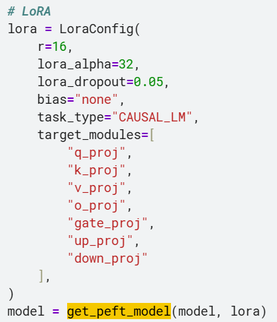

**r**：秩，定义了低秩矩阵的维度，也就是新增的矩阵 A 和 B，用这两个矩阵去近似表示原始矩阵 W 的增量 ΔW，所以最后的权重矩阵是：**W_new = W + ΔW = W + B·A** 。由于这个，当秩小了，A 和 B 的维度小，参数量少，表达能力受限，秩大了，近似能力增强，计算成本增加。

**`lora_alpha=32`**：缩放因子，调整低秩矩阵的权重，确保微调后模型输出和原始模型一致。在 LoRA 中，低秩矩阵的更新量定义为 **ΔW = (B·A) × (α / r)**,相当于是 r 的几杯就乘几，生成任务常用 2r，多模态常用 4r。

：：因为多模态复杂，微调后的值大一点，则对原始的权重影响更大。以及，为什么不直接设为常数，而要设置为 r 的倍数，设置一个 k，α = kr，然后动态得到 α 不是更好？——好像确实更好，文心一言说更好。

**`lora_dropout=0.05`（Dropout 率）**

- **作用** ：在训练过程中随机丢弃低秩矩阵的连接，防止过拟合。典型值 `0.05~0.1`，根据数据量调整（小数据集可增大至 0.1）。

**`bias="none"`（偏置处理）**

- **选项** ：`"none"`（不训练偏置）、`"lora_only"`（仅训练 LoRA 相关偏置）、`"all"`（训练所有偏置）。
- **建议** ：默认 `"none"`可减少参数量，需精细控制时选 `"lora_only"`。
- ：：调整输出的基准值，**Y = W·X + b**，bias 参数可控制是否对 b 近些训练或低秩更新。

**`task_type="CAUSAL_LM"`（任务类型）**

- **含义** ：指定为因果语言模型（如 GPT 系列），影响优化策略和损失函数选择。
- ：：`CAUSAL_LM`,因果语言模型，根据历史上下文预测下一个 token，用于文本生成什么的，还有**掩码语言模型（**`MASKED_LM`**），** 双向模型，随机掩码部分 token 并预测被掩码的内容（如 BERT）。**标记分类（`TOKEN_CLASSIFICATION`）,** 对输入序列中的每个 token 进行分类（如命名实体识别、词性标注）。

**`target_modules`（目标模块）**

- **作用** ：指定在哪些层应用 LoRA，如注意力机制的 `q_proj`（查询投影）、`k_proj`（键投影）、`v_proj`（值投影）等。
- **策略** ：通常选择关键层（如注意力层），避免全模型微调以节省资源

：：对于 target_modules，以这个为例,LoRA（Low-Rank Adaptation）的核心机制是 **冻结原始模型参数** ，仅在指定的 `target_modules`中注入可训练的 **低秩适配矩阵** ，训练完成后将原始模型与低秩矩阵结合使用

target_modules=[

    "q_proj",

    "k_proj",

    "v_proj",

    "o_proj",

    "gate_proj",

    "up_proj",

    "down_proj"

]——也就是说，只会训练这些参数，训练完了再和原来的结合使用。

#### **(1) 自注意力机制相关模块**

- **`q_proj` (Query Projection)**
  将输入嵌入映射为注意力机制中的 **Query** 矩阵，用于计算与 Key 的相似度。
- **`k_proj` (Key Projection)**
  将输入嵌入映射为 **Key** 矩阵，与 Query 计算注意力权重。
- **`v_proj` (Value Projection)**
  将输入嵌入映射为 **Value** 矩阵，用于加权求和生成上下文表示。
- **`o_proj` (Output Projection)**
  将注意力头的输出拼接后投影到目标维度，通常接在多头注意力之后。

#### **(2)前馈网络（FFN）相关模块**

- **`gate_proj`**
  常见于 **门控线性单元（GLU）** 或**Switch 机制**中，用于控制信息流的开关（如控制 FFN 中哪些部分被激活）。
- **`up_proj`**
  FFN 中的 **升维投影** ，将输入扩展到更高维度（如从 `d_model`到 `4*d_model`）。
- **`down_proj`**
  FFN 中的 **降维投影** ，将高维表示压缩回原始维度（如从 `4*d_model`到 `d_model`）。

##### 数学原理

原始权重更新：ΔW = BA
其中：

- B ∈ ℝ^(d×r)
- A ∈ ℝ^(r×k)
- r ≪ min(d,k) （秩远小于维度）

##### ✨ 核心功能

- **高效微调** ：只训练 1-10%的参数
- **内存友好** ：减少显存使用 70-90%
- **模型复用** ：多个任务共用同一个基础模型
- **避免灾难性遗忘** ：保持原有知识

##### 🚀 特点

- **低秩分解** ：用两个小矩阵近似权重更新
- **可插拔** ：训练后可以合并回原模型
- **兼容性好** ：支持各种 Transformer 模型
- **效果接近全量微调** ：性能损失很小

## CNN

传统 CNN 没有上采样，因为其不需要恢复原本的图像，只有编码器-解码器结构或者 U-Net 结构有上采样。

常用的上采样方法是转置卷积或反卷积，以及临近插值加普通卷积，或者**像素 shuffle：**

- 一种更高效、效果更好的上采样方式。
- 先通过卷积将通道数扩大（例如放大 4 倍），然后通过一个特定的重排列操作，将通道上的信息重新排列到空间上，从而将高和宽各扩大 2 倍。

### 卷积层

**局部连接，参数全局共享**，依靠卷积核滑动检测相同的特征，具有平移不变形，输出被成为特征图，一个卷积核对应一个输出通道，所以其深度与输入数据的通道数完全相同，但输入会有多个通道，卷积核会处理所有的输入通道

有时候卷积层通过步长大于 2 也能实现下采样，其可以通过多个不同的卷积核，由于每个卷积可以产生一个输出通道，所以多个卷积核会生成多样的通道信息。

### 池化层

下采样的一种，会降低数据的空间尺寸，也就是高度和宽度会下降，因为压缩了空间尺寸，所以可以增大后续卷积层的感受野，从而学习全局信息。

### 全链接层

全连接层，用于网络最后，往往是在输出层的上一层，将学习到的分布式特征映射到样本的标记空间，用于最终的分类或回归任务。

在现代架构（如 GoogLeNet, ResNet）中，**全局平均池化（Global Average Pooling, GAP）** 常常被用来替代全连接层。

## Transformer

基于自注意力的架构，最开始是 Seq2Seq，其核心是摒弃了循环和卷积结构，通过注意力机制直接建模序列中任意两个元素之间的**全局依赖关系。**

#### **自注意力机制（Self-Attention）** ：

- 对于序列中的每一个元素（如一个词），自注意力机制会计算它与序列中**所有其他元素**的相关性权重。
- **核心优势：** 能够直接捕获 **长距离依赖关系** 。无论两个元素在序列中相隔多远，它们的关联都可以一步计算得到，避免了 RNN 中的梯度消失/爆炸问题。
- 通过**Query（Q）， Key（K）， Value（V）** 矩阵进行计算。

计算主要是三个步骤如下，d通常是个固定维度，所以空间时间复杂度都是**O(n²)**。

1. Query-Key相似度计算，计算每个位置与其他所有位置的复杂度，`(n, d) × (d, n) → (n, n)`，复杂度为 **O(n²d)**
2. Softmax归一化，对（n,n）矩阵的每一行都操作，包括计算最大值，指数和以及归一化，复杂度也是**O(n²)**
3. 加权求和，Attention: (n, n), V: (n, d) → Output: (n, d)，每个输出元素：n 次乘加操作，总操作数：n × d × n = **O(n²d)**

##### **计算过程详解（“手动”计算注意力）**

1. **生成 Q, K, V：** 对于输入序列的每个词嵌入向量，分别乘以三个不同的权重矩阵$ W^Q, W^K, W^V$，得到该词的 Query、Key、Value 向量。
   - **Query (Q)：** “我想要找什么？” 可以理解为当前词的“提问”向量。
   - **Key (K)：** “我有什么内容？” 可以理解为每个词的“标签”或“标识”向量。
   - **Value (V)：** “我的实际内容是什么？” 是真正包含信息、将被聚合的“内容”向量。
2. **计算注意力分数（Attention Scores）：** 计算当前词（Query）与序列中 **所有词** （包括自己）的 Key 的相似度。通常使用点积计算。
   - 注意力分数 = $Q · K^T$(T 是转置，也就是:Query ·Key 的转置矩阵)
   - **点积的意义：** 两个向量越相似，点积结果越大，意味着当前词应该更“关注”那个词。
   - _通过矩阵乘法 Q · K^T 一次性计算出所有词对之间的注意力分数_
3. **缩放（Scale）与归一化（Softmax）：**
   - **缩放：** 将分数除以 dk**d**k（其中 dk**d**k 是 Key 向量的维度）。这是因为点积的结果会随着维度增大而变大，导致 Softmax 函数进入梯度极小的区域，通过缩放使梯度更稳定。
   - **归一化：** 对缩放后的分数应用 Softmax 函数，将其转化为所有位置上的权重之和为 1 的概率分布。这样，与当前词最相关的词会获得更高的权重。
4. **加权求和（Sum）：** 将上一步得到的权重与每个词对应的 Value 向量相乘并求和，得到当前词的新表示（输出）。
   - 输出 = $Softmax( (Q · K^T) / \sqrt{d_k} ) · V$

**核心要点：**

- **信息聚合：** 自注意力的输出是 **所有 Value 向量的加权和** 。权重由 Query 和 Key 的相似度动态决定。
- **动态权重：** 对于序列中的每个位置，其与其他位置的关联权重都是**动态计算**的，而不是像 CNN 一样使用固定的卷积核。这使得模型非常灵活。
- **并行计算：** 上述所有计算都可以通过矩阵操作一次性完成，极大提高了训练效率。

#### **多头注意力（Multi-Head Attention）** ：

- 将自注意力过程并行执行多次（即多个“头”），每个头关注输入序列不同方面的信息（例如，有的头关注语法关系，有的头关注语义关系），然后将结果合并。这大大增强了模型的表征能力。

单头注意力相当于只从一个“视角”去理解句子。多头则提供了多个不同的“理解视角”。

##### **工作机制：**

1. **投影到不同子空间：** 将原始的 Q, K, V 通过 **h 组** （h 是头数）不同的线性投影矩阵（$W_i^Q,W_i^K,W_i^V$）进行变换。每一组矩阵会将 Q, K, V 投影到不同的低维子空间（通常维度为$ d\_{model}/h）$。
2. **并行计算：** 在各自的子空间中，**并行地**执行 h 次自注意力计算，得到 h 个不同的输出矩阵。
3. **拼接与线性变换：** 将这 h 个输出矩阵**拼接（Concat）** 起来，最后通过一个**可学习的线性矩阵$ W^O$** 进行变换，得到最终的输出。

**核心要点与直觉：**

- **独立的学习空间：** 每一组投影矩阵都是独立学习的，这意味着每个头都学会了在不同的表示子空间里关注不同的信息。
- **“委员会”机制：** 可以理解为模型组建了一个“专家委员会”：
  - 有的头可能专门关注 **语法关系** （如主谓一致）。
  - 有的头可能专门关注 **指代关系** （如“它”指代的是前面的哪个名词）。
  - 有的头可能专门关注 **语义相关的词** （如“吃”关注“饭”、“苹果”等）。
  - 最终，模型综合所有“专家”的意见，做出更全面、更细腻的判断。
- **表征能力的指数级提升：** 多头机制极大地增强了模型的表征能力，使其能够同时关注来自不同位置的不同类型的信息。

#### **位置编码（Positional Encoding）** ：

- 由于自注意力机制本身不包含序列的顺序信息，Transformer 需要显式地向输入嵌入中添加位置编码，以告诉模型每个元素在序列中的位置。

自注意力是置换不变的（Permutation Invariant），打乱输入词的顺序，输出不变。这显然不符合语言特性，因此必须注入位置信息。

##### **核心要点：**

1. **加法而非拼接：** 位置编码不是简单地将位置标签拼接到词向量上，而是 **直接与词嵌入向量相加** 。这使得位置信息能够无缝地融入到后续的每一步计算中。
2. **正弦和余弦函数（Sinusoidal）的选择原因：**
   - **可以外推：** 模型可以处理比训练时更长的序列，因为正弦函数是周期性的，可以对未知位置进行有意义的插值。
   - **蕴含相对位置信息：** 对于某个偏移量 k，位置 `pos+k` 的编码可以由位置 `pos` 的编码线性表示。这为模型学习相对位置关系提供了便利。
3. **可学习的参数：** 在现代一些模型（如 BERT）中，位置编码不再是固定的三角函数，而是 **可学习的参数** 。模型自己学会为每个位置分配一个最合适的向量。这在有充足数据的情况下通常表现更好。

#### **前馈神经网络（Feed-Forward Network）** ：

- 每个编码器和解码器层中都包含一个全连接前馈网络，用于对注意力输出进行进一步的非线性变换。

FFN 是 Transformer 另一个至关重要的组成部分，它作用于 **每个位置 independently** 。

##### **结构与作用：**

1. **结构：** 它是一个简单的两层全连接网络，中间夹着一个 ReLU 激活函数。
   - `FFN(x) = max(0, xW1 + b1)W2 + b2`
2. **“专家”角色：** 可以将注意力机制看作一个 **信息聚合层** （收集全局相关信息），而 FFN 则是一个**信息处理层**或 **专家层** 。它接收注意力层聚合好的信息，并对其进行非线性变换、提炼和深化，从而为最终输出准备更强大的特征表示。
3. **维度变化：** 中间层的维度通常比输入/输出维度大得多（例如，`d_model=512` -> `d_ff=2048` -> `d_model=512`）。这提供了一个 **高维空间中的“思维池”** ，让模型能够进行更复杂的计算。

#### **编码器-解码器结构（Encoder-Decoder）** ：

- **编码器** ：将输入序列（如一句英文）映射为一个富含上下文信息的隐藏表示。
- **解码器** ：基于编码器的输出和之前已生成的输出，自回归地生成目标序列（如一句中文）。

##### **编码器（Encoder）：**

- **工作模式：** **双向自注意力** 。编码器中的自注意力层可以同时看到输入序列的 **全部信息** （过去和未来的词），从而为每个词生成一个富含**全局上下文**的表示。
- **层层抽象：** 多个编码器层堆叠起来，每一层都在前一层的输出基础上，进一步抽象和提炼信息。

##### **解码器（Decoder）：**

解码器比编码器更复杂，它包含两种注意力机制：

1. **掩码自注意力（Masked Self-Attention）：**

   - **核心：** **防止信息泄露** 。在训练时，解码器需要根据之前的词预测下一个词。因此，在计算第 i 个位置的注意力时， **只能关注到第 1 到第 i 个位置** ，不能“偷看”未来的词（i+1 及之后的位置）。
   - **实现：** 通过一个**掩码（Mask）** 矩阵（通常是一个上三角为负无穷的矩阵）在 Softmax 步骤之前加到注意力分数上，未来位置的分数经过 Softmax 后变为 0。
2. **编码器-解码器注意力（Encoder-Decoder Attention）：**

   - **这是真正的“翻译”步骤。**
   - **Q** 来自**解码器**上一层的输出（代表当前已生成的部分的疑问）。
   - **K, V** 来自**编码器**的最终输出（代表源序列的全部信息）。
   - **作用：** 让解码器的每一个位置都可以去“查阅”编码器输出的所有信息，从而决定当前步最应该生成哪个目标词。例如，在翻译时，生成英文单词“apple”时，解码器会通过这个注意力机制高度关注中文输入中的“苹果”。
   - ：：Query 和 Key 必须存在于同一个向量空间中，才能进行有意义的相似度比较，换句话说，**Q 和 K 是由同一个输入源通过不同的线性变换（不同的权重矩阵）投影到一个共享的语义空间（common semantic space）中。** 这个和后面的**Induction Heads**自相关性又不一样。

| 特性                   | 编码器-解码器注意力 (您的“苹果”例子)                                                | Induction Heads (自相关注意力)                                                                   |
| ---------------------- | ------------------------------------------------------------------------------------- | ------------------------------------------------------------------------------------------------ |
| **核心任务**     | **跨模态信息检索 (Translation)**                                                | **模式识别与复制 (Imitation)**                                                             |
| **要解决的问题** | “基于**源语言**的全部信息，我下一个应该生成**目标语言**的哪个词？”      | “根据**目标语言**自身之前出现过的模式，我下一个应该生成哪个词？”                         |
| **类比**         | **口译员** ：听到一句完整的中文（编码器），思考对应的英文单词是什么（解码器）。 | **猜谜游戏** ：听到“天空是蓝色的，小草是...”，你会根据“X 是 Y”的模式，猜出“绿色的”。 |
| **信息流方向**   | **横向的、跨语言的** （编码器 <-> 解码器）                                      | **纵向的、语言内部的** （解码器序列的前文 -> 解码器序列的后文）                            |

# 图像方面

## 目标检测

摘自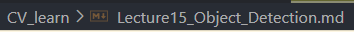

主要有两个目标，检测目标类别，已经定位目标位置

因此，输出类别标签和边界框，同时执行分类和定位任务，

类别标签由训练产生，位置输出的是中心距离 x,y,以及定位框的宽和高 w，h。好处在于兼容性好，便于处理。

### 处理单个目标

在经过诸多网络层得到特征向量后，需要分成两路，一路得到类别标签，一路得到边界框。

每一路都需要一个损失函数，但梯度下降只要一个 loss，因此总 loss 是两路 loss 的加权和。

边界框是四个向量，因此需要全连接层将特征降到 4 维，先降到思维得到初值，然后再训练，才能定位到正确位置。

### 处理多个目标

使用滑动窗口的检测，类别是所有类加背景类，背景类的边界框不会显示。

遍历式的滑动窗口可能性太多，计算量太大，需要其他办法。比如使用算法在图像中生成候选区域，然后在候选区域里面选。

### R-CNN，Region-Based CNN

注意，这不是 RNN，RNN 是序列处理，这个是目标检测。

- 使用候选区域法，计算出两千个候选区域
- 将每个区域变为统一大小（拉伸缩放，没有裁剪，论文提到拉伸比裁剪效果好，这一步就是**图像扭曲**），独立使用 CNN 进行标签和边界框预测
- 使用阈值来选择框
- 与真实标签进行对比

有点慢，是 14 年的论文，计算量也大，缺点如下

重复计算：对 2000 个区域独立做 CNN 前向传播，计算冗余。 扭曲破坏信息：早期 Warping 可能导致图像失真，影响特征质量。

### Fast R-CNN

光训练就能比 R-CNN 快二十倍，推理还要更快

先对图像进行一次卷积，在特征图上通过 RoI Pooling 将候选区域映射为固定尺寸，避免了原始图像的扭曲。

这样计算会很快，而且可以使用预训练好的网络提取特征，然后在原始图像上再进行选择性搜索选择出一些**感兴趣区域（Regions of Interest，RoIs）**，然后对其进行裁剪（Crop）和变换（Resize）得到特征图上的对应区域，

#### Rol 池化

RoIs：多个候选区域，生成方式同 R-CNN，使用候选区域法，

感兴趣区域池化，在 Fast R-CNN 提出，用于裁剪特征图中不同大小的 Rol 区域，再将其池化成固定大小

还有个 RoI Align，它解决了 Fast R-CNN 中 RoI Pooling 的对齐问题，定位进去空间信息。

### Faster R-CNN

通过神经网络方法来计算候选区域，用一个叫 RPN 的网络学习预测候选区域，通过锚框(anchor box)在特征图上滑动，让其包含的信息压缩到特征图对应为止的特征向量中。其本质还是一个卷积层。

比起 R-CNN，Fast R-CNN，Faster R-CNN 的计算量更小，速度更快。计算速度从 49->2.3->0.2。

### 一些指标

#### 交并比 IoU

预测值与真实值之间的交集和并集的比例，一般在 0.8 以上就很不错了，0.7 就能用

不过可能会有多个检测框框选同一个对象，因此需要减少边界框数量。

#### 非极大值抑制 NMS

##### 使用前提：

但在实际的目标检测中，算法**无法预先知道**有多少个不同的个体，也无法知道哪些框对应同一个个体。这就是为什么需要 NMS 算法：

1. **不知道有几个目标** ：算法不知道图像中有 2 只猫
2. **只能看到一堆框** ：看到 4 个猫类别的框，得分分别是 0.95, 0.92, 0.90, 0.88
3. **通过 IoU 判断是否同一目标** ：计算框之间的重叠程度来判断是否检测到同一个物体

---

##### 步骤演示：

计算与其他框的 IoU：

- 与 0.92 框的 IoU = 0.85 > 阈值 0.5 → 移除（判断为同一只猫 1）
- 与 0.90 框的 IoU = 0.15 < 阈值 0.5 → 保留（判断为不同的猫 2）
- 与 0.88 框的 IoU = 0.12 < 阈值 0.5 → 保留（但后面会被处理）

计算与剩余框的 IoU：

- 与 0.88 框的 IoU = 0.82 > 阈值 0.5 → 移除（判断为同一只猫 2）

当有很多框时，希望一个物体只有一个边界框来表示，所以要消去多余的框，这就是 NMS，Non-Max Suppression。

- 对所有候选的边界框根据其得分（一般是模型预测的置信度或类别概率）进行降序排序，选取得分最高的边界框，并将其加入到最终结果列表中
- 计算这个得分最高的边界框与其他所有候选边界框的交并比，移除那些与得分最高的边界框具有高交并比（通常设定一个**IoU** **阈值或者 threshold**，例如 0.7）的所有候选边界框(就是说与当前框有较多重复的就排除)
- 如果还有其他边界框存在，继续上面的处理

1. **去重** ：移除对同一目标的重复检测
2. **保真** ：保留对不同目标的正确检测
3. **优化** ：确保每个目标只被一个最准确的边界框表示

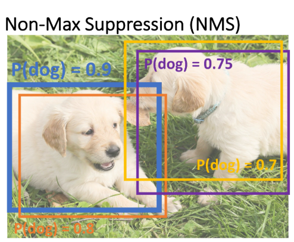 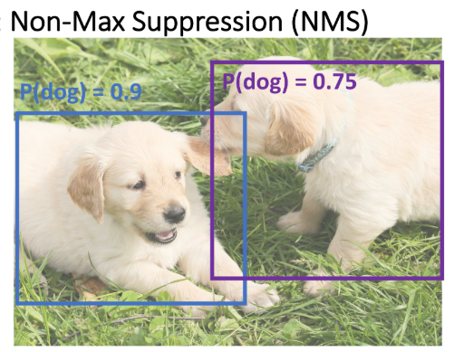

#### 平均精度 mAP

IoU 是判断检测器上单个图像性能表现

mAP 是在数据集上评价检测器表现的指标，是所有类别 AP 值(平均精度)的平均，也就是先平均每个类别的进度，再平均加在一起后的进度，反应模型在数据集上的整体性能。

AP 是 PR 曲线下的面积，∈(0,1)，横坐标是 Recall，纵坐标是 Precision

mAP 能衡量所有可能点，所以被用来评估对象检测。

优点如下：

1. **全面性:** 考虑了查准率和查全率，两个都好 mAP 才高。
2. **平均性：** 能反应模型在数据集的整体性能。
3. 稳健性，其对所有可能的阈值进行平均，使评估更稳健。
4. 易于比较，0-1 之间。
5. 被广泛接受。

### DETR

DETR（DEtection TRansformer）是由 Facebook AI（现 Meta AI）提出的一种基于 Transformer 的端到端目标检测模型。它摒弃了传统检测方法（如 Faster R-CNN、YOLO）中的 Anchor 机制 和 非极大值抑制（NMS），直接使用 Transformer 的编码器-解码器结构预测目标框和类别，实现了真正的端到端检测。

CNN 骨干网络（如 ResNet）：提取图像特征。

Transformer 编码器-解码器：处理特征并建模全局关系。

预测头（FFN）：输出最终的检测结果（类别 + 边界框）。

## 语义分割

对像素打上标签，讲一个对象的所有有像素都打上相应标签。

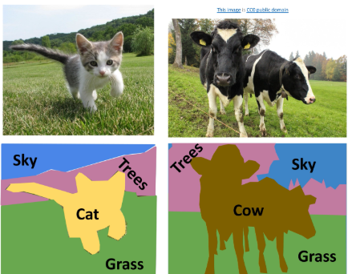

### 一些方法

#### FCN

全卷积网络（Fully Convolutional Network，FCN）是语义分割领域的经典模型，没有全连接层和池化层，只有卷积层，输出是每个图像的分类分数。

损失函数则是每个像素的交叉熵损失

直接在图像上卷积很难，因为卷积尺寸限制了感受野，直接遍历整个图像需要很大的感受野，会让堆叠的卷积很深，因此使用上下采样来进行语义分割

### 带有上/下采样的全连接卷积网络、

**下采样：** 下采样是一种降低数据的分辨率或者复杂度的处理方式。在图像处理中，下采样通常是指减少图像的像素数量，使图像变得更小、更模糊，小的特征图能大幅度减少计算复杂度。池化是下采样的典型方式，或者使用步长大于 1 的卷积也能下采样，下采样用会减小图像尺寸，会损失细节信息，但是会增加通道数来存储高维特征。

**上采样：** 上采样是一种增加数据分辨率或者复杂度的处理方式。上采样通常指增加图像的像素数量，使图像变得更大、更清晰。通过转置卷积(反卷积)实现，目标是(用存储的高维信息)恢复下采样丢失的细节信息，即让特征图尺寸变大。

上采样方法有：

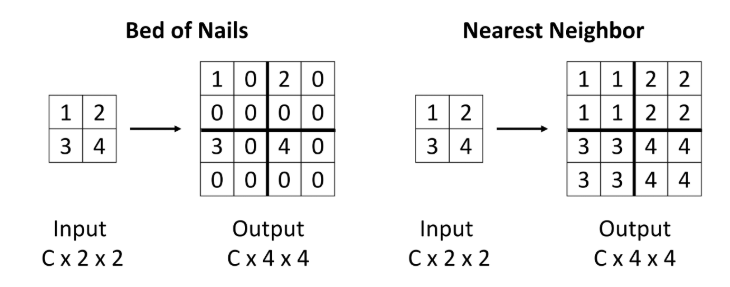

上图是钉床和最临近反池化，下图是双线性插值，对于目标图像中的每一个像素，先在水平方向进行线性插值，然后在垂直方向进行线性插值，得到最终的像素值。

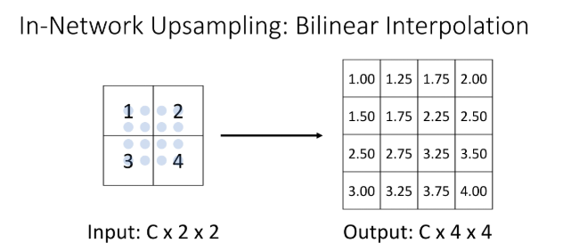

还有双三次差值，在双三次插值中，新的像素值是通过考察附近 16 个像素（在一个 4x4 的区域内）并使用这些像素的值进行加权计算得到的。具体的加权系数由三次插值函数决定，这个插值函数考虑到了像素之间的距离关系。

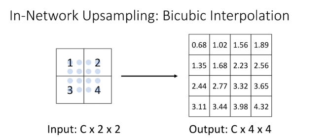和最大反池化，就是把其他位置用 0 填充，要与最大池化配合使用

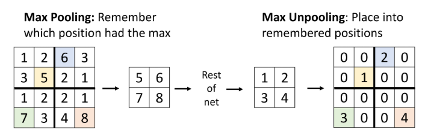

下采样和上采样操作通常会配合使用，以形成一个编码-解码（Encoder-Decoder）的结构。这种结构也被称为 U-Net 结构，因为它的形状类似于字母"U"。

下采样降低图像的长宽，但提升图像深度(通道数),哪些降低长宽之后的信息就存储在这些多的通道中，所以让网络捕捉根冲选个的信息。

经验法则：

- 如果在下采样部分使用平均池化这种，那么上采样就可以考虑最近邻或者双线性或者双三次插值，
- 如果下采样是最大池化，那么应该考虑使用最大反池化作为上采样方式

### 转置卷积

步长大于等于 1 的卷积，实际上就是一个可学习的下采样操作，ResNet 和 DenseNet，倾向于使用步长大于 1 的卷积替代池化操作进行下采样。

当步长小于 1 时，卷积可以通过某种方式，为输入中的每个点跨越输出中的多个点，如果我们能想出一种方法来做到这一点，那么是不是就可以实现一种可学习的上采样操作？实际上是有的，也就是**转置卷积。**

可以将转置卷积理解为一种矩阵乘法，这种矩阵乘法使用的是卷积矩阵的转置

**注意一下，转置卷积不是卷积的逆运算，转置卷积也是卷积**

### 语义分割不同类别

"stuff"和"thing"

"Thing"通常指的是可数的、有独立存在的物体，如人、汽车、自行车等。这些对象通常有明确的形状和大小，而且在图像中可以被清晰地辨识出来，可以区分为不同的实例（Instance）。

"Stuff"指的是不可数的、通常作为背景存在的物体，如草地、天空、路面等。这些对象通常没有明确的形状和大小，而且在图像中可能会覆盖较大的区域，这些对象讨论数量或者个体是没有意义的。

在某些情况下，"Stuff"和"Thing"的区分可能会变得模糊。例如，当我们看到一群密集的鸟时，我们可能会把它们视为一整块"Stuff"，而不是单独的"Thing"。

## 实例分割

实例是同一个个体的不同对象，狗 1，狗 2……

我们已经了解了目标检测和语义分割，前者可以区分不同对象实例，后者分割不同类别，但是抛弃了实例的概念，所以需要一种更高级的算法来实现目标检测+语义分割，也就是既要区分不同对象，也要完成像素级分割，也就是**实例分割（Instance Segmentation）**

我们想实现实例分割，就需要基于目标检测算法，对于每一个检测出的对象，输出一个**分割掩码（segmentation mask）**

### Mask R-CNN

其相对于 Faster R-CNN 的改进就是，在从特征图上抽取出候选区域的时候，会额外附加一个分支用来完成 Mask Prediction

看起来，Mask R-CNN 有点像目标检测和语义分割联合起来了，我们只是对检测到的对象进行语义分割，这意味着训练这些分割掩码的目标就是与候选区域的边界框对齐

这是一个非常好的算法，他不但会使用目标检测方法完成边界框的输出，对于每个边界框，实际上也会输出分割掩码来告诉我们，边界框中的哪些像素实际上对应检测到的对象

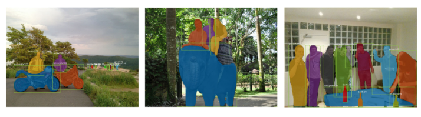

## 全景分割

标记像素（语义），同类别物体做区分（实例）

这是一种混合任务，混合了语义分割和实例分割，它想要标记每个像素，同时对于同一个类别的不同物体加以区分。

或者说同时处理"stuff"类别（如天空、草地等大面积的、不可数的物体）和"thing"类别（如汽车、人等可数的、独立的物体实例）。

全景分割的目标是为图像中的每个像素点都分配一个类别标签，并且在"thing"类别上区分出不同的实例。

## 具体应用

上面所说的诸多分割能用于人类的位姿估计，通用想法，密集字幕……

位姿估计：首先分割出不同的人体实例，然后使用某种方法去估计其姿势，常用的一种方法就是定义一组关键点，比如说眼睛、鼻子和各种关节。可以使用 Mask R-CNN 实现关键点检测。

通用想法：利用目标检测的定位能力（即“哪里”）作为基础，在检测到的区域上附加额外的预测任务（即“是什么/怎么样”） 。在目标检测器上加一个“Heads”，这个“Heads”就可以在输入图像的每个区域产生额外的新型输出

密集字幕：合并目标检测和图像字幕，输入一个图像，然后输出一种自然语言来描述输入图像中的不同区域

## 三维视觉

语义分割，目标检测，实例分割，这些算法都是基于二维图像的

## 三维形状表示

二维是 NCWH，三维图像多了一个深度 D

**N (Batch Size)** ：一次性处理的样本数量（如一次输入 16 张图片，`N=16`）。

**C (Channels)** ：图像的通道数（如 RGB 图像 `C=3`，灰度图 `C=1`）。

**W (Width)** ：图像的宽度（像素数）。

**H (Height)** ：图像的高度（像素数）。

**D (Depth)**： 深度，如 3D 体积的切片数或视频的帧数

### 深度图

深度图在概念上是一个非常简单的三维形状表示，深度图的作用是对于输入图像中的每个像素，分配从相机到该像素的距离(深度预测任务)

1. 深度图比以往的 RGB 图要多一个网格，其中每个像素值给了我们一个深度信息，有些类似于 RGB 图像的二维网格，只不过像素的值不是颜色，而是“深度”，以米为单位的深度，然后将其与 RGB 图像结合，深度作为第四个信息通道，提供深度信息。或者我们可以叫他为**2.5D 图像或者 RGB-D 图像**
2. 表面法线：第二种三维形状表示，想法上与 RGB-D 深度图很接近，只不过在这里，我们给每个像素分配的是一个单位向量（或者说法线），表面点的法线都是垂直于该表面的单位向量。在计算机图形学和计算机视觉中，表面法线被广泛用于光照计算，以判断物体表面的亮度和颜色。比如不同 RGB 颜色的法线表示物体的不同走向。

### 体素网格（Voxel Grid）

"Voxel"是"volume"（体积）和"pixel"（像素）的结合词，指的是在三维空间中的像素，也就是体素。每个体素都可以存储一些信息，例如颜色、密度、表面法线等，有点像 Mask R-CNN(实例分割)中物体背景和前景的表示。

体素网格在许多领域都有应用，如计算机图形学、医学成像、地质科学和机器人导航等。例如，在计算机图形学中，体素网格可以用于渲染复杂的三维场景；在医学成像中，**MRI 和 CT 扫描的结果通常就是体素网格**；在机器人导航中，体素网格可以用于表示环境并进行路径规划。

ps：怪不得一张图那么大

但是它需要大量的存储空间，而且处理速度可能比较慢，尤其是在需要捕捉非常精细的细节的时候，分辨率会非常高。因此经常使用各种优化技术，如八叉树（Octree）和稀疏哈希表（Sparse Hashing），来高效地存储和处理体素网格。

### 三维卷积

比二维卷积多了一个 Depth 深度，形状为在 pytorch 中卷积核形状默认为 NCDHW。

### 点云

点云：将物体表示为三维空间中的点集（是一组没有顺序的点，顺序不影响点云本身），或者说使用一组点集以某种方式覆盖我们想表示的三维形状的表面

与体素网格相比，点云某种程度上更有适应性，如果我们想使用体素网格表示精细的细节，那么分辨率就会很高，但是在点云中，我们可以使用不同的点云密度来改变细节的精细程度

在数学上，点云中的点是无限小的一个质点，但是在可视化的时候我们必须让每个点变成一个有限大小的球然后进行渲染，才可以在屏幕上可视化显示，同时，点云具有稀疏性

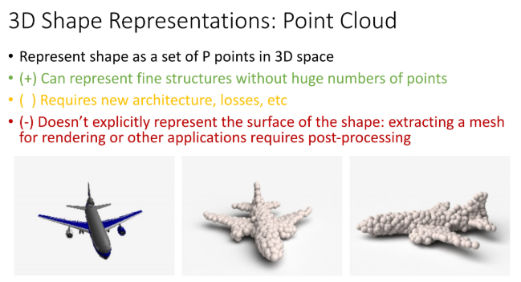

点云在神经网络中是一个非常有用的东西，同时也是非常常见的，比如说在自动驾驶中，激光雷达就是收集了周围环境的点云表示，所以在自动驾驶程序中，点云是经常使用的，我们可以根据这些原始点云输入去做出一些决策

总的来说，点云是一种很好的表达形式，接近传感器原始数据，同时其表示起来很容易（一个多维向量就可以表示，坐标、颜色、强度等特征），同时可以更好的表示三维形状，在诸多领域都有很好的应用。

点云是一种无序的数据，不同的表示顺序对于点云并没有任何影响，并且点云还有平移/旋转不变性

### 三角网格（Triangle Mesh）

是在计算机图形学中非常常用的表示，有点类似于点云，因为它是将三维形状表示为三维空间中的一组顶点，在三角网格表示中，三维物体的表面被划分为许多小的三角形面片，这些三角形面片的集合就构成了三角网格。

每个三角形面片由三个顶点（vertices）和三条边（edges）组成。顶点存储了空间中的坐标位置信息，可能还会包含其他属性信息，如颜色、法线、纹理坐标等。边连接了两个顶点，描述了三角形的形状。除此之外，三角网格还包括了面（faces），即由三条边围成的区域，它们描述了物体的表面。

三角网格的优点在于它可以准确和高效地表示复杂的三维表面（在计算机图形学中常用）。由于三角形是平面的，任何复杂的三维表面都可以通过足够数量的三角形面片来逼近。此外，三角网格还支持多种几何运算，如交、并、差等。

#### 预测三角网格：Pixel2Mesh

ECCV2018，一种使用神经网络处理网格的算法，称为 Pixel2Mesh，这种网络，输入一个 RGB 图像，然后输出一个三角网格，给出一个图像中物体的完整三维形状

其中有几个关键的地方

1.难以直接创建一个网格对象，因此也是给初值，然后学习，初始网格往往是球状或者会椭圆体

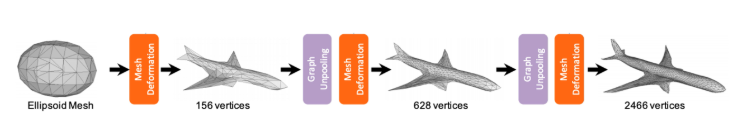

2.神经网络，需要一种在网格结构数据上可以操作的神经网络，因为网格并不是常见的规则化数据，在这里，我们使用的就是一种名为图卷积的运算。其卷积输入是一个图和一个附加到图的每个顶点的特征向量。

输出特征向量$f^\prime_i$取决于输入特征向量和所有相邻顶点的特征向量

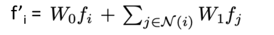

3.**对齐（Alignment），** 指的是将 **3D 网格顶点** 与 **2D 图像特征** 在空间位置上建立准确的对应关系，使得每个顶点能获取与之相关的图像区域的特征信息。

可以使用二维卷积网络处理图像来提取特征

4.损失函数，一个形状能被好几种三角形表示，比如正方形，能被两个或四个三角形表示，因此希望损失函数不受用三角形表示形状的特定方式的影响，而是取决于基础形状本身，不是取决于表示方式。

就是沿着网格内部取样，将其转化为点云（如下图所示），然后使用**钝化距离**来比较两个点云之间的区别

## 3D 形状比较指标

钝化距离：二维常用交并比，三维常用**钝化距离**，钝化距离使用了 L2 距离（欧式距离，平方再开方，对大误差更敏感），对异常值很敏感，很适合用来完成评价

F1 分数，（F1 Score）是一种用于评估分类模型性能的统计指标，尤其在数据不平衡的情况下特别有用。它是精确率（Precision）和召回率（Recall）的调和平均值。

- 精确率：在所有预测为正例的样本中，真正为正例的比例。
- 召回率：在所有真正为正例的样本中，被正确预测为正例的比例。

F1 分数的公式为：

F1 = 2 _ (精确率 _ 召回率) / (精确率 + 召回率)

## 视频

三维视觉比二维多了空间维度，视频比二维视觉多了一个时间维度。

Video = 2D + Time

这里的预测更复杂，二维检测是预测主题是什么，视频往往是预测主题一再做什么，就是在是什么的基础上进一步到做什么。

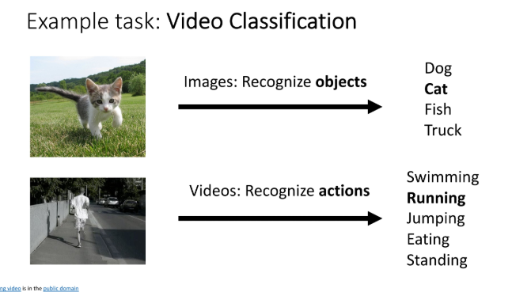

### 单帧 CNN 与 3D CNN

**1.Single-Frame CNN**：一种基于单帧图像的卷积神经网络方法， "Single-Frame" 指的是单个帧图像，也就是视频的每一帧。该方法将视频分类任务简化为对视频中每个单独帧图像进行分类，并使用单帧的特征来表示整个视频，训练和测试也都是在单帧上进行。

没有上下文信息，忽略了时间尺度。

**2.后期融合**：首先对每个帧进行独立的处理，然后在最后阶段（决策层）将它们的分类结果进行融合，以得到最终的视频分类结果。可学习参数过多，容易导致过拟合

**3.早期融合**：这里与后期融合相反，在**输入层融合** ，将不同模态的原始数据或低级特征直接拼接（如 RGB 帧+光流帧合并为多通道输入），将融合后的数据输入单一模型（如 3D CNN）进行端到端学习。

**4.3D CNN**:这种方法也叫 Slow Fusion，有点类似于三维视觉中处理体素网格的网络，其用于处理视频数据的时空信息。与传统的 2D CNN 不同，3D CNN 可以直接在视频序列中进行三维卷积操作，在网络的每一个层中，都有卷积和池化函数，从而捕捉视频中的时域和空域信息（或者说融合各种信息），不过这个速度比较慢，所以其被称为 Slow Fusion。

3D CNN 的基本思想是将视频序列视为一个时域和空域上扩展的三维数据体。它通过在时间维度上进行卷积操作，从视频序列中提取时域特征，并在空域上捕捉物体的形状、结构和运动信息。

其优点在于能捕捉时域和空域信息，可以捕捉动态特征；直接在视频上卷积方便；

缺点在于需要大量内存和计算资源，世间开销大；视频过场会受到梯度消耗和梯度消失问题；需要大量标注数据来训练。

## YOLO 网络

YOLO（You Only Look Once）是一种实时性高的单阶段目标检测框架，**锚框（Anchor Boxes）** 是预先定义的一组具有特定宽度和高度的参考框，用于帮助模型更高效地预测目标物体的边界框（Bounding Box），起一个形状先验和简化任务的作用。

### YOLOv1

YOLOv1 的设计灵感来自用于 GoogLeNet 模型，该模型使用较小卷积网络的级联模块。它在 ImageNet 数据上进行预训练，直到模型达到高精度，然后通过添加随机初始化的卷积和全连接层进行微调。

YOLO 将两阶段方法重构为回归问题，直接将图像像素预测为目标及其边界框属性。在 YOLO 中，输入图像被划分为一个 S×S 网格，目标中心所在的单元格负责检测它。一个网格单元预测多个边界框，每个预测数组由 5 个元素组成：边界框的中心(x,y)、框的维度(w,h)以及置信度分数

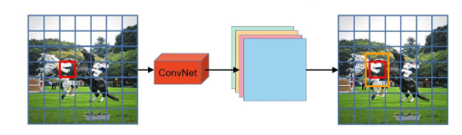

其让神经网络直接看到一整张图片，YOLO 将不同的模块整合为单一的框架，并且同时预测所有边界框，使得速度大大提高；但是只能接受固定大小的图片输入。

### YOLOv3

YOLOv3 相比 v1，速度和性能都有所提高，涨点最大的原因就是在**多尺度检测** 和 **骨干网络优化**。

多尺度检测：

- **3 个检测头（Predictions Heads）** ：
  在 Darknet-53 的 3 个不同层级（分别下采样 32 倍、16 倍、8 倍）输出预测结果，对应：
- **大尺度特征图** （13×13）：检测小目标（感受野小，保留细节）。
- **中尺度特征图** （26×26）：检测中等目标。
- **小尺度特征图** （52×52）：检测大目标（感受野大，捕捉全局）。
- **特征金字塔网络（FPN）** ：
  通过上采样和跨层连接融合多尺度特征，增强小目标检测能力。

骨干网络优化：其基于残差网络 DarkNet53 构建，效果比 ResNet101 更好，抑制了梯度弥散。

### YOLOv5

**工程化优化** ，主打好用、速度快、易上手。

- 灵活模块化设计，用 YAML 配置文件就能改模型结构
- 自动计算锚框，

  - 训练时自动计算最适合数据集的锚框。
  - 省时省力，避免人工调参。
- 数据增强升级，

  - **Mosaic** ：把 4 张图拼成 1 张训练，让小目标更多样
  - **自适应图片缩放** ：保持图片比例不变形，检测更准。

YOLOv5 像一辆“改装车”，把 YOLOv3 的发动机（Darknet53）换成了更轻便的部件，还加了自动挡（AutoAnchor）和涡轮增压（Mosaic 增强），开起来又快又稳。

### YOLOv8

**多功能+更高精度** ，适合复杂任务

1. **取消锚框（Anchor-Free）**
   - 直接预测目标中心点和宽高，不用预设锚框，模型更简单，小目标检测更好。
2. **解耦检测头**
   - 把分类和回归任务分开处理（以前混在一起），精度更高。
3. **多任务支持**
   - 不仅能检测，还能做实例分割（抠图）和姿态估计（识别人体关键点）。
4. **更强的数据增强**
   - **CutMix** ：把图片的一部分替换成另一张图的片段，让模型更鲁棒。
   - **更多训练策略** ：比如动态标签分配（根据难度调整样本权重）。

YOLOv8 像一辆“SUV”，不仅能跑得快（检测），还能拉货（分割）和越野（姿态估计）。取消了锚框（就像去掉备胎），车身更轻便，适应更多路况。

### YOLOv9

**轻量化+信息不丢失** ，解决深层网络的信息衰减问题。

1. **可编程梯度信息（PGI）**
   - 深层网络容易“忘掉”前面层的信息（比如小目标细节），PGI 像一个小秘书，专门把浅层特征传给深层，保证信息不丢失。
2. **新骨架网络（GELAN）**
   - 比 YOLOv8 的骨架更轻、更快，但精度更高（参数少 50%，性能反超）。
3. **通用高效层聚合**
   - 让不同层之间的特征融合更智能，避免重复计算。

**通俗比喻** ：
YOLOv9 像一辆“新能源车”，电池更小（参数少），但续航更长（精度高），还装了智能导航（PGI）确保不迷路（信息不丢失）。

| **特性**     | YOLOv5     | YOLOv8              | YOLOv9              |
| ------------------ | ---------- | ------------------- | ------------------- |
| **锚框**     | 需要       | 取消（Anchor-Free） | 取消（Anchor-Free） |
| **任务支持** | 仅检测     | 检测+分割+姿态      | 检测+分割+姿态      |
| **核心创新** | 工程化优化 | 解耦头+多任务       | PGI+GELAN           |
| **参数量**   | 中等       | 中等                | 更少（轻量化）      |
| **适用场景** | 快速部署   | 复杂任务            | 边缘设备+高精度     |

# 零散总结

## 知识点和概念

1. **1. PR 曲线（Precision-Recall Curve）** 是评估分类模型（尤其是类别不均衡时）性能的重要工具，横轴是 **召回率（Recall，实正正，实际正确的中，被预测正确的比例）** ，纵轴是**精确率（Precision，预正正，被预测为正确中，实际正确的比例）** 所以器才能处理类别不平衡问题
   通过设置不同的阈值，让 P 和 R 的范围从 1 到某个数，再把这些数的坐标标出来连线，这就是 PR 曲线。
2. 两个 3x3 卷积叠在一起，那么第二层的输出实际上就是查看 5x5 的区域，每多一层，感受野大小就会加二
3. 一个卷积核能处理输入数据的所有通道，但是只会输出一个通道高。$ r*t = \sigma(W_r \cdot [h*{t-1}, x_t])$

- **可导性**：导数简单：$\sigma'(z) = \sigma(z)(1 - \sigma(z))$，便于梯度下降优化。
- **广义线性模型**：逻辑回归是广义线性模型（GLM）的特例。

4. 非齐次线性方程组 Ax=b 有无穷多解的条件是：$r(A)=r([A|b])<n$
5. 逻辑回归的二分类使用 sigmoid 作为激活函数，其是 1/（1+1+np.exp)
6. Batch Normalization 在训练阶段，均值与方差来源于小批统计，而在他推理阶段，均值与方差来源于移动平均统计。——训练时，均值与方差来自 mini-batch 实时计算，同时为了推理时更加稳定，会维护一个移动平均的全局统计量，在推理时直接用。
7. 自注意力（Self-Attention）在序列长度 n 下的时间/显存复杂度更接近：$O(n^2)$，而卷积神经网络的复杂度是 $O(n^2)$，因此，自注意力在序列长度较长时，可以替代卷积神经网络。
8. 回归任务是预测新的值，其常见损失函数式MSE和MAR
   * 均方误差MSE：$\frac{1}{n}\sum_{i=1}^n (y_i - \hat{y}_i)^2$，平方放大误差，对异常值敏感，最常用，处处可导
   * 平均绝对误差MAE：$\frac{1}{n}\sum_{i=1}^n |y_i - \hat{y}_i|$
9. 交叉熵用于分类，其能衡量分布之间的差异，而且对1一下的数据敏感（MSE回缩小1一下的误差）；Hinge用于SVM的分类，永不最大化分类间隔。

## Latex 一些公式写法

在这里用$$包裹，公式写在符号中间

$\mathbf{W} \in \mathbb{R}^{d_{\text{out}} \times d_{\text{in}}}$

### **1. 基础符号**

#### **下标与上标**

- 下标：`x_i` → **x**i
- 上标：`x^2` → **x**2
- 上下标组合：`a_{ij}^2` → **a**ij**2**

#### **希腊字母**

- `\alpha, \beta, \gamma, \delta` → **α**,**β**,**γ**,**δ**
- `\theta, \Theta` → **θ**,**Θ**（小写/大写）
- `\mu, \sigma, \pi` → **μ**,**σ**,**π**

#### **分数**

- `\frac{a}{b}` → **b**a
- 行内分数：`a/b` → **a**/**b**

# 一些项目

## **Image Matching Challenge 2025**

### 项目简介

**数据集介绍**：

项目的分类与重建，真实数据集中对应了多个数据集，每个数据集中又有一个或多个场景（如故宫的西边和东边，他们属于同一个数据集，但不是同一个场景），每个场景又有若干张图像。属于同一数据集的不同场景之间不重叠：它们展示不同的区域或物体，但在外观上相似，例如同一建筑物的两面，或两棵不同的树

注意：每个数据集的场景数量和图像数量可能不同。每个数据集可能包含也可能不包含“异常”图像，这些图像与任何场景都不对应。

**训练集和测试集：**

对于训练数据，我们提供了每张图像的相机姿态，包括其旋转矩阵$R$和平移向量$T$。与任何场景都不对应的图像被放置在一个 `outliers` 文件夹中，对于这些图像不提供姿态信息。对于测试数据，我们将所有图像合并到一个文件夹中。

**任务：**

（1）将每个数据集$D_k$的图像 $I_{kiz}$划分为一组簇$C_{kj}$ 或异常值，从而恢复原始场景分配；(无监督聚类)

（2）独立重建每个场景，为每张图像提供相机姿态，表示为旋转矩阵和平移向量。（重建，运动恢复结构 SfM 技术，计算出这组照片代表的 3D 模型，以及照片拍摄时候相机的精确位置和角度，即 **`旋转矩阵 R` 和 `平移向量 T`**）

**评分：**

1. **重建准确度 (mAA 分数)** ：你计算出的相机位置和真实位置有多接近？这个分数越高，说明你 3D 重建的精度越高。
2. **分类准确度 (Clustering 分数)** ：

- **召回率 (Recall)** ：一个真实场景里的照片，有多少被你正确地分到了对应的组里？（不能漏）
- **精确率 (Precision)** ：你分出来的一个组里，有多少照片是真正属于同一个场景的？（不能错）

**最终分数**是这两个分数的 **调和平均数** （类似于机器学习中常用的 **F1 Score** ），这意味着你必须在**重建**和**分类**两方面都做得好才能获得高分。

**总结：**

这个比赛要求你开发一个强大的算法，它能：
**从一堆混乱的照片中，自动筛选出无关照片，并把相关的照片正确分组，最后为每一组照片高精度地重建出 3D 场景和相机位置。**

这是一个结合了**无监督聚类**和**3D 几何重建**的高难度、高价值的计算机视觉前沿挑战。

### 依赖性与导包

#### 安装 COLMAP

**COLMAP** 是一个**通用性的运动恢复结构（Structure-from-Motion, SfM）** 和**多视图立体（Multi-View Stereo, MVS）** 管道。它可以从一组无序的图片中自动重建出相机的拍摄参数（位置、姿态、镜头参数）和密集的 3D 场景结构。

简单来说，它的工作就是解决这个问题：**“给我一堆照片，我告诉你这些照片是从哪拍的，并且帮你把照片里的东西变成 3D 模型。”**

稍微具体点就是，先运动恢复结构（SfM）—— 求解相机位置和稀疏点云，再多视图立体（MVS）—— 生成密集模型。

SfM 阶段得到的点云非常稀疏（只有特征点），远不是我们想要的详细模型。MVS 的目标就是生成一个**稠密的**3D 表面。

**其作用是:**我们先想尽办法（用深度学习）找到更正确、更强大的图像匹配关系，然后把匹配结果喂给 COLMAP，让它来完成 SfM 重建\*\*\*\*

不要想着替换 colmap，而是为他准备出更好的数据

#### 必要的包

kornia：一个基于 PyTorch 的计算机视觉库，包含大量可微分（Differentiable）的计算机视觉算子，可以执行以下操作

- **图像预处理** ：如调整大小、灰度化、图像增强等。
- **特征提取** ：提供了 LoFTR、DISK、SuperPoint 等现代深度学习特征检测器和描述符的实现，可以直接集成到 PyTorch 模型中。

lightglue：一个轻量级、高效且精度超高的 **深度学习特征匹配器** 。它可以看作是 SuperPoint+SuperGlue 组合的一个进化版，更快、更好、更省内存。

**在任务中的作用** ： **这是整个流程的核心引擎之一** 。

- **输入** ：两幅图像以及它们对应的特征点（可以是来自 SuperPoint、DISK、SIFT 等任何特征提取器）。
- **输出** ：两幅图像之间精确的、经过筛选的匹配点对。
- **优势** ：相比传统的基于最近邻（KNN）的匹配方法，LightGlue 使用图神经网络（GNN）来同时考虑外观和几何上下文，能极大地 **剔除错误匹配（Outliers）** ，并保留更多正确的匹配（Inliers）。这直接决定了后续 SfM 重建的成败和精度。**在这个挑战中，使用 LightGlue 几乎是获得高分的必要条件。**

pycolmap：COLMAP 的 Python 绑定（bindings）。它允许你直接在 Python 代码中调用 COLMAP 的核心功能，而无需通过命令行。

#### 导入的模型

安装了 4 个模型

##### ALIKED 特征提取器（3 个模型）

三个模型是同一个家族(ALIKED)的不同变体,主要在模型容量和训练方式上有所不同,以适应不同的需求。

- **`aliked-n16.pth`** :

  - **`n16`** ： `n` 很可能代表网络中某个模块的 **宽度或通道数** 。`n16` 是**较小、较快**的版本，参数量较少，推理速度更快，但提取的特征表现力可能稍弱。适合对速度要求极高的场景或资源受限的设备。
- **`aliked-n32.pth`** :

  - **`n32`** ： 这是 **标准或更大的版本** 。相比 `n16`，它拥有更多的参数和更强的特征提取能力，能产生更稳定、更具判别性的特征描述符，但计算成本更高。这通常是精度和速度之间的一个平衡选择。
- **`aliked-n16rot.pth`** :

  - **`rot`** ： 这是最关键的后缀，代表 **`rotation`（旋转）** 。
  - **作用** ： 这个模型在训练时 **专门针对图像旋转进行了数据增强和优化** 。因此，它在处理具有 **大视角变化** （特别是旋转）的图像对时，表现出色。特征描述符对旋转更加不变量，能极大地提升在这类困难场景下的匹配成功率。
  - **为什么重要** ： 在真实的无序图像集合中，照片可能是横屏、竖屏、甚至倾斜拍摄的，这个模型专门应对这种挑战。

  **使用策略** ：代码可能会根据图像的具体情况（如估计的重叠度、EXIF 中的方向信息等）智能地选择使用哪个特征提取器，或者使用 `n16rot` 作为通用主力。

##### LightGlue 匹配器（1 个一体化模型）

- **`aliked_lightglue.pth`** (被复制了 2 份，其中一份重命名为 `aliked_lightglue_v0-1_arxiv-pth`)：
  - **这是什么** ： 这就是我们之前讨论的 **“二合一”终极武器** （SuperPoint+SuperGlue）。它不是单独的特征提取器或匹配器，而是一个 **端到端的联合模型** 。
  - **工作原理** ： 它接收两幅原始图像，内部集成了 ALIKED 的特征提取流程，并通过 LightGlue 的图神经网络进行自适应匹配，最终直接输出匹配点对和置信度。
  - **优势** ： 由于是联合训练，特征提取和匹配两个步骤相互优化，通常能获得比“分离式”流水线（先提特征再匹配）更好的性能。它能高效地处理大量匹配并给出可靠的置信度分数。

##### DINOv2（额外的三个模型）

负责全局语义表示（特征向量）；能处理局部特征失效问题（同一扇门的白天和晚上完全不同），DINOv2 对外观变化的**不变性**表现较好。

- **使命** ：理解一张图像的全局内容和语义场景。
- **回答的问题** ：**“这张图里是什么？它和另一张图在语义上是否属于同一个类别或场景？即使它们没有直接的几何重叠？”**

#### 更多的包和库

##### 1. 通用与工具库

- `sys`, `os`, `glob`: 系统操作和文件路径管理。
- `tqdm`, `fastprogress`, `time`, `sleep`: 用于显示进度条和计时。
- `gc`: 垃圾回收，用于管理内存（在处理大量图像时至关重要）。
- `numpy`, `h5py`, `dataclasses`, `pandas`: 数据处理和存储。`h5py`用于处理高效的 HDF5 文件格式，通常用来存储特征和匹配结果。
- `IPython.display`: 用于在 Notebook 中清除输出。
- `defaultdict`, `deepcopy`: 高级数据容器操作。
- `PIL.Image`: 图像处理。
- `networkx as nx`: **图论库** 。这是 **关键** ！在 SfM 中，图像之间的关系可以被建模为一个图（节点是图像，边是匹配对），这个库用于分析图像连接的组件（聚类）、寻找关键路径等。
- `concurrent.futures`: 用于实现 **多进程/多线程并行计算** ，以加速特征提取和匹配等耗时操作。

##### 2. 核心计算机视觉库

- `cv2` (OpenCV): 传统计算机视觉操作。
- `torch` (PyTorch): 深度学习框架基石。
- `kornia` & `kornia.feature`: 基于 PyTorch 的可微分计算机视觉库，提供特征提取等操作。

##### 3. 特征匹配模型库

- `lightglue`: 从 `lightglue`包中导入关键函数 `match_pair`和模型类 `ALIKED`, `LightGlue`。这是 **特征匹配的核心** 。
- `transformers`: Hugging Face 的 Transformer 库，通常用于加载视觉基础模型（如 DINOv2），这里可能用于计算图像级全局特征（用于图像检索，初步筛选哪些图像可能有关联）。

##### 4. 3D 重建与比赛专用工具

- `pycolmap`: **COLMAP 的 Python 接口** ，用于执行 SfM 重建。这是 **3D 重建的核心** 。
- `sys.path.append('/kaggle/input/imc25-utils')`: 将比赛组织方提供的工具包路径加入系统路径。
- `from database import *`: 导入操作 COLMAP 数据库的工具（例如，将特征和匹配结果写入 `.db`文件）。
- `from h5_to_db import *`: 导入将 HDF5 格式的特征转换为 COLMAP 数据库格式的工具。
- `import metric`: 导入 **官方评估指标的计算函数** 。你的最终分数将由这个 metric 计算。

### 参数配置类

这里定义了控制算法流程和行为的“旋钮”。

#### 1. `Param_AlikedLightGlue` 类

- **作用** ：定义一个参数容器，用于配置 **ALIKED+LightGlue 特征提取与匹配流水线** 的行为。
- **参数** ：
- `min_matches`: **最低匹配数量** 。如果两幅图像匹配到的特征点少于这个数，就认为它们无法构成有效匹配对，会被丢弃。这是一个非常重要的过滤条件。
- `max_num_keypoints`: **每张图像最多提取的特征点数量** 。更多的特征点可能带来更多匹配，但也增加计算量和内存消耗。需要权衡。
- `image_size`: **图像重置大小** 。在提取特征前，将图像的最长边缩放到此尺寸。更大的尺寸能保留更多细节，但计算更慢。

#### 2. `CONFIG` 类（或命名空间）

这是一个集中存放所有全局配置的地方。

- **Image Pairs (图像对选择)** :

  - `sim_th`, `min_pairs`, `exhaustive_if_less`, `GLOBAL_TOPK`: 这些参数很可能用于**图像检索**阶段。目的是在成千上万张图片中，快速找出哪些图像对**有可能**匹配，从而避免进行所有图像对（n\*(n-1)/2 对）的暴力匹配，极大减少计算量。例如，`GLOBAL_TOPK=150` 意味着每张图像只与它最相似的 150 张图像进行详细匹配。
- **Image Matching (图像匹配)** :

  - `params_alikedlg`: 这是一个 **列表** ，包含了多个 `Param_AlikedLightGlue`实例。这揭示了一个高级策略： **使用多尺度/多配置进行匹配** 。先用低分辨率、少特征点快速匹配，如果匹配数不够，再 fallback 到高分辨率、多特征点的配置。这是一种保证召回率和精度的有效技巧。
  - `Param_AlikedLightGlue( min_matches=50, max_num_keypoints=8192, image_size=1536 )`
  - **策略** ：非常激进和高精度。将图像缩放到相当大的 `1536` 像素，提取非常多的特征点（`8192`个），并且要求很高的匹配成功阈值（`50`个内点）
- **ROMA Parameters** :

  - `roma_*`: ROMA 是另一个先进的深度匹配模型（用于匹配和相对位姿估计）。这里为它定义了独立的参数（特征点数量、图像尺寸、批处理大小），说明代码中可能集成了多种匹配方法，ROMA 是备选或用于特定环节
  - **（确实没用上）。**
- **SfM** :

  - `num_pallalel_sfm`: **并行 SfM 重建的数量** 。这证实了代码的策略是： **先对图像进行聚类，得到多个可能的不连通场景，然后对每个场景（聚类）并行地、独立地运行 COLMAP 重建** 。这个参数控制了同时可以跑几个重建进程。
  - 聚类加并行重建（每个场景独立的 COLMAP 重建进程），`num_pallalel_sfm = 4` 意味着 **最多同时运行 4 个 COLMAP 重建进程** 。

### 一些函数

#### Colmap Utilities

##### 匹配数据->COLMAP

`import_into_colmap`

将特征匹配数据导入到 COLMAP 数据库中，为后续 3D 重建做准备。

1. **输入** ：从特征提取阶段生成的 HDF5 文件（关键点和匹配）
2. **处理** ：将这些数据转换为 COLMAP 数据库格式
3. **输出** ：准备好供 COLMAP 进行增量式 SfM 的数据库文件

##### 带场景过滤的 COLMAP 导入系统

`add_keypoints_with_scene()`

将特定场景的**关键点数据**添加到 COLMAP 数据库

1. 打开 `keypoints.h5` 文件
2. 遍历所有关键点数据
3. **过滤** ：只处理属于指定场景的图像
4. 为每个图像创建相机和图像记录
5. 将关键点数据添加到数据库

`add_matches_with_scene()`

将特定场景的**匹配数据**添加到 COLMAP 数据库

1. 打开 `matches.h5` 文件
2. 遍历所有匹配对
3. **双重过滤** ：只处理两个图像都在指定场景中的匹配对
4. 使用进度条显示处理进度
5. 防止重复添加相同的匹配对
6. 将匹配数据添加到数据库

`import_into_colmap_with_scene()`

完整的带场景过滤的数据导入流程

1. 创建数据库连接和表结构
2. **关键点导入** ：调用 `add_keypoints()`（没有使用场景过滤版本）
3. **匹配导入** ：调用 `add_matches_with_scene()`（使用场景过滤）
4. 提交事务

#### Pairs Reranker，**配对重新排序器**

**智能选择需要匹配的图像对** ，而不是暴力匹配所有可能的组合，大幅减少计算量。

#### 全局特征粗筛（DINOv2）

**使用 DINOv2 模型**提取图像的全局特征，然后计算余弦相似度，为每个图像选择最相似的 Top-K 个候选邻居。

`global_feats = _extract_dino_embeddings(fnames, device)  topk_lists   = _build_topk_lists(global_feats, device)`

#### 第二级：局部特征精筛（ALIKED）

**使用 ALIKED 模型**提取局部特征描述符，然后对第一级筛选出的候选对进行局部特征验证。

```python
# 2) ALIKED local descriptors
aliked = _get_aliked_model(device, CONFIG.N_KEYPOINTS)
descs  = _extract_local_features(fnames, aliked, device)

# 3) local verification
pairs  = _build_final_pairs(topk_lists, descs, device)
```

#### 详细组件分析

- `CONFIG.GLOBAL_TOPK = 150` - 每个图像的候选邻居数
- `CONFIG.N_KEYPOINTS = 2048` - 每图像最大关键点数
- `CONFIG.RATIO_THR = 1.0` - 比率测试阈值
- `CONFIG.MATCH_THRESH = 15` - 最小匹配数阈值

这种 **全局粗筛 + 局部精筛** 的策略是当前图像匹配领域的标准做法，在保证匹配质量的同时大幅提升计算效率。

##### **全局特征提取** (`_extract_dino_embeddings`)

- 使用 **DINOv2** 模型提取图像全局嵌入
- 采用 **MAC pooling** (Max Activation of Channels) 获取紧凑的全局描述符
- 输出 L2 归一化的特征向量

##### **Top-K 相似度筛选** (`_build_topk_lists`)

```python
sim = g @ g.T                          # 余弦相似度矩阵
sim.fill_diagonal_(-1)                 # 排除自身相似度
topk = torch.topk(sim, k, dim=1)       # 获取每个图像最相似的K个邻居
```

- 计算所有图像间的余弦相似度
- 为每个图像选择最相似的前 K 个候选

##### **局部特征提取** (`_extract_local_features`)

- 使用 **ALIKED** 模型提取局部特征
- 输出归一化的特征描述符（半精度以节省内存）

##### **相互最近邻验证** (`_mutual_nn_score`)

```python
d12 = torch.cdist(desc1, desc2, p=2)    # 计算特征距离
min_val, _ = torch.min(d12, 1)          # 找到最近邻
n_matches = np.sum(min_val < threshold) # 统计匹配数量
```

- 使用 **Lowe's ratio test** 原理进行匹配验证
- 计算相互最近邻匹配的数量

##### **最终配对构建** (`_build_final_pairs`)

- 对通过验证的候选对进行最终筛选
- 确保匹配数量超过阈值
- 去除重复并排序

### **Image Pairs（图像对）模块**

**自动决定使用哪种图像匹配策略** ：当图像数量少时用穷举法，数量多时用智能筛选法

#### 工作流程

##### **图像加载** (`load_torch_image`)

使用 Kornia 库，加载图像到 GPU 内存，格式为 32 位浮点 RGB

- `[None, ...]`：添加批次维度（从[H,W,C]变为[1,H,W,C]）

##### **全局特征提取** (`get_global_desc`)

加载 DINOv2 模型，使用评估模式并加载到 GPU 上

加载图像，使用模型推理，为图像计算全局描述符，再通过比较全局特征相似度，选出最相似的 Top-k 个最相似图像，仅对这些候选的图像对采用 ALIKED-LightGlue 精细匹配。

采用 MAC 池化：取每个通道的最大值，然后 L2 归一化

##### **穷举匹配** (`get_img_pairs_exhaustive`)

生成所有可能的图象对，在图像少于一定量的时候使用。

##### **智能策略选择** (`get_image_pairs_shortlist`)

根据不同的图片数据量选择不同的匹配方法，当小于 exhaustive_if_less 时，选择穷举匹配，否则先提取特征再筛选，返回**所有图像对中筛选出最有可能匹配的图像对。**

```python
def get_image_pairs_shortlist(fnames,
                              sim_th = 0.6,
                              min_pairs = 20,
                              exhaustive_if_less = 20,
                              device=torch.device('cuda')):
    num_imgs = len(fnames)
    if num_imgs <= exhaustive_if_less:
        return get_img_pairs_exhaustive(fnames)
    matching_list = get_image_pairs(fnames, device)
    return matching_list
```

#### 运用的技术

##### **DINOv2 自监督学习模型**

- **是什么** ：Facebook 开发的先进视觉 Transformer 模型
- **特点** ：无需人工标注，通过自学习理解图像内容
- **优势** ：提取的特征具有很好的语义理解能力

##### **2. MAC Pooling（最大激活池化）**

`outputs.last_hidden_state[:,1:].max(dim=1)[0]`

- **作用** ：将复杂的特征图压缩为紧凑的全局描述符
- **过程** ：在每个通道上取最大值，形成固定长度的向量

### **ALIKED+LightGlue 模块**

是图像匹配的核心部分，实现了旋转不变的特征提取和匹配

#### `convert_coord` - 坐标转换函数

**将旋转后的特征点坐标转换回原始图像坐标系，提取的特征基于旋转后图像。**

- 旋转后提取的特征点坐标是基于旋转后图像的
- 需要映射回原始图像坐标系才能正确匹配

#### `matching_aliked_lightglue_rot` - 主匹配函数

**使用 ALIKED 提取特征 + LightGlue 进行匹配，支持旋转增强**

分三个阶段：

特征提取（旋转增强）：提取呀孙吉方向特征或旋转后再提取

特征匹配（LightGlue）：使用 LightGlue 进行匹配

结果保存（HDF5 格式）：保存结果为 HDF5 格式，格式如下

`matches = [kp1_x, kp1_y, kp2_x, kp2_y, confidence]`

五个参数分别是第一张图的特征点左边，第二张图的特征点坐标，以及撇皮置信度

### Keypoints merger & Matching Filter

这段代码主要实现了关键点（keypoints）的合并与匹配过滤功能

1. **数据读取** ：从多个 HDF5 文件聚合原始匹配点。
2. **初步过滤** ：可选基础矩阵过滤离群匹配。
3. **图结构过滤** ：保留强连接图像对的匹配。
4. **全局去重** ：合并所有关键点并去重，重建匹配索引。
5. **结果保存** ：输出最终的关键点和匹配关系。

#### **`get_unique_idxs(A, dim=0)`**

获取张量 A 中唯一元素的首次出现索引，确保关键点唯一性

1. 使用 `torch.unique` 获取唯一值及其逆索引和计数。
2. 通过排序和累加计数，定位每个唯一值的首次出现位置。

#### **`get_keypoint_from_h5(fp, key1, key2)`**

- **功能** ：从 HDF5 文件中读取关键点数据。
- **参数** ：
  - `fp`：HDF5 文件对象。
  - `key1`, `key2`：HDF5 中的路径键。
- **返回值** ：成功时返回 `(0, 关键点数据)`，失败返回 `(-1, None)`。
- **用途** ：封装 HDF5 读取操作，处理异常情况。

#### **3. `get_keypoint_from_multi_h5(fps, key1, key2)`**

- **功能** ：从多个 HDF5 文件中合并同一对图像的关键点。
- **参数** ：

  - `fps`：HDF5 文件对象列表。
  - `key1`, `key2`：图像对标识。
- **逻辑** ：

  1. 遍历所有文件，尝试读取关键点。
  2. 合并所有成功读取的关键点（沿第 0 轴拼接）。
- **返回值** ：合并后的关键点数组或 `None`。
- **用途** ：支持多源关键点数据的聚合。

#### **`matches_merger(...)`**

- **功能** ：合并多对图像的匹配点，可选基础矩阵过滤。
- 关键逻辑。
  - 遍历所有图像对，合并关键点。
  - 若启用过滤，使用 `cv2.findFundamentalMat` 剔除离群点（通过多次迭代和投票机制）。
  - 保存过滤后的匹配点到 HDF5 文件。
- **用途** ：生成初步合并的匹配结果。

#### **`get_adjacent_edges_with_weights(G, node)`**

- **功能** ：获取图中某节点的邻接边及权重，按权重降序排序。
- **参数** ：
  - `G`：NetworkX 图对象。
  - `node`：目标节点。
- **返回值** ：`(邻接节点, 权重)` 列表。
- **用途** ：在匹配过滤中分析节点连接强度。

#### **`filter_mkpts(file_mkpts, save_file, th_num_pairs)`**

逻辑：

1. 构建图结构，节点为图像，边权重为匹配点数。
2. 对每条边，检查其是否在双方节点的 Top `th_num_pairs`邻接边中，若是则保留。

- **用途** ：剔除弱连接或冗余匹配。

#### **`keypoints_merger(...)`**

整合关键点合并和匹配过滤流程，生成全局唯一的关键点和匹配关系

1. 调用 `matches_merger` 生成初步合并结果（`merge_tmp0.h5`）。
2. 调用 `filter_mkpts` 进一步过滤（`merge_tmp.h5`）。
3. 对关键点去重并重新索引：
   - 合并所有关键点，使用 `torch.unique` 去重。
   - 更新匹配索引，确保与去重后的关键点对齐。
   - 通过多轮唯一性检查（`get_unique_idxs`）清理重复匹配。
4. 保存最终结果到 `keypoints.h5`（关键点）和 `matches.h5`（匹配索引）。

### Pipeline: Image Matching，图像匹配流水线

把前面的各个模块结合起来，完成图像匹配任务

1. **图像对选择** ：从所有可能的图像对中筛选出最有可能匹配的图像对（基于相似度阈值）
2. **特征提取与匹配** ：使用不同的特征提取器（主要是 ALIKED+LightGlue 组合）对选定的图像对进行特征提取和匹配
3. **结果合并与清理** ：将不同参数设置下的匹配结果合并，并进行后处理（如基础矩阵过滤）
4. **性能统计** ：记录各阶段的执行时间用于性能分析

### SfM Maps Merger

用于合并多个 COLMAP 重建结果(稀疏点云)的工具

将多个独立的 COLMAP 重建结果（每个结果对应一个子场景）合并成一个统一的 3D 重建结果，主要处理以下情况：

1. 当一个大场景被分成多个子场景分别重建后，需要合并结果
2. 当多个视角有重叠区域的重建结果需要整合时
3. 在分布式 SfM（Structure from Motion）流程中合并各节点结果

### Update submission values

**更新预测结果** ，将多个 COLMAP 重建结果（`result_map_dirs`）中的信息整合到预测对象（`predictions`）中。

1. **加载多个重建结果**
   - 遍历输入的重建目录（`result_map_dirs`），用 `pycolmap`加载每个重建结果到字典 `maps`中。
   - 示例：`maps = {0: rec0, 1: rec1, ...}`，其中 `recX`是 `pycolmap.Reconstruction`对象。
2. **统计重建规模**
   - 收集每个重建结果的图像数量（`list_num_images`），并转换为 NumPy 数组。
   - 输出日志：`list_num_images = [N0, N1, ...]`，显示每个重建的图像数量。
   - 将当前统计结果追加到 `params.list_model_size`中（用于记录历史数据）。
3. **按规模排序重建结果**
   - 对 `list_num_images`排序，得到索引 `sort_idx`，用于后续处理**从大到小**的重建结果（优先处理规模大的重建）。
4. **更新预测值**
   - 遍历排序后的重建结果（`sort_idx`），跳过图像数量小于 4 的无效重建。
   - 对每个重建中的图像，通过 `filename_to_index`找到对应的预测索引（`prediction_index`）。
   - **更新条件** ：如果当前重建的规模（`cur_map_size`）大于预测中已记录的规模（`predictions[prediction_index].map_size`）且大于 5，则更新预测：
   - `map_size`：更新为当前重建的规模。
   - `cluster_index`：标记当前图像属于哪个重建集群（`map_index`）。
   - `retry_index`：记录重试次数（`retry`参数）。
   - `rotation`和 `translation`：深拷贝当前图像的相机位姿（`cam_from_world`）。
5. **资源清理**
   - 删除 `maps`对象并调用 `gc.collect()`，显式释放内存。

### Clustering，聚类

将一组图像根据其共视关系，分组到不同的场景

#### `get_network_from_matches_h5`

从匹配文件构建图结构，

- **输入：**

  - `file`：HDF5 格式的匹配文件（存储图像间的特征匹配对）。
  - `images`：图像文件名列表。
  - `num_max_keypoints`：归一化权重时的分母（默认 8192）。
  - `th_matches`：最小匹配数阈值（默认 150），低于此值的匹配对会被过滤。
- **输出** ：

  - `G`：NetworkX 无向图，节点代表图像，边权重代表匹配强度（归一化后的匹配数）。
  - `image_to_index` 和 `index_to_image`：图像文件名与索引的映射字典。

#### **提取连通分量 (`get_components`)**

- **输入** ：
  - `G`：NetworkX 图（支持有向或无向）。
  - `directed_mode`：处理有向图时的模式（`"weak"`、`"strong"`或 `"auto"`）。
- **输出** ：
  - `n_components`：连通分量数量。
  - `components`：每个连通分量的节点列表（按节点名排序）

#### 基于 Louvain 算法聚类 (`get_scenes_from_graph`)

- **输入** ：

  - `G`：NetworkX 无向图（通常由 `get_network_from_matches_h5`生成）。
  - `random_state`：随机种子（用于 Louvain 算法）。
  - `th`：分辨率参数（`resolution`），控制聚类粒度（默认 0.2）。
- **输出** ：

  - `scenes`：聚类结果列表，每个元素是一个图像集合（`set`），代表一个场景。

改进：全连接图可能内存不足，可以使用稀疏图或 KNN 近邻图，以及可以考虑更高级的聚类算法 `SpectralClustering`或 `Leiden`。

### Pipeline: Multi-Scene SfM

**多场景 SfM（Structure-from-Motion）管线**，流程包括

1. **图像聚类（Clustering）** ：将大量图像按共视关系分组到不同场景（scenes）。
2. **单场景 SfM 重建（`reconstruction_single`）** ：对每个场景独立运行增量式 SfM（COLMAP）。
3. **模型合并（Merge）** ：将多个场景的重建结果合并成一个全局一致的模型。

- **核心思想** ：
  **“分而治之”** ——先聚类分组，再独立重建，最后合并优化。
- **适用场景** ：
  大规模图像集（如无人机航拍、城市级重建），其中存在多个独立场景或子区域。
- **输出结果** ：
  - 合并后的全局模型（相机参数、点云）。
  - 每张图像的重建信息（位姿、所属场景）。

#### **图像聚类（Clustering）**

- **输入** ：

  - `matches.h5`：存储图像间特征匹配的 HDF5 文件（由前序步骤生成）。
  - `fnames`：所有图像文件名列表。
- **输出** ：

  - `scenes`：聚类后的场景列表，每个场景是一个图像名称的集合（`set`）。
- **关键点** ：

  - 使用 `get_network_from_matches_h5`构建加权图（边权重=匹配强度）。
  - 使用 `get_components`提取连通分量（每个连通分量视为一个潜在场景）。
  - 仅保留节点数 >4 的连通分量（避免噪声）。
  - **重试机制** ：如果聚类失败（如匹配文件未就绪），最多重试 4 次

#### **单场景 SfM 重建（`reconstruction_single`）**

- **输入** ：
  - `scene`：单个场景的图像集合（如 `{"image1.jpg", "image2.jpg", ...}`）。
  - `retry`：当前重试次数（用于区分不同场景的输出目录）。
- **输出** ：
  - 更新 `params`，记录每个图像的重建信息（位姿、所属场景等）。

#### **模型合并（Merge）**

- **输入** ：
  - 所有单场景重建结果的 `cameras.bin`路径（通过 glob 匹配）。
- **过滤条件** ：
  - 仅保留图像数 >8 的模型（避免小模型干扰）。
  - 仅保留重投影误差 <2.0 的模型（保证质量）。
- **合并策略** ：
  - 使用 `cluster_and_merge`（可能是自定义函数或 COLMAP 的 `model_merger`）：
    - `min_common=6`：至少 6 对共同图像才能合并。
    - `run_bundle_adjustment=True`：合并后运行全局 BA 优化。
- **输出** ：
  - 合并后的模型存储在 `output_dir`。

### Main 主函数

主要分为 **数据准备** 、**特征提取**和**三维重建**三个阶段。以下是详细的流程解析：

#### 数据准备

##### **(1) 数据类定义**

- **`Prediction`** ：存储单个图像的预测信息（如文件名、数据集、旋转矩阵、平移向量等）。
- **`DatasetParams`** ：存储数据集的参数（如图像路径、特征目录、设备信息、各处理步骤的耗时等），并提供 `summary()`方法打印统计信息。

##### **(2) 配置初始化**

- **`is_train`** ：控制是否使用训练模式（`True`）或测试模式（`False`）。
- **`data_dir`** ：指向 Kaggle 输入数据目录（`/kaggle/input/image-matching-challenge-2025`）。
- **`workdir`** ：工作目录，用于存储中间结果（如特征、重建结果）。

##### **(3) 数据加载与过滤**

- 读取提交文件（`train_labels.csv` 或 `sample_submission.csv`）。
- **测试模式特殊处理** ：
- 如果数据行数为 1945（完整测试集），仅保留 `ETs`和 `stairs`数据集。
- 调整工作目录到 `/kaggle/working/result/`。

##### **(4) 数据分组**

- 遍历数据，按 `dataset`分组存储到 `samples`字典中，每个数据集对应一个 `Prediction`列表。

#### **2. 特征提取阶段**

##### **(1) 多线程并行处理**

- 使用 `ThreadPoolExecutor`启动两个线程池（`executors_gpu0`和 `executors_gpu1`），分别对应两个 GPU 设备。
- **`switch_gpu()`** ：动态切换 GPU 设备（未在代码中显示，但推测用于负载均衡）。

##### **(2) 遍历数据集并提取特征**

- **过滤数据集** ：如果 `datasets_to_process`非空，仅处理指定的数据集（如 `ETs`、`stairs`、`imc2023_haiper`）。
- **准备数据** ：
- 构造图像路径列表（`images`）。
- 创建 `filename_to_index`映射（文件名到索引）。
- 设置特征存储目录（`feature_dir`）。
- **提交特征提取任务** ：
- 使用 `executors_gpus[device_index].submit()`异步提交 `exec_feature_extraction`任务。
- 任务参数包括 `DatasetParams`（存储数据集信息）。

---

#### **3. 三维重建阶段**

##### **(1) 等待特征提取完成**

- 遍历所有数据集，调用 `future.result()`等待特征提取完成。
- 如果特征提取失败（返回 `None`），跳过该数据集。

##### **(2) 多线程并行重建**

- 启动新的线程池（`executors`，并行数由 `CONFIG.num_pallalel_sfm`控制）。
- 提交 `exec_reconstruction`任务，传入 `DatasetParams`进行三维重建。

##### **(3) 保存重建结果**

- 等待所有重建任务完成（`futures_cpu[dataset].result()`）。
- 更新 `samples[dataset]`中的预测结果，并记录 `dataset_logs`。

---

#### **4. 关键优化与调试**

##### **(1) 内存管理**

- 频繁调用 `gc.collect()`手动触发垃圾回收，防止内存泄漏。

##### **(2) 调试模式**

- **`max_images`** ：限制每个数据集处理的图像数量（用于快速调试）。
- **`datasets_to_process`** ：指定要处理的数据集（避免全量运行超时）。

##### **(3) 设备切换**

- 动态切换 GPU 设备（`switch_gpu`），平衡两个 GPU 的负载。

#### **5. 代码流程总结**

- **初始化配置** （训练/测试模式、数据路径、工作目录）。
- **加载并过滤数据** （测试模式下仅处理部分数据集）。
- **按数据集分组** ，存储到 `samples`字典。
- **特征提取** ：

  - 使用双 GPU 线程池并行处理。
  - 提交 `exec_feature_extraction`任务。
- **三维重建** ：

  - 等待特征提取完成。
  - 使用 CPU 线程池并行执行 `exec_reconstruction`。
- **保存结果**并更新预测信息。

---

#### **6. 潜在改进点**

1. **错误处理** ：当前代码未处理特征提取或重建失败的情况（仅跳过）。
2. **日志记录** ：可增加更详细的日志（如耗时、错误信息）。
3. **动态并行度** ：根据 GPU/CPU 负载自动调整线程数。
4. **模块化** ：将特征提取和重建逻辑封装成独立函数，提高可读性。

---

---

---

---

### 流程再次梳理

**依赖准备 → 参数配置 → 候选对生成 (DINOv2) → 特征提取 (Aliked) → 特征匹配 (LightGlue) → 导入 COLMAP → SfM 重建** 。

| 步骤         | 使用的关键技术/模块                   | 说明                                             |
| ------------ | ------------------------------------- | ------------------------------------------------ |
| 环境依赖     | `colmap`，`pip install`+`.deb`  | 解决 Kaggle 环境无网络问题，必须提前下载依赖     |
| 参数配置     | `Param_AlikedLightGlue`，`CONFIG` | 控制特征点数量、候选对阈值等，直接影响精度与速度 |
| 候选对生成   | `DINOv2`(全局描述符)                | 大幅减少需要匹配的图像对，提高效率               |
| 局部特征提取 | `Aliked`                            | 提取关键点 + 局部特征描述子                      |
| 特征匹配     | `LightGlue`                         | 更鲁棒的匹配器，避免错误对应                     |
| 数据导入     | `COLMAPDatabase`                    | 把特征与匹配结果导入到 COLMAP 的 SQLite 数据库   |
| 重建         | `COLMAP SfM`                        | 使用已有匹配进行三维稀疏点云恢复                 |

---

| **阶段** | **模型/技术**                                | **代码位置**                   | **作用**                                            |
| :------------- | -------------------------------------------------- | ------------------------------------ | --------------------------------------------------------- |
| 输入准备       | pandas, dataclass<br />(Prediction, DatasetParams) | 构造 `samples`、`dataset_params` | 组织输入数据                                              |
| 候选对生成     | **DINOv2 (ViT)**                             | `exec_feature_extraction`          | 提取全局 embedding，选出候选图像对                        |
| 局部特征提取   | **Aliked**                                   | `exec_feature_extraction`          | 从单张图像提取关键点 + 描述子                             |
| 特征匹配       | **LightGlue**                                | `exec_feature_extraction`          | 在候选对上做 Transformer-based 匹配                       |
| 三维重建       | **COLMAP**                                   | `exec_reconstruction`              | 利用 keypoints+matches 执行 SfM，<br />恢复相机和稀疏点云 |
| 并行调度       | ThreadPoolExecutor +`switch_gpu()`               | main                                 | GPU 并行跑特征提取，CPU 并行跑 SfM                        |
| 输出结果       | numpy/pandas + CSV writer                          | main                                 | 生成 submission.csv                                       |

### 模型详解

#### DINO

**DINO** （**DI**stillation with **NO** labels）是一种**自监督学习**的视觉模型，由 Meta AI 在 2021 年提出。它的核心思想是 **在不使用任何人工标注标签的情况下** ，让模型自己学习图像的特征表示。

最核心的点是让同一个模型自己既当老师有当学生，对输入的数据进行处理，同时得到全局视图和局部裁剪视图，然后并行处理，让局部裁剪视图分支当学生，热全局试图那个分支当老师，让学生的输出结果不断向老师的输出看齐。最终，通过这种“自己教自己”的方式，模型学会了理解图像的语义信息，甚至能自动发现图像中的物体， **无需任何人工标注** 。

几个关键点：

- **不对称性** ：两个分支的增强策略不同（全局 vs 局部），防止模型学到退化的平凡解。
- **动量编码器** ：教师网络的参数是学生网络参数的滞后平均值，这为训练提供了稳定、一致的学习目标。
- **中心化与锐化** ：对教师网络的输出进行中心化（避免模型崩塌）和锐化（突出主要特征），再让学生去匹配。

#### DINOv2（2023 年）

DINOv2 是 DINO 的重大升级版，目标是构建一个能够像 NLP 中的 GPT 模型一样强大的 **视觉基础模型** ，适用于多种任务。

在当前项目中的作用，提取图像的全局特征，计算其语义相似度，用于快速筛选出最有可能匹配的图像对，避免了对所有图像的匹配，降低计算量。

what：具体怎么计算的，有哪些参数，有什么要注意的点

##### 主要改进：

1. **更庞大的数据** ：

- 从网络上爬取了 1.42 亿张图像的 **大规模 curated 数据集** ，远超 ImageNet。
- 使用一种称为**自监督数据筛选**的方法来保证数据质量，无需人工标注。
- ps：：训练集增加，而且都是高质量图片，同时不用人工标注干预

1. **更先进的架构** ：

- 采用了 **Vision Transformer (ViT)** 的多种尺寸（ViT-S, ViT-B, ViT-L, ViT-G）。
- 引入了 **FlashAttention** 和 **Nested Tensors** 等技术，使得训练极大的模型（如拥有 10 亿参数的 ViT-G）成为可能，且效率更高。

1. **更高效的训练流程** ：

- 整合了当时多种有效的训练技巧，如效率更高的优化器、更稳定的损失函数等。

##### DINOv2 的特点：

- **强大的视觉特征** ：产生的图像特征包含丰富的语义信息，适用于各种下游任务。
- **“免费”的语义分割** ：无需微调，其特征图就能直接高亮出图像中的主要物体。
- **优异的性能** ：在多个图像分类、分割、检测等基准测试上达到了接近甚至超越有监督模型的性能。

### ALIkED

一个专用于图像匹配的深度学习模型，是一个用于**关键点检测和描述子提取**的神经网络。它的核心目标是：在保持高精度的同时，实现更快的运行速度和更少的计算资源消耗。

传统的关键点检测方法运行快，但区分度较差（SIFT，ORB），而深度学习方法性能好单计算量大，ALIKED 试图找到一个平衡。

在本项目中，使用的模型是 ALIKED-n16，对通过 DINO2 得到的可能图像对进行匹配，其作为局部特征提取器，**输入原始图像，得到关键点位置和特征描述子**

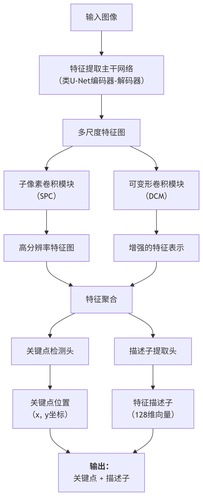

#### 创新与架构

ALIKED 有一个**密集特征提取主干网络**（类似 U-Net）架构，不止在系数位置计算特征。输入图像，输出关键点加描述子。

采用黎曼损失，因为原本的交叉熵损失会把每个像素视为独立的类别，这显然不合理，而**黎曼损失**会把关键点检测视为一个**流形上的概率分布学习问题**

#### 优势

1. **高重复性** ：在不同视角、光照变化下能检测出相同的关键点
2. **高精度** ：关键点定位准确，描述子区分性强
3. **高效率** ：相比其他深度学习方法，速度更快，资源消耗更少
4. **端到端训练** ：检测和描述在一个网络中联合优化，相互促进

### LightGlue

目前通过 DINOv2 自监督的学习 ，进行了一次基于全局特征的粗分类，将可能配对的图像拆出来了，然后通过 ALIKED 进行局部特征的提取，获得关键点及其描述子，然后将提取的特征交给 LightGlue，进行只能匹配，查找关键点对。

LightGlue 是一个基于 Transformer（核心是 self-attention）的深度学习模型，用于局部特征点匹配，它的核心创新在于： **自适应地决定哪些特征点需要被匹配，以及何时停止匹配过程** ，从而实现了前所未有的效率和精度平衡。

LightGlue 拥有自适应推理机制，大大提高效率和减少计算浪费（有时候明明都不对了却还在匹配），其输入为两个图像的特征关键点加描述子，输出最终匹配结果（所有匹配点对加置信度）

另外，LightGlue 处理 ALIKED 的输出，并不需要其特征的数量相等，其可以处理数量不同的可变长度的特征。

#### 架构和创新

1. **自适应计算** ：根据图像对难度动态调整计算量，大幅提升效率
2. **更高精度** ：在标准基准测试中达到 state-of-the-art 性能
3. **更快速度** ：比 SuperGlue 快 2-10 倍，且内存效率更高
4. **可解释性** ：可以可视化每个特征点的决策过程

##### 自适应推理机制

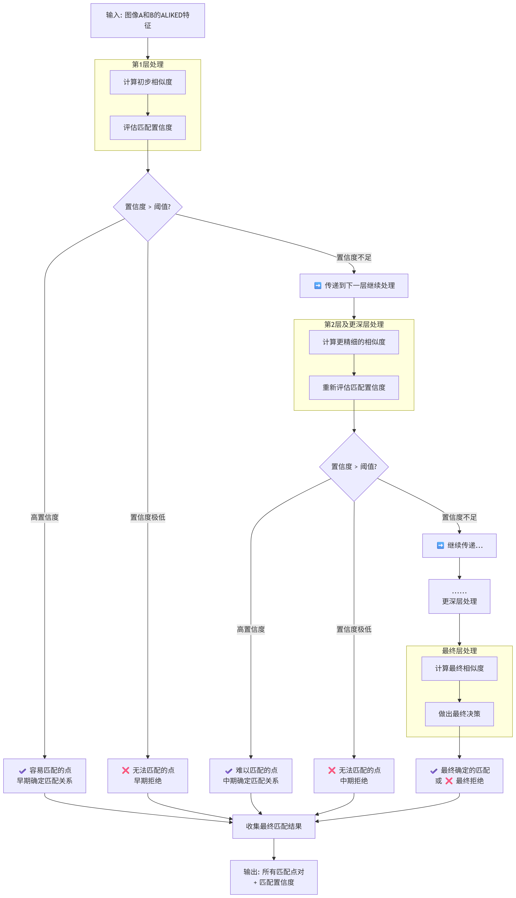

LightGlue 最革命性的特性。模型会 **动态决定每个特征点的命运** ：

| 特征点类型             | 传统方法         | LightGlue 方法 | 效率提升        |
| ---------------------- | ---------------- | -------------- | --------------- |
| **容易匹配的点** | 与其他点同等计算 | 早期层快速确定 | ⚡ 节省大量计算 |
| **难以匹配的点** | 与其他点同等计算 | 更多层仔细分析 | ✅ 保证精度     |
| **无法匹配的点** | 仍然参与完整计算 | 早期层直接拒绝 | 🚫 避免浪费计算 |

- **容易匹配的点** ：快速做出匹配决策（早期层就确定）
- **难以匹配的点** ：需要更多计算层来决策
- **无法匹配的点** ：被早期拒绝（标记为无法匹配）

这种机制类似于人类匹配特征点的过程：先找明显匹配的点，对不确定的点仔细比对，果断放弃根本无法匹配的点。

ps：：逐层处理，对容易匹配的先匹配，有效减少了运算量，而且层级化也可能会有权重差异化，有利于复用。

##### 退出策略

LightGlue 在每个 Transformer 层后都会评估：

- 是否所有特征点都已经有了高置信度的决策（匹配/不匹配）
- 如果是，就提前退出，不再进行后续计算

这意味着 **简单图像对匹配得很快，复杂图像对匹配得较慢但更精确** 。

### COLMAP

**COLMAP** 是一个开源的基于图像的三维重建工具库，广泛应用于多视图立体视觉（Multi-View Stereo, MVS）和运动恢复结构（Structure-from-Motion, SfM）任务

使用 COLMAP 执行 SfM 重建，基于 LightGlue 的结果进行三维重建，生成相机位姿和稀疏点云。COLMAP 已经足够好用，所以任务就是得到对于 COLMAP 足够好的输入，而不是自己开发一个新的 SfM 方法。

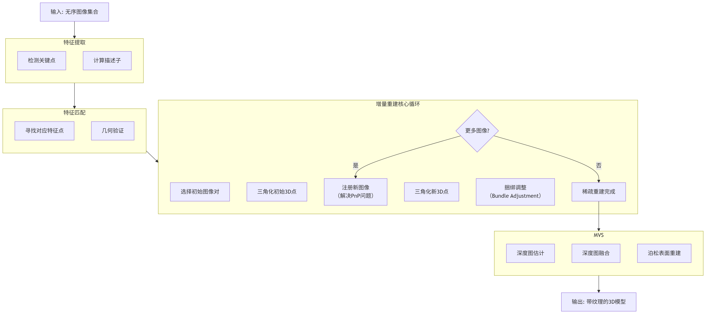

- **输入** ：图像 + 特征点 + 匹配关系（由 ALIKED 和 LightGlue 提供）
- **处理** ：通过复杂的优化算法计算相机位姿和 3D 结构
- **输出** ：每张图像的精确相机参数（旋转矩阵和平移向量）

# 笔试真题

## 小红书

以下关于 CORS 的说法，哪一个是错误的？

CORS（ **Cross-Origin Resource Sharing** ，跨域资源共享）是一种基于 HTTP 头的安全机制，用于解决浏览器同源策略（Same-Origin Policy）对跨域请求的限制。它允许服务器明确声明哪些外部域名（跨域）可以访问其资源，从而在保障安全性的前提下实现跨域数据交互。

1. CORS 支持预检请求(PreflightRequest)
2. CORS 需要服务器支持
3. CORS 允许所有跨域请求——错误，默认**限制跨域请求**
4. CORS 可以设置特定的域名允许访问

### TabNet，DCN-V2

1.一家短视频推荐平台在亿级样本上对比 Deep & Cross Network (DCN-V2)和 TabNet，以下判断哪些正确?

1. TabNet 采用逐步注意力和稀疏化正则，可自动学习软选择的特征子集——正确
2. 若对 TabNet 加入手工交叉特征,会与其注意力 Mask 冲突,性能一定下降——错误
3. 对冷启动用户（无历史行为） ，DCN-V2 依赖 Embedding 仍能给出合理估计，而 TabNet 可能过拟合少数统计特征——基本正确
4. DCN-V2 的 Cross 层显式构造高阶交叉项，更适合稀疏 ID 特征——正确

**DCN-V2**通过精巧的网络结构设计（显式交叉）来强大地捕获特征交互；

而**TabNet**则通过模仿树模型的特性（特征选择）来实现高性能和高解释性。

#### TabNet 采用逐步注意力和稀疏化正则，可自动学习软选择的特征子集——正确

- **TabNet** 是 Google 于 2019 年提出的专门用于表格数据的深度学习模型。其核心创新是 **序列注意机制（Sequential Attention Mechanism）** 。
- **逐步注意力（Step-wise Attention）** ：TabNet 由多个“决策步（Decision Steps）”组成。在每个步骤中，模型通过一个注意力掩码（Mask，也称为“Attentive Transformer”）从所有输入特征中**软选择（Soft Selection）** 出一个子集用于处理。软选择意味着它不是非此即彼的硬选择，而是给每个特征一个 0 到 1 之间的权重，表示其在本步骤中的重要程度。
- **稀疏化正则（Sparsity Regularization）** ：为了鼓励模型在每个步骤中只关注少数关键特征，避免所有特征权重趋同，其在损失函数中加入了稀疏性正则项。这使得学习到的特征选择更接近于“硬选择”，提高了模型的解释性。
- 因此，该描述准确地概括了 TabNet 的核心工作机制。
- ps：：为了让学习到的特征具有差异性，可以让每次只学习少数的关键特征，如果一起学习，特征权重要兼顾所有学习的特征，会有些趋同。

#### 2. 若对 TabNet 加入手工交叉特征，会与其注意力 Mask 冲突，性能一定下降——**错误。**

- 这个说法过于绝对。 **冲突不一定发生，性能也不一定下降，甚至可能提升** 。
- **冲突的可能性** ：TabNet 的注意力机制旨在**自动地**发现特征交互（交叉）。如果你手动加入了非常强且复杂的交叉特征（例如，`用户年龄 * 商品类别`），理论上 TabNet 可能会通过其注意力机制学到这个交叉特征本身就很重要，从而给它分配高权重。这并不构成“冲突”，而是一种补充。
- **性能可能提升** ：手工交叉特征可以看作是一种**先验知识**的注入。如果手工交叉设计得非常巧妙，恰好是模型难以自动学习到的关键模式，那么为模型提供这些“现成的”强特征可以降低学习难度， **加速收敛并可能提升最终性能** 。
- **性能可能下降的原因** ：性能下降的风险不在于“冲突”，而在于：
  1. **特征冗余** ：如果手工交叉特征和 TabNet 自动学到的交叉特征高度重复，会造成信息冗余。
  2. **维度灾难** ：加入大量手工特征会急剧增加特征维度，可能引入噪声并增加过拟合风险。
- 总之，加入手工特征是一种工程技巧，其结果需要通过 AB 实验来验证，而不是断然认为“一定下降”。

#### 3. 对冷启动用户（无历史行为），DCN-V2 依赖 Embedding 仍能给出合理估计，而 TabNet 可能过拟合少数统计特征——**基本正确。**

- **相关知识** ：
- **冷启动问题** ：指对于新用户或新物品，由于缺乏历史交互数据（如点击、购买等），导致模型难以进行精准推荐。
- **DCN-V2 的处理方式** ：DCN-V2 的强大之处在于其**Cross Network**能够高效地显式学习特征交叉。即使对于冷启动用户，模型仍然拥有该用户的 **静态特征** （如年龄、性别、地域、注册渠道等）。这些特征会被转换为 Embedding。
  - Cross 网络会将这些静态特征进行多阶交叉（例如，`地域 * 年龄`， `(地域 * 年龄) * 性别`），从而 **合成出一些高阶的、具有预测性的组合特征** 。即使没有历史行为，这些组合特征也能在一定程度上反映用户的潜在兴趣，因此能给出一个相对合理的基线估计。
- **TabNet 的潜在风险** ：TabNet 依赖于注意力机制从所有特征中筛选。对于冷启动用户，其最有价值的动态行为特征（如最近点击的 item_id）是缺失或无效的。此时，模型只能依赖于那些有限的静态特征。
  - 由于 TabNet 具有很强的拟合能力，它可能会**过度依赖**这些少量可用的统计特征（如“是否来自 XX 渠道”），并放大其影响，从而导致 **过拟合** 。模型可能会学到“只要来自这个渠道的新用户，都推荐某个商品”，而这种规律可能是片面且不稳定的。
- 因此，这个判断在大多数情况下是成立的。
- ：：Embedding 就像是用户本身自带的信息，不用学习也能获取，通过利用这部分信息也能简单的做出预测。

#### 4. DCN-V2 的 Cross 层显式构造高阶交叉项，更适合稀疏 ID 特征——**正确。**

- **相关知识** ：
- **稀疏 ID 特征** ：在推荐系统中，用户 ID、物品 ID、视频 ID 等特征维度极高（可能上亿），但每个样本中只有少数几个 ID 非零（例如一个用户点击了几个视频），因此极其稀疏。这些特征是表达个性化偏好的关键。——所以稀疏 ID 特征是很重要的，但是维度很高，而且非零量很少。
- **显式交叉 vs 隐式交叉** ：
  - **隐式交叉** ：像 Wide & Deep 的 Deep 部分或普通的 MLP，它们通过多层非线性激活函数**隐式地**学习特征交叉。这种交叉是高度非结构化且难以解释的，对于学习稀疏 ID 特征之间复杂但特定的交叉模式，效率可能不高。
  - **显式交叉** ：DCN-V2 的**Cross Network**的核心公式为：$x_{l+1} = x_0 \odot (W_l x_l + b_l) + x_l$。这个设计可以证明能够**显式地**构造出所有阶数的特征交叉（bit-wise 级别），且计算效率很高。
- **为何更适合稀疏 ID 特征** ：
  1. **高效建模** ：Cross 网络以一种参数高效的方式，直接且可控地创造了特征交互。这对于从海量 ID 中挖掘出“用户 A 就是对视频 B 特别感兴趣”这种特定的交叉信号非常有效。
  2. **与 Embedding 结合** ：稀疏 ID 特征会先被映射为低维稠密的 Embedding 向量，这些向量包含了该 ID 的语义信息。Cross 网络正是在这些稠密 Embedding 上进行显式交叉，极大地提升了交叉的有效性和模型的表达能力。
  3. **实践验证** ：DCN 系列模型在 Google 等公司的大规模推荐系统中得到了成功应用，其优势正是在于处理这类稀疏特征并学习其高阶交互。
- ps：：多层感知机，也是有输入隐藏输出层的，层与层之间是全链接，通过前向传播和反向传播进行拟合和调整权重。

| 判断                                                                 | 是否正确           | 简要原因                                              |
| -------------------------------------------------------------------- | ------------------ | ----------------------------------------------------- |
| 1. TabNet 采用逐步注意力和稀疏化正则...                              | **正确**     | 这是 TabNet 的核心原理                                |
| 2. 若对 TabNet 加入手工交叉特征...性能一定下降                       | **错误**     | 不一定冲突，可能提升也可能下降，需实验验证            |
| 3. 对冷启动用户...DCN-V2...仍能给出合理估计，而 TabNet 可能过拟合... | **基本正确** | DCN 的显式交叉能利用静态特征，TabNet 易过拟合少数特征 |
| 4. DCN-V2 的 Cross 层显式构造高阶交叉项...                           | **正确**     | Cross 网络设计初衷就是高效显式地处理稀疏特征交叉      |

### ImageBind，跨模态联合嵌入方法

关于 ImageBind 的跨模态联合嵌入方法，下列哪些说法正确？

1. 目标是在同一向量空间绑定图像、文本、音频、深度、热成像和 IMU 六种模态
2. 模型推理阶段可进行跨模态算术(如“图像狗+音频喵-图像狗 → 音频喵”)检索或组合
3. 只需每种模态与“图像”成对即可，把图像作为 锚点完成跨模态绑定
4. 需要收集六模态互相成对的海量数据才能完成训练
5. 对对对错

**ImageBind**：是由 **Meta（原 Facebook）** 提出的一种 **跨模态联合嵌入模型** ，其核心目标是将多种不同模态的数据（如图像、文本、音频、深度图、热成像、IMU 传感器数据等，**一共六种**）映射到一个 **统一的向量空间** 中，使得语义相关的数据在不同模态下也能在该空间内彼此靠近。其创新如下

- **支持六种模态** ：图像、文本、音频、深度图、热成像、IMU（惯性测量单元，如加速度计、陀螺仪数据）。
- **无需全配对数据** ：传统方法需要所有模态两两配对（如图像-文本、图像-音频、文本-音频等），而 ImageBind 仅需 **每种模态与图像成对** ，利用图像作为“枢纽”间接关联其他模态。
- **统一向量空间** ：所有模态的嵌入向量维度相同，可直接计算相似度或进行向量算术（如“狗的图片” + “猫叫声” ≈ “猫的图片”）。

**跨模态联合嵌入**：将不同模态的数据（如图像和文本）通过神经网络编码为低维向量（嵌入向量），并确保语义相关的数据在向量空间中距离相近。其好处在于：**打破模型壁垒**，让模型理解不同模态数组间的关联；**支持零样本学习，** 一组模态数据能去用于其他学习任务；**支持多模态推理**，实现跨模态搜索、生成、组合。

#### 1. 目标是在同一向量空间绑定图像、文本、音频、深度、热成像和 IMU 六种模态

**正确。**

- **核心思想** ：ImageBind 的核心目标正是为多种模态（题目中提到的六种）学习一个 **共享的（或称为“联合”的）嵌入空间（Embedding Space）** 。
- **如何工作** ：在这个空间中，尽管数据的原始形式千差万别（一张图片、一段文字、一个声音），但 **语义相似的内容会被映射到彼此接近的向量点** 。例如，“狗”的图片、“狗”的文本描述、“狗吠”的音频，它们的向量表示在共享空间中的距离会非常近。
- **意义** ：这种对齐是实现一切跨模态任务（如检索、生成、分类）的基础。ImageBind 的论文标题“One Embedding Space To Bind Them All”就清晰地阐明了这一目标。

#### 2. 模型推理阶段可进行跨模态算术(如“图像狗+音频喵-图像狗 → 音频喵”)检索或组合

**正确。**

- **类比推理（Analogous Reasoning）** ：这是共享嵌入空间的一个强大涌现特性。由于所有模态都在同一个向量空间中，并且向量运算保留了语义关系，因此可以进行类似于 Word2Vec 中经典的“国王 - 男人 + 女人 = 女王”的运算。
- **示例解析** ：
- `向量(“狗的图像”)` 包含了“狗”的视觉概念。
- `向量(“猫叫的音频”)` 包含了“猫”的听觉概念。
- 运算 `向量(“狗的图像”) + (向量(“猫叫的音频”) - vector(“狗的图像”))` 在理想情况下，其中的变化量 `(猫的音频 - 狗的图像)` 捕捉到了从“狗”到“猫”的语义转换。将这个转换应用到新的“狗的图像”上，就有可能在嵌入空间中找到最接近的点，即“猫叫的音频”。
- **应用** ：这使得模型在推理时能够实现创造性的组合和转换，而无需针对这种任务进行专门训练。

#### 3. 只需每种模态与“图像”成对即可，把图像作为锚点完成跨模态绑定

**正确。** 这是 ImageBind 最关键、最创新的贡献。

- **问题背景** ：获取所有模态之间（如音频直接对深度图，IMU 对热成像）两两配对的数据是极其困难甚至不可能的，这构成了之前多模态研究的一大瓶颈。
- **ImageBind 的解决方案** ：它巧妙地利用了**图像（Image）作为一种“通用连接器”或“锚点（Anchor）”** 的特性。在自然界和互联网中，图像很容易与其他模态成对出现：
- （图像，文本）：网络上的图片配文。
- （图像，音频）：视频数据。
- （图像，深度）：RGB-D 数据集（如 Kinetics）。
- （图像，热成像）：某些特定数据集。
- （图像，IMU）：由手机、机器人等设备录制视频时同步记录的惯性测量单元数据。
- **工作原理** ：通过分别学习：
- `模态A -> 图像` 的映射
- `模态B -> 图像` 的映射
- 因为所有模态都对齐到了 **同一个图像空间** ，所以模态 A 和模态 B 也 **间接地对齐到了同一个空间** 。图像充当了“枢纽”或“罗塞塔石碑”的角色。
- **优势** ：这种方法避免了收集所有模态两两配对的噩梦，极大地降低了数据需求，使得扩展到大模型和更多模态成为可能。

#### 需要收集六模态互相成对的海量数据才能完成训练

**错误。** 这个说法直接与第三个（正确的）说法和 ImageBind 的核心贡献相矛盾。

- 正如在分析第 3 点时所说，ImageBind 的**最大优势**就是它**不需要**这种“完全配对”的数据。
- 它只需要**每个模态与图像模态有成对数据**即可。例如，训练音频模块不需要（音频，深度）数据对，只需要（视频（图像+音频））和（图像，深度）数据对。模型通过图像这个桥梁，自然能够学会音频和深度在语义上的关联。
- 如果真需要六模态完全配对的数据，那 ImageBind 这项研究几乎就无法实现了，其价值和可行性将大打折扣。

### HEVC，B (Hier-B) GOP

在实时直播切换到 HEVC 层级 B (Hier-B) GOP 时,下列哪项描述最符合实际

1. 层级 B 仅适用于低延迟(Low-Delay)配置
2. 采用层级 B 可直接去掉环路滤波降低复杂度
3. 层级 B 增加预测链深度，压缩效率提高，但随机访问延迟也提高
4. 层级 B 让所有帧都成 I 帧，延迟上升， 码率下降

首先，需要理解 HEVC 中层级 B（Hierarchical B）GOP 的基本概念。这是一种利用 B 帧（双向预测帧）来构建多层次预测结构的技术，旨在提高压缩效率。

| 是否正确                                                             | 原因           |
| -------------------------------------------------------------------- | -------------- |
| **C. 层级 B 增加预测链深度，压缩效率 ↑，但随机访问延迟也 ↑** | **正确** |
| A. 层级 B 仅适用于低延迟(Low-Delay)配置                              | 错误           |
| B. 采用层级 B 可直接去掉环路滤波降低复杂度                           | 错误           |
| D. 层级 B 让所有帧都成 I 帧，延迟 ↓ 码率 ↑                         | 错误           |

**因此，在实时直播中切换到 HEVC Hier-B 需要非常谨慎。** 虽然它能显著降低码率（节省带宽成本），但其增加的编码和解码延迟可能会对直播的实时互动性产生负面影响，通常只在允许一定延迟的直播场景（如赛事转播）中考虑使用。真正的低延迟直播更倾向于使用无 B 帧或特殊低延迟 B 帧的结构。

### SameSite Cookie：`Strict`, `Lax`, `None`

以下关于 SameSite Cookie 属性的说法，哪一个是正确的？

1. SameSite=Lax 允许部分跨站请求携带 Cookie
2. SameSite 属性与 CSRF 防御无关
3. SameSite=Strict 允许所有跨站请求携带 Cookie
4. SameSite=None 禁止所有跨站请求携带 Cookie

**1. 什么是 SameSite 属性？**
`SameSite` 是 Set-Cookie 响应头的一个属性，用于控制浏览器在 **跨站请求** （Cross-site request）中是否发送特定的 Cookie。它的主要目的是 **增强安全性，特别是防御 CSRF（跨站请求伪造）攻击** ，同时兼顾用户体验。

它有三个可选值：`Strict`, `Lax`, `None`。

| SameSite 值      | 跨站请求是否发送 Cookie？                | 主要用途                                                 |
| ---------------- | ---------------------------------------- | -------------------------------------------------------- |
| **Strict** | **从不发送**                       | 最高级别安全，保护关键操作（如银行交易）。               |
| **Lax**    | **仅安全方法（如 GET 导航）发送**  | **默认值** 。平衡安全与用户体验，防御大多数 CSRF。 |
| **None**   | **总是发送** (必须配合 `Secure`) | 用于需要跨站功能的第三方服务。                           |

#### **`SameSite=Lax` 允许部分跨站请求携带 Cookie**

- **正确** 。这是 `Lax` 模式的精确描述。
- **工作原理** ：`Lax` 是浏览器逐渐转向的默认值，它在安全和可用性之间取得了平衡。它允许在以下**安全**的跨站请求中携带 Cookie：
- **导航链接** （点击 `<a>` 标签跳转）
- **预加载** (`<link rel="prerender">`)
- **GET 表单** (`<form method="GET">`)
- **禁止**在以下可能不安全的跨站请求中携带 Cookie：
  - **跨站 POST 表单** (`<form method="POST">`)
  - **AJAX / Fetch 请求** (通过 `XMLHttpRequest` 或 `fetch` API 发起)
  - **iframe 内发起的请求**
- 这样既保证了用户点击链接跳转到另一个站点时（如从搜索引擎结果页跳转到目标网站）能保持登录状态，又阻止了大多数用于发起 CSRF 攻击的请求方式（通常使用 POST 表单或 AJAX）。

#### SameSite 属性与 CSRF 防御无关

- **错误** 。`SameSite` 属性 **是防御 CSRF 攻击的一种非常重要且有效的手段** 。
- **原理** ：CSRF 攻击的本质是恶意网站诱导用户浏览器向目标网站（用户已登录）发起一个跨站请求。如果关键的认证 Cookie（如 Session Cookie）被设置为 `SameSite=Strict` 或 `SameSite=Lax`，浏览器将阻止这些请求携带此 Cookie，从而使目标网站无法识别用户身份，攻击也就无法成功。

#### **`SameSite=Strict` 允许所有跨站请求携带 Cookie**

- **错误** 。事实恰恰相反。
- **工作原理** ：`Strict` 是**最严格**的模式。它**完全禁止**所有跨站请求携带 Cookie。只有在 **第一方上下文** （即 URL 栏中显示的网站与 Cookie 的 Domain 属性一致）中发起的请求才会携带此 Cookie。
- **影响** ：即使用户通过一个普通链接（如邮件中的链接）点击访问你的网站，由于是跨站导航，浏览器也不会发送 `Strict` 模式的 Cookie。用户会看起来像是“未登录”状态，需要重新登录。这提供了最高的安全性，但可能对用户体验不太友好。

#### **`SameSite=None` 禁止所有跨站请求携带 Cookie**

- **错误** 。事实恰恰相反。
- **工作原理** ：`SameSite=None` **允许**所有跨站请求携带 Cookie。这意味着 Cookie 将在任何上下文中被发送，无论是站内请求还是跨站请求。
- **重要前提** ：设置为 `SameSite=None` 的 Cookie **必须**同时将 `Secure` 属性设置为 `true`（即只能通过 HTTPS 协议传输），以确保在传输过程中的安全性。
- **使用场景** ：此模式通常用于需要跨站嵌入的第三方服务，例如：
- 嵌入在网站 A 中的网站 B 的“点赞”按钮。
- 跨站 iframe 中的应用。
- 需要跨站身份验证的支付网关。

### RIHG，训练步骤，GPT 类模型特点

典型 RLHF (Reinforcement Learning from Human Feedback)训练 GPT-类模型时,下列阶段执行顺序正确的是

1. SFT→PPO 微调 →Preference 模型学习
2. Preference 模型学习 →SFT→PPO 微调
3. SFT→Preference 模型学习 →PPO 微调
4. PPO 微调 → SFT → Preference 模型学习

**RLHF，人类反馈强化学习**，旨在让模型的行为与人类的偏好和价值观对齐。它通常分为三个核心阶段，**顺序是固定的**，因为后一阶段依赖于前一阶段的产出。

**第一阶段：有监督微调 (Supervised Fine-Tuning, SFT)**

- **目的** ：这是 RLHF 的 **基础准备阶段** 。其目标不是直接学习人类偏好，而是让预训练好的基座模型（Base Model） **初步学会如何完成指令和进行对话** 。
- **方法** ：收集一个高质量的“指令-回答”数据集（由人类标注者编写高质量的示范答案）。然后在这个数据集上对预训练模型进行 **有监督学习** （即下一个词预测）。
- **结果** ：得到一个 **SFT 模型** 。这个模型已经能够较好地理解和遵循指令，但其输出可能还不够符合人类的最深层次偏好（例如，可能不够有帮助、诚实或无害）。

**第二阶段：奖励模型训练 (Reward Model Training, RMT) / Preference 模型学习**

- **目的** ：创建一个可以自动判断模型回答好坏的“AI 裁判”，即 **奖励模型（Reward Model, RM）** 。这个模型将模拟人类的偏好，为任何给定的回答输出一个分数（奖励值）。
- 方法：通过第一阶段的 SFT 模型对同一个提示（Prompt）生成多个回答，再由人类来标注这些回答的好坏，得到一个人类偏好数据集，再在这个数据集上训练奖励模型。

**第三阶段：强化学习微调 (Reinforcement Learning Fine-Tuning)**

- **目的** ：利用第二阶段训练好的奖励模型作为指引，使用强化学习来进一步优化第一阶段的 SFT 模型，使其输出能获得尽可能高的奖励分数，即最大化符合人类偏好的行为。
- **方法** ：最常用的算法是 **近端策略优化（Proximal Policy Optimization, PPO）** 。

所以顺序是，STF 微调（听懂话），Preference（在数据集上进行奖励模型训练），Pro 微调（产出高质量回答）

### RLHF，pipeline，①SFT ② 奖励模型 ③PPO 微调

典型 RLHF pipeline: ①SFT ② 奖励模型 ③PPO 微调。以下哪些判断正确?

1. "直接偏好优化(Direct Preference Optimization, DPO)"省去奖励模型,直接对比人类偏好文本,可减少训练不稳定 -> 正确
2. 在超参数固定时，将 PPO Clip-Range 调大能显著提高模型 diversity，而不会降低稳定性 -> 错误
3. 奖励模型训练常使用 pairwise preference,用 RankNet 风格损失预测"A 是否优于 B" -> 正确
4. 若奖励模型过拟合 SFT 分布，会导致策略在 PPO 中出现 reward hacking -> 正确

#### 1. "直接偏好优化(Direct Preference Optimization, DPO)"省去奖励模型,直接对比人类偏好文本,可减少训练不稳定

**正确。**

- **背景** ：传统的 RLHF（步骤 ①→②→③）需要先训练一个奖励模型（RM），再使用 PPO 等 RL 算法来优化策略模型。这个过程非常复杂且不稳定，涉及训练两个大型神经网络（RM 和策略模型），并且 PPO 的超参数调优非常困难。
- **DPO 的原理** ：DPO 是一种更简洁、更稳定的替代方案。它通过 **数学推导** ，将奖励最大化的 RL 目标转换为一个 **纯粹的监督学习目标** 。
- **优势：**
  - **省去奖励模型** ：无需单独训练和维护一个 RM。
  - **更稳定** ：避免了 RL 训练的不稳定性（如梯度爆炸、策略崩溃等），训练过程就像标准的 SFT 一样稳定。
  - **计算高效** ：只需训练一个模型，大大减少了计算开销。

#### 2. 在超参数固定时，将 PPO Clip-Range 调大能显著提高模型 diversity，而不会降低稳定性

**错误。**

- **PPO Clip-Range 的作用** ：`clip_range`（或 `ϵ`）是 PPO 算法中一个 **至关重要的超参数** ，用于 **确保训练的稳定性** 。它通过“裁剪”策略更新的幅度，防止新策略与旧策略的差异过大，从而避免一次糟糕的更新摧毁整个策略。
- **调大 Clip-Range 的影响** ：

  - 如果**调大** `clip_range`（即增加 `ϵ`），意味着 **允许更大胆、更大幅度的策略更新** 。
  - **不会提高 diversity** ：输出的多样性（diversity）主要受采样温度（temperature）、top-p 等**生成参数**影响，而不是由 `clip_range` 直接控制。
  - **会降低稳定性** ：这是最关键的一点。更大的更新步长 **极易导致训练不稳定** 。策略可能会迅速偏离到某个糟糕的局部最优，或者因为过度优化某个行为而失去语言能力（模式坍塌），从而完全破坏训练过程。
- **结论** ：通常，`clip_range` 需要被设置为一个相对较小的值（如 0.1 或 0.2）来保证稳定训练。随意调大它几乎必然会导致不稳定。

#### 3. 奖励模型训练常使用 pairwise preference,用 RankNet 风格损失预测"A 是否优于 B"

**正确。**

- **数据格式** ：奖励模型的训练数据通常是 **成对的（pairwise）** 。对于同一个提示（prompt），人类标注者会提供一对回答 `(A, B)` 并指出哪一个更好（例如 `A > B`）。
- **损失函数** ：奖励模型的训练目标不是直接预测一个绝对分数，而是 **学习一个排序** 。它要确保给优选回答 `A` 打出的分数 `r_A` 始终**高于**劣选回答 `B` 的分数 `r_B`。
- **RankNet/Bradley-Terry 模型** ：这是最常用的损失函数。其核心思想是使用交叉熵损失来最大化 `(r_A - r_B)` 的差值被正确排序的概率。公式类似于 `loss = -log(σ(r_A - r_B))`，其中 `σ` 是 sigmoid 函数。这直接优化了“A 优于 B”的概率。

#### 4. 若奖励模型过拟合 SFT 分布，会导致策略在 PPO 中出现 reward hacking

**正确。** 这是 RLHF 中一个非常重要且经典的问题。

- **过拟合 SFT 分布** ：这意味着奖励模型（RM）没有学会泛化的人类偏好，而是记住了 SFT 阶段模型输出的 **表面特征或风格** 。例如，SFT 模型的回答可能偏长、喜欢用某种句式，RM 就错误地认为“长回答”或“某种句式”就是高奖励的信号。
- **Reward Hacking（奖励破解）** ：在 PPO 阶段，策略模型的目标是 **最大化从 RM 那里获得的奖励分数** 。如果 RM 过拟合了，它就给策略模型指明了一个错误的优化方向。
- **后果** ：策略模型会很快学会生成一些 **在 RM 看来分数很高、但在人类看来毫无意义甚至荒谬的回答** 。例如，它可能会生成非常冗长、重复、堆砌关键词的文本，因为这些特征“欺骗”了过拟合的 RM。最终，策略模型的性能会 **退化** ，失去一致性和可用性。
- **解决方案** ：防止 RM 过拟合是关键，通常通过收集更多样化的偏好数据、使用正则化、以及监控 RM 在验证集上的表现来实现。

### KMP，next 数组

已知模式串 S = "ababcaa1" 的 next 数组为 [0, 0, 0, 1, 2, 0, 1]（注意：数组下标从 1 开始，next[1] = 0）。主串 T = "ababcabcabac"，匹配到 T[7] 时发生失配（数组下标从 1 开始）。

我们需要确定模式串需要移动的位数。

1. - 模式串 S = "ababcaa1"（长度为 7，字符索引从 1 到 7）。
   - 主串 T = "ababcabcabac"，匹配到 T[7] 时失配。
   - 从 T[1] 开始匹配：
     T[1] = 'a' 与 S[1] = 'a' 匹配
     T[2] = 'b' 与 S[2] = 'b' 匹配
     T[3] = 'a' 与 S[3] = 'a' 匹配
     T[4] = 'b' 与 S[4] = 'b' 匹配
     T[5] = 'c' 与 S[5] = 'c' 匹配
     T[6] = 'a' 与 S[6] = 'a' 匹配
     T[7] = 'b' 与 S[7] = '1' 失配（因为 S[7] 是 '1'，而 T[7] 是 'b'）

   因此，失配时，模式串已经匹配了前 6 个字符（即已经匹配到 S[6]），正在比较 S[7] 时失配。所以 j = 7。
2. **查找 next[j]** ：
   j = 7，next[7] = 1（根据给定的 next 数组：next[1]=0, next[2]=0, next[3]=0, next[4]=1, next[5]=2, next[6]=0, next[7]=1）
3. **计算移动位数** ：
   移动位数 = j - next[j] = 7 - 1 = 6
   或者从模式串指针回溯的角度：模式串指针应回溯到 next[7] = 1，即模式串向右移动的位数为（已匹配长度 - next[j]）？
   实际上，标准 KMP 算法中，当失配时，模式串向右移动的位数为：j - next[j]
   这里 j=7, next[j]=1，所以移动位数 = 7 - 1 = 6。
   这意味着模式串向右移动 6 位，使得模式串的第 1 个字符（S[1]）与主串的当前失配位置（T[7]）对齐，然后继续比较。

### 注意力头，Induction Heads

研究发现,某些注意力头表现为"Induction Heads",用于检测重复模式($token_i= token_j$推测$token_i+1= token_j+1$)。该功能主要依赖下列哪一项数学结构？

1. Query 向量与 Key 向量的线性同构
2. Feed-Forward 网络的 ReLU 稀疏激活效果
3. Softmax 保证的列归—化性质
4. 相对位置编码产生的平移等变性

#### A.Query 向量与 Key 向量的线性同构 ：

**正确**

这是 Induction Heads 工作的核心机制。其工作原理可以分为两步：

1. **复制模式（Copying）** ：首先，注意力头需要找到一个位置 `j`，该位置的 token（$token_j$）与当前查询位置 `i` 的 token（$token_i$）相同。这是通过 **Query-Key 匹配** 实现的。

   - 一个经过训练的 Induction Head 会学会产生这样的 **Key 向量（K）** 和 **Query 向量（Q）** ： **当 $token_i == token_j$时，$Q_i · K_j$ 的值会非常高** 。
   - 这意味着注意力机制会高度关注到之前出现过相同 token 的位置 `j`。
2. **归纳步骤（Induction）** ：光找到相同的 token 还不够，关键是利用这个信息。注意力机制会从那个被关注的位置 `j` **复制其下一个位置 `j+1` 的“信息”** 。

   - 这个“信息”存储在**值向量（V）** 中。模型会学会让位置 `j+1` 的 Value 向量 $V_{j+1} $包含足够的信息来预测$ token\_{j+1}$。
   - 由于注意力权重在位置 `j` 上非常高，其对应的值向量$ V_j$ 会被大量读取。但一个真正的 Induction Head 会通过**位置编码**或其他机制，学会实际上是从 `j+1` 的位置“借用”信息来完成当前 `i+1` 位置的预测。

#### **B. Feed-Forward Network 的 ReLU 稀疏激活效果**

错误

- FFN 在 Transformer 中主要负责对注意力输出进行非线性变换和特征整合。虽然它对模型的表现力至关重要，但 Induction Head 的 **模式发现和复制功能是明确由注意力层完成的** 。FFN 可能后续会处理这个结果，但不是该功能的核心依赖。

#### **C. Softmax 保证的列归一化性质**

错误

- Softmax 的归一化性质确保了注意力权重的总和为 1，这使其看起来像一个概率分布。这固然重要，但它是一个 **通用机制** ，适用于所有类型的注意力头（如关注前一个词、关注句首等）。它并不是 Induction Head **能够进行模式匹配**的原因，而是它**如何分配权重**的后续步骤。

#### **D. 相对位置编码产生的平移等变性**

错误

- 这个选项很有迷惑性，并且 **相对位置编码对 Induction Head 的工作非常有帮助** 。它可以帮助注意力头理解“下一个位置”（`j+1`）相对于当前位置 `j` 的关系。
- 然而，它 **不是最核心的依赖** 。即使使用绝对位置编码，模型也能学会形成 Induction Heads，只是可能效率更低。而最核心的数学结构—— **通过点积比较 token 内容本身是否相同** ——始终是 Query 和 Key 向量的功能。相对位置编码是一个强大的增强，但基础是 Q-K 的相似性匹配。

### ZeRO 的三个阶段，分片

ZeRO-1/2/3 三个阶段按分片颗粒度递进。下列对应关系正确的是:

1. ZeRO-1 分片梯度：ZeRO-2 额外分片参数；ZeRO-3 分片优化们状态
2. ZeRO-1 只做梯度累积; ZeRO-2 分片优化器状态；ZeRO-3 分片梯度
3. ZeRO-1 分片优化器状态; ZeRO-2 额外分片梯度; ZeRO-3 进一步分片参数本身
4. ZeRO-1、ZeRO-2 皆分片参数，ZeRO-3 额外跨节点复制以提升带宽

ZeRO（Zero Redundancy Optimizer）是一种用于大规模深度学习训练的内存优化技术，通过分片优化器状态、梯度和参数来减少内存占用。ZeRO-1、ZeRO-2 和 ZeRO-3 三个阶段的分片颗粒度递进关系如下：

- **ZeRO-1** ：分片优化器状态（如 Adam 优化器的动量、方差等）。
- **ZeRO-2** ：在 ZeRO-1 的基础上，额外分片梯度。
- **ZeRO-3** ：在 ZeRO-2 的基础上，进一步分片模型参数本身。

因此，正确的对应关系是选项 3： **ZeRO-1 分片优化器状态; ZeRO-2 额外分片梯度; ZeRO-3 进一步分片参数本身** 。

### Transformer,TimeSformer，自注意力，理论复杂度

在处理视频时, Transformer 変体 TimeSformer 将自注意力分解为(时域,空域」两步，其理论复杂度从$O(THW)^2$降到哪一表达式，并靠什么机制实现？

1. $O(T^2 H^2W^2)$，因为把 Query 和 Key 都下采样一半
2. $O(THW)$,依靠稀疏采样仅保留关键帧
3. $O(T^2 + H^2 + W^2)$，将三维张量拆成独立向量并做 1-D 注意力
4. $O(T^2 HW + THW)^2)$,通过先对每帧做时域注意力再在帧内做空间注意力

ps：$O(T^2 HW + T(HW)^2)$，应该是这个，而不是 d 选项

**1. 问题背景：原生 Transformer 的复杂度瓶颈**
对于一个由 T 帧、每帧分辨率为 H x W 的视频，如果将其所有像素（或 Patch）作为一个序列输入标准 Transformer，那么序列长度 L = T _ H _ W。
自注意力机制的复杂度是 **O(L²)** ，即 **O((T _ H _ W)²)** 。这个复杂度对于视频数据来说是**极其昂贵**的，几乎无法计算。

**2. TimeSformer 的解决方案：分解的时空注意力（Divided Space-Time Attention）**
TimeSformer 的核心思想是将复杂的全局三维（时间-高度-宽度）注意力 **分解为两个顺序执行的、更简单的注意力机制** ：

- **空间注意力（Spatial Attention）** ： **在每一帧内部独立进行** 。对于某一帧 t，计算该帧内所有 H x W 个 Patch 之间的自注意力。这一步的复杂度对于一帧是 O((H _ W)²。因为有 T 帧，所以总复杂度是 **T _ O((H \* W)²) = O(T H² W²)**  。
- **时间注意力（Temporal Attention）** ： **在每个空间位置（即每个 Patch）上沿着时间维度进行** 。对于空间中的某个位置 (i, j)，计算所有 T 帧中对应于此位置的 Patch 之间的自注意力。这一步的复杂度对于一个空间位置是 O(T²)。因为有 $H _ W$ 个空间位置，所以总复杂度是 \*\* H _ W \* O(T²) = O(T² H W)\*\* 。

#### 选项分析

- **A. O(T² H² W²)，因为把 Query 和 Key 都下采样一半** ：错误。复杂度并未降低，只是常数项变小了（约为 1/4），但仍然是四次方复杂度。TimeSformer 并未采用下采样的方法。
- **B. O(THW)，依靠稀疏采样仅保留关键帧** ：错误。这描述的是基于采样的方法（如一些早期视频模型），而不是 TimeSformer 的机制。TimeSformer 处理的是所有帧，并未丢弃任何信息。
- **C. O(T² + H² + W²)，将三维张量拆成独立向量并做 1-D 注意力** ：错误。这个复杂度看起来是三项相加，非常低，但这是不可能的。它描述的方法可能是分别对时间、高度、宽度维度做一维注意力，但这种方法无法捕获视频中复杂的时空联合关系（例如一个物体在运动中变形的现象），而且其实际计算方式也与选项描述不符。TimeSformer 采用的是“先空间后时间”的分解策略，而非独立的 1-D 注意力。

### NLP,超参数优化，均值，方差

在对 NLP 超参(learning rate, dropout)做贝叶斯优化时,若希望采集函数显式同时考虑预测均值与方差,可优先选择:

1. 上置信界(Upper Confidence Bound,UCB)——正确，其显示平衡均值与方差。
2. 概率改进(Probability of Improvement, PI)——仅依赖概率
3. 纯随机搜索
4. 汤普森采样(Thompson Sampling)——从模型的后验分布中随机采样一个性能函数，选择使该函数最优的超参数

| 方法          | 显式结合均值与方差 | 探索机制                              | 适用场景                          |
| ------------- | ------------------ | ------------------------------------- | --------------------------------- |
| **UCB** | ✅ 是              | 加权和（**μ**+**κσ**） | NLP 超参优化（高效平衡探索-利用） |
| PI            | ❌ 否              | 仅概率改进阈值                        | 保守优化（如已知性能下限）        |
| 纯随机搜索    | ❌ 否              | 无模型引导                            | 超参空间极小或并行资源充足        |
| 汤普森采样    | ❌ 否（隐式）      | 后验随机采样                          | 简单问题或计算资源充足            |

### 视觉特征，LLM，Q-Former，线性投影

在将视觉特征接入 LLM 的设计中,关于 Querying Transformer (Q-Former)与线性投影方案的差异,哪些说法正确?

1. 线性投影方案仅需 LoRA 适配就能达到 Q-Former 级别表现
2. Q-Former 以可学习查询 token 对冻结视觉特征做多头注意力抽取
3. 仅用线性投影 CLS 向量往往缺乏细粒度区域信息
4. Q-Former 输出固定长度 token 序列喂给语言模型，实现可控上下文长

Q-Former 相比简单的线性投影，是一种更强大、更灵活的设计，它通过一种可学习的“查询”机制，从冻结的视觉编码器中提取出更丰富、更相关的视觉信息，并以一种对 LLM 友好的固定长度方式呈现出来。

：：**Q-Former (Querying Transformer)** 是来自 BLIP-2 模型的一个**核心创新组件**。BLIP-2 想要利用强大的预训练模型，但直接微调巨大的图像编码器和文本 LLM 成本极高。于是它想出了一个巧妙的办法：

- **冻结图像编码器** ：保持其强大的视觉特征提取能力不变，不更新其参数。
- **冻结 LLM** ：保持其强大的语言生成和理解能力不变，不更新其参数。
- **问题** ：如何让一个固定的 LLM 能够“理解”另一个固定的图像编码器输出的视觉特征？

Q-Former 就是解决这个问题的 **“翻译官”** 或 **“适配器”** ，通过可学习查询向量和跨注意力机制，高效桥接冻结的视觉和语言模型。

#### A. 线性投影方案仅需 LoRA 适配就能达到 Q-Former 级别表现

- **错误** 。这个说法过于绝对且与事实不符。
- **LoRA（Low-Rank Adaptation）** ：是一种高效的参数微调技术，用于微调 LLM。它确实可以用于训练线性投影层或微调 LLM。
- **性能差距** ：然而， **架构的差距无法仅通过调参技巧来弥补** 。简单的线性投影方案存在上述（C 点）的固有缺陷——信息瓶颈和缺乏细粒度信息。即使使用 LoRA 进行充分训练，其性能在需要复杂视觉推理的任务上（如 VQA、视觉推理）也通常**显著低于**基于 Q-Former 等更高级架构的模型。
- **结论** ：LoRA 是一种训练方法，而 Q-Former 是一种模型架构。更好的架构提供了更高的性能上限。LoRA 可以帮助线性投影方案达到其架构下的最佳性能，但这个“最佳性能”通常也难以匹敌 Q-Former。
- ：：Q-Former 比线性投影高级，而 LoRA 只是调参的，并不能突破最高性能。

#### B. Q-Former 以可学习查询 token 对冻结视觉特征做多头注意力抽取

- **正确** 。这是 Q-Former 最核心的机制。
- **工作原理** ：Q-Former 引入了一组固定数量的 **可学习查询向量（Learnable Query Tokens）** 。这些查询向量作为“问题”，通过**交叉注意力机制（Cross-Attention）** 与**冻结的视觉编码器**输出的图像特征图（或 Patch 特征）进行交互。
- **优势** ：这个过程允许 Q-Former 主动地、有选择地从庞大的视觉特征图中“提取”与文本生成最相关的信息。它不是被动地接受所有视觉信息，而是像提问一样去查询，从而得到更精炼的视觉表示。

#### **C. 仅用线性投影 CLS 向量往往缺乏细粒度区域信息**

- **正确** 。这是简单线性投影方案的主要缺点之一。
- **CLS 向量** ：在 ViT 等视觉模型中，[CLS] token 的最终输出向量被用作整个图像的全局摘要。它包含了图像的全局信息（“是什么”），但丢失了大量的空间和细节信息（“在哪里”、“什么样子”）。
- **线性投影** ：仅仅将这个单一的 CLS 向量通过一个线性层投影到 LLM 的词嵌入空间，相当于只给了 LLM 一个非常抽象的图像概念。
- **后果** ：LLM 很难基于这样一个高度压缩的摘要来回答需要细粒度视觉推理的问题，例如“图片左下角的红色杯子里有什么？”或者“比较图中两只猫的毛色”。Q-Former 通过输出多个 token，可以保留更多的细节和空间信息。

#### **D. Q-Former 输出固定长度 token 序列喂给语言模型，实现可控上下文长**

- **正确** 。这是 Q-Former 的一个关键设计优势。
- **固定长度** ：无论输入图像的分辨率多高、视觉特征多复杂，Q-Former 输出的始终是固定数量的（例如 32 个）视觉 token。
- **优势** ：

1. **可控的上下文长度** ：这确保了输入给 LLM 的视觉 token 数量是固定且可控的，不会因为图像变大而占用大量的上下文窗口，从而挤占文本 token 的空间。
2. **兼容性** ：可以轻松地接入各种现有的 LLM，而无需因为视觉输入长度可变而修改 LLM 的核心结构。

### 线程，资源隔离，独立持有资源

某银行后台系统的开发团队发现，当多个客户端并发发起交易请求时，偶尔会出现账户余额计算混乱的故障。经排查发现，这是由于线程间意外篡改了某类本应隔离的资源所致。下列哪种资源在正确实现时应由线程独立持有以防止此类问题？

1. 全局配置参数表
2. 动态分配的堆内存
3. 共享文件句柄
4. 线程栈（Stack）

**问题背景** ：多个线程并发操作账户余额，导致计算结果混乱。这说明多个线程**错误地共享**了某个本应**每个线程独有一份**的资源，从而发生了数据竞争（Data Race）和脏读脏写。

我们需要找出一种**在正确实现时，其生命周期和访问权限天然就被限制在单个线程内部**的资源。

#### **D. 线程栈（Stack）**

| 资源                         | 是否应线程独立持有？ | 原因                                                                              |
| ---------------------------- | -------------------- | --------------------------------------------------------------------------------- |
| **D. 线程栈（Stack）** | **是**         | **操作系统保证其私有性** ，是线程局部存储的天然实现。                       |
| A. 全局配置参数表            | 否                   | 设计初衷就是**只读共享**或需要 **同步的共享** 。                      |
| B. 动态分配的堆内存          | 视情况而定           | 内存区域本身是共享的，其所有权由程序员控制。**它不是“本应隔离”的典型** 。 |
| C. 共享文件句柄              | 否                   | 设计初衷就是用于**协同共享** ，需要通过同步机制防止混乱。                   |

**因此，导致账户余额计算混乱的根本原因，很可能是程序员错误地将本应属于单个线程的、存储在线程栈上的临时变量（如计算中间结果），误声明为了所有线程共享的全局变量或静态变量。** 正确的修复方法就是确保每个线程使用自己独立的栈上变量进行计算。

### 优化大模型，提高质量和效率的常用技术

在优化生成大模型(如 GPT 系列)以提高生成质量和效率时，以下哪些技术有效且常用?

1. 采用梯度裁剪(Gradient Clipping)防止梯度爆炸
2. 使用混合精度训练(Mixed Precision Training)加速训练过程
3. 使用温度采样(Temperature Sampling)调整生成的随机性
4. 引入束搜索(Beam Search)以提高生成的多样性

**正确答案是 ABC**

#### **A. 采用梯度裁剪(Gradient Clipping)防止梯度爆炸**

- **有效且常用** 。
- **作用** ：在训练非常深的神经网络（如 GPT）时，反向传播的梯度可能会变得非常大（梯度爆炸），导致模型参数更新步长过大，训练变得不稳定甚至发散。梯度裁剪通过设定一个阈值，当梯度的范数超过这个阈值时，就将其按比例缩小。这**能有效稳定训练过程** ，是训练大模型的标配技术。
- 梯度裁剪的核心思想是 **限制梯度向量的范数（长度）** ，避免其过大。

#### **B. 使用混合精度训练(Mixed Precision Training)加速训练过程**

- **有效且常用** 。
- **作用** ：混合精度训练同时使用 16 位（FP16）和 32 位（FP32）浮点数进行训练。其主要优势在于：

1. **降低内存占用** ：FP16 张量所需内存是 FP32 的一半，可以训练更大的模型或使用更大的批次大小（batch size）。
2. **加速计算** ：在现代 GPU（如 NVIDIA 的 Tensor Core）上，对 FP16 的计算速度远快于 FP32。
3. **保持精度** ：通过保留一份 FP32 的主权重副本用于更新，避免了由于 FP16 精度不足可能带来的训练不稳定问题。
   这是目前 **加速大模型训练最主流、最有效的技术之一** 。

#### **C. 使用温度采样(Temperature Sampling)调整生成的随机性**

- **有效且常用** 。
- **作用** ：这是在模型**推理/生成**阶段最核心的采样技术之一。它通过一个温度参数（T）来调整模型输出概率分布的平滑程度。
- **T < 1** ：使概率分布更“尖锐”（放大高概率词的差异）， **降低随机性** ，生成结果更保守、更可预测。
- **T > 1** ：使概率分布更“平缓”（缩小高概率词与低概率词的差异）， **增加随机性** ，生成结果更多样、更有创造性。
- 通过调节温度，可以 **有效地在生成质量和多样性之间进行权衡** ，是控制生成文本风格的重要手段。温度越小越随机

#### **D. 引入束搜索(Beam Search)以提高生成的多样性**

- **不正确** 。这是一个常见的误解。
- **束搜索（Beam Search）的作用** ：束搜索是一种**确定性**的解码策略。它在每一步保留概率最大的 k 个候选序列（k 为束宽），目的是 **找到总体上概率最高的序列** 。
- **对多样性的影响** ：恰恰相反，束搜索会 **降低生成的多样性** 。因为它总是倾向于选择那些最保守、最常见、概率最高的词，这经常导致生成结果过于通用、重复甚至枯燥。它更适用于目标明确的任务（如机器翻译、摘要生成），而不太适用于需要创造性的开放文本生成。
- **提高多样性的技术** ：为了提高多样性，通常会使用 **随机采样** （Stochastic Sampling）策略，例如**核采样（Top-p Sampling）** 或 **Top-k Sampling** ，这些方法会从一组高概率的候选词中随机选择，从而引入不确定性。温度采样（选项 C）也常与这些方法结合使用来调控多样性。

### 总结

| 技术                      | 是否有效常用？                 | 主要作用阶段        | 说明                                               |
| ------------------------- | ------------------------------ | ------------------- | -------------------------------------------------- |
| **A. 梯度裁剪**     | **是**                   | **训练**      | 防止梯度爆炸，稳定训练过程。                       |
| **B. 混合精度训练** | **是**                   | **训练**      | 显著降低内存占用并加速计算。                       |
| **C. 温度采样**     | **是**                   | **推理/生成** | 调整生成结果的随机性和多样性。                     |
| **D. 束搜索**       | **否（对于提高多样性）** | **推理/生成** | 旨在找到概率最高的序列，但会**降低**多样性。 |

### 无监督域，DANN，源域特征与目标域对齐

在无监督域适应中, DANN (Domain-Adversarial Neural Network)通过哪一步使源域特征与目标域对齐?

1. 训练域判别器，并反向梯度使特征抽取器学习域不可判别表示
2. 在像素域做颜色直方图与目标域对齐匹配像素
3. 仅对目标数据做自监督预训练
4. 用随机权重初始化替代传统的 ImageNet 预训练

在无监督域适应中，DANN（Domain-Adversarial Neural Network）,域对抗网络，通过**训练域判别器，并反向梯度使特征抽取器学习域不可判别表示**这一步骤实现源域特征与目标域的对齐。以下是详细解释：

#### 核心机制

1. **域判别器的作用**
   DANN 引入了一个额外的域判别器（Domain Discriminator），其任务是区分输入特征来自源域还是目标域。通过最大化域判别器的分类准确率，模型能够捕捉到域间的差异特征。
2. **反向梯度（Gradient Reversal Layer, GRL）**
   特征提取器（Feature Extractor）的目标是生成对域判别器“不可区分”的特征表示。为此，DANN 在反向传播时通过梯度反转层（GRL）将域判别器的梯度取反，再传递给特征提取器。这一操作使得特征提取器在优化过程中逐渐减少域间差异，从而学习到域不变特征（Domain-Invariant Features）。
3. **对抗训练过程**
   - **主任务损失** ：优化分类器在源域上的性能（如交叉熵损失）。
   - **域对抗损失** ：通过域判别器与 GRL 的对抗，迫使特征提取器混淆源域和目标域的特征分布。
     最终，模型在源域任务上表现良好的同时，目标域特征分布与源域对齐，提升泛化能力。

#### 其他选项分析

- **像素域颜色直方图对齐** ：属于浅层统计匹配方法，无法处理复杂域差异，且 DANN 工作在特征空间而非像素空间。
- **目标数据自监督预训练** ：虽可辅助特征学习，但非 DANN 的核心对齐机制。
- **随机权重初始化** ：与域适应无关，传统 ImageNet 预训练可能引入域偏差，但 DANN 通过对抗训练解决此问题。

DANN 通过 **域判别器与梯度反转层的对抗训练** ，强制特征提取器学习域不可判别的表示，从而实现源域与目标域的特征对齐。这一设计是域适应领域对抗方法的基础框架。

### GCN，归纳节点，图信号处理

对于归纳节点分类,使用 GCN 会出现过平滑(Over-Smoothing)。按图信号处理观点,其根因可归结为:

1. 高阶卷积引入 Chebyshev 多项式截断误差
2. 激活函数造成非线性失真,使拉普拉斯基频放大
3. 反复应用归一化拉普拉斯$\hat{L}$当于低通滤波，高频特征被抑制
4. BatchNorm 在小图上统计不稳定，导致梯度爆炸收敛错位

背景：GCN，图神经网络，在 GCN 中，随着网络层数的增加，所有节点的特征表示会变得非常相似，难以区分。这就是“过平滑”现象，它严重限制了深层 GCN 的性能。

- **节点嵌入** ：将节点映射到低维向量空间
- **拉普拉斯矩阵** ：图的结构数学表示，用于频谱方法

从图信号处理（Graph Signal Processing）的视角来看，图卷积操作可以被理解为对图信号（即节点特征）在频谱域（Spectral Domain）上进行滤波。

| 选项                                              | 是否正确       | 原因                                                                                                                        |
| ------------------------------------------------- | -------------- | --------------------------------------------------------------------------------------------------------------------------- |
| **C. 反复应用归一化拉普拉斯相当于低通滤波** | **正确** | **从频谱视角看，GCN 的核心操作是低通滤波，多次应用必然导致高频信息（节点区分性）丢失，是所有 GCN 过平滑的根本原因。** |
| A. Chebyshev 多项式截断误差                       | 错误           | 这是特定模型的近似问题，非 GCN 过平滑的普适根因。                                                                           |
| B. 激活函数造成非线性失真                         | 错误           | 激活函数不是主因，去掉它过平滑依然存在。                                                                                    |
| D. BatchNorm 统计不稳定                           | 错误           | 导致训练问题，而非过平滑这个表示问题。                                                                                      |

因此，过平滑的本质是**信号处理中的低频滤波效应**在图结构数据上的体现。

### 算法方面

三道算法题见 SomeExaminationQuestions->xhs\_\*

#### 快排

快速排序是一种 **分治算法** ，通过选择一个 **基准值（pivot）** 将数组分为两部分：一部分小于基准值，另一部分大于基准值，然后递归地对两部分排序。

**核心步骤**

1. **选择基准值（pivot）** ：通常选第一个元素、最后一个元素或随机元素。
2. **分区（Partition）** ：将数组分为两部分，左边 ≤ pivot，右边 ≥ pivot。
3. **递归排序** ：对左右子数组重复上述过程。

：：right<=left 为运行一遍，然后会把 pivot 和 right 对应的元素交换

- 在扫描过程中，`right` 指针一直在寻找小于基准的元素，因此当划分结束时，`right` 所指的元素是最后一个小于基准的元素（或者等于基准，取决于实现）。
- 将基准与 `right` 交换后，基准就位于所有小于它的元素的右边、所有大于它的元素的左边，即正确位置。

```python
def quick_sort(arr):
    if len(arr) <= 1:
        return arr
    pivot = arr[len(arr) // 2]  # 选择中间元素作为基准
    left = [x for x in arr if x < pivot]
    middle = [x for x in arr if x == pivot]
    right = [x for x in arr if x > pivot]
    return quick_sort(left) + middle + quick_sort(right)

# 测试
arr = [3, 6, 8, 10, 1, 2, 1]
print("排序前:", arr)
sorted_arr = quick_sort(arr)
print("排序后:", sorted_arr)
```

---

---

---

---

---

---

---

---

---

---

---
