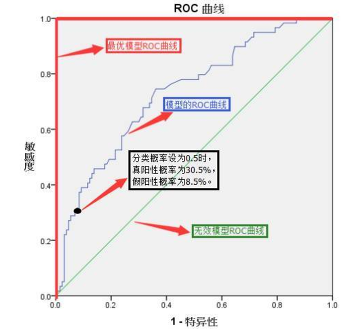

# 机器学习

分类和回归都属于监督学习，有时候一个东西又能做分类又能做回归。

## 回归与分类

回归通常使用均方误差损失 MSE，其对分类不敏感，比如会将-0,5 和 0.5 处理成一样的。而分类任务需要衡量概率分布的差异，因此往往用交叉熵损失。

另外，分类的概率都 ∈(0,1)，并且所有分类的概率和为 1，回归则没有这个限制。

逻辑回归可以预测新数据的分类，属于**判别式分类模型。**

不能预测新数据的分类方法，属于**生成式分类模型**

（聚类中叫做归纳聚类和非归纳聚类，前者能预测新的）

## 线性回归

只是一次函数关系的，没有更高次。

- 线性：两个变量之间的关系**是**一次函数关系的——图象**是直线**，叫做线性。
- 非线性：两个变量之间的关系**不是**一次函数关系的——图象**不是直线**，叫做非线性。
- 回归：人们在测量事物的时候因为客观条件所限，求得的都是测量值，而不是事物真实的值，为了能够得到真实值，无限次的进行测量，最后通过这些测量数据计算**回归到真实值**，这就是回归的由来。

### 正则化

L1，L2，本质都是调整权重，表现出来是删小减大，一般优先考虑L2回归，当维度高并且很稀疏时再考虑L1

**L1正则**，Lasso回归，容易得到稀疏矩阵，****L1正则化(Lasso回归)可以使得一些特征的系数变小,甚至还使一些绝对值较小的系数直接变为0**，**

)

**L2正则**，岭回归，会将较大的权重缩小，让平滑一些，不容易得到稀疏矩阵


**ElasticNet综合了L1正则化项和L2正则化项**，以下是它的公式：

^2+\lambda\sum_{j=1}^{n}\theta_j^2]+\lambda\sum_{j=1}^{n}|\theta|))

## 逻辑回归 LR

说是回归，其实主要用来做分类。用线性回归的输出直接分类的效果差，因此先将线性回归的输出作为 sigmoid 的输入，这样输出为（0，1）之间，再通过设置概率阈值进行分类。

线性回归的输出 $Y = aX + b$ 是连续值（范围$-\infty \sim +\infty$），无法直接用于分类（如预测类别 0/1）。强行用阈值分割会导致对异常值敏感且解释性差。

**ps:**

- 线性回归的输出是连续值（范围$(-\infty, +\infty)$），而分类任务需要离散的类别标签（如 0/1）。 直接使用回归输出作为分类概率缺乏合理性，因为概率需满足$[0,1]$范围且总和为 1。回归输出可能超出此范围，无法解释为概率。
- 线性回归对异常值敏感，如果直接用来分类，那因为异常点太大，又通过 MSE 放大误差，导致分类的结果被异常点干扰大

线性回归的输出 $Y = aX + b$ 是连续值（范围$-\infty \sim +\infty$），无法直接用于分类（如预测类别 0/1）。强行用阈值分割会导致对异常值敏感且解释性差。

通过 Sigmoid 函数将线性回归的输出映射到 **[0,1]**，表示概率：

$$
S = \sigma(Y) = \frac{1}{1 + e^{-Y}} = \frac{1}{1 + e^{-(aX + b)}}
$$

- 当 $Y \to +\infty$，$S \to 1$；当 $Y \to -\infty$，$S \to 0$。
- 输出$S$可解释为样本属于正类的概率 $P(Y=1|X)$。
- 决策边界是线性超平面 $aX + b = 0$（即 Sigmoid 输入为 0 时输出恰为 0.5）

### 为什么是 Sigmoid 函数

**概率解释**：输出天然满足概率定义 $S \in [0,1]$。

**可导性**：导数简单：$\sigma'(z) = \sigma(z)(1 - \sigma(z))$，便于梯度下降优化。

**广义线性模型**：逻辑回归是广义线性模型（GLM）的特例。

### 损失函数

**损失函数（交叉熵损失）**

$$
\mathcal{L} = -\sum_{i} \left[ y_i \log(S_i) + (1-y_i) \log(1-S_i) \right]
$$

- $y_i$：真实标签（0 或 1）
- $S_i$：预测概率
- 
- **优化方法**
  梯度下降法迭代更新参数：

  $$
  a \leftarrow a - \eta \cdot \frac{\partial \mathcal{L}}{\partial a}
  $$

### 逻辑回归的扩展

| 扩展方向             | 说明                                                                    |
| -------------------- | ----------------------------------------------------------------------- |
| **多分类**     | 通过 Softmax 函数推广（One-vs-Rest 或 Multinomial Logistic Regression） |
| **非线性边界** | 添加多项式特征或核方法                                                  |
| **正则化**     | 加入 L1/L2 正则项（如 Lasso 或 Ridge）                                  |

---

### 与其他模型的对比

| 特性               | 逻辑回归      | 线性回归        |
| ------------------ | ------------- | --------------- |
| **输出类型** | 概率（0~1）   | 连续值          |
| **损失函数** | 交叉熵损失    | 均方误差（MSE） |
| **应用场景** | 二分类/多分类 | 回归问题        |

### 逻辑回归为什么用交叉熵损失函数：

因为交叉熵对错误的惩罚更严重

- 真实标签：$y=1$（属于正类），
- 模型预测：$\hat{y}$表示预测为正类的概率。

**交叉熵** ：
模型会优先修正那些预测概率严重错误的样本（如真实为 1 但预测接近 0），从而快速提升分类准确性。

**MSE** ：
模型可能对严重错误“不敏感”，反而花更多精力优化那些已经接近正确的预测，因为 MSE 对$\hat{y}=0.6$和$\hat{y}=0.4$的惩罚相同（当分类阈值为 0.5 时），但前者分类正确，后者错误）。

| 预测概率$\hat{y}$ | MSE 损失$(1-\hat{y})^2$   | 交叉熵损失$-\log(\hat{y})$ |
| ------------------- | --------------------------- | ---------------------------- |
| $\hat{y}=0.9$     | $(1-0.9)^2 = 0.01$        | $-\log(0.9) \approx 0.1$   |
| $\hat{y}=0.5$     | $(1-0.5)^2 = 0.25$        | $-\log(0.5) \approx 0.69$  |
| $\hat{y}=0.1$     | $(1-0.1)^2 = 0.81$        | $-\log(0.1) \approx 2.3$   |
| $\hat{y}=0.01$    | $(1-0.01)^2 \approx 0.98$ | $-\log(0.01) \approx 4.6$  |

#### **观察结论**

1. **MSE 的惩罚** ：

- 当预测完全错误（$\hat{y} \to 0$时），损失趋近于 1， **增长缓慢** 。
- 例如，$\hat{y}$从 0.5 降到 0.1 时，MSE 仅从 0.25 增加到 0.81。

1. **交叉熵的惩罚** ：

- 当预测完全错误（$\hat{y} \to 0$时），损失趋近$+\infty$， **增长极快** 。
- 例如，$\hat{y}$从 0.5 降到 0.1 时，交叉熵从 0.69 暴增到 2.3。

#### 为什么交叉熵更严厉

- **数学原因** ：
  交叉熵中的$-\log(\hat{y})$函数在$\hat{y} \to 0$时梯度极大（导数$\frac{d}{d\hat{y}}(-\log(\hat{y})) = -\frac{1}{\hat{y}} \to -\infty$），模型会强烈修正这种错误。
  _（对比 MSE 的梯度$\frac{d}{d\hat{y}}(1-\hat{y})^2 = -2(1-\hat{y})$，在$\hat{y}=0$时梯度仅为$-2$。）_
- **分类任务的本质** ：
  分类需要明确区分“对”和“错”，交叉熵通过**对数函数**对错误预测施加指数级增长的惩罚，迫使模型快速修正严重错误。而 MSE 的对称性惩罚（对$\hat{y}>1$和$\hat{y}<0$同样惩罚）不适合概率输出。

### 逻辑回归的扩展

1。逻辑回归本来是二分类，如果多分类，可以把其当成要进行多个二分类之后的结果，这样看有点像决策树，但总之还是以二分类来依次划分，并求出最大概率结果

- 当有 K 个类别是，需要训练 K 个二分类 LR 模型，第 i 个模型负责区分类别 i 和其他所有类别，最后选择概率最高的类别为训练结果。

2。使用 softmax 回归，即多项逻辑回归，将多个线性输出转化为概率分布

| 特性                     | OvR（One-vs-Rest）       | Softmax 回归           |
| ------------------------ | ------------------------ | ---------------------- |
| **模型数量**       | **K** 个二分类模型 | 1 个多分类模型         |
| **输出概率归一化** | 否（需单独校准）         | 是（天然归一化）       |
| **适用场景**       | 类别数多或分布不平衡     | 类别数较少或需精确概率 |
| **计算效率**       | 并行训练，但总计算量大   | 单模型，更高效         |

### 优化方法

一阶方法：梯度下降、随机梯度下降、mini 随机梯度下降法

二阶方法：牛顿法，二阶泰勒展开加 Hessian 矩阵（x 的二阶导数矩阵），收敛快，计算量大；拟牛顿法是通过一个特殊表达式来模拟 Hessian 矩阵或它的逆。

#### 特征离散化

连续转化成离散的：非线性，速度快，鲁棒性，特征交叉

**特征离散化（Feature Discretization）** 是指将 **连续型特征** （如年龄、收入、温度等）转换为 **离散的分段或类别** （如“青年/中年/老年”、“低/中/高收入”）。

- 原始连续特征：年龄 = [18, 25, 30, 35, 40, ...]
- 离散化后：年龄分段 = ["18-25", "26-35", "36-45", ...]

好处：

1. **非线性**：将连续特征分段后，每段可单独学习一个权重，从而捕捉非线性模式。
2. **速度快**：稀疏向量内积乘法运算速度快，计算结果方便存储,容易扩展。
3. **鲁棒性**：同一分段内的值被视为相同，增强模型稳定性，同时异常值被处理在两端。
4. **特征交叉**：离散化后可直接构造交叉特征（如“青年+低收入”），提高表达能力。

## 随机森林

bagging 思想：并行，随机有放回地取出一部分样本训练，通过多次这样的结果，进行投票获取平均值作为结果输出.

**基本流程**

1. **Bootstrap 抽样** ：

- 从原始训练集（大小为 N）中**有放回地随机抽取**N 个样本（允许重复），形成一个子训练集（称为 Bootstrap 样本集）。
- 重复此过程 m 次，生成 m 个独立的子训练集。

  **2. 并行训练基分类器** ：
- 对每个子训练集，独立训练一个基分类器（如决策树、SVM 等）。
- 每个分类器的训练过程互不干扰。

3. **聚合预测结果** ：

- 分类任务：通过 **投票机制** （如多数表决）决定最终类别。
- 回归任务：通过**平均预测值**输出结果。

### **核心优势**

- **降低方差** ：通过多次重采样和模型平均，减少模型对特定训练数据的过拟合。
- **适合高方差模型** ：如深度较大的决策树。

随机森林：多个树的 bagging 模型，希望多，准确，针对性强，同样的数据通过多个树模型（取什么树模型也是随机的），取树模型的投票为最终结果。

**Bagging**策略来源于 bootstrap aggregation：从样本集（假设样本集 N 个数据点）中重采样选出 Nb 个样本（有放回的采样，样本数据点个数仍然不变为 N），在所有样本上，对这 n 个样本建立分类器（ID3\C4.5\CART\SVM\LOGISTIC），重复以上两步 m 次，获得 m 个分类器，最后根据这 m 个分类器的投票结果，决定数据属于哪一类，不同分类器的投票过程互不干扰。

### 决策树

ps:决策树像是 if else 不断判断，每个节点划分一个特征属性。

树什么时候停：

1. 当前的节点的样本全是同一个类别时，就不用划分了；
2. 当前节点样本的特征值一致，或者没有可用的特征（已经用过了）
3. 没有满足符合条件的样本（节点中没有样本，空节点）

熵衡量信息量，**信息熵越低，纯度越高**，信息量越少——熵越低，越有序，越一样，所以纯度高。

树不需要归一化，因为其特征选择是阶跃的，不可导，并且其按特征值排序，数值缩放不会影响分类节点的位置。因为上述两点，所以不用归一化。

#### 决策树剪枝

预剪枝和后剪枝

预剪枝：在想分裂节点时拿验证集做测试，分裂后准确率不提高就不分裂。——可能欠拟合

后剪枝：无视过拟合，让节点生长，再自底向上尝试剪枝，若剪枝后验证集的分类准确率提高，则减掉，否则保留。——精确，但是计算量大。

#### 三个决策树

**ID3**

**核心思想** ：使用 **信息增益（Information Gain）** 来选择最优特征进行分裂，仅适用于分类。

**特点** ：

- 只能处理 **离散特征** ，不能直接处理连续值。
- 倾向于选择 **取值较多的特征** （可能导致过拟合）。
- **无剪枝策略** ，容易过拟合。

**C4.5（ID3 的改进版）**

- 由 Ross Quinlan 于 1993 年提出， **适用于分类问题** 。

**核心改进** ：

- 使用 **信息增益率（Gain Ratio）** 代替信息增益， **减少对多值特征的偏好** ，因此适用于更复杂的数据。
- **支持连续特征** （通过二分法离散化），**支持缺失值处理** 。
- **引入剪枝（Pruning）** ，防止过拟合。

信息增益率本质：是在信息增益的基础之上乘上一个惩罚参数。特征个数较多时，惩罚参数较小（0.1)；特征个数较少时，惩罚参数较大(0.5).——这以平衡取值少和取值多的特征。

**但是，又会导致\*\***信息增益率偏向取值较少的特征。\*\*

使用信息增益率：基于以上缺点，并不是直接选择信息增益率最大的特征，而是现在候选特征中找出信息增益高于平均水平的特征，然后在这些特征中再选择信息增益率最高的特征

**CART（Classification and Regression Trees）**

- 由 Breiman 等人于 1984 年提出， **可用于分类和回归** 。

基尼系数：**表示在样本集合中一个随机选中的样本被分错的概率**。现在一个袋子里有 3 种颜色的球若干个，伸手进去掏出 2 个球，颜色不一样的概率。**Gini(D)越小，数据集 D 的纯度越高，（更适合作为划分标准）**

**核心特点** ：

- **二叉树结构** （每个节点只分两支，不同于 ID3/C4.5 的多分支）。
- **分类任务** ：使用 **基尼指数（Gini Index）** 选择最优特征。
- **回归任务** ：使用 **均方误差（MSE）** 选择最优分裂点。
- **支持剪枝** （成本复杂度剪枝）。

#### 三个决策树总结

**ID3**：取值多的属性，更容易使数据更纯，其信息增益更大。
训练得到的是一棵庞大且深度浅的树：不合理。

**C4.5**：采用信息增益率替代信息增益。

**CART**：以基尼系数替代熵，最小化不纯度，而不是最大化信息增益。

| 算法           | 适用任务  | 分裂标准                          | 树结构 | 连续值    | 缺失值    | 剪枝    | 主要缺点               |
| -------------- | --------- | --------------------------------- | ------ | --------- | --------- | ------- | ---------------------- |
| **ID3**  | 分类      | 信息增益                          | 多叉树 | ❌ 不支持 | ❌ 不支持 | ❌ 无   | 偏向多值特征，易过拟合 |
| **C4.5** | 分类      | 信息增益比                        | 多叉树 | ✔️ 支持 | ✔️ 支持 | ✔️ 有 | 计算复杂度高           |
| **CART** | 分类+回归 | 基尼指数（分类）<br />MSE（回归） | 二叉树 | ✔️ 支持 | ✔️ 支持 | ✔️ 有 | 可能不稳定             |

CATR 最通用，是随机森林和 GBDT 的核心组件

### 随机森林的随机，体现在三个方面：

**(1) 样本随机性**

- 每棵树的训练数据通过 Bootstrap 抽样生成（有放回采样）。
- **未被抽中的样本** （约 37%的概率）称为 **OOB（Out-of-Bag）数据** ，可用于验证模型性能。

**(2) 特征随机性**

- 每棵树的每个节点分裂时，从全部 M 个特征中 **随机选取 m 个候选特征** （通常取 `m = sqrt(M)`或 `log2(M)`）。
- 从这 m 个特征中选择最优分裂点（如基于信息增益、Gini 系数）。

**(3) 分类器随机性（可选）**

- 随机选择不同类型的基分类器（如混合决策树和逻辑回归），但实践中较少使用。

总的来说就是随机选择样本数，随机选取特征，随机选择分类器，建立多颗这样的决策树，然后通过这几课决策树来投票，决定数据属于哪一类(**投票机制有一票否决制、少数服从多数、加权多数**)——因此，这些基分类器要**好而不同**

### 构建随机森林

构建随机森林的关键是选择最优的 m（从 M 个特征选择 m 个候选特征），这个以来袋外错误率，oob error

oob：每此取样有大约 1/3 的数据不会被取到，这 1/3 数据被称为袋外数据 oob（out of bag）

#### 过拟合问题

- 随机森林的过拟合主要取决于 **单棵树的深度** （如 `max_depth`）和 **特征随机性** （`max_features`），而非树的数量。
- 但树的数量过多时，模型会逐渐拟合训练数据的细节（包括噪声），尤其是当单棵树本身已经过深时。

因此，当过拟合时，可以尝试减少树的数量

| 树的数量 (`n_estimators`) | 对过拟合的影响             | 原因分析                                                                       |
| --------------------------- | -------------------------- | ------------------------------------------------------------------------------ |
| **增加**              | ❌**可能加剧过拟合** | 更多树会增强模型对训练数据的记忆能力（尤其是深度大的树），导致对噪声过度拟合。 |
| **减少**              | ✅**可能缓解过拟合** | 限制树的数量会降低模型复杂度，减少对训练数据的过度拟合倾向。                   |

更有效的方法如下：减小复杂度和通用性，增强随机性。

**(1) 控制单棵树的复杂度**

- **减小 `max_depth`** ：限制树的深度（如从 `None`改为 `5-10`）。
- **增大 `min_samples_split`** ：节点分裂所需的最小样本数（如从 `2`改为 `5-10`）。
- **增大 `min_samples_leaf`** ：叶节点的最小样本数（如从 `1`改为 `3-5`）。

**(2) 增强随机性**

- **减小 `max_features`** ：每棵树分裂时使用的特征数（如从 `sqrt(n_features)`改为 `log2(n_features)`）。
- **启用 `bootstrap`** ：确保每棵树使用 Bootstrap 抽样（默认开启）。

**(3) 其他策略**

- **增加训练数据量** ：过拟合的根本原因是数据不足。
- **使用早停（Early Stopping）** ：监控 OOB 误差或验证集误差，停止训练当误差不再下降。

### **随机森林对方差敏感**

- **对样本方差敏感** ：由于依赖 Bootstrap 抽样，样本分布的小幅变化可能导致模型差异较大。
- **降低方差** ：通过多棵树平均投票，显著减少模型整体方差。
- **保持低偏差** ：单棵树可以深度生长而不剪枝（因多样性抵消过拟合风险），就是说单棵树的性能要好，这样投票才好。

ps：方差衡量数据分布，方差越大，分布越离散（数据点离均值越远），如果样本方差大，那取样时候的样本差异会变大，导致模型之间的差异变大。结论就是，单个决策树对方差敏感，但多个树共同决策，可以有效降低模型方差。

### 随机森林优缺点

**优点：**

- 在当前的很多数据集上，相对其他算法有着很大的优势，表现良好。
- 它能够处理很高维度（feature 很多）的数据，并且不用做特征选择(因为特征子集是随机选择的)。
- 在训练完后，它能够给出哪些 feature 比较重要。
- 训练速度快，容易做成并行化方法(训练时树与树之间是相互独立的)。
- 在训练过程中，能够检测到 feature 间的互相影响。
- 对于不平衡的数据集来说，它可以平衡误差。
- 如果有很大一部分的特征遗失，仍可以维持准确度。

**缺点：不适合噪声过大的数据**

- 随机森林已经被证明在某些**噪音较大**的分类或回归问题上会过拟合。
- 对于有不同取值的属性的数据，取值划分较多的属性会对随机森林产生更大的影响，所以随机森林在这种数据上产出的属性权值是不可信的。

## Boosting

Boosting 方法训练基分类器时采用串行的方式，各个基分类器之间有依赖。它的基本思路是将基分类器层层叠加，每一层在训练的时候，对前一层基分类器分错的样本，给予更高的权重。测试时，根据各层分类器的结果的加权得到最终结果。

Bagging 与 Boosting 的串行训练方式不同，Bagging 方法在训练过程中，各基分类器之间无强依赖，可以进行并行训练。

### GBDT

梯度提升决策树，Boosting 思想，穿心训练，后面的弱分类器纠正前面弱分类器的残差（预测与真实值之间的误差，分类器一般是树）

将残差拟合问题转化为梯度下降问题，通过负梯度方向（即残差近似）指导新树的生成，常用 CART

ps:弱分类器，准确率不高，但在 50%以上的分类器.

#### 优点和缺点

**优点**：精度高，灵活性好，可计算特征重要性，受异常值干扰小(因为使用损失函数梯度)

**缺点：** 速度慢，调参复杂（需要平衡学习率和树的数量， `learning_rate` 和 `n_estimators`），容易过拟合，对噪声敏感(残差拟合偏差)

#### 与 RF 对比

| **特性**         | **GBDT**                           | **随机森林**               |
| ---------------------- | ---------------------------------------- | -------------------------------- |
| **训练方式**     | 串行（Boosting）                         | 并行（Bagging）                  |
| **基学习器依赖** | 强依赖前一棵树的结果                     | 每棵树独立                       |
| **目标**         | 减少偏差（Bias）                         | 减少方差（Variance）             |
| **树结构**       | 浅层树（通常深度 ≤6）                   | 深层树（可能完全生长）           |
| **数据敏感性**   | 对异常值鲁棒，但对噪声敏感               | 对噪声和异常值均鲁棒             |
| **参数调优**     | 需调 `learning_rate`, `n_estimators` | 主要调 `n_estimators`          |
| **适用场景**     | 高精度需求（如 CTR 预测、排序）          | 快速原型、高维数据、抗过拟合需求 |

### AdaBoost

**核心思想** ：
通过串行训练多个 **弱分类器** （如决策树、线性模型），每次调整样本权重，使得后续分类器更关注之前分类错误的样本，最终加权投票得到强分类器。

**优点** ：

- 简单高效，对过拟合有一定抵抗能力。
- 可结合多种基分类器（如决策树、SVM）。

  **缺点** ：
- 对噪声和异常值敏感（因权重调整会放大噪声影响）。

#### AdaBoost 与 GBDT 对比

前者关注样本权重，后者关注概率

| **特性**         | **AdaBoost**                 | **GBDT**                     |
| ---------------------- | ---------------------------------- | ---------------------------------- |
| **核心思想**     | 调整样本权重，关注错误样本         | 拟合残差（负梯度），逐步逼近真实值 |
| **损失函数**     | 指数损失（分类）、平方损失（回归） | 支持多种损失（如 MSE、LogLoss）    |
| **基学习器**     | 任意弱分类器（如决策树、SVM）      | 固定使用决策树（通常为 CART）      |
| **样本权重**     | 动态调整样本权重                   | 样本权重固定，拟合残差             |
| **并行性**       | 串行训练                           | 串行训练                           |
| **异常值敏感性** | 高（权重放大异常值影响）           | 低（用梯度方向缓解影响）           |
| **典型应用**     | 二分类、人脸检测                   | 回归、排序、CTR 预测               |

#### **AdaBoost 与 GBDT/XGBoost/LightGBM 的区别**

| **特性**         | **AdaBoost**            | **GBDT/XGBoost/LightGBM**           |
| ---------------------- | ----------------------------- | ----------------------------------------- |
| **优化目标**     | 调整样本权重，关注错误样本    | 拟合残差（GBDT）或负梯度（XGBoost）       |
| **损失函数**     | 指数损失（分类）              | 可自定义（如 MSE、LogLoss）               |
| **基学习器**     | 任意弱分类器（如决策树、SVM） | 固定使用决策树                            |
| **样本权重**     | 动态调整                      | 固定权重，拟合残差                        |
| **并行化**       | 串行训练                      | XGBoost/LightGBM 支持并行（不是树的并行） |
| **异常值敏感性** | 高（权重放大异常值影响）      | 低（梯度下降对异常值鲁棒）                |
| **主要应用**     | 二分类、人脸检测              | 回归/分类/排序等通用任务                  |

- **AdaBoost** ：
  像老师批改作业，重点关注学生 **常错的题目** ，下次多练习这些题。
  **问题** ：如果作业中有错误答案（噪声），老师会过度关注错误方向。
- **GBDT/XGBoost/LightGBM** ：
  像学生 **每次只改正上次考试的错题** ，逐步逼近满分。
  **优势** ：更稳定，适合复杂任务。

---

预测房价

- **AdaBoost** ：

1. 第一棵树预测后，**高估的房子**会被标记
2. 第二棵树会**重点拟合这些高估样本**
3. 最终结果 = 树 1 预测 × 权重 1 + 树 2 预测 × 权重 2 + ...

- **Gradient Boosting** ：

1. 第一棵树预测后，计算 **残差** （真实价 - 预测价）
2. 第二棵树直接学习**残差的规律**
3. 最终结果 = 树 1 预测 + 树 2 预测 + ...（逐步累加修正）

### XGBoost

可用于分类和回归，其和后面的 LightGBM 都支持并行

XGBoost 是 GBDT 的高效改进版本，通过 **二阶梯度优化** 、**正则化**和 **工程优化** （如并行计算），显著提升模型性能和训练速度。

XGBoost 本质上还是一个 GBDT，但是力争把速度和效率发挥到极致，所以叫 X (Extreme) GBoosted。包括前面说过，两者都是 boosting 方法。

XGBoost 的并行主要体现在 **特征粒度** 的并行，而非树粒度的并行（因为 boosting 是串行生成树）。

#### **XGBoost 的关键改进（vs GBDT）**

损失函数，收敛速度，工程优化

1. **损失函数优化,** 在目标函数中显式加入 L1/L2 正则化，防止过拟合

```math
\text{Obj} = \sum_{i=1}^n L(y_i, \hat{y}_i) + \sum_{k=1}^K (\gamma T + \frac{1}{2}\lambda|w|^2)
```

2. 二阶泰勒展开，同时使用 **一阶梯度（g）** 和 **二阶梯度（h）** ，比 GBDT 的一阶梯度更精准

```math
\text{Obj}^{(t)} \approx \sum_{i=1}^n [g_i f_t(x_i) + \frac{1}{2}h_i f_t^2(x_i)] + \Omega(f_t)
```

3. 工程优化

| 改进项               | 说明                                   |
| -------------------- | -------------------------------------- |
| **特征预排序** | 提前对特征值排序并缓存，加速分裂点查找 |
| **并行化**     | 在特征粒度上并行计算，提升训练速度     |
| **稀疏感知**   | 自动学习缺失值的分裂方向               |
| **分块存储**   | 数据按列分块（Column Block），节省内存 |

#### 核心对比

| **特性**       | **XGBoost**             | **GBDT**           |
| -------------------- | ----------------------------- | ------------------------ |
| **损失函数**   | 支持自定义，含正则项（L1/L2） | 通常为均方误差或对数损失 |
| **梯度优化**   | 一阶 + 二阶导数（更精准）     | 仅一阶导数               |
| **正则化**     | 显式控制（γ, λ, α）        | 无（依赖剪枝和早停）     |
| **缺失值处理** | 自动学习缺失值方向            | 需手动处理               |
| **并行化**     | 特征预排序 + 多线程           | 串行训练                 |
| **基学习器**   | 支持线性模型和树              | 仅决策树                 |
| **速度**       | 更快（尤其大数据）            | 较慢                     |
| **过拟合控制** | 更强（正则项 + 子采样）       | 较弱                     |

#### XGBoost 思想

与 GBDT 一样，同样是拟合残差，用后面的树来拟合前面树的残差，像是学习只盯着上次考试没考出来的学。

- 不断地添加树，不断地进行特征分裂来生长一棵树，每次添加一个树，其实是学习一个新函数**f(x)**，去拟合上次预测的残差。
- 当我们训练完成得到 k 棵树，我们要预测一个样本的分数，其实就是根据这个样本的特征，在每棵树中会落到对应的一个叶子节点，每个叶子节点就对应一个分数
- 最后只需要将每棵树对应的分数加起来就是该样本的预测值

XGBoost 使用了和 CART 回归树一样的想法，利用贪婪算法，遍历所有特征的所有特征划分点，不同的是使用的目标函数不一样。具体做法就是分裂后的目标函数值比单子叶子节点的目标函数的增益，同时为了限制树生长过深，还加了个阈值，只有当增益大于该阈值才进行分裂。从而继续分裂，形成一棵树，再形成一棵树，**每次在上一次的预测基础上取最优进一步分裂/建树。**

凡是这种循环迭代的方式必定有停止条件，什么时候停止呢？简言之，设置树的最大深度、当样本权重和小于设定阈值时停止生长以防止过拟合。

### LightGMB

(请点击[https://github.com/Microsoft/LightGBM](https://github.com/Microsoft/LightGBM))

**LightGBM** （Light Gradient Boosting Machine）是微软开发的 **高性能梯度提升框架** ，基于 GBDT（梯度提升决策树）优化，主打**训练速度快**和 **内存消耗低** ，尤其适合大规模数据。

比 XGBoost 还好，速度快十倍，内存占 1/6，准确率也提升。

LightGBM 提出的主要原因就是为了解决 GBDT 在海量数据遇到的问题，让 GBDT 可以更好更快地用于工业实践。

LightGBM 的并行比 XGBoost 更激进，支持 **特征并行 + 数据并行** ：

**(1) 特征并行**

- **传统方法** ：每个机器保存全部数据，但只处理部分特征（通信成本高）。
- **LightGBM 优化** ：每个机器只保存 **本地特征的数据** ，通过投票选择最佳分裂特征，减少通信量。

**(2) 数据并行**

- **直方图合并** ：不同机器计算本地数据的直方图，合并后找全局最优分裂点。

#### 核心改进

1. 基于直方图的算法，**（Histogram-based）**

- **传统方法** （如 XGBoost）：
  对每个特征的所有取值排序，计算所有可能的分裂点（精确但计算量大）。
- **LightGBM** ：
  将连续特征 **离散化为直方图（bin）** ，仅对直方图的边界值计算分裂增益，大幅减少计算量。

减少就散复杂度，利好高维和大规模数据

2. 单边梯度采样 ，**（GOSS, Gradient-based One-Side Sampling）**

- **传统方法** ：对所有样本计算梯度，计算成本高。
- **LightGBM** ：
  - 保留 **梯度较大（预测不准）的样本** （更关键）。
  - 随机采样 **梯度较小（预测较准）的样本** （减少冗余计算）。

保持模型精度，并减少计算量。

3. 互斥特征捆绑，**（EFB, Exclusive Feature Bundling）**

- **问题** ：高维数据中，许多特征是 **稀疏且互斥的** （如用户 ID、类别型特征）。
- **LightGBM** ：
  自动检测互斥特征，将它们 **捆绑成一个特征** ，减少特征维度
- **优势** ：降低内存占用，加速训练。

ps：其他方面，LightGBM 进行进一步的优化。首先它抛弃了大多数 GBDT 工具使用的按层生长 (level-wise)的决策树生长策略，而使用了带有深度限制的按叶子生长 (leaf-wise)算法，也就是不强制要求层数，没必要追求每层都占满了。


#### 与 XGBoost 和 GBDT 对比

| **特性**       | **LightGBM**                   | **XGBoost**      | **GBDT**    |
| -------------------- | ------------------------------------ | ---------------------- | ----------------- |
| **训练速度**   | ⚡**最快** （直方图+GOSS+EFB） | 中等（需预排序）       | 慢（串行计算）    |
| **内存占用**   | ✅**最低** （特征捆绑+直方图） | 较高（需存储排序数据） | 高（存储多棵树）  |
| **算法优化**   | 直方图 + GOSS + EFB                  | 二阶梯度 + 正则化      | 仅一阶梯度        |
| **并行计算**   | 特征并行 + 数据并行                  | 特征并行               | 不支持            |
| **缺失值处理** | 自动学习最优分裂方向                 | 自动学习               | 需手动填充        |
| **适用场景**   | 大数据（10W+样本）                   | 中小数据 + 高精度需求  | 小数据 + 简单任务 |

## SVM 总述

support vector machine，支持向量机，可以用来分类（主要是二分类），属于监督学习，思想是找到一个超平面，让分类后的两类数据间隔最大。

具体怎么最大，是根据支持向量来决定的，离哪个超平面距离最小的数据点，就是支持向量，最大化支持向量距离超平面的距离，也就是能让两类数据分开。

但有时候这写支持向量并不好找，甚至有可能找不到，因此引入软间隔概念，允许一些点不遵循这个规则，不再强硬的划分所有点。

而有时候数据交错 ，无法找到超平面，这时候需要对数据进行升维，但是直接升维会引入过多计算量和大量的空间浪费，因此常通过核函数将输入空间映射到高维特征空间，从而在高维特征空间构造出最优的超平面

也就是说，核函数是把原始数据映射到高维空间，他事先在低维上进行计算，而将实质上的分类效果表现在了高维上，避免了直接在高维空间中的复杂计算。

根据核函数不同，SVM 可以是线性分类器或非线性分类器

又因为可以一直往高维映射，所以是一定存在一组参数能让 SVM 分类器的训练误差为 0

### 细说

**松弛变量：$\xi_i \geq 0$**

**作用** ：在 SVM 中引入松弛变量，允许部分样本“违反”最大间隔规则，使模型能处理**线性不可分数据**或 **噪声数据** 。

**原始 SVM 硬间隔约束：**

$y_i (w^T x_i + b) \geq 1 \quad (\forall i)$

**引入松弛变量后：**

$y_i (w^T x_i + b) \geq 1 - \xi_i \quad \text{其中} \quad \xi_i \geq 0$

**软间隔的优化目标：**

$\min_{w,b} \frac{1}{2} \|w\|^2 + C \sum_{i=1}^n \xi_i$

- $\xi_i$ 表示第 $i$ 个样本的“违反程度”：
  - $\xi_i = 0$：样本严格满足间隔约束（位于支持向量或正确侧）。
  - $0 < \xi_i < 1$：样本在间隔内但分类正确。
  - $\xi_i \geq 1$：样本被错误分类。
- **超参数 $C$** ：控制对误分类的惩罚强度：
- $C \to \infty$：退化为硬间隔 SVM（不允许错误）。
- $C$ 较小：允许更多错误，模型更简单。

#### SMO（Sequential Minimal Optimization）

**作用** ：SVM 的高效训练算法，用于求解对偶问题中的拉格朗日乘子 $\alpha_i$。

- 避免矩阵存储和求逆，内存效率高。
- 适合大规模数据集（如 LibSVM 的实现）。

| **概念**     | **松弛变量**                  | **SMO**                    |
| ------------------ | ----------------------------------- | -------------------------------- |
| **目的**     | 允许分类错误，增强模型鲁棒性        | 高效求解 SVM 对偶问题            |
| **数学形式** | 引入$\xi_i \geq 0$ 和超参数 $C$ | 分步优化拉格朗日乘子$\alpha_i$ |
| **应用场景** | 线性不可分数据或噪声数据            | 大规模 SVM 训练（如 LibSVM）     |
| **关键参数** | 惩罚系数$C$                       | 收敛容忍度、最大迭代次数         |

### 与 LR 的异同

| **对比维度**   | **SVM（支持向量机）**                   | **LR（逻辑回归）**                      | **相同点**                       |
| -------------------- | --------------------------------------------- | --------------------------------------------- | -------------------------------------- |
| **核心思想**   | 最大化分类间隔（几何间隔），依赖支持向量      | 最大化似然概率，输出属于某类的概率            | 均为监督学习，用于分类任务             |
| **损失函数**   | 合页损失（Hinge Loss）                        | 对数损失（Log Loss）                          | 均通过优化损失函数训练模型             |
| **输出结果**   | 直接输出类别（可通过概率校准间接输出概率）    | 直接输出概率（默认阈值 0.5 分类）             | 均可用于二分类（通过扩展支持多分类）   |
| **正则化**     | 通过间隔最大化隐式控制复杂度（类似 L2 正则）  | 需显式添加 L1/L2 正则化（如 `penalty`参数） | 均依赖超参数平衡模型复杂度与拟合能力   |
| **数据敏感性** | 对支持向量敏感，异常值可能影响超平面          | 对全体数据敏感，概率优化更鲁棒                | 性能均受特征缩放影响（如标准化）       |
| **核方法**     | 支持核技巧（线性/高斯/多项式等非线性分类）    | 仅线性分类（需手动特征工程实现非线性）        | 线性核 SVM 和 LR 的决策边界均为线性    |
| **计算效率**   | 训练复杂度高（尤其核函数时），适合小/中数据集 | 训练高效（梯度下降），适合大规模数据          | 均可用随机梯度下降（SGD）加速优化      |
| **多分类支持** | 需依赖 OVR（One-vs-Rest）或 OVO（One-vs-One） | 原生支持 OVR，也可用 Softmax 多分类           | 均需扩展策略处理多分类问题             |
| **应用场景**   | 高维数据（如文本）、小样本非线性分类          | 概率需求场景（如风控）、大规模线性分类        | 均广泛用于二分类任务（如垃圾邮件检测） |

#### **关键区别总结** ：

1. **损失函数** ：SVM 关注边界附近的样本（Hinge Loss），LR 关注全局概率分布（Log Loss）。
2. **非线性能力** ：SVM 通过核函数隐式处理非线性，LR 需显式特征工程。
3. **输出解释** ：LR 直接输出概率，SVM 需额外校准（如 Platt Scaling）。
4. **数据量适应性** ：LR 更适合大规模数据，SVM（尤其核方法）计算成本较高。

#### **选择建议** ：

- 需要**概率解释**或**处理大规模数据** → **LR**
- 数据维度高、样本少或需要**非线性分类** → **SVM（核方法）**
- 线性可分且追求简单高效 → **线性 SVM** 或 **LR + L2 正则**

## 贝叶斯网络

### 概率图模型

概率图模型分为**贝叶斯网络（Bayesian Network）和马尔可夫网络（Markov Network）** 两大类。贝叶斯网络可以用一个有向图结构表示，马尔可夫网络可以表 示成一个无向图的网络结构。更详细地说，概率图模型包括了朴素贝叶斯模型、最大熵模型、隐马尔可夫模型、条件随机场、主题模型等，在机器学习的诸多场景中都有着广泛的应用。

**概率图模型（Probabilistic Graphical Model, PGM）** 是用图结构表示随机变量间概率关系的模型，分为两类：

- **有向图模型（贝叶斯网络）** ：用有向无环图表示因果关系（如贝叶斯网络）。
- **无向图模型（马尔可夫网络）** ：用无向图表示变量间的关联关系（如条件随机场）。

  **核心思想** ：
  将联合概率分布分解为局部条件概率的乘积，利用图结构降低计算复杂度。

### 贝叶斯模型

**频率派观点**

- **核心** ：参数是固定未知的，通过极大似然估计（MLE）求解。
- **局限性** ：无法量化参数的不确定性。

**贝叶斯学派**

- **核心** ：参数是随机变量，通过先验分布+数据 → 后验分布。
- **优势** ：提供概率化的不确定性评估。

**贝叶斯定理**

$$
P(A|B) = \frac{P(B|A)P(A)}{P(B)}
$$

从先验（$P(A)$）和似然（$P(B|A)$）推导后验（$P(A|B)$）。

**朴素贝叶斯**

即假设特诊间相互独立的贝叶斯网络

### 生成式与判别式模型

- **判别模型**(discriminative model)通过求解条件概率分布 P(y|x)或者直接计算 y 的值来预测 y。
  线性回归（Linear Regression）,逻辑回归（Logistic Regression）,支持向量机（SVM）, 传统神经网络（Traditional Neural Networks）,线性判别分析（Linear Discriminative Analysis），条件随机场（Conditional Random Field）
- **生成模型**（generative model）通过对观测值和标注数据计算联合概率分布 P(x,y)来达到判定估算 y 的目的。
  朴素贝叶斯（Naive Bayes）, 隐马尔科夫模型（HMM）,贝叶斯网络（Bayesian Networks）和隐含狄利克雷分布（Latent Dirichlet Allocation）、混合高斯模型

| **维度**       | **生成式模型（如贝叶斯网络）** | **判别式模型（如逻辑回归）**   |  |  |  |
| -------------------- | ------------------------------------ | ------------------------------------ | - | - | - |
| **目标**       | 建模联合概率$P(X,Y)$               | 建模条件概率$P(Y             | X)$ |  |  |  |
| **特点**       | 可生成数据，需假设数据分布           | 直接分类，对分布假设较弱             |  |  |  |
| **计算复杂度** | 通常更高（需估计全概率）             | 通常更低（仅关注决策边界）           |  |  |  |
| **典型算法**   | 朴素贝叶斯、HMM、GMM                 | SVM、逻辑回归、CRF                   |  |  |  |
| **优势场景**   | 数据缺失、小样本、生成新样本         | 高维数据、分类性能优先               |  |  |  |

### 西瓜例子

#### **问题设定**

我们有以下数据集（简化版）：

| 编号 | 颜色（绿=0，黑=1） | 敲声（闷=0，脆=1） | 纹理（模糊=0，清晰=1） | 是否甜（甜=1，不甜=0） |
| ---- | ------------------ | ------------------ | ---------------------- | ---------------------- |
| 1    | 1                  | 1                  | 1                      | 1                      |
| 2    | 1                  | 0                  | 1                      | 1                      |
| 3    | 0                  | 1                  | 1                      | 1                      |
| 4    | 0                  | 0                  | 0                      | 0                      |
| 5    | 1                  | 1                  | 0                      | 0                      |

**目标** ：
给定一个新西瓜的特征 `[颜色=1, 敲声=1, 纹理=0]`，判断它更可能是“甜”还是“不甜”。

---

#### **Step 1: 计算先验概率**

- **甜瓜（Y=1）** ：3/5 = 0.6
- **不甜瓜（Y=0）** ：2/5 = 0.4

#### **Step 2: 计算条件概率（似然）**

统计每个特征在甜/不甜情况下的分布：

**甜瓜（Y=1）** ：

- 颜色=1：2/3
- 敲声=1：2/3
- 纹理=1：3/3

  **不甜瓜（Y=0）** ：
- 颜色=1：1/2
- 敲声=1：1/2
- 纹理=1：0/2

（注：遇到概率为 0 时，用拉普拉斯平滑修正，此处暂不处理）

#### **Step 3: 对新样本 `[1, 1, 0]` 计算后验概率**

**甜瓜的联合概率** ：

- $P(Y=1) \times P(\text{颜色}=1 \mid Y=1) \times P(\text{敲声}=1 \mid Y=1) \times P(\text{纹理}=0 \mid Y=1) = 0.6 \times \frac{2}{3} \times \frac{2}{3} \times \frac{0}{3} = 0$

**不甜瓜的联合概率** ：

- $P(Y=0) \times P(\text{颜色}=1 \mid Y=0) \times P(\text{敲声}=1 \mid Y=0) \times P(\text{纹理}=0 \mid Y=0) = 0.4 \times \frac{1}{2} \times \frac{1}{2} \times \frac{2}{2} = 0.1$

#### **Step 4: 归一化后验概率**

- 总联合概率 = 0 + 0.1 = 0.1
- **甜的概率** ：0 / 0.1 = 0
- **不甜的概率** ：0.1 / 0.1 = 1

  **结论** ：该西瓜 **“不甜”** 。

---

#### **问题与修正（拉普拉斯平滑）**

若某特征值在训练集中未出现（如甜瓜的纹理=0），会导致概率为 0。
**解决方法** ：对每个特征值计数加 1（拉普拉斯平滑）：

修正后的条件概率：

- **甜瓜（Y=1）** ：
- 纹理=0：(0+1)/(3+2) = 1/5
- 纹理=1：(3+1)/(3+2) = 4/5

重新计算甜瓜的联合概率：

$0.6 \times \frac{2}{3} \times \frac{2}{3} \times \frac{1}{5} \approx 0.035$

不甜瓜的联合概率不变（0.1）。
归一化后：

- 甜的概率：0.035 / (0.035 + 0.1) ≈ 26%
- 不甜的概率：74%

  **最终结论** ：仍倾向于“不甜”，但概率更合理。

ps:拉普拉斯平滑：分子加一，分母加特征数量（这里就是有纹理或是没有纹理，2 个），提高鲁棒性，好让模型处理没有出现过的特征值。

1. 分子：该特征值出现的次数 + 1
2. 分母：该类别的样本总数 + 该特征可能的取值数量

## 马尔科夫

### 多个概念

| 概念                                              | 核心特点                                                                     | 主要用途                               | 关键区别                           |
| ------------------------------------------------- | ---------------------------------------------------------------------------- | -------------------------------------- | ---------------------------------- |
| **马尔可夫过程 (Markov Process)**           | 状态转移只依赖当前状态（无记忆性），不一定是离散的（如连续时间的马尔可夫链） | 随机过程建模（如排队论、金融时间序列） | **无隐藏状态** ，纯状态转移  |
| **马尔可夫模型 (Markov Model, MM)**         | 离散时间、离散状态的马尔可夫过程（如马尔可夫链）                             | NLP（n-gram 语言模型）、金融预测       | **显式状态序列** ，观测=状态 |
| **隐马尔可夫模型 (HMM)**                    | 状态不可观测，观测值依赖隐藏状态                                             | 语音识别、基因序列分析                 | **隐藏状态 + 观测序列**      |
| **马尔可夫网络 (Markov Random Field, MRF)** | 无向图模型，表示变量间的依赖关系（无方向性）                                 | 图像分割、社交网络分析                 | **无向图，全局依赖**         |
| **贝叶斯网络 (Bayesian Network, BN)**       | 有向无环图（DAG），表示因果或条件依赖                                        | 医学诊断、故障分析                     | **有向图，局部依赖**         |

- **有向 vs 无向** ：贝叶斯网络是有向图（因果），马尔可夫网络是无向图（相关）。
- **隐藏状态** ：HMM 有隐藏状态，普通马尔可夫模型没有。
- **时间 vs 空间** ：马尔可夫过程/模型关注时间序列，马尔可夫网络关注变量间的空间依赖。

#### 一句话总结

- **马尔可夫过程（Markov Process）** ：描述状态如何随时间随机变化（如股票涨跌）。
- **马尔可夫模型（Markov Model）** ：离散状态的马尔可夫过程（如预测明天天气）。
- **隐马尔可夫模型（HMM）** ：状态不可见，只能看到依赖状态的观测值（如通过语音推测文字）。
- **马尔可夫网络（MRF）** ：无向图描述变量间的依赖关系（如图像像素间的关联）。
- **贝叶斯网络（Bayesian Network）** ：有向图描述因果关系（如“吸烟 → 肺癌”）。

### 马尔科夫过程

马尔可夫过程（Markov process）是一类随机过程。最简单的马尔可夫过程就是一阶过程，**每一个状态的转移只依赖于其之前的那一个状态**，这个也叫作**马尔可夫性质**。

- 数学上是一个 **随机过程** ，可以是连续或离散时间。
- 满足 **马尔可夫性** ：P(未来 ∣ 现在,过去)=P(未来 ∣ 现在)

### 隐马尔可夫模型 HMM

##### 三大问题：

- 给定模型，如何有效计算产生观测序列的概率？换言之，如何**评估**模型与观测序列之间的匹配程度？
- 给定模型和观测序列，如何找到与此观测序列最匹配的状态序列？换言之，如何根据观测序列推断出隐藏的模型状态？
- 给定观测序列，如何调整模型参数使得该序列出现的概率最大？换言之，如何训练模型使其能最好地描述观测数据？

| 问题               | 描述                                                                                                                                          | 解法                                   | 应用                           |
| ------------------ | --------------------------------------------------------------------------------------------------------------------------------------------- | -------------------------------------- | ------------------------------ |
| **评估问题** | 给定模型**λ**=**(**A**,**B**,**π**)**，计算观测序列 **O** 的概率 **P**(**O**∥**λ**) | **前向算法** / 后向算法          | 语音识别（计算某句话的概率）   |
| **解码问题** | 给定**O** 和 **λ**，找最可能的隐藏状态序列 **Q**                                                                           | **Viterbi 算法**                 | 词性标注（找最可能的词性序列） |
| **学习问题** | 给定**O**，估计 **λ**=**(**A**,**B**,**π**)**                                                           | **Baum-Welch 算法（EM 的特例）** | 训练语音模型                   |

### 条件随机场 CRF

观测不再独立，比如要推断一张照片中的人在干什么，得知道与之相邻时间照片的标签信息。

- **定义** ：判别式无向图模型，直接建模 **P**(**Y|X**)（HMM 是生成式）。
- **关键点** ：
- **与 HMM 对比** ：
  - HMM 假设观测独立$（P(O_t\|Q_t)）$，CRF 无此限制。
  - CRF 可引入任意特征（如单词大写、后缀等）。
- **与 MEMM（最大熵马尔可夫模型）对比** ：
  - MEMM 有标注偏置问题（倾向于选择少转移的路径），CRF 无此问题。
- **应用** ：命名实体识别（NER）、词性标注。

#### **6. EM 算法、HMM、CRF 的比较**

| 方法              | 核心思想                           | 适用场景                          | 优缺点                   |
| ----------------- | ---------------------------------- | --------------------------------- | ------------------------ |
| **EM 算法** | 迭代优化（E 步求期望，M 步最大化） | 含隐变量的概率模型（如 GMM、HMM） | 可能局部最优，但通用性强 |
| **HMM**     | 生成式模型，假设观测独立           | 序列标注（语音、基因）            | 计算高效，但假设过强     |
| **CRF**     | 判别式模型，无独立性假设           | NLP（NER、分词）                  | 更灵活，但计算复杂度高   |

## LDA 潜在狄利克雷分配(不是降维)

### **LDA 模型是什么？**

**LDA（Latent Dirichlet Allocation）** 是一种**无监督**的主题模型，用于从文档集合中自动发现隐藏的“主题”（即词的分布）。

它可以将文档集 中每篇文档的主题以概率分布的形式给出，从而通过分析一些文档抽取出它们的主题（分布）出来后，便可以根据主题（分布）进行主题聚类或文本分类。同时，它是一种典型的词袋模型，即一篇文档是由一组词构成，词与词之间没有先后顺序的关系。此外，一篇文档可以包含多个主题，文档中每一个词都由其中的一个主题生成。

#### **5 个关键分布的理解**

LDA 的核心依赖以下概率分布：

1. **Dirichlet 分布（狄利克雷分布）**
   - 用于生成“文档-主题分布”和“主题-词分布”。
   - 性质：多项分布的共轭先验，保证采样结果仍为 Dirichlet 分布。
   - 参数：α**α**（控制文档的主题稀疏性），β**β**（控制主题的词稀疏性）。
2. **多项分布（Multinomial）**
   - 用于生成具体的“主题”和“词”。
   - 例如：一篇文档的主题分布 θ∼Dir(α)**θ**∼**Dir**(**α**)，再按 θ**θ** 采样主题。
3. **泊松分布（Poisson）**
   - 用于生成文档的长度（词的数量），但在 LDA 中通常假设文档长度固定。
4. **Categorical 分布（分类分布）**
   - 实际上是多项分布的特例（单次试验），用于生成单个词。
5. **共轭先验（Conjugate Prior）**
   - Dirichlet 分布是多项分布的共轭先验，简化后验计算。

### 冷启动

**冷启动问题** ：新用户或新物品缺乏历史行为数据，难以推荐。

#### **解决方案**

##### **（1）用户冷启动**

- **步骤** ：

1. 用 LDA 对所有物品（如文章、商品）提取主题分布 θitem**θ**item。
2. 新用户注册时填写兴趣标签（如“科技”“体育”），映射到主题分布 θuser**θ**user。
3. 推荐与 θuser**θ**user 最相似的物品。

##### **（2）物品冷启动**

- **步骤** ：

1. 对新物品提取文本（如标题、描述），用训练好的 LDA 模型推断其主题分布 θitem**θ**item。
2. 推荐给喜欢相似主题的用户。

##### **（3）混合策略**

- 结合主题模型与协同过滤：

  - 用主题分布补充用户-物品矩阵的稀疏部分。

  **优势** ：
- 无需依赖用户行为，仅需文本信息。
- 主题可解释性强（如“科技”“时尚”），便于人工调整。

### 总结

| 问题                    | 方法                  | 核心要点                              |
| ----------------------- | --------------------- | ------------------------------------- |
| **LDA 是什么**    | 无监督主题模型        | Dirichlet 先验 + 文档-主题-词三层生成 |
| **确定 Topic 数** | 指标优化（Coherence） | 平衡可解释性与模型性能                |
| **解决冷启动**    | 基于文本的主题匹配    | 将用户/物品映射到语义主题空间         |

通过 LDA，可以将文本数据转化为低维主题表示，从而解决推荐系统中的语义理解和冷启动问题。

## EM

EM 算法，两个步骤交替进行

**第一步**是计算期望（E），利用对隐藏变量的现有估计值，计算其最大似然估计值；
**第二步**是最大化（M），最大化在 E 步上求得的最大似然值来计算参数的值。M 步上找到的参数估计值被用于下一个 E 步计算中，这个过程不断交替进行。

极大似然估计用一句话概括就是：知道结果，反推条件 θ。

### 似然函数

知道结果，寻求使该结果出现可能性最大的条件 。

### 采用 EM 算法的模型

用 EM 算法求解的模型一般有 GMM 或者协同过滤，k-means 其实也属于 EM。EM 算法一定会收敛，但是可能收敛到局部最优。由于求和的项数将随着隐变量的数目指数上升，会给梯度计算带来麻烦。

## 聚类算法

通常是无监督学习，模型将每个数据点划分到特定的组里

K-Means 和 GMM 都是通过 EM 算法来执行的

### K-Means，K 均值

K-均值是一个迭代算法，假设我们想要将数据聚类成 n 个组，其方法为:

- 首先选择 𝐾 个随机的点，称为聚类中心（cluster centroids）；
- 对于数据集中的每一个数据，按照距离 𝐾 个中心点的距离，将其与距离最近的中心点关联起来，与同一个中心点关联的所有点聚成一类。
- 计算每一个组的平均值，将该组所关联的中心点移动到平均值的位置。
- 重复步骤，直至中心点不再变化。


对于 K 值选择，常用手肘法，就是找到一个值，比如为 4，从 3 到 4，分类效果会有明显下降，但从 4 到 5，基本没什么变化，也就是说 4 是一个肘点。

### KNN 和 K-Means

KNN 是分类，属于监督学习，根据某个节点最近的 K 个邻居判断这个节点的类型。

K-Means 是聚类，属于无监督学习，先随机指定 K 个聚类中心，根据与聚类中心的距离更新当前节点的类别，更新后再根据平均值得到新的中心，再更新距离值，直到收敛。

### GMM

**用多个高斯分布函数的线形组合来对数据分布进行拟合。**

GMM 假设数据由多个高斯分布（正态分布）混合生成，每个高斯分布对应一个簇（类）。数据点的生成过程如下：

1. 随机选择一个高斯分布（簇），概率由权重 $π_k$ 决定。
2. 从该高斯分布中采样一个数据点。

$π_k$：第 K 个高斯分布的权重

也是通过 EM 算法来执行，更新下面三个参数

- **均值（μ）** ：分布的中心点（如 70 分）。
- **方差（σ²）** ：数据的波动范围（如方差小=成绩集中）。
- **权重（π）** ：这类数据占总数据的比例（如 A 类占 60%，B 类占 40%）。

### GMM 与 K-Means 相比

| 特性                   | GMM                        | K-Means             |
| ---------------------- | -------------------------- | ------------------- |
| **簇形状**       | 任意椭圆（协方差矩阵决定） | 仅球形              |
| **软聚类**       | 输出属于各簇的概率         | 硬分配（非 0 即 1） |
| **参数更新**     | EM 算法（优化似然函数）    | 最小化平方误差      |
| **异常值鲁棒性** | 更强（概率模型）           | 较弱（均值敏感）    |

高斯混合模型与 K 均值算法的相同点是：

- 它们都是可用于聚类的算法；
- 都需要 指定 K 值；
- 都是使用 EM 算法来求解；
- 都往往只能收敛于局部最优。

而它相比于 K 均值算法的优点是，可以给出一个样本属于某类的概率是多少；不仅仅可以用于聚类，还可以用于概率密度的估计；并且可以用于生成新的样本点。

## KNN

有监督的分类算法，根据最近的K个邻居的类型判断自己的类型。

所谓K近邻算法，即是给定一个训练数据集，对新的输入实例，在训练数据集中找到与该实例最邻近的K个实例（也就是上面所说的K个邻居），这K个实例的多数属于某个类，就把该输入实例分类到这个类中。

### 距离度量

**欧式距离：**就是数学中的两点之间距离， 最常见的两点之间或多点之间的距离表示法。

=\sqrt{(x_1-y_1)^2+(x_2-y_2)^2+...+(x_n-y_n)^2}=\sqrt{\sum_{i=1}^{n}(x_i-y_i)^2})

**曼哈顿距离**：坐标（x1, y1）的点P1与坐标（x2, y2）的点P2的曼哈顿距离为： 。

两个n维向量a(x11,x12,…,x1n)与 b(x21,x22,…,x2n)间的曼哈顿距离


**余弦距离：** 几何中夹角余弦可用来衡量两个向量方向的差异，机器学习中借用这一概念来衡量样本向量之间的差异。

夹角余弦取值范围为[-1,1]。夹角余弦越大表示两个向量的夹角越小，夹角余弦越小表示两向量的夹角越大。当两个向量的方向重合时夹角余弦取最大值1，当两个向量的方向完全相反夹角余弦取最小值-1。

**（方向重合是1，相反是-1）**

 =\frac{A*B}{||A||_2||B||_2})

- 在二维空间中向量A(x1,y1)与向量B(x2,y2)的夹角余弦公式：
  
- 两个n维样本点a(x11,x12,…,x1n)和b(x21,x22,…,x2n)的夹角余弦：
  

### 一些问题

1. 在k-means或kNN，我们是用欧氏距离来计算最近的邻居之间的距离。为什么不用曼哈顿距离？
   **答：** 我们不用曼哈顿距离，因为它只计算水平或垂直距离，有维度的限制。另一方面，欧式距离可用于任何空间的距离计算问题。因为，数据点可以存在于任何空间，欧氏距离是更可行的选择。例如：想象一下国际象棋棋盘，象或车所做的移动是由曼哈顿距离计算的，因为它们是在各自的水平和垂直方向的运动。
1. KD-Tree相比KNN来进行快速图像特征比对的好处在哪里?
   **答：**极大的节约了时间成本．点线距离如果 >　最小点，无需回溯上一层，如果<,则再上一层寻找。

# 一些网络知识

## 特征工程

### 1. 特征工程有哪些？

特征工程，顾名思义，是对原始数据进行一系列工程处理，将其提炼为特征，作为输入供算法和模型使用。从本质上来讲，特征工程是一个表示和展现数 据的过程。在实际工作中，**特征工程旨在去除原始数据中的杂质和冗余**，设计更高效的特征以刻画求解的问题与预测模型之间的关系。

主要讨论以下两种常用的数据类型。

1. 结构化数据。结构化数据类型可以看作关系型数据库的一张表，每列都 有清晰的定义，包含了数值型、类别型两种基本类型；每一行数据表示一个样本 的信息。
2. 非结构化数据。非结构化数据主要包括文本、图像、音频、视频数据， 其包含的信息无法用一个简单的数值表示，也没有清晰的类别定义，并且每条数 据的大小各不相同。

#### 1.1 特征归一化

为了消除数据特征之间的量纲影响，我们需要对特征进行归一化处理，使得 不同指标之间具有可比性。例如，分析一个人的身高和体重对健康的影响，如果 使用米（m）和千克（kg）作为单位，那么身高特征会在 1.6 ～ 1.8m 的数值范围 内，体重特征会在 50 ～ 100kg 的范围内，分析出来的结果显然会倾向于数值差别比 较大的体重特征。想要得到更为准确的结果，就需要进行特征归一化 （Normalization）处理，使各指标处于同一数值量级，以便进行分析。

对数值类型的特征做归一化可以将所有的特征都统一到一个大致相同的数值 区间内。最常用的方法主要有以下两种。

1. **线性函数归一化**（Min-Max Scaling）。它对原始数据进行线性变换，使 结果映射到[0, 1]的范围，实现对原始数据的等比缩放。归一化公式如下，其中*X*为原始数据， 分别为数据最大值和最小值。

   
2. **零均值归一化**（Z-Score Normalization）。它会将原始数据映射到均值为 0、标准差为 1 的分布上。具体来说，假设原始特征的均值为 μ、标准差为 σ，那么 归一化公式定义为

   

优点：**训练数据归一化后，容易更快地通过梯度下降找到最优解。**

当然，数据归一化并不是万能的。在实际应用中，通过梯度下降法求解的模 型通常是需要归一化的，包括线性回归、逻辑回归、支持向量机、神经网络等模 型。但对于决策树模型则并不适用。

#### 1.2 类别型特征

类别型特征（Categorical Feature）主要是指性别（男、女）、血型（A、B、 AB、O）等只在有限选项内取值的特征。类别型特征原始输入通常是字符串形 式，除了决策树等少数模型能直接处理字符串形式的输入，对于逻辑回归、支持 向量机等模型来说，类别型特征必须经过处理转换成数值型特征才能正确工作。

1. **序号编码**

   序号编码通常用于处理类别间具有大小关系的数据。例如成绩，可以分为 低、中、高三档，并且存在“高>中>低”的排序关系。序号编码会按照大小关系对 类别型特征赋予一个数值 ID，例如高表示为 3、中表示为 2、低表示为 1，转换后依 然保留了大小关系。
2. **独热编码(one-hot)**

   独热编码通常用于处理类别间不具有大小关系的特征。例如血型，一共有 4 个 取值（A 型血、B 型血、AB 型血、O 型血），独热编码会把血型变成一个 4 维稀疏 向量，A 型血表示为（1, 0, 0, 0），B 型血表示为（0, 1, 0, 0），AB 型表示为（0, 0, 1, 0），O 型血表示为（0, 0, 0, 1）。对于类别取值较多的情况下使用独热编码。
3. **二进制编码**

   二进制编码主要分为两步，先用序号编码给每个类别赋予一个类别 ID，然后 将类别 ID 对应的二进制编码作为结果。以 A、B、AB、O 血型为例，下图是二进制编码的过程。A 型血的 ID 为 1，二进制表示为 001；B 型血的 ID 为 2，二进制表示为 010；以此类推可以得到 AB 型血和 O 型血的二进制表示。

#### 1.3 高维组合特征的处理

为了提高复杂关系的拟合能力，在特征工程中经常会把一阶离散特征两两组 合，构成高阶组合特征。以广告点击预估问题为例，原始数据有语言和类型两种 离散特征，第一张图是语言和类型对点击的影响。为了提高拟合能力，语言和类型可 以组成二阶特征，第二张图是语言和类型的组合特征对点击的影响。

#### 1.4 文本表示模型

文本是一类非常重要的非结构化数据，如何表示文本数据一直是机器学习领 域的一个重要研究方向。

1. **词袋模型和 N-gram 模型**

   最基础的文本表示模型是词袋模型。顾名思义，就是将每篇文章看成一袋子词，并忽略每个词出现的顺序。具体地说，就是将整段文本以词为单位切分开， 然后每篇文章可以表示成一个长向量，向量中的每一维代表一个单词，而该维对 应的权重则反映了这个词在原文章中的重要程度。常用 TF-IDF 来计算权重。
2. **主题模型**

   主题模型用于从文本库中发现有代表性的主题（得到每个主题上面词的分布 特性），并且能够计算出每篇文章的主题分布。
3. **词嵌入与深度学习模型**

   词嵌入是一类将词向量化的模型的统称，核心思想是将每个词都映射成低维 空间（通常 K=50 ～ 300 维）上的一个稠密向量（Dense Vector）。K 维空间的每一 维也可以看作一个隐含的主题，只不过不像主题模型中的主题那样直观。

#### 1.5 其它特征工程

1. 如果某个特征当中有**缺失值**，缺失比较少的话，可以使用该特征的平均值或者其它比较靠谱的数据进行填充；缺失比较多的话可以考虑删除该特征。
2. 可以分析特征与结果的相关性，把相关性小的特征去掉。

#### 1.6 特征工程脑图


### 2. 机器学习优化方法

优化是应用数学的一个分支，也是机器学习的核心组成部分。实际上，机器 学习算法 = 模型表征 + 模型评估 + 优化算法。其中，优化算法所做的事情就是在 模型表征空间中找到模型评估指标最好的模型。不同的优化算法对应的模型表征 和评估指标不尽相同。

#### 2.1 机器学习常用损失函数

损失函数（loss function）是用来估量你模型的预测值 f(x)与真实值 Y 的不一致程度，它是一个非负实值函数,通常使用 L(Y, f(x))来表示，损失函数越小，模型的鲁棒性就越好。常见的损失函数如下：

1. **平方损失函数**

   Y-f(X)表示的是残差，整个式子表示的是残差的平方和，而我们的目的就是最小化这个目标函数值（注：该式子未加入正则项），也就是最小化残差的平方和。而在实际应用中，通常会使用均方差（MSE）作为一项衡量指标，公式如下：

   ^2)

   该损失函数一般使用在线性回归当中。
2. **log 损失函数**

   公式中的 y=1 表示的是真实值为 1 时用第一个公式，真实 y=0 用第二个公式计算损失。为什么要加上 log 函数呢？可以试想一下，当真实样本为 1 是，但 h=0 概率，那么 log0=∞，这就对模型最大的惩罚力度；当 h=1 时，那么 log1=0，相当于没有惩罚，也就是没有损失，达到最优结果。所以数学家就想出了用 log 函数来表示损失函数。

   最后按照梯度下降法一样，求解极小值点，得到想要的模型效果。该损失函数一般使用在逻辑回归中。
3. **Hinge 损失函数**

   $L_i = \sum_{\substack{j=1 \\ j \neq y_i}}^{C} \max\Big(0, \underbrace{f(x_i, W)_j}_{\text{错误类别分数}} - \underbrace{f(x_i, W)_{y_i}}_{\text{正确类别分数}} + \underbrace{\Delta}_{\text{边际}}\Big)$

   SVM 采用的就是 Hinge Loss，用于衡量分类错误程度,用于“最大间隔(max-margin)”分类。

#### 2.2 什么是凸优化

**凸函数**的严格定义为，函数 L(·) 是凸函数当且仅当对定义域中的任意两点 x，y 和任意实数 λ∈[0,1]总有：

$L(\lambda \mathbf{x} + (1-\lambda)\mathbf{y}) \leq \lambda L(\mathbf{x}) + (1-\lambda)L(\mathbf{y})$

该不等式的一个直观解释是，凸函数曲面上任意两点连接而成的线段，其上的任 意一点都不会处于该函数曲面的下方，如下图所示所示.

凸优化问题的例子包括支持向量机、线性回归等 线性模型，非凸优化问题的例子包括低秩模型（如矩阵分解）、深度神经网络模型等。

#### 2.3 正则化项

使用正则化项，也就是给 loss function 加上一个参数项，正则化项有**L1 正则化、L2 正则化、ElasticNet**。加入这个正则化项好处：

- 控制参数幅度，不让模型“无法无天”。
- 限制参数搜索空间
- 解决欠拟合与过拟合的问题。

详细请参考之前的文章：[线性回归--第 5 点](https://github.com/NLP-LOVE/ML-NLP/tree/master/Machine%20Learning/Liner%20Regression)

#### 2.4 常见的几种最优化方法

1. **梯度下降法**

   梯度下降法是最早最简单，也是最为常用的最优化方法。梯度下降法实现简单，当目标函数是凸函数时，梯度下降法的解是全局解。一般情况下，其解不保证是全局最优解，梯度下降法的速度也未必是最快的。梯度下降法的优化思想是用当前位置负梯度方向作为搜索方向，因为该方向为当前位置的最快下降方向，所以也被称为是”最速下降法“。最速下降法越接近目标值，步长越小，前进越慢。梯度下降法的搜索迭代示意图如下图所示：

   

   缺点：靠近极小值时收敛速度减慢；直线搜索时可能会产生一些问题；可能会“之字形”地下降。
2. **牛顿法**

   牛顿法是一种在实数域和复数域上近似求解方程的方法。方法使用函数 f (x)的泰勒级数的前面几项来寻找方程 f (x) = 0 的根。牛顿法最大的特点就在于它的收敛速度很快。具体步骤：

   - 首先，选择一个接近函数 f (x)零点的 x0，计算相应的 f (x0) 和切线斜率 f ' (x0)（这里 f ' 表示函数 f 的导数）。
   - 然后我们计算穿过点(x0, f (x0)) 并且斜率为 f '(x0)的直线和 x 轴的交点的 x 坐标，也就是求如下方程的解：

     +f(x_0)-x_0*f^{'}(x_0)=0)
   - 我们将新求得的点的 x 坐标命名为 x1，通常 x1 会比 x0 更接近方程 f (x) = 0 的解。因此我们现在可以利用 x1 开始下一轮迭代。

   由于牛顿法是基于当前位置的切线来确定下一次的位置，所以牛顿法又被很形象地称为是"切线法"。牛顿法搜索动态示例图：

   

   从本质上去看，牛顿法是二阶收敛，梯度下降是一阶收敛，所以牛顿法就更快。
   **缺点：**

   - 牛顿法是一种迭代算法，每一步都需要求解目标函数的 Hessian 矩阵的逆矩阵，计算比较复杂。
   - 在高维情况下这个矩阵非常大，计算和存储都是问题。
   - 在小批量的情况下，牛顿法对于二阶导数的估计噪声太大。
   - 目标函数非凸的时候，牛顿法容易受到鞍点或者最大值点的吸引。
3. **拟牛顿法**

   拟牛顿法是求解非线性优化问题最有效的方法之一，**本质思想是改善牛顿法每次需要求解复杂的 Hessian 矩阵的逆矩阵的缺陷，它使用正定矩阵来近似 Hessian 矩阵的逆，从而简化了运算的复杂度。** 拟牛顿法和梯度下降法一样只要求每一步迭代时知道目标函数的梯度。通过测量梯度的变化，构造一个目标函数的模型使之足以产生超线性收敛性。这类方法大大优于梯度下降法，尤其对于困难的问题。另外，因为拟牛顿法不需要二阶导数的信息，所以有时比牛顿法更为有效。如今，优化软件中包含了大量的拟牛顿算法用来解决无约束，约束，和大规模的优化问题。
4. **共轭梯度法**

   共轭梯度法是介于梯度下降法与牛顿法之间的一个方法，它仅需利用一阶导数信息，但克服了梯度下降法收敛慢的缺点，又避免了牛顿法需要存储和计算 Hesse 矩阵并求逆的缺点，共轭梯度法不仅是解决大型线性方程组最有用的方法之一，也是解大型非线性最优化最有效的算法之一。 在各种优化算法中，共轭梯度法是非常重要的一种。其优点是所需存储量小，具有步收敛性，稳定性高，而且不需要任何外来参数。

#### 2.5 降维方法

##### 2.5.1 线性判别分析（LDA）

线性判别分析（Linear Discriminant Analysis，LDA）是一种经典的降维方法。和主成分分析 PCA 不考虑样本类别输出的无监督降维技术不同，LDA 是一种监督学习的降维技术，数据集的每个样本有类别输出。

LDA 分类思想简单总结如下：

1. 多维空间中，数据处理分类问题较为复杂，LDA 算法将多维空间中的数据投影到一条直线上，将 d 维数据转化成 1 维数据进行处理。
2. 对于训练数据，设法将多维数据投影到一条直线上，同类数据的投影点尽可能接近，异类数据点尽可能远离。
3. 对数据进行分类时，将其投影到同样的这条直线上，再根据投影点的位置来确定样本的类别。

如果用一句话概括 LDA 思想，**即“投影后类内方差最小，类间方差最大”。**

假设有红、蓝两类数据，这些数据特征均为二维，如下图所示。我们的目标是将这些数据投影到一维，让每一类相近的数据的投影点尽可能接近，不同类别数据尽可能远，即图中红色和蓝色数据中心之间的距离尽可能大。


左图和右图是两种不同的投影方式。

 **左图思路：让不同类别的平均点距离最远的投影方式。**

 **右图思路：让同类别的数据挨得最近的投影方式。**

    从上图直观看出，右图红色数据和蓝色数据在各自的区域来说相对集中，根据数据分布直方图也可看出，所以右图的投影效果好于左图，左图中间直方图部分有明显交集。

    以上例子是基于数据是二维的，分类后的投影是一条直线。如果原始数据是多维的，则投影后的分类面是一低维的超平面。

**优缺点**

| 优缺点 | 简要说明                                                                                                                                                                      |
| :----: | :---------------------------------------------------------------------------------------------------------------------------------------------------------------------------- |
|  优点  | 1. 可以使用类别的先验知识；<br />2. 以标签、类别衡量差异性的有监督降维方式，相对于 PCA 的模糊性，其目的更明确，更能反映样本间的差异；                                         |
|  缺点  | 1. LDA 不适合对非高斯分布样本进行降维；<br />2. LDA 降维最多降到分类数 k-1 维；<br />3. LDA 在样本分类信息依赖方差而不是均值时，降维效果不好；<br />4. LDA 可能过度拟合数据。 |

##### 2.5.2 主成分分析（PCA）

1. PCA 就是将高维的数据通过线性变换投影到低维空间上去。
2. 投影思想：找出最能够代表原始数据的投影方法。被 PCA 降掉的那些维度只能是那些噪声或是冗余的数据。
3. 去冗余：去除可以被其他向量代表的线性相关向量，这部分信息量是多余的。
4. 去噪声，去除较小特征值对应的特征向量，特征值的大小反映了变换后在特征向量方向上变换的幅度，幅度越大，说明这个方向上的元素差异也越大，要保留。
5. 对角化矩阵，寻找极大线性无关组，保留较大的特征值，去除较小特征值，组成一个投影矩阵，对原始样本矩阵进行投影，得到降维后的新样本矩阵。
6. 完成 PCA 的关键是——协方差矩阵。协方差矩阵，能同时表现不同维度间的相关性以及各个维度上的方差。协方差矩阵度量的是维度与维度之间的关系，而非样本与样本之间。
7. 之所以对角化，因为对角化之后非对角上的元素都是 0，达到去噪声的目的。对角化后的协方差矩阵，对角线上较小的新方差对应的就是那些该去掉的维度。所以我们只取那些含有较大能量(特征值)的维度，其余的就舍掉，即去冗余。

**图解 PCA**

PCA 可解决训练数据中存在数据特征过多或特征累赘的问题。核心思想是将 m 维特征映射到 n 维（n < m），这 n 维形成主元，是重构出来最能代表原始数据的正交特征。

    假设数据集是m个n维，$(\boldsymbol x^{(1)}, \boldsymbol x^{(2)}, \cdots, \boldsymbol x^{(m)})$。如果$n=2$，需要降维到$n'=1$，现在想找到某一维度方向代表这两个维度的数据。下图有$u_1, u_2$两个向量方向，但是哪个向量才是我们所想要的，可以更好代表原始数据集的呢？

从图可看出，$u_1$比$u_2$好，为什么呢？有以下两个主要评价指标：

1. 样本点到这个直线的距离足够近。
2. 样本点在这个直线上的投影能尽可能的分开。

如果我们需要降维的目标维数是其他任意维，则：

1. 样本点到这个超平面的距离足够近。
2. 样本点在这个超平面上的投影能尽可能的分开。

**优缺点**

| 优缺点 | 简要说明                                                                                                                                                              |
| :----: | :-------------------------------------------------------------------------------------------------------------------------------------------------------------------- |
|  优点  | 1. 仅仅需要以方差衡量信息量，不受数据集以外的因素影响。　 2.各主成分之间正交，可消除原始数据成分间的相互影响的因素。3. 计算方法简单，主要运算是特征值分解，易于实现。 |
|  缺点  | 1.主成分各个特征维度的含义具有一定的模糊性，不如原始样本特征的解释性强。2. 方差小的非主成分也可能含有对样本差异的重要信息，因降维丢弃可能对后续数据处理有影响。       |

##### 2.5.3 比较这两种方法

**降维的必要性**：

1. 多重共线性和预测变量之间相互关联。多重共线性会导致解空间的不稳定，从而可能导致结果的不连贯。
2. 高维空间本身具有稀疏性。一维正态分布有 68%的值落于正负标准差之间，而在十维空间上只有 2%。
3. 过多的变量，对查找规律造成冗余麻烦。
4. 仅在变量层面上分析可能会忽略变量之间的潜在联系。例如几个预测变量可能落入仅反映数据某一方面特征的一个组内。

**降维的目的**：

1. 减少预测变量的个数。
2. 确保这些变量是相互独立的。
3. 提供一个框架来解释结果。相关特征，特别是重要特征更能在数据中明确的显示出来；如果只有两维或者三维的话，更便于可视化展示。
4. 数据在低维下更容易处理、更容易使用。
5. 去除数据噪声。
6. 降低算法运算开销。

**LDA 和 PCA 区别**

| 异同点 | LDA                                                                                                                 | PCA                                |
| :----: | :------------------------------------------------------------------------------------------------------------------ | :--------------------------------- |
| 相同点 | 1. 两者均可以对数据进行降维；<br />2. 两者在降维时均使用了矩阵特征分解的思想；<br />3. 两者都假设数据符合高斯分布； |                                    |
| 不同点 | 有监督的降维方法；                                                                                                  | 无监督的降维方法；                 |
|        | 降维最多降到 k-1 维；                                                                                               | 降维多少没有限制；                 |
|        | 可以用于降维，还可以用于分类；                                                                                      | 只用于降维；                       |
|        | 选择分类性能最好的投影方向；                                                                                        | 选择样本点投影具有最大方差的方向； |
|        | 更明确，更能反映样本间差异；                                                                                        | 目的较为模糊；                     |

### 3. 机器学习评估方法

混淆矩阵也称误差矩阵，是表示精度评价的一种标准格式，用 n 行 n 列的矩阵形式来表示。具体评价指标有总体精度、制图精度、用户精度等，这些精度指标从不同的侧面反映了图像分类的精度。下图为混淆矩阵

|          | 正类                | 负类                |
| -------- | ------------------- | ------------------- |
| 预测正确 | TP(True Positives)  | FP(False Positives) |
| 预测错误 | FN(False Negatives) | TN(True Negatives)  |

#### 3.1 准确率(Accuracy)

**准确率（Accuracy）。** 顾名思义，就是所有的预测正确（正类负类）的占总的比重。


准确率是分类问题中最简单也是最直观的评价指标，但存在明显的缺陷。比 如，当负样本占 99%时，分类器把所有样本都预测为负样本也可以获得 99%的准确 率。所以，当不同类别的样本比例非常不均衡时，占比大的类别往往成为影响准 确率的最主要因素。

#### 3.2 精确率（Precision）

**精确率（Precision）**，查准率。即正确预测为正的占全部预测为正的比例。个人理解：真正正确的占所有预测为正的比例。


#### 3.3 召回率(Recall)

**召回率（Recall）**，查全率。即正确预测为正的占全部实际为正的比例。个人理解：真正正确的占所有实际为正的比例。


为了综合评估一个排序模型的好坏，不仅要看模型在不同 Top N 下的 Precision@N 和 Recall@N，而且最好绘制出模型的 P-R（Precision- Recall）曲线。这里简单介绍一下 P-R 曲线的绘制方法。

P-R 曲线的横轴是召回率，纵轴是精确率。对于一个排序模型来说，其 P-R 曲 线上的一个点代表着，在某一阈值下，模型将大于该阈值的结果判定为正样本， 小于该阈值的结果判定为负样本，此时返回结果对应的召回率和精确率。整条 P-R 曲线是通过将阈值从高到低移动而生成的。下图是 P-R 曲线样例图，其中实线代表 模型 A 的 P-R 曲线，虚线代表模型 B 的 P-R 曲线。原点附近代表当阈值最大时模型的 精确率和召回率。


由图可见，当召回率接近于 0 时，模型 A 的精确率为 0.9，模型 B 的精确率是 1， 这说明模型 B 得分前几位的样本全部是真正的正样本，而模型 A 即使得分最高的几 个样本也存在预测错误的情况。并且，随着召回率的增加，精确率整体呈下降趋 势。但是，当召回率为 1 时，模型 A 的精确率反而超过了模型 B。**这充分说明，只用某个点对应的精确率和召回率是不能全面地衡量模型的性能，只有通过 P-R 曲线的 整体表现，才能够对模型进行更为全面的评估。**

#### 3.4 F1 值(H-mean 值)

F1 值（H-mean 值）。F1 值为算数平均数除以几何平均数，且越大越好，将 Precision 和 Recall 的上述公式带入会发现，当 F1 值小时，True Positive 相对增加，而 false 相对减少，即 Precision 和 Recall 都相对增加，即 F1 对 Precision 和 Recall 都进行了加权。


#### 3.4 ROC 曲线

ROC 曲线。接收者操作特征曲线（receiver operating characteristic curve），是反映敏感性和特异性连续变量的综合指标，ROC 曲线上每个点反映着对同一信号刺激的感受性。下图是 ROC 曲线例子。



横坐标：1-Specificity，伪正类率(False positive rate，FPR，FPR=FP/(FP+TN))，预测为正但实际为负的样本占所有负例样本的比例；

纵坐标：Sensitivity，真正类率(True positive rate，TPR，TPR=TP/(TP+FN))，预测为正且实际为正的样本占所有正例样本的比例。

**真正的理想情况**，TPR 应接近 1，FPR 接近 0，即图中的（0,1）点。**ROC 曲线越靠拢（0,1）点，越偏离 45 度对角线越好**。

**AUC 值**

AUC (Area Under Curve) 被定义为 ROC 曲线下的面积，显然这个面积的数值不会大于 1。又由于 ROC 曲线一般都处于 y=x 这条直线的上方，所以 AUC 的取值范围一般在 0.5 和 1 之间。使用 AUC 值作为评价标准是因为很多时候 ROC 曲线并不能清晰的说明哪个分类器的效果更好，而作为一个数值，对应 AUC 更大的分类器效果更好。

从 AUC 判断分类器（预测模型）优劣的标准：

- AUC = 1，是完美分类器，采用这个预测模型时，存在至少一个阈值能得出完美预测。绝大多数预测的场合，不存在完美分类器。
- 0.5 < AUC < 1，优于随机猜测。这个分类器（模型）妥善设定阈值的话，能有预测价值。
- AUC = 0.5，跟随机猜测一样（例：丢铜板），模型没有预测价值。
- AUC < 0.5，比随机猜测还差；但只要总是反预测而行，就优于随机猜测。

**一句话来说，AUC 值越大的分类器，正确率越高。**

#### 3.5 余弦距离和欧式距离

**余弦距离：**几何中夹角余弦可用来衡量两个向量方向的差异，机器学习中借用这一概念来衡量样本向量之间的差异。

夹角余弦取值范围为[-1,1]。夹角余弦越大表示两个向量的夹角越小，夹角余弦越小表示两向量的夹角越大。当两个向量的方向重合时夹角余弦取最大值1，当两个向量的方向完全相反夹角余弦取最小值-1。

**（方向重合是1，相反是-1）**

 =\frac{A*B}{||A||_2||B||_2})

- 在二维空间中向量A(x1,y1)与向量B(x2,y2)的夹角余弦公式：
  
- 两个n维样本点a(x11,x12,…,x1n)和b(x21,x22,…,x2n)的夹角余弦：
  

**欧式距离：** 在数学中，欧几里得距离或欧几里得度量是欧几里得空间中两点间“普通”（即直线）距离，如点 x = (x1,...,xn) 和 y = (y1,...,yn) 之间的距离为：

=\sqrt{(x_1-y_1)^2+(x_2-y_2)^2+...+(x_n-y_n)^2}=\sqrt{\sum_{i=1}^{n}(x_i-y_i)^2})

对于两个向量 A 和 B，余弦距离关注的是向量之间的角度关系，并不关心它们的绝对大小，其取值 范围是[−1,1]。当一对文本相似度的长度差距很大、但内容相近时，如果使用词频 或词向量作为特征，它们在特征空间中的的欧氏距离通常很大；而如果使用余弦 相似度的话，它们之间的夹角可能很小，因而相似度高。此外，在文本、图像、 视频等领域，研究的对象的特征维度往往很高，余弦相似度在高维情况下依然保 持“相同时为 1，正交时为 0，相反时为 −1”的性质，而欧氏距离的数值则受维度的 影响，范围不固定，并且含义也比较模糊。

#### 3.6 A/B 测试

AB 测试是为 Web 或 App 界面或流程制作两个（A/B）或多个（A/B/n）版本，在同一时间维度，分别让组成成分相同（相似）的访客群组（目标人群）随机的访问这些版本，收集各群组的用户体验数据和业务数据，最后分析、评估出最好版本，正式采用。

#### 3.7 模型评估方法

1. **Holdout 检验**

   Holdout 检验是最简单也是最直接的验证方法，它将原始的样本集合随机划分 成训练集和验证集两部分。比方说，对于一个点击率预测模型，我们把样本按照 70%～ 30% 的比例分成两部分，70% 的样本用于模型训练；30% 的样本用于模型 验证，包括绘制 ROC 曲线、计算精确率和召回率等指标来评估模型性能。

   Holdout 检验的缺点很明显，即在验证集上计算出来的最后评估指标与原始分 组有很大关系。为了消除随机性，研究者们引入了“交叉检验”的思想。
2. **交叉检验**

   k-fold 交叉验证：首先将全部样本划分成 k 个大小相等的样本子集；依次遍历 这 k 个子集，每次把当前子集作为验证集，其余所有子集作为训练集，进行模型的 训练和评估；最后把 k 次评估指标的平均值作为最终的评估指标。在实际实验 中，k 经常取 10。
3. **自助法**

   不管是 Holdout 检验还是交叉检验，都是基于划分训练集和测试集的方法进行 模型评估的。然而，当样本规模比较小时，将样本集进行划分会让训练集进一步 减小，这可能会影响模型训练效果。有没有能维持训练集样本规模的验证方法 呢？自助法可以比较好地解决这个问题。

   自助法是基于自助采样法的检验方法。对于总数为 n 的样本集合，进行 n 次有 放回的随机抽样，得到大小为 n 的训练集。n 次采样过程中，有的样本会被重复采 样，有的样本没有被抽出过，将这些没有被抽出的样本作为验证集，进行模型验 证，这就是自助法的验证过程。

#### 3.8 超参数调优

为了进行超参数调优，我们一般会采用网格搜索、随机搜索、贝叶斯优化等 算法。在具体介绍算法之前，需要明确超参数搜索算法一般包括哪几个要素。一 是目标函数，即算法需要最大化/最小化的目标；二是搜索范围，一般通过上限和 下限来确定；三是算法的其他参数，如搜索步长。

- **网格搜索**，可能是最简单、应用最广泛的超参数搜索算法，它通过查找搜索范 围内的所有的点来确定最优值。如果采用较大的搜索范围以及较小的步长，网格 搜索有很大概率找到全局最优值。然而，**这种搜索方案十分消耗计算资源和时间**，特别是需要调优的超参数比较多的时候。因此，在实际应用中，网格搜索法一般会先使用较广的搜索范围和较大的步长，来寻找全局最优值可能的位置；然 后会逐渐缩小搜索范围和步长，来寻找更精确的最优值。这种操作方案可以降低 所需的时间和计算量，但由于目标函数一般是非凸的，所以很可能会错过全局最 优值。
- **随机搜索**，随机搜索的思想与网格搜索比较相似，只是不再测试上界和下界之间的所有 值，而是在搜索范围中随机选取样本点。它的理论依据是，如果样本点集足够 大，那么通过随机采样也能大概率地找到全局最优值，或其近似值。随机搜索一 般会比网格搜索要快一些，但是和网格搜索的快速版一样，它的结果也是没法保证的。
- **贝叶斯优化算法**，贝叶斯优化算法在寻找最优最值参数时，采用了与网格搜索、随机搜索完全 不同的方法。网格搜索和随机搜索在测试一个新点时，会忽略前一个点的信息； 而贝叶斯优化算法则充分利用了之前的信息。贝叶斯优化算法通过对目标函数形 状进行学习，找到使目标函数向全局最优值提升的参数。

#### 3.9 过拟合和欠拟合

过拟合是指模型对于训练数据拟合呈过当的情况，反映到评估指标上，就是 模型在训练集上的表现很好，但在测试集和新数据上的表现较差。欠拟合指的是 模型在训练和预测时表现都不好的情况。下图形象地描述了过拟合和欠拟合的区别。

1. **防止过拟合：**
   - 从数据入手，获得更多的训练数据。
   - 降低模型复杂度。
   - 正则化方法，给模型的参数加上一定的正则约束。
   - 集成学习方法，集成学习是把多个模型集成在一起。
2. **防止欠拟合：**
   - 添加新特征。
   - 增加模型复杂度。
   - 减小正则化系数。

### 4. 检验方法

#### 4.1 KS 检验

Kolmogorov-Smirnov 检验是基于累计分布函数的，用于检验一个分布是否符合某种理论分布或比较两个经验分布是否有显著差异。

- 单样本 K-S 检验是用来检验一个数据的观测经验分布是否符合已知的理论分布。
- 两样本 K-S 检验由于对两样本的经验分布函数的位置和形状参数的差异都敏感，所以成为比较两样本的最有用且最常用的非参数方法之一。

检验统计量为：-F(x)|)

其中 )为观察序列值，)为理论序列值或另一观察序列值。

#### 4.2 T 检验

T 检验，也称 student t 检验，主要用户样本含量较小，总体标准差未知的正态分布。

t 检验是用 t 分布理论来推论差异发生的概率，从而比较两个平均数的差异是否显著。

t 检验分为单总体检验和双总体检验。

#### 4.3 F 检验

T 检验和 F 检验的由来：为了确定从样本中的统计结果推论到总体时所犯错的概率。F 检验又叫做联合假设检验，也称方差比率检验、方差齐性检验。是由英国统计学家 Fisher 提出。通过比较两组数据的方差，以确定他们的精密度是否有显著性差异。

#### 4.4 Grubbs 检验

一组测量数据中，如果个别数据偏离平均值很远，那么称这个数据为“可疑值”。用格拉布斯法判断，能将“可疑值”从测量数据中剔除。

#### 4.5 卡方检验

卡方检验就是统计样本的实际观测值与理论推断值之间的偏离程度，实际观测值与理论推断值之间的偏离程度就决定卡方值的大小，卡方值越大，越不符合；卡方值越小，偏差越小，越趋于符合，若两个值完全相等时，卡方值就为 0，表明理论值完全符合。

1. 提出原假设 H0：总体 X 的分布函数 F(x)；
2. 将总体 x 的取值范围分成 k 个互不相交的小区间 A1-Ak；
3. 把落入第 i 个区间 Ai 的样本的个数记做 fi，成为组频数，f1+f2+f3+...+fk = n；
4. 当 H0 为真时，根据假设的总体理论分布，可算出总体 X 的值落入第 i 个小区间 Ai 的概率 pi，于是 n\*pi 就是落入第 i 个小区间 Ai 的样本值的理论频数；
5. 当 H0 为真时，n 次试验中样本落入第 i 个小区间 Ai 的频率 fi/n 与概率 pi 应该很接近。基于这种思想，皮尔逊引入检测统计量：

   ^2}{np_i})

   在 H0 假设成立的情况下服从自由度为 k-1 的卡方分布。

**KS 检验与卡方检验**

**相同点：** 都采用实际频数和期望频数只差进行检验

**不同点：**

- 卡方检验主要用于类别数据，而 KS 检验主要用于有计量单位的连续和定量数据。
- 卡方检验也可以用于定量数据，但必须先将数据分组才能获得实际的观测频数，而 KS 检验能直接对原始数据进行检验，所以它对数据的利用比较完整。

## 优化

### 误差

训练误差和泛化误差，机器学习模型应关注降低泛化误差。

训练误差：模型在训练集上的误差

泛化误差：模型在测试集上的误差

一般来说，泛化误差会稍稍大于训练误差，由于⽆法从训练误差估计泛化误差，⼀味地降低训练误差并不意味着泛化误差⼀定会降低。

### 数据集和验证

数据集一般就分训练集，测试集，但有的会多加一个验证集，训练集训练的是模型参数。验证集用于评估不同超参数组合下模型的性能，帮助选择最优的超参数，而 **不直接参与训练** 。

- **训练集（Training Set）** ：用于训练模型（如 70%），通过优化损失函数学习数据规律。
- **验证集（Validation Set）** ：用于调参和模型选择（如 15%），选择最优超参数组合。
- **测试集（Test Set）** ：仅用于最终评估模型在未知数据上的泛化能力。

K 折交叉验证，用于数据不够的情况。把原始训练数据集分割成 K 个不重合的⼦数据集，然后我们做 K 次模型训练和验证。每⼀次，我们使⽤⼀个⼦数据集验证模型，并使⽤其他 K − 1 个⼦数据集来训练模型。

### 欠拟合和过拟合

欠拟合：训练误差大，模型没训练好，此时会有较大偏差

过拟合：测试误差远大于训练误差，模型对测试集太熟悉了，此时方差较大。


应对欠拟合：增加训练轮次，增加参数，让模型变复杂

应对过拟合：增加训练数据，减少训练轮次，减少参数，简化模型，正则化，dropout

### 梯度消失和梯度爆炸

梯度消失：多见于 sigmoid 和 tanh 激活函数，因为其一旦过大，导数会接近于 0，并且其导数本身的范围不超过 1，一旦连乘，会很快的逼近 0

梯度爆炸：常见与初始权重没选好，权重过大，连乘的时候就太大了。

在深层网络中，由于网络过深，如果初始得到的梯度过小，或者传播途中在某一层上过小，则在之后的层上得到的梯度会越来越小，即产生了梯度消失。梯度爆炸也是同样的

归一化可以解决反向传播时的梯度问题，一般用 BN，放在激活函数前面，让数据归一到一个更合适的区间，从而获得激活函数的更好的导数值，这样能有效缓解梯度消失或爆炸。

### 梯度下降算法

#### SGD

随机梯度下降，每次随机选取一个样本或很小一批样本计算梯度下降。

- batch_size=1，就是 SGD。
- batch_size=n，就是 mini-batch
- batch_size=m，就是 batch（批量梯度下降）

特点：

**高效** ：每次迭代只用一个样本，计算速度快，适合大规模数据。

**随机性** ：噪声帮助逃离局部最优，但可能导致收敛不稳定。

**学习率敏感** ：需谨慎选择学习率（过大不收敛，过小收敛慢）。

#### 优化 SGD

动量法：引入动量项，记录历史梯度的指数加权平均，可以加速收敛并减少震荡。旨在解决 SGD 的两个主要问题

1. **收敛速度慢** （在平坦区域梯度小，更新缓慢）。
2. **震荡剧烈** （在梯度方向变化大的区域，参数更新不稳定）。

动量法的核心思想是 **引入“惯性”** ，使参数更新方向不仅取决于当前梯度，还受历史梯度的影响，从而加速收敛并减少震荡。

- **SGD** ：在陡峭方向震荡，在平坦方向缓慢。
- **Momentum** ：在陡峭方向平滑，在平坦方向加速。

### AdaGrad 算法

**不同参数采用不同的学习率，可以有效处稀疏数据。**

根据⾃变量在每个维度的梯度值的⼤小来调整各个维度上的学习率，从而避免统⼀的学习率难以适应所有维度的问题。

**传统 SGD 的问题** ：所有参数使用相同的学习率，但不同参数的梯度可能差异很大（例如，某些特征稀疏，梯度较小）。

**AdaGrad 的改进** ：

- 对每个参数单独调整学习率。
- **历史梯度平方累积** ：对频繁更新的参数（梯度大），学习率降低；对稀疏更新的参数（梯度小），学习率保持较大。

### RMSProp

**主要解决了 AdaGrad 梯度过早衰减问题。**

**AdaGrad 的问题** ：累积所有历史梯度平方，导致学习率持续下降，可能过早停止训练。(后期难找到有用解)

**RMSProp 的改进** ：

1. 使用**指数衰减**计算梯度平方的移动平均，最近的梯度对调整学习率影响更大，较早的梯度影响逐渐衰减，而非简单累加（动态调整每个参数的学习率，就是对 AdaGrad 的改进再改进。）
2. 这样，较早的梯度影响会逐渐衰减，避免学习率无限减小。

### Adam

Momentum + RMSprop，已经内置了动量，没有动量参数

**Adam 算法在 RMSProp 的核心思想（对梯度平方做指数加权平均）基础上，进一步对小批量随机梯度本身（即梯度的一阶矩）也做了指数加权移动平均** 。换句话说，Adam 不仅像 RMSProp 那样自适应调整学习率，还引入了动量机制来优化梯度方向。

优点

1. **自适应学习率** ：自动调整不同参数的学习率，适合稀疏数据。
2. **动量加速** ：结合 Momentum，在梯度方向一致时加速收敛。
3. **偏差修正** ：解决初始训练阶段估计偏差问题。

### 提高模型稳定性

- 正则化（L2, L1, dropout）：模型方差大，很可能来自于过拟合。正则化能有效的降低模型的复杂度，增加对更多分布的适应性。
- 提前停止训练：提前停止是指模型在验证集上取得不错的性能时停止训练。这种方式本质和正则化是一个道理，能减少方差的同时增加的偏差。目的为了平衡训练集和未知数据之间在模型的表现差异。
- 扩充训练集：正则化通过控制模型复杂度，来增加更多样本的适应性。
- 特征选择：过高的特征维度会使模型过拟合，减少特征维度和正则一样可能会处理好方差问题，但是同时会增大偏差

### 改善模型思路

- **数据角度**
  增强数据集。无论是有监督还是无监督学习，数据永远是最重要的驱动力。更多的类型数据对良好的模型能带来更好的稳定性和对未知数据的可预见性。对模型来说，“看到过的总比没看到的更具有判别的信心”。
- **模型角度**
  模型的容限能力决定着模型可优化的空间。在数据量充足的前提下，对同类型的模型，增大模型规模来提升容限无疑是最直接和有效的手段。
- **调参优化角度**
  如果你知道模型的性能为什么不再提高了，那已经向提升性能跨出了一大步。 超参数调整本身是一个比较大的问题。一般可以包含模型初始化的配置，优化算法的选取、学习率的策略以及如何配置正则和损失函数等等。
- **训练角度**
  在越大规模的数据集或者模型上，诚然一个好的优化算法总能加速收敛。但你在未探索到模型的上限之前，永远不知道训练多久算训练完成。所以在改善模型上充分训练永远是最必要的过程。充分训练的含义不仅仅只是增大训练轮数。有效的学习率衰减和正则同样是充分训练中非常必要的手段。

## CNN

- **局部感知** ：卷积核滑动扫描局部区域（如图像的像素块）。
- **平移不变性** ：同一特征（如边缘、纹理）在不同位置共享权重。
- **层次化特征提取** ：浅层捕捉低级特征（边缘/颜色），深层组合为高级语义（物体/场景）。

sigmoid 适用于二分类任务的输出，CNN 慎用 sigmoid！

- 因为会有梯度消失问题，sigmoid 的导数往往接近 0，从而让权重无法更新。
- 而且 sigmoid 是指数运算，慢。

| CNN 层次结构 | 作用                                                       |
| ------------ | ---------------------------------------------------------- |
| 输入层       | 卷积网络的原始输入，可以是原始或预处理后的像素矩阵         |
| 卷积层       | 参数共享、局部连接，利用平移不变性从全局特征图提取局部特征 |
| 激活层       | 将卷积层的输出结果进行非线性映射                           |
| 池化层       | 进一步筛选特征，可以有效减少后续网络层次所需的参数量       |
| 全连接层     | 用于把该层之前提取到的特征综合起来。                       |

**CNN 能做图像识别任务，识别**可以看作多分类问题(**用 softmax**)，用别人训练好的 CNN 模型做 fine-tune

## RNN

循环神经网络（Recurrent Neural Network, RNN）是一类以序列（sequence）数据为输入，在序列的演进方向进行递归（recursion）且所有节点（循环单元）按链式连接的递归神经网络（recursive neural network）

RNN

- **时序依赖性** ：隐藏状态传递历史信息。
- **可变长度输入/输出** ：适应不同长度的序列（如句子翻译）。

**主要任务是自然语言处理 NLP，时间序列分析等任务**

| 特性               | CNN                           | RNN                      |
| ------------------ | ----------------------------- | ------------------------ |
| **数据依赖** | 空间/局部相关性（如图像像素） | 时序相关性（如句子词序） |
| **输入长度** | 固定尺寸（需 resize/pad）     | 可变长度（动态处理）     |
| **参数共享** | 空间共享（卷积核）            | 时间步共享（循环权重）   |
| **典型应用** | 图像、视频、网格数据          | 文本、语音、时间序列     |
| **主流变体** | ResNet、EfficientNet          | LSTM、GRU、Transformer   |

RNN 引入**记忆**，输出需要依赖于之前的输入，而不是独立的。eg：传统神经网络(包括 CNN)，输入和输出都是互相独立的。图像上的猫和狗是分隔开的，但有些任务，后续的输出和之前的内容是相关的。例如：我是中国人，我的母语是\_\_\_\_。这是一道填空题，需要依赖于之前的输入.

$H\*t=\phi(X*tW*{xh}+H*{t-1}W*{hh}+b_h) $

从以上公式我们可以看出，这⾥我们保存上⼀时间步的隐藏变量 ，并引⼊⼀个新的权重参数，该参数⽤来描述在当前时间步如何使⽤上⼀时间步的隐藏变量。具体来说，**时间步 t 的隐藏变量的计算由当前时间步的输⼊和上⼀时间步的隐藏变量共同决定。** $\phi$**函数其实就是激活函数。**

之前介绍的循环神经⽹络模型都是假设当前时间步是由前⾯的较早时间步的序列决定的，因此它们都将信息通过隐藏状态从前往后传递。有时候，当前时间步也可能由后⾯时间步决定。例如，
当我们写下⼀个句⼦时，可能会根据句⼦后⾯的词来修改句⼦前⾯的⽤词。**双向循环神经⽹络通过增加从后往前传递信息的隐藏层来更灵活地处理这类信息。** 下图演⽰了⼀个含单隐藏层的双向循环神经⽹络的架构。

在双向循环神经⽹络的架构中，设该时间步正向隐藏状态为 (正向隐藏单元个数为 h)，反向隐藏状态为 (反向隐藏单元个数为 h)。我们可以分别
计算正向隐藏状态和反向隐藏状态：

}+\overrightarrow{H}_{t-1}W_{hh}^{(f)}+b_h^{(f)}))

}+\overleftarrow{H}_{t-1}W_{hh}^{(b)}+b_h^{(b)}))

然后我们连结两个⽅向的隐藏状态 来得到隐藏状态 ，并将其输⼊到输出层。输出层计算输出 (输出个数为 q)：

### RNN 的 Loss 波动大.

由于 RNN 特有的 memory 会影响后期其他的 RNN 的特点，梯度时大时小，learning rate 没法个性化的调整，导致 RNN 在 train 的过程中，Loss 会震荡起伏，为了解决 RNN 的这个问题，在训练的时候，可以设置临界值，当梯度大于某个临界值，直接截断，用这个临界值作为梯度的大小，防止大幅震荡。

### **传统 RNN 的梯度问题**

- **梯度消失/爆炸原因** ：
- 传统 RNN 通过时间反向传播（BPTT）计算梯度，梯度是连乘形式：。
- 当时间步 t**t** 较大时，若雅可比矩阵 ∂hi∂hi−1**∂**h**i**−**1\*\***∂**h**i\*\* 的特征值持续大于 1 或小于 1，会导致梯度爆炸或消失。
- **后果** ：
- 梯度消失：难以更新早期时间步的权重，无法学习长期依赖。
- 梯度爆炸：可通过梯度裁剪缓解，但无法解决梯度消失。

## GRU

ps:门控循环单元，当时间步数较⼤或者时间步较小时，传统循环神经网络（RNN）中存在梯度消失/爆炸问题，门控循环神经网络（如 GRU 和 LSTM）通过引入门控机制有效缓解了传统循环神经网络（RNN）中的梯度消失/爆炸问题，从而能够捕捉长距离依赖关系。
感觉像是对数据多了选择，以前的是全都用，现在的 GRU 能更好捕捉长度更大的依赖关系。

在循环神经⽹络中的梯度计算⽅法中，我们发现，当时间步数较⼤或者时间步较小时，**循环神经⽹络的梯度较容易出现衰减或爆炸。虽然裁剪梯度可以应对梯度爆炸，但⽆法解决梯度衰减的问题。** 通常由于这个原因，循环神经⽹络在实际中较难捕捉时间序列中时间步距离较⼤的依赖关系。

**门控循环神经⽹络（gated recurrent neural network）的提出，正是为了更好地捕捉时间序列中时间步距离较⼤的依赖关系。** 它通过可以学习的⻔来控制信息的流动。其中，门控循环单元（gatedrecurrent unit，GRU）是⼀种常⽤的门控循环神经⽹络

GRU 它引⼊了**重置⻔（reset gate）和更新⻔（update gate）** 控制信息流动：

重置门 RG 决定是否忽略旧状态，以计算候选状态。

$$
r_t = \sigma(W_r \cdot [h_{t-1}, x_t])
$$

更新门 UG 决定把多少旧状态保留到更新状态。

$$
z_t = \sigma(W_z \cdot [h_{t-1}, x_t])
$$

## LSTM

我们的思想拥有持久性。LSTM 就是具备了这一特性。

另⼀种常⽤的⻔控循环神经⽹络：**⻓短期记忆（long short-term memory，LSTM）[1]。** 它⽐⻔控循环单元的结构稍微复杂⼀点，也是为了解决在 RNN 网络中梯度衰减的问题，是 GRU 的一种扩展。

LSTM 中引⼊了 3 个⻔，即输⼊⻔（input gate）、遗忘⻔（forget gate）和输出⻔（output gate），以及与隐藏状态形状相同的记忆细胞（某些⽂献把记忆细胞当成⼀种特殊的隐藏状态），从而记录额外的信息。

输入门，遗忘门，输出门

### LSTM 与 GRU 的区别

LSTM 与 GRU 二者结构十分相似，**不同在于**：

1. 新的记忆都是根据之前状态及输入进行计算，但是 GRU 中有一个重置门控制之前状态的进入量，而在 LSTM 里没有类似门；
2. 产生新的状态方式不同，LSTM 有两个不同的门，分别是遗忘门(forget gate)和输入门(input gate)，而 GRU 只有一种更新门(update gate)；
3. LSTM 对新产生的状态可以通过输出门(output gate)进行调节，而 GRU 对输出无任何调节。
4. GRU 的优点是这是个更加简单的模型，所以更容易创建一个更大的网络，而且它只有两个门，在计算性上也运行得更快，然后它可以扩大模型的规模。
5. LSTM 更加强大和灵活，因为它有三个门而不是两个。

### 激活函数

关于激活函数的选取，在 LSTM 中，遗忘门、输入门和输出门使用 Sigmoid 函数作为激活函数；在生成候选记忆时，使用双曲正切函数 Tanh 作为激活函数。

## 强化学习 RL

强化学习（Reinforcement Learning, RL）学习在特定场景怎么做能获得最大回报。

- 基本是以一种闭环的形式；
- 不会直接指示选择哪种行动（actions）；
- 一系列的 actions 和奖励信号（reward signals）都会影响之后较长的时间。

由 agent 进行 action，做的好有 reward，做的不好有 punishment

**Agent 可能做得好，也可能做的不好，环境始终都会给它反馈，agent 会尽量去做对自身有利的决策，通过反反复复这样的一个循环，agent 会越来越做的好，就像孩子在成长过程中会逐渐明辨是非，这就是强化学习。**


如上图左边所示，一个 agent(例如：玩家/智能体等)做出了一个 action，对 environment 造成了影响，也就是改变了 state，而 environment 为了反馈给 agent，agent 就得到了一个奖励(例如：积分/分数)，不断的进行这样的循环，直到结束为止。

### 3. 强化学习和监督学习、无监督学习的区别

1. 监督式学习就好比你在学习的时候，有一个导师在旁边指点，他知道怎么是对的怎么是错的。

   强化学习会在没有任何标签的情况下，通过先尝试做出一些行为得到一个结果，通过这个结果是对还是错的反馈，调整之前的行为，就这样不断的调整，算法能够学习到在什么样的情况下选择什么样的行为可以得到最好的结果。
2. 监督式学习输出的是之间的关系，可以告诉算法什么样的输入对应着什么样的输出。监督学习做了比较坏的选择会立刻反馈给算法。

   强化学习出的是给机器的反馈 reward function，即用来判断这个行为是好是坏。 另外强化学习的结果反馈有延时，有时候可能需要走了很多步以后才知道以前的某一步的选择是好还是坏。
3. 监督学习的输入是独立同分布的。

   强化学习面对的输入总是在变化，每当算法做出一个行为，它影响下一次决策的输入。
4. 监督学习算法不考虑这种平衡，就只是 exploitative。

   强化学习，一个 agent 可以在探索和开发（exploration and exploitation）之间做权衡，并且选择一个最大的回报。
5. 非监督式不是学习输入到输出的映射，而是模式(自动映射)。

   对强化学习来说，它通过对没有概念标记、但与一个延迟奖赏或效用（可视为延迟的概念标记）相关联的训练例进行学习，以获得某种从状态到行动的映射。

**强化学习和前二者的本质区别**:没有前两者具有的明确数据概念，它不知道结果，只有目标。数据概念就是大量的数据，有监督学习、无监督学习需要大量数据去训练优化你建立的模型。

|      | 监督学习         | 非监督学习     | 强化学习                                                       |
| ---- | ---------------- | -------------- | -------------------------------------------------------------- |
| 标签 | 正确且严格的标签 | 没有标签       | 没有标签，通过结果反馈调整                                     |
| 输入 | 独立同分布       | 独立同分布     | 输入总是在变化，每当算法做出一个行为，它影响下一次决策的输入。 |
| 输出 | 输入对应输出     | 自学习映射关系 | reward function，即结果用来判断这个行为是好是坏                |

# 图像方面

## 目标检测

摘自

主要有两个目标，检测目标类别，已经定位目标位置

因此，输出类别标签和边界框，同时执行分类和定位任务，

类别标签由训练产生，位置输出的是中心距离 x,y,以及定位框的宽和高 w，h。好处在于兼容性好，便于处理。

### 处理单个目标

在经过诸多网络层得到特征向量后，需要分成两路，一路得到类别标签，一路得到边界框。

每一路都需要一个损失函数，但梯度下降只要一个 loss，因此总 loss 是两路 loss 的加权和。

边界框是四个向量，因此需要全连接层将特征降到 4 维，先降到思维得到初值，然后再训练，才能定位到正确位置。

### 处理多个目标

使用滑动窗口的检测，类别是所有类加背景类，背景类的边界框不会显示。

遍历式的滑动窗口可能性太多，计算量太大，需要其他办法。比如使用算法在图像中生成候选区域，然后在候选区域里面选。

### R-CNN，Region-Based CNN

注意，这不是 RNN，RNN 是序列处理，这个是目标检测。

- 使用候选区域法，计算出两千个候选区域
- 将每个区域变为统一大小（拉伸缩放，没有裁剪，论文提到拉伸比裁剪效果好，这一步就是**图像扭曲**），独立使用 CNN 进行标签和边界框预测
- 使用阈值来选择框
- 与真实标签进行对比

有点慢，是 14 年的论文，计算量也大，缺点如下

重复计算：对 2000 个区域独立做 CNN 前向传播，计算冗余。 扭曲破坏信息：早期 Warping 可能导致图像失真，影响特征质量。

### Fast R-CNN

光训练就能比 R-CNN 快二十倍，推理还要更快

先对图像进行一次卷积，在特征图上通过 RoI Pooling 将候选区域映射为固定尺寸，避免了原始图像的扭曲。

这样计算会很快，而且可以使用预训练好的网络提取特征，然后在原始图像上再进行选择性搜索选择出一些**感兴趣区域（Regions of Interest，RoIs）**，然后对其进行裁剪（Crop）和变换（Resize）得到特征图上的对应区域，

#### Rol 池化

RoIs：多个候选区域，生成方式同 R-CNN，使用候选区域法，

感兴趣区域池化，在 Fast R-CNN 提出，用于裁剪特征图中不同大小的 Rol 区域，再将其池化成固定大小

还有个 RoI Align，它解决了 Fast R-CNN 中 RoI Pooling 的对齐问题，定位进去空间信息。

### Faster R-CNN

通过神经网络方法来计算候选区域，用一个叫 RPN 的网络学习预测候选区域，通过锚框(anchor box)在特征图上滑动，让其包含的信息压缩到特征图对应为止的特征向量中。其本质还是一个卷积层。

比起 R-CNN，Fast R-CNN，Faster R-CNN 的计算量更小，速度更快。计算速度从 49->2.3->0.2。

### 一些指标

#### 交并比 IoU

预测值与真实值之间的交集和并集的比例，一般在 0.8 以上就很不错了

不过可能会有多个检测框框选同一个对象，因此需要减少边界框数量

#### 非极大值抑制 NMS

当有很多框时，希望一个物体只有一个边界框来表示，所以要消去多余的框，这就是 NMS，Non-Max Suppression。

- 对所有候选的边界框根据其得分（一般是模型预测的置信度或类别概率）进行降序排序，选取得分最高的边界框，并将其加入到最终结果列表中
- 计算这个得分最高的边界框与其他所有候选边界框的交并比，移除那些与得分最高的边界框具有高交并比（通常设定一个**IoU** **阈值或者 threshold**，例如 0.7）的所有候选边界框(就是说与当前框有较多重复的就排除)
- 如果还有其他边界框存在，继续上面的处理

 

#### 平均精度 mAP

IoU 是判断检测器上单个图像性能表现

mAP 是在数据集上评价检测器表现的指标，是所有类别 AP 值(平均精度)的平均，也就是先平均每个类别的进度，再平均加在一起后的进度，反应模型在数据集上的整体性能。

AP 是 PR 曲线下的面积，∈(0,1)，横坐标是 Recall，纵坐标是 Precision

mAP 能衡量所有可能点，所以被用来评估对象检测。

优点如下：

1. **全面性:** 考虑了查准率和查全率，两个都好 mAP 才高。
2. **平均性：** 能反应模型在数据集的整体性能。
3. 稳健性，其对所有可能的阈值进行平均，使评估更稳健。
4. 易于比较，0-1 之间。
5. 被广泛接受。

### DETR

DETR（DEtection TRansformer）是由 Facebook AI（现 Meta AI）提出的一种基于 Transformer 的端到端目标检测模型。它摒弃了传统检测方法（如 Faster R-CNN、YOLO）中的 Anchor 机制 和 非极大值抑制（NMS），直接使用 Transformer 的编码器-解码器结构预测目标框和类别，实现了真正的端到端检测。

CNN 骨干网络（如 ResNet）：提取图像特征。

Transformer 编码器-解码器：处理特征并建模全局关系。

预测头（FFN）：输出最终的检测结果（类别 + 边界框）。

## 语义分割

对像素打上标签，讲一个对象的所有有像素都打上相应标签。


### 一些方法

#### FCN

全卷积网络（Fully Convolutional Network，FCN）是语义分割领域的经典模型，没有全连接层和池化层，只有卷积层，输出是每个图像的分类分数。

损失函数则是每个像素的交叉熵损失

直接在图像上卷积很难，因为卷积尺寸限制了感受野，直接遍历整个图像需要很大的感受野，会让堆叠的卷积很深，因此使用上下采样来进行语义分割

### 带有上/下采样的全连接卷积网络、

**下采样：** 下采样是一种降低数据的分辨率或者复杂度的处理方式。在图像处理中，下采样通常是指减少图像的像素数量，使图像变得更小、更模糊，小的特征图能大幅度减少计算复杂度。池化是下采样的典型方式，或者使用步长大于 1 的卷积也能下采样，下采样用会减小图像尺寸，会损失细节信息，但是会增加通道数来存储高维特征。

**上采样：** 上采样是一种增加数据分辨率或者复杂度的处理方式。上采样通常指增加图像的像素数量，使图像变得更大、更清晰。通过转置卷积(反卷积)实现，目标是(用存储的高维信息)恢复下采样丢失的细节信息，即让特征图尺寸变大。

上采样方法有：


上图是钉床和最临近反池化，下图是双线性插值，对于目标图像中的每一个像素，先在水平方向进行线性插值，然后在垂直方向进行线性插值，得到最终的像素值。


还有双三次差值，在双三次插值中，新的像素值是通过考察附近 16 个像素（在一个 4x4 的区域内）并使用这些像素的值进行加权计算得到的。具体的加权系数由三次插值函数决定，这个插值函数考虑到了像素之间的距离关系。

和最大反池化，就是把其他位置用 0 填充，要与最大池化配合使用


下采样和上采样操作通常会配合使用，以形成一个编码-解码（Encoder-Decoder）的结构。这种结构也被称为 U-Net 结构，因为它的形状类似于字母"U"。

下采样降低图像的长宽，但提升图像深度(通道数),哪些降低长宽之后的信息就存储在这些多的通道中，所以让网络捕捉根冲选个的信息。

经验法则：

- 如果在下采样部分使用平均池化这种，那么上采样就可以考虑最近邻或者双线性或者双三次插值，
- 如果下采样是最大池化，那么应该考虑使用最大反池化作为上采样方式

### 转置卷积

步长大于等于 1 的卷积，实际上就是一个可学习的下采样操作，ResNet 和 DenseNet，倾向于使用步长大于 1 的卷积替代池化操作进行下采样。

当步长小于 1 时，卷积可以通过某种方式，为输入中的每个点跨越输出中的多个点，如果我们能想出一种方法来做到这一点，那么是不是就可以实现一种可学习的上采样操作？实际上是有的，也就是**转置卷积。**

可以将转置卷积理解为一种矩阵乘法，这种矩阵乘法使用的是卷积矩阵的转置

**注意一下，转置卷积不是卷积的逆运算，转置卷积也是卷积**

### 语义分割不同类别

"stuff"和"thing"

"Thing"通常指的是可数的、有独立存在的物体，如人、汽车、自行车等。这些对象通常有明确的形状和大小，而且在图像中可以被清晰地辨识出来，可以区分为不同的实例（Instance）。

"Stuff"指的是不可数的、通常作为背景存在的物体，如草地、天空、路面等。这些对象通常没有明确的形状和大小，而且在图像中可能会覆盖较大的区域，这些对象讨论数量或者个体是没有意义的。

在某些情况下，"Stuff"和"Thing"的区分可能会变得模糊。例如，当我们看到一群密集的鸟时，我们可能会把它们视为一整块"Stuff"，而不是单独的"Thing"。

## 实例分割

实例是同一个个体的不同对象，狗 1，狗 2……

我们已经了解了目标检测和语义分割，前者可以区分不同对象实例，后者分割不同类别，但是抛弃了实例的概念，所以需要一种更高级的算法来实现目标检测+语义分割，也就是既要区分不同对象，也要完成像素级分割，也就是**实例分割（Instance Segmentation）**

我们想实现实例分割，就需要基于目标检测算法，对于每一个检测出的对象，输出一个**分割掩码（segmentation mask）**

### Mask R-CNN

其相对于 Faster R-CNN 的改进就是，在从特征图上抽取出候选区域的时候，会额外附加一个分支用来完成 Mask Prediction

看起来，Mask R-CNN 有点像目标检测和语义分割联合起来了，我们只是对检测到的对象进行语义分割，这意味着训练这些分割掩码的目标就是与候选区域的边界框对齐

这是一个非常好的算法，他不但会使用目标检测方法完成边界框的输出，对于每个边界框，实际上也会输出分割掩码来告诉我们，边界框中的哪些像素实际上对应检测到的对象


## 全景分割

标记像素（语义），同类别物体做区分（实例）

这是一种混合任务，混合了语义分割和实例分割，它想要标记每个像素，同时对于同一个类别的不同物体加以区分。

或者说同时处理"stuff"类别（如天空、草地等大面积的、不可数的物体）和"thing"类别（如汽车、人等可数的、独立的物体实例）。

全景分割的目标是为图像中的每个像素点都分配一个类别标签，并且在"thing"类别上区分出不同的实例。

## 具体应用

上面所说的诸多分割能用于人类的位姿估计，通用想法，密集字幕……

位姿估计：首先分割出不同的人体实例，然后使用某种方法去估计其姿势，常用的一种方法就是定义一组关键点，比如说眼睛、鼻子和各种关节。可以使用 Mask R-CNN 实现关键点检测。

通用想法：利用目标检测的定位能力（即“哪里”）作为基础，在检测到的区域上附加额外的预测任务（即“是什么/怎么样”） 。在目标检测器上加一个“Heads”，这个“Heads”就可以在输入图像的每个区域产生额外的新型输出

密集字幕：合并目标检测和图像字幕，输入一个图像，然后输出一种自然语言来描述输入图像中的不同区域

## 三维视觉

语义分割，目标检测，实例分割，这些算法都是基于二维图像的

## 三维形状表示

二维是 NCWH，三维图像多了一个深度 D

**N (Batch Size)** ：一次性处理的样本数量（如一次输入 16 张图片，`N=16`）。

**C (Channels)** ：图像的通道数（如 RGB 图像 `C=3`，灰度图 `C=1`）。

**W (Width)** ：图像的宽度（像素数）。

**H (Height)** ：图像的高度（像素数）。

**D (Depth)**： 深度，如 3D 体积的切片数或视频的帧数

### 深度图

深度图在概念上是一个非常简单的三维形状表示，深度图的作用是对于输入图像中的每个像素，分配从相机到该像素的距离(深度预测任务)

1. 深度图比以往的 RGB 图要多一个网格，其中每个像素值给了我们一个深度信息，有些类似于 RGB 图像的二维网格，只不过像素的值不是颜色，而是“深度”，以米为单位的深度，然后将其与 RGB 图像结合，深度作为第四个信息通道，提供深度信息。或者我们可以叫他为**2.5D 图像或者 RGB-D 图像**
2. 表面法线：第二种三维形状表示，想法上与 RGB-D 深度图很接近，只不过在这里，我们给每个像素分配的是一个单位向量（或者说法线），表面点的法线都是垂直于该表面的单位向量。在计算机图形学和计算机视觉中，表面法线被广泛用于光照计算，以判断物体表面的亮度和颜色。比如不同 RGB 颜色的法线表示物体的不同走向。

### 体素网格（Voxel Grid）

"Voxel"是"volume"（体积）和"pixel"（像素）的结合词，指的是在三维空间中的像素，也就是体素。每个体素都可以存储一些信息，例如颜色、密度、表面法线等，有点像 Mask R-CNN(实例分割)中物体背景和前景的表示。

体素网格在许多领域都有应用，如计算机图形学、医学成像、地质科学和机器人导航等。例如，在计算机图形学中，体素网格可以用于渲染复杂的三维场景；在医学成像中，**MRI 和 CT 扫描的结果通常就是体素网格**；在机器人导航中，体素网格可以用于表示环境并进行路径规划。

ps：怪不得一张图那么大

但是它需要大量的存储空间，而且处理速度可能比较慢，尤其是在需要捕捉非常精细的细节的时候，分辨率会非常高。因此经常使用各种优化技术，如八叉树（Octree）和稀疏哈希表（Sparse Hashing），来高效地存储和处理体素网格。

### 三维卷积

比二维卷积多了一个 Depth 深度，形状为在 pytorch 中卷积核形状默认为 NCDHW。

### 点云

点云：将物体表示为三维空间中的点集（是一组没有顺序的点，顺序不影响点云本身），或者说使用一组点集以某种方式覆盖我们想表示的三维形状的表面

与体素网格相比，点云某种程度上更有适应性，如果我们想使用体素网格表示精细的细节，那么分辨率就会很高，但是在点云中，我们可以使用不同的点云密度来改变细节的精细程度

在数学上，点云中的点是无限小的一个质点，但是在可视化的时候我们必须让每个点变成一个有限大小的球然后进行渲染，才可以在屏幕上可视化显示，同时，点云具有稀疏性


点云在神经网络中是一个非常有用的东西，同时也是非常常见的，比如说在自动驾驶中，激光雷达就是收集了周围环境的点云表示，所以在自动驾驶程序中，点云是经常使用的，我们可以根据这些原始点云输入去做出一些决策

总的来说，点云是一种很好的表达形式，接近传感器原始数据，同时其表示起来很容易（一个多维向量就可以表示，坐标、颜色、强度等特征），同时可以更好的表示三维形状，在诸多领域都有很好的应用。

点云是一种无序的数据，不同的表示顺序对于点云并没有任何影响，并且点云还有平移/旋转不变性

### 三角网格（Triangle Mesh）

是在计算机图形学中非常常用的表示，有点类似于点云，因为它是将三维形状表示为三维空间中的一组顶点，在三角网格表示中，三维物体的表面被划分为许多小的三角形面片，这些三角形面片的集合就构成了三角网格。

每个三角形面片由三个顶点（vertices）和三条边（edges）组成。顶点存储了空间中的坐标位置信息，可能还会包含其他属性信息，如颜色、法线、纹理坐标等。边连接了两个顶点，描述了三角形的形状。除此之外，三角网格还包括了面（faces），即由三条边围成的区域，它们描述了物体的表面。

三角网格的优点在于它可以准确和高效地表示复杂的三维表面（在计算机图形学中常用）。由于三角形是平面的，任何复杂的三维表面都可以通过足够数量的三角形面片来逼近。此外，三角网格还支持多种几何运算，如交、并、差等。

#### 预测三角网格：Pixel2Mesh

ECCV2018，一种使用神经网络处理网格的算法，称为 Pixel2Mesh，这种网络，输入一个 RGB 图像，然后输出一个三角网格，给出一个图像中物体的完整三维形状

其中有几个关键的地方

1.难以直接创建一个网格对象，因此也是给初值，然后学习，初始网格往往是球状或者会椭圆体


2.神经网络，需要一种在网格结构数据上可以操作的神经网络，因为网格并不是常见的规则化数据，在这里，我们使用的就是一种名为图卷积的运算。其卷积输入是一个图和一个附加到图的每个顶点的特征向量。

输出特征向量$f^\prime_i$取决于输入特征向量和所有相邻顶点的特征向量


3.**对齐（Alignment），** 指的是将 **3D 网格顶点** 与 **2D 图像特征** 在空间位置上建立准确的对应关系，使得每个顶点能获取与之相关的图像区域的特征信息。

可以使用二维卷积网络处理图像来提取特征

4.损失函数，一个形状能被好几种三角形表示，比如正方形，能被两个或四个三角形表示，因此希望损失函数不受用三角形表示形状的特定方式的影响，而是取决于基础形状本身，不是取决于表示方式。

就是沿着网格内部取样，将其转化为点云（如下图所示），然后使用**钝化距离**来比较两个点云之间的区别

## 3D 形状比较指标

钝化距离：二维常用交并比，三维常用**钝化距离**，钝化距离使用了 L2 距离（欧式距离，平方再开方，对大误差更敏感），对异常值很敏感，很适合用来完成评价

F1 分数，（F1 Score）是一种用于评估分类模型性能的统计指标，尤其在数据不平衡的情况下特别有用。它是精确率（Precision）和召回率（Recall）的调和平均值。

- 精确率：在所有预测为正例的样本中，真正为正例的比例。
- 召回率：在所有真正为正例的样本中，被正确预测为正例的比例。

F1 分数的公式为：

F1 = 2 _ (精确率 _ 召回率) / (精确率 + 召回率)

## 视频

三维视觉比二维多了空间维度，视频比二维视觉多了一个时间维度。

Video = 2D + Time

这里的预测更复杂，二维检测是预测主题是什么，视频往往是预测主题一再做什么，就是在是什么的基础上进一步到做什么。


### 单帧 CNN 与 3D CNN

**1.Single-Frame CNN**：一种基于单帧图像的卷积神经网络方法， "Single-Frame" 指的是单个帧图像，也就是视频的每一帧。该方法将视频分类任务简化为对视频中每个单独帧图像进行分类，并使用单帧的特征来表示整个视频，训练和测试也都是在单帧上进行。

没有上下文信息，忽略了时间尺度。

**2.后期融合**：首先对每个帧进行独立的处理，然后在最后阶段（决策层）将它们的分类结果进行融合，以得到最终的视频分类结果。可学习参数过多，容易导致过拟合

**3.早期融合**：这里与后期融合相反，在**输入层融合** ，将不同模态的原始数据或低级特征直接拼接（如 RGB 帧+光流帧合并为多通道输入），将融合后的数据输入单一模型（如 3D CNN）进行端到端学习。

**4.3D CNN**:这种方法也叫 Slow Fusion，有点类似于三维视觉中处理体素网格的网络，其用于处理视频数据的时空信息。与传统的 2D CNN 不同，3D CNN 可以直接在视频序列中进行三维卷积操作，在网络的每一个层中，都有卷积和池化函数，从而捕捉视频中的时域和空域信息（或者说融合各种信息），不过这个速度比较慢，所以其被称为 Slow Fusion。

3D CNN 的基本思想是将视频序列视为一个时域和空域上扩展的三维数据体。它通过在时间维度上进行卷积操作，从视频序列中提取时域特征，并在空域上捕捉物体的形状、结构和运动信息。

其优点在于能捕捉时域和空域信息，可以捕捉动态特征；直接在视频上卷积方便；

缺点在于需要大量内存和计算资源，世间开销大；视频过场会受到梯度消耗和梯度消失问题；需要大量标注数据来训练。

## YOLO 网络

YOLO（You Only Look Once）是一种实时性高的单阶段目标检测框架，**锚框（Anchor Boxes）** 是预先定义的一组具有特定宽度和高度的参考框，用于帮助模型更高效地预测目标物体的边界框（Bounding Box），起一个形状先验和简化任务的作用。

### YOLOv1

YOLOv1 的设计灵感来自用于 GoogLeNet 模型，该模型使用较小卷积网络的级联模块。它在 ImageNet 数据上进行预训练，直到模型达到高精度，然后通过添加随机初始化的卷积和全连接层进行微调。

YOLO 将两阶段方法重构为回归问题，直接将图像像素预测为目标及其边界框属性。在 YOLO 中，输入图像被划分为一个 S×S 网格，目标中心所在的单元格负责检测它。一个网格单元预测多个边界框，每个预测数组由 5 个元素组成：边界框的中心(x,y)、框的维度(w,h)以及置信度分数


其让神经网络直接看到一整张图片，YOLO 将不同的模块整合为单一的框架，并且同时预测所有边界框，使得速度大大提高；但是只能接受固定大小的图片输入。

### YOLOv3

YOLOv3 相比 v1，速度和性能都有所提高，涨点最大的原因就是在**多尺度检测** 和 **骨干网络优化**。

多尺度检测：

- **3 个检测头（Predictions Heads）** ：
  在 Darknet-53 的 3 个不同层级（分别下采样 32 倍、16 倍、8 倍）输出预测结果，对应：
- **大尺度特征图** （13×13）：检测小目标（感受野小，保留细节）。
- **中尺度特征图** （26×26）：检测中等目标。
- **小尺度特征图** （52×52）：检测大目标（感受野大，捕捉全局）。
- **特征金字塔网络（FPN）** ：
  通过上采样和跨层连接融合多尺度特征，增强小目标检测能力。

骨干网络优化：其基于残差网络 DarkNet53 构建，效果比 ResNet101 更好，抑制了梯度弥散。

### YOLOv5

**工程化优化** ，主打好用、速度快、易上手。

- 灵活模块化设计，用 YAML 配置文件就能改模型结构
- 自动计算锚框，

  - 训练时自动计算最适合数据集的锚框。
  - 省时省力，避免人工调参。
- 数据增强升级，

  - **Mosaic** ：把 4 张图拼成 1 张训练，让小目标更多样
  - **自适应图片缩放** ：保持图片比例不变形，检测更准。

YOLOv5 像一辆“改装车”，把 YOLOv3 的发动机（Darknet53）换成了更轻便的部件，还加了自动挡（AutoAnchor）和涡轮增压（Mosaic 增强），开起来又快又稳。

### YOLOv8

**多功能+更高精度** ，适合复杂任务

1. **取消锚框（Anchor-Free）**
   - 直接预测目标中心点和宽高，不用预设锚框，模型更简单，小目标检测更好。
2. **解耦检测头**
   - 把分类和回归任务分开处理（以前混在一起），精度更高。
3. **多任务支持**
   - 不仅能检测，还能做实例分割（抠图）和姿态估计（识别人体关键点）。
4. **更强的数据增强**
   - **CutMix** ：把图片的一部分替换成另一张图的片段，让模型更鲁棒。
   - **更多训练策略** ：比如动态标签分配（根据难度调整样本权重）。

YOLOv8 像一辆“SUV”，不仅能跑得快（检测），还能拉货（分割）和越野（姿态估计）。取消了锚框（就像去掉备胎），车身更轻便，适应更多路况。

### YOLOv9

**轻量化+信息不丢失** ，解决深层网络的信息衰减问题。

1. **可编程梯度信息（PGI）**
   - 深层网络容易“忘掉”前面层的信息（比如小目标细节），PGI 像一个小秘书，专门把浅层特征传给深层，保证信息不丢失。
2. **新骨架网络（GELAN）**
   - 比 YOLOv8 的骨架更轻、更快，但精度更高（参数少 50%，性能反超）。
3. **通用高效层聚合**
   - 让不同层之间的特征融合更智能，避免重复计算。

**通俗比喻** ：
YOLOv9 像一辆“新能源车”，电池更小（参数少），但续航更长（精度高），还装了智能导航（PGI）确保不迷路（信息不丢失）。

| **特性**     | YOLOv5     | YOLOv8              | YOLOv9              |
| ------------------ | ---------- | ------------------- | ------------------- |
| **锚框**     | 需要       | 取消（Anchor-Free） | 取消（Anchor-Free） |
| **任务支持** | 仅检测     | 检测+分割+姿态      | 检测+分割+姿态      |
| **核心创新** | 工程化优化 | 解耦头+多任务       | PGI+GELAN           |
| **参数量**   | 中等       | 中等                | 更少（轻量化）      |
| **适用场景** | 快速部署   | 复杂任务            | 边缘设备+高精度     |

# 零散总结

1. **1. PR 曲线（Precision-Recall Curve）** 是评估分类模型（尤其是类别不均衡时）性能的重要工具，横轴是 **召回率（Recall，实正正，实际正确的中，被预测正确的比例）** ，纵轴是**精确率（Precision，预正正，被预测为正确中，实际正确的比例）** 所以器才能处理类别不平衡问题
   通过设置不同的阈值，让 P 和 R 的范围从 1 到某个数，再把这些数的坐标标出来连线，这就是 PR 曲线。
2. 两个 3x3 卷积叠在一起，那么第二层的输出实际上就是查看 5x5 的区域，每多一层，感受野大小就会加二
3. 一个卷积核能处理输入数据的所有通道，但是只会输出一个通道高。 r*t = \sigma(W_r \cdot [h*{t-1}, x_t])

控制是否忽略旧状态 \( h\_{t-1} \) 以计算候选状态 \( \tilde{h}\_t \)

- **可导性**：导数简单：$\sigma'(z) = \sigma(z)(1 - \sigma(z))$，便于梯度下降优化。
- **广义线性模型**：逻辑回归是广义线性模型（GLM）的特例。
