# **Attention**

## 1. **讲讲对 Attention 的理解？**

**Attention 机制是一种在处理时序相关问题的时候常用的技术，_主要用于处理序列数据。_**

> **核心思想：**
>
> 在处理序列数据时，网络应该**更关注输入中的重要部分**，**而忽略不重要的部分**，它通过学习不同部分的权重，将输入的序列中的重要部分显式地加权，从而使得模型可以更好地关注与输出有关的信息。

在序列建模任务中，**比如机器翻译、文本摘要、语言理解等**，输入序列的不同部分可能具有不同的重要性。传统的循环神经网络（RNN）或卷积神经网络（CNN）在处理整个序列时，难以捕捉到序列中不同位置的重要程度，可能导致信息传递不够高效，特别是在处理长序列时表现更明显。

**Attention 机制的关键是引入一种机制来动态地计算输入序列中各个位置的权重，从而在每个时间步上，对输入序列的不同部分进行加权求和，得到当前时间步的输出。这样就实现了模型对输入中不同部分的关注度的自适应调整。**

## 2. **`Attention`的计算步骤是什么？**

**具体的计算步骤如下：**

> - **计算查询（Query）**：查询是当前时间步的输入，用于和序列中其他位置的信息进行比较。
> - **计算键（Key）和值（Value）**：键表示序列中其他位置的信息，值是对应位置的表示。键和值用来和查询进行比较。
> - **计算注意力权重**：通过将查询和键进行累积运算，然后应用 softmax 函数，得到注意力权重。这些权重表示了在当前时间步，模型应该关注序列中其他位置的重要程度。
> - **加权求和**：根据注意力权重将值进行加权求和，得到当前时间步的输出。

在**Transformer**中，**Self-Attention 被称为"Scaled Dot-Product Attention"**

**其计算过程如下：**

1. 对于输入序列中的每个位置，通过计算其与所有其他位置之间的相似度得分（通常通过点积计算）。
2. 对得分进行缩放处理，以防止梯度爆炸。
3. 将得分用 softmax 函数转换为注意力权重，以便计算每个位置的加权和。
4. 使用注意力权重对输入序列中的所有位置进行加权求和，得到每个位置的自注意输出。

$$
Attention(Q,K,V)=softmax(\frac{QK^T}{\sqrt{d_k}})V
$$

## 3. **`Attention`机制和传统的 `Seq2Seq`模型有什么区别？**

- **Seq2Seq 模型**是一种基于编码器-解码器结构的模型，主要用于处理序列到序列的任务，例如机器翻译、语音识别等。
- **传统的 Seq2Seq 模型**只使用编码器来捕捉输入序列的信息，而解码器只从编码器的最后状态中获取信息，并将其用于生成输出序列。

**而 Attention 机制则允许解码器在生成每个输出时，根据输入序列的不同部分给予不同的注意力，从而使得模型更好地关注到输入序列中的重要信息。**

## **`self-attention` 和 `target-attention`的区别？**

- **self-attention**是指在序列数据中，**将当前位置与其他位置之间的关系建模**。

它通过计算每个位置与其他所有位置之间的相关性得分，从而为每个位置分配一个权重。这使得模型能够根据输入序列的不同部分的重要性，自适应地选择要关注的信息。

- **target-attention**则是指将**注意力机制应用于目标（或查询）和一组相关对象之间的关系**。

它用于将目标与其他相关对象进行比较，并将注意力分配给与目标最相关的对象。这种类型的注意力通常用于任务如机器翻译中的编码-解码模型，其中需要将源语言的信息对齐到目标语言。

因此，**自注意力主要关注序列内部的关系，而目标注意力则关注目标与其他对象之间的关系**。这两种注意力机制在不同的上下文中起着重要的作用，帮助模型有效地处理序列数据和相关任务。

## 4. **在常规 `attention`中，一般有 k=v，那 self-attention 可以吗?**

> **self-attention 实际只是 attention 中的一种特殊情况**，**因此 k=v 是没有问题的，也即 K，V 参数矩阵相同**。实际上，在 Transformer 模型中，Self-Attention 的典型实现就是 k 等于 v 的情况。Transformer 中的 Self-Attention 被称为"Scaled Dot-Product Attention"，其中通过将**词向量**进行线性变换来得到 Q、K、V，**并且这三者是相等的**。
>
> k = v一般都是来源相同，拿源乘以不同的权重矩阵，就是k或v，从这个角度来说，self-attention也是一样的操作，也是拿两个矩阵乘以输入向量X，反而attention的Q一般来自于Decoder，与k和v不同

## 5. **目前主流的 `attention`方法有哪些？**

**讲自己熟悉的就可：**

- **Scaled Dot-Product Attention**: 这是Transformer模型中最核心、最基础的注意力计算单元。所有复杂的Attention都基于此构建。用于计算查询向量（Q）与键向量（K）之间的相似度得分，然后使用注意力权重对值向量（V）进行加权求和。

  $Attention(Q, K, V) = softmax(\frac{QK^T}{\sqrt{d_k}})V$
- **Multi-Head Attention**: 这是 Transformer 中的一个改进，通过同时使用多组独立的注意力头（多个 QKV 三元组），并在输出时将它们拼接在一起。这样的做法允许模型在不同的表示空间上学习不同类型的注意力模式。——其实也是现在的Transformer的用的,**MHA**
- **Relative Positional Encoding**: 传统的 Self-Attention 机制在处理序列时使用绝对位置编码，而相对位置编码引入了位置信息，使得模型能够更好地处理序列中不同位置之间的关系。
- **Flash Attention:** 标准Attention的 计算和内存瓶颈 。计算 $QK^T$ 矩阵（N x N，N为序列长度）需要 $O(N^2)$ 的时间和空间复杂度。这对于处理长序列（如长文档、高分辨率图像）是致命的，因此，使用GPU的高速（SRAM）和低速（HBM）存储器之间高效传输数据，避免存储巨大的中间矩阵 $QK^T$。——所以，可以加速，并且支持更长的上下文
- **Grouped-Query Attention：** 多头注意力在推理（自回归生成）时的KV缓存瓶颈。生成每个新token时，都需要读取之前所有步的K和V缓存。头数h越多，缓存占用越大，读取速度越慢。——多个头的Q还是各自的，这就像：多个侦探（Q头）去查同一个档案库（KV），虽然档案库是共享的，但每个侦探关注点不同，问的问题不同，提取的信息也不同
  ：：MHA就是最普通的多头注意力，每个头都有自己的QKV。

  📊举个例子：在 LLaMA-2 70B 中，从 MHA → GQA，困惑度几乎不变，但推理速度提升 30%+，显存占用降低 50%+

  

  

## 6. **`self-attention` 在计算的过程中，如何对 padding 位做 mask？**

**Mask的目的：让Padding token（比如 `[PAD]`）在Attention计算中“隐身”，不让它们参与计算和产生影响。**这里以 transformer encoder 中的 self-attention 为例：

self-attention 中，Q 和 K 在点积之后，需要先经过 mask 再进行 softmax，**在Softmax之前，把Padding位置对应的注意力分数（Score）设成一个巨大的负数（负无穷），这样Softmax之后它的权重就会变成0。**（正无穷会占据所有概率，$e^{z_i} \approx \infty$）

## 7.**深度学习中 attention 与全连接层的区别何在？**

其都是用与特征组合和变化的模块，全链接层是固定权重链接，attention是计算元素相关性生成的动态权重，他知道自己关注什么。

Transformer Paper 里重新用 QKV 定义了 Attention。**所谓的 QKV 就是 Query，Key，Value**。

如果我们用这个机制来研究传统的 RNN attention，就会发现这个过程其实是这样的：RNN 最后一步的 output 是 Q，这个 Q query 了每一个中间步骤的 K。Q 和 K 共同产生了 Attention Score，最后 Attention Score 乘以 V 加权求和得到 context。那如果我们不用 Attention，单纯用全连接层呢？

**很简单，全链接层可没有什么 Query 和 Key 的概念，只有一个 Value，也就是说给每个 V 加一个权重再加到一起（如果是 Self Attention，加权这个过程都免了，因为 V 就直接是从 raw input 加权得到的。）**

**可见 Attention 和全连接最大的区别就是 Query 和 Key，而这两者也恰好产生了 Attention Score 这个 Attention 中最核心的机制**。**而在 Query 和 Key 中，我认为 Query 又相对更重要，因为 Query 是一个锚点，Attention Score 便是通过计算与这个锚点的距离算出来的**。任何 Attention based algorithm 里都会有 Query 这个概念，但全连接显然没有。

最后来一个比较形象的比喻吧。**如果一个神经网络的任务是从一堆白色小球中找到一个略微发灰的，那么全连接就是在里面随便乱抓然后凭记忆和感觉找，而 attention 则是左手拿一个白色小球，右手从袋子里一个一个抓出来，两两对比颜色，你左手抓的那个白色小球就是 Query**。

# **`Transformer`**

## 1. **transformer 中 multi-head attention 中每个 head 为什么要进行降维？**

在 Transformer 的 Multi-Head Attention 中，对每个 head 进行降维是**为了增加模型的表达能力和效率。**

**每个 head 是独立的注意力机制，它们可以学习不同类型的特征和关系**。通过使用**多个注意力头**，**Transformer 可以并行地学习多种不同的特征表示，从而增强了模型的表示能力**。

**然而，在使用多个注意力头的同时，注意力机制的计算复杂度也会增加**。

原始的 Scaled Dot-Product Attention 的计算复杂度为$O(d^2)$

，其中 d 是输入向量的维度。如果使用 h 个注意力头，计算复杂度将增加到$O(hd^2)$

**这可能会导致 Transformer 在处理大规模输入时变得非常耗时**

为了缓解计算复杂度的问题，**Transformer 中在每个 head 上进行降维**。在每个注意力头中，**输入向量通过线性变换被映射到一个较低维度的空间**。这个降维过程使用两个矩阵：一个是查询（Q）和键（K）的降维矩阵$W_q$和$W_k$，另一个是值（V）的降维矩阵$W_v$

通过降低每个 head 的维度，Transformer 可以在**保持较高的表达能力的同时，大大减少计算复杂度**。降维后的计算复杂度为$(h\hat d ^ 2)$，其中$\hat d$是降维后的维度。通常情况下$\hat d$会远小于原始维度 d，这样就可以显著提高模型的计算效率。

## 2.&#x20;**&#x20;transformer 在哪里做了权重共享，为什么可以做权重共享？**

**Transformer 在 Encoder 和 Decoder 中都进行了权重共享**。

在**Transformer**中，**Encoder**和**Decoder**是由多层的**Self-Attention Laye**r 和前馈神经网络层交叉堆叠而成。**权重共享是指在这些堆叠的层中，相同位置的层共用相同的参数**。

在 Encoder 中，**所有的自注意力层和前馈神经网络层都共享相同的参数**。这意味着每一层的自注意力机制和前馈神经网络都使用相同的权重矩阵来进行计算。这种共享保证了每一层都执行相同的计算过程，使得模型能够更好地捕捉输入序列的不同位置之间的关联性。

在 Decoder 中，除了和 Encoder 相同的权重共享方式外，还存在另一种特殊的权重共享：**Decoder 的自注意力层和 Encoder 的自注意力层之间也进行了共享**。

> **这种共享方式被称为"masked self-attention"，因为在解码过程中，当前位置的注意力不能关注到未来的位置（后续位置），以避免信息泄漏。通过这种共享方式，Decoder 可以利用 Encoder 的表示来理解输入序列并生成输出序列。权重共享的好处是大大减少了模型的参数数量，使得 Transformer 可以更有效地训练，并且更容易进行推理。此外，共享参数还有助于加快训练速度和提高模型的泛化能力，因为模型可以在不同位置共享并学习通用的特征表示。**

## 3. **transformer 的点积模型做缩放的原因是什么？**

使用缩放的原因**是为了控制注意力权重的尺度，以避免在计算过程中出现梯度爆炸的问题**。

可以大致认为，内积之后、softmax 之前的Attention分数（即 `q·k`）数值落在 `[-3√d, 3√d]` 这个范围内。由于 `d` 通常至少是 64（此时 `3√d ≈ 3*8 = 24`），经过指数运算 `exp()` 后$ e^{3√d}$（例如 `e²⁴`，约 2.65×10¹⁰）会变得非常大，而 $e^{-3√d}$（例如 `e⁻²⁴`，约 3.78×10⁻¹¹）会变得非常小。这使得softmax后的概率分布非常尖锐，几乎所有的概率质量都集中在了最大的分数上。

**因此经过 softmax 之后，Attention 的分布非常接近一个 one hot 分布了，这带来严重的梯度消失问题，导致训练效果差**。（例如 y=softmax(x)在|x|较大时进入了饱和区，x 继续变化 y 值也几乎不变，即饱和区梯度消失）

**相应地，解决方法就有两个:**

> 1. 像 NTK 参数化那样，在内积之后除以 𝑑，使 q⋅k 的方差变为 1，对应$e^3,e^{−3}$
>
>    都不至于过大过小，这样 softmax 之后也不至于变成 one hot 而梯度消失了，这也是常规的 Transformer 如 BERT 里边的 Self Attention 的做法
> 2. 另外就是不除以 𝑑，但是初始化 q,k 的全连接层的时候，其初始化方差要多除以一个 d，这同样能使得使 q⋅k 的初始方差变为 1，T5 采用了这样的做法。

# **`BERT`**

## 1. **BERT 用字粒度和词粒度的优缺点有哪些？**

**BERT 可以使用字粒度（character-level）和词粒度（word-level）两种方式来进行文本表示，它们各自有优缺点：**

> **字粒度（Character-level）：**
>
> - **优点：** 字粒度可以处理任意字符串，包括未登录词，不需要像词粒度那样遇到未登录词就忽略或使用特殊标记。对于少见词和低频词，字粒度可以学习更丰富的字符级别表示，使得模型能够更好地捕捉词汇的细粒度信息。
> - **缺点：** 使用字粒度会导致输入序列的长度大大增加，进而增加模型的计算复杂度和内存消耗。需要更多的训练数据：字粒度模型对于少见词和低频词需要更多的训练数据来学习有效的字符级别表示，否则可能会导致过拟合。

> **词粒度（Word-level）：**
>
> - **优点**：使用词粒度可以大大减少输入序列的长度，从而降低模型的计算复杂度和内存消耗。学习到更加稳定的词级别表示：词粒度模型可以学习到更加稳定的词级别表示，特别是对于高频词和常见词，有更好的表示能力。
> - **缺点**：词粒度模型无法处理未登录词，遇到未登录词时需要采用特殊处理（如使用未登录词的特殊标记或直接忽略）。对于多音字等形态复杂的词汇，可能无法准确捕捉其细粒度的信息。

## 2. **BERT 的 Encoder 与 Decoder 掩码有什么区别？**

**Encoder 主要使用自注意力掩码和填充掩码，而 Decoder 除了自注意力掩码外，还需要使用编码器-解码器注意力掩码来避免未来位置信息的泄露**。这些掩码操作保证了 Transformer 在处理自然语言序列时能够准确、有效地进行计算，从而获得更好的表现。

## 3. **BERT 用的是 transformer 里面的 encoder 还是 decoder？**

**BERT**使用的**是 Transformer 中的 Encoder 部分，而不是 Decoder 部分**。

**_Transformer 模型由 Encoder 和 Decoder 两个部分组成_**

**Encoder**用于将输入序列编码为一系列高级表示，而**Decoder**用于基于这些表示生成输出序列。

**在 BERT 模型中，只使用了 Transformer 的 Encoder 部分，并且对其进行了一些修改和自定义的预训练任务，而没有使用 Transformer 的 Decoder 部分**。

## 4. **为什么 BERT 选择 mask 掉 15%这个比例的词，可以是其他的比例吗？**

BERT 选择 mask 掉 15%的词是一种经验性的选择，是原论文中的一种选择，并没有一个固定的理论依据，实际中当然可以尝试不同的比例，15%的比例是由 BERT 的作者在原始论文中提出，并在实验中发现对于 BERT 的训练效果是有效的。

## 5. **为什么 BERT 在第一句前会加一个\[CLS] 标志?**

BERT 在第一句前会加一个 \[CLS] 标志，**最后一层该位对应向量可以作为整句话的语义表示，从而用于下游的分类任务等**。

**为什么选它？**

**因为与文本中已有的其它词相比，这个无明显语义信息的符号会更“公平”地融合文本中各个词的语义信息，从而更好的表示整句话的语义。**

具体来说，self-attention 是用文本中的其它词来增强目标词的语义表示，但是目标词本身的语义还是会占主要部分的，因此，经过 BERT 的 12 层，每次词的 embedding 融合了所有词的信息，可以去更好的表示自己的语义。而 \[CLS] 位本身没有语义，经过 12 层，得到的是 attention 后所有词的加权平均，相比其他正常词，可以更好的表征句子语义。

## 6. **BERT 非线性的来源在哪里？**

**主要来自两个地方：前馈层的 gelu 激活函数和 self-attention**

- **前馈神经网络层**：在 BERT 的 Encoder 中，每个自注意力层之后都跟着一个前馈神经网络层。前馈神经网络层是全连接的神经网络，通常包括一个线性变换和一个非线性的激活函数，如 gelu。这样的非线性激活函数引入了非线性变换，使得模型能够学习更加复杂的特征表示。
- **self-attention layer**：在自注意力层中，查询（Query）、键（Key）、值（Value）之间的点积得分会经过 softmax 操作，形成注意力权重，然后将这些权重与值向量相乘得到每个位置的自注意输出。这个过程中涉及了 softmax 操作，使得模型的计算是非线性的。

## 7. **BERT 训练时使用的学习率 warm-up 策略是怎样的？为什么要这么做？**

在 BERT 的训练中，使用了**学习率 warm-up 策略**，这是**为了在训练的早期阶段增加学习率，以提高训练的稳定性和加快模型收敛**。

学习率 warm-up 策略的具体做法是，在训练开始的若干个步骤（通常是一小部分训练数据的迭代次数）内，**将学习率逐渐从一个较小的初始值增加到预定的最大学习率**。在这个过程中，学习率的变化是线性的，即学习率在 warm-up 阶段的每个步骤按固定的步幅逐渐增加。学习率 warm-up 的目的是为了解决 BERT 在训练初期的两个问题：

> - **不稳定性**：在训练初期，由于模型参数的随机初始化以及模型的复杂性，模型可能处于一个较不稳定的状态。此时使用较大的学习率可能导致模型的参数变动太大，使得模型很难收敛，学习率 warm-up 可以在这个阶段将学习率保持较小，提高模型训练的稳定性。
> - **避免过拟合**：BERT 模型往往需要较长的训练时间来获得高质量的表示。如果在训练的早期阶段就使用较大的学习率，可能会导致模型在训练初期就过度拟合训练数据，降低模型的泛化能力。通过学习率 warm-up，在训练初期使用较小的学习率，可以避免过度拟合，等模型逐渐稳定后再使用较大的学习率进行更快的收敛。

## 8. **在 BERT 应用中，如何解决长文本问题？**

**在 BERT 应用中，处理长文本问题有以下几种常见的解决方案：**

- **截断与填充**：将长文本截断为固定长度或者进行填充。BERT 模型的输入是一个固定长度的序列，因此当输入的文本长度超过模型的最大输入长度时，需要进行截断或者填充。通常，可以根据任务的要求，选择适当的最大长度，并对文本进行截断或者填充，使其满足模型输入的要求。
- **Sliding Window**：将长文本分成多个短文本，然后分别输入 BERT 模型。这种方法被称为 Sliding Window 技术。具体来说，将长文本按照固定的步长切分成多个片段，然后分别输入 BERT 模型进行处理。每个片段的输出可以进行进一步的汇总或者融合，得到最终的表示。
- **Hierarchical Model**：使用分层模型来处理长文本，其中底层模型用于处理短文本片段，然后将不同片段的表示进行汇总或者融合得到整个长文本的表示。这样的分层模型可以充分利用 BERT 模型的表示能力，同时处理长文本。
- **Longformer、BigBird 等模型**：使用专门针对长文本的模型，如 Longformer 和 BigBird。这些模型采用了不同的注意力机制，以处理超长序列，并且通常在处理长文本时具有更高的效率。
- **Document-Level Model**：将文本看作是一个整体，而不是将其拆分成句子或段落，然后输入 BERT 模型进行处理。这样的文档级模型可以更好地捕捉整个文档的上下文信息，但需要更多的计算资源。

# **`MHA` & `MQA` & `MGA`**

## 1. **MHA**

从多头注意力的结构图中，貌似这个所谓的**多个头就是指多组线性变换层**，其实并不是，只有使用了一组线性变化层，即三个变换张量对 Q，K，V 分别进行线性变换，**这些变换不会改变原有张量的尺寸**，因此每个变换矩阵都是方阵，得到输出结果后，多头的作用才开始显现，每个头开始从词义层面分割输出的张量，**也就是每个头都想获得一组 Q，K，V 进行注意力机制的计算，但是句子中的每个词的表示只获得一部分，也就是只分割了最后一维的词嵌入向量。这就是所谓的多头，将每个头的获得的输入送到注意力机制中, 就形成多头注意力机制**

Multi-head attention 允许模型**共同关注来自不同位置的不同表示子空间的信息**，如果只有一个 attention head，它的平均值会削弱这个信息。

$$
MultiHead(Q,K,V)=Concat(head_1,...,head_h)W^O \\
where ~ head_i = Attention(QW_i^Q, KW_i^K, VW_i^V)
$$

**其中映射由权重矩阵完成：**

$$
W^Q_i \in \mathbb{R}^{d_{{model}} \times d_k} $$, $$W^K_i \in \mathbb{R}^{d_{\text{model}} \times d_k}$$, $$W^V_i \in \mathbb{R}^{d_{\text{model}} \times d_v}$$和$$W^O_i \in \mathbb{R}^{hd_v \times d_{\text{model}} }
$$

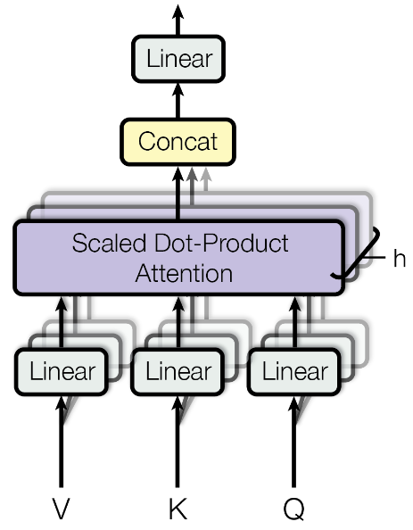

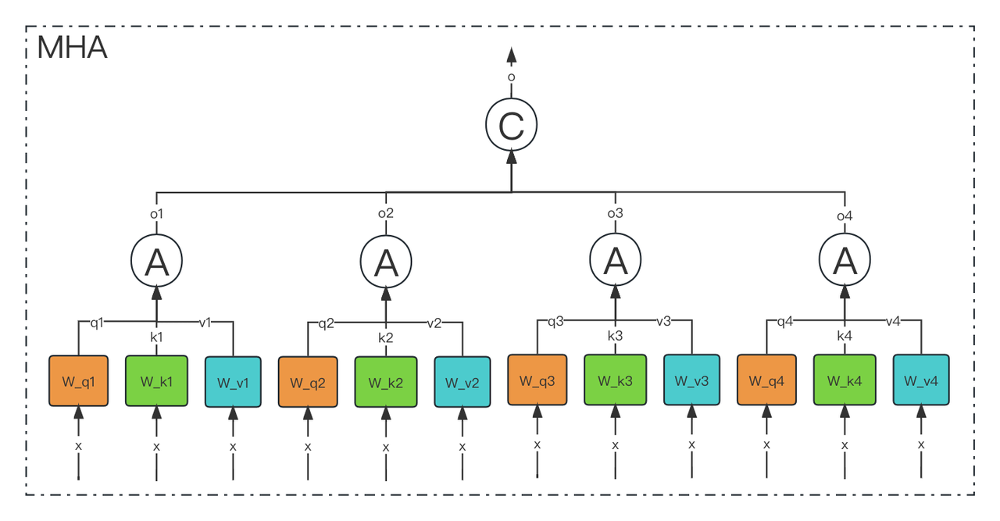

**多头注意力作用**

这种结构设计能**让每个注意力机制去优化每个词汇的不同特征部分**，从而均衡同一种注意力机制可能产生的偏差，让词义拥有来自更多元的表达，实验表明可以从而提升模型效果.

**为什么要做多头注意力机制呢**？

> - 一个 dot product 的注意力里面，没有什么可以学的参数。具体函数就是内积，为了识别不一样的模式，希望有不一样的计算相似度的办法。加性 attention 有一个权重可学，也许能学到一些内容。
> - multi-head attention 给 h 次机会去学习 不一样的投影的方法，使得在投影进去的度量空间里面能够去匹配不同模式需要的一些相似函数，然后把 h 个 heads 拼接起来，最后再做一次投影。
> - 每一个头 hi 是把 Q,K,V 通过 可以学习的 Wq, Wk, Wv 投影到 dv 上，再通过注意力函数，得到 headi

## 2. **MQA**

**MQA（Multi Query Attention）**&#x6700;早是出现在**2019 年谷歌**的一篇论文 **《Fast Transformer Decoding: One Write-Head is All You Need》**

MQA 的思想其实比较简单，MQA 与 MHA 不同的是，**MQA 让所有的头之间共享同一份 Key 和 Value 矩阵，每个头正常的只单独保留了一份 Query 参数，从而大大减少 Key 和 Value 矩阵的参数量**。

> Multi-query attention is identical except that the different heads share a single set of keys and values.

在 Multi-Query Attention 方法中只会保留一个单独的 key-value 头，这样**虽然可以提升推理的速度，但是会带来精度上的损失**。《Multi-Head Attention:Collaborate Instead of Concatenate 》这篇论文的第一个思路是**基于多个 MQA 的 checkpoint 进行 finetuning，来得到了一个质量更高的 MQA 模型**。这个过程也被称为 Uptraining。

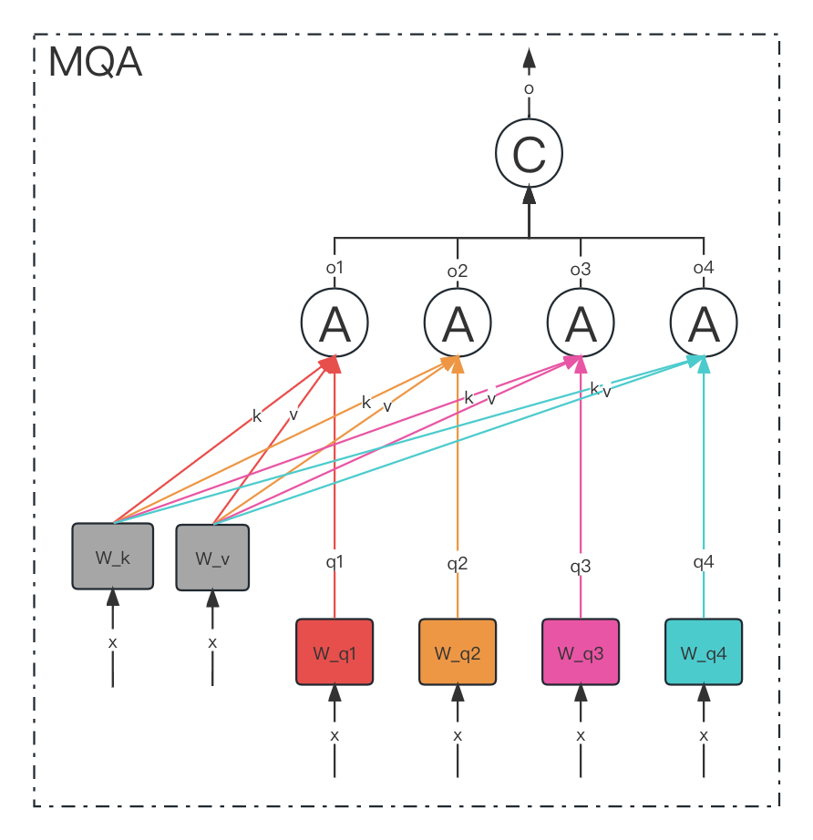

**具体分为两步：**

> - 对多个 **MQA** 的 **checkpoint&#x20;**&#x6587;件进行融合，融合的方法是: **通过对 key 和 value 的 head 头进行 mean pooling 操作，如下图**。
> - 对融合后的模型使用少量数据进行 finetune 训练，重训后的模型大小跟之前一样，但是效果会更好

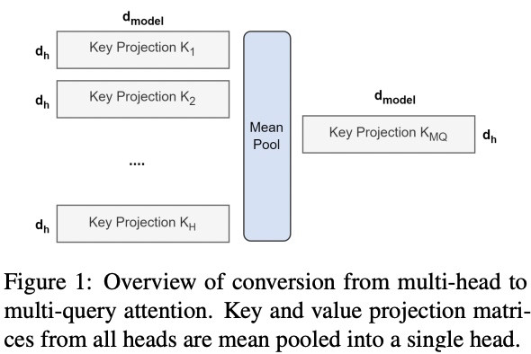

## 3. **GQA**

- 在 **MHA（Multi Head Attention）** 中，每个头有自己单独的 key-value 对；
- 在 **MQA（Multi Query Attention）** 中只会有一组 key-value 对；
- 在 **GQA（Grouped Query Attention）** 中，会对 attention 进行分组操作，query 被分为 N 组，每个组共享一个 Key 和 Value 矩阵。

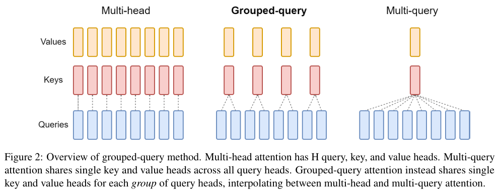

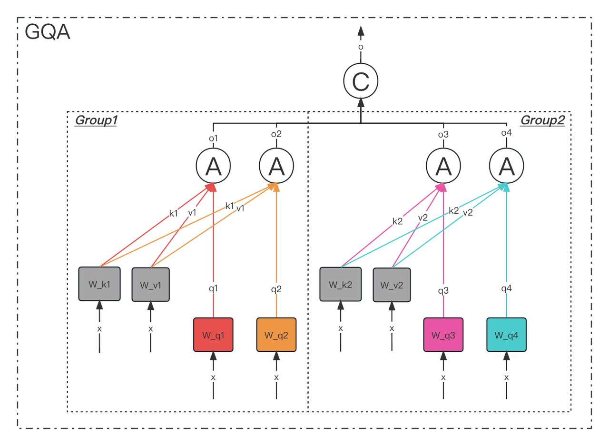

**GQA-N** 是指**具有 N 组的 Grouped Query Attention**

GQA-1 具有单个组，因此具有单个 Key 和 Value，等效于 MQA。而 GQA-H 具有与头数相等的组，等效于 MHA。

在基于 Multi-head 多头结构变为 Grouped-query 分组结构的时候，也是采用跟上图一样的方法，对每一组的 key-value 对进行 mean pool 的操作进行参数融合。**融合后的模型能力更综合，精度比 Multi-query 好，同时速度比 Multi-head 快**。

## 4. **总结**

> - **MHA（Multi-head Attention）**&#x662F;标**准的多头注意力机制，h 个 Query、Key 和 Value 矩阵**。
> - **MQA（Multi-Query Attention）**&#x662F;**多查询注意力的一种变体，也是用于自回归解码的一种注意力机制**。与 MHA 不同的是，**MQA 让所有的头之间共享同一份 Key 和 Value 矩阵，每个头只单独保留了一份 Query 参数，从而大大减少 Key 和 Value 矩阵的参数量**。
> - GQA（Grouped-Query Attention）是分组查询注意力，**GQA 将查询头分成 G 组，每个组共享一个 Key 和 Value 矩阵**。GQA-G 是指具有 G 组的 grouped-query attention。GQA-1 具有单个组，**因此具有单个 Key 和 Value，等效于 MQA。而 GQA-H 具有与头数相等的组，等效于 MHA**
> - GQA 介于 MHA 和 MQA 之间。**GQA 综合 MHA 和 MQA ，既不损失太多性能，又能利用 MQA 的推理加速**。不是所有 Q 头共享一组 KV，而是分组一定头数 Q 共享一组 KV，比如上图中就是两组 Q 共享一组 KV

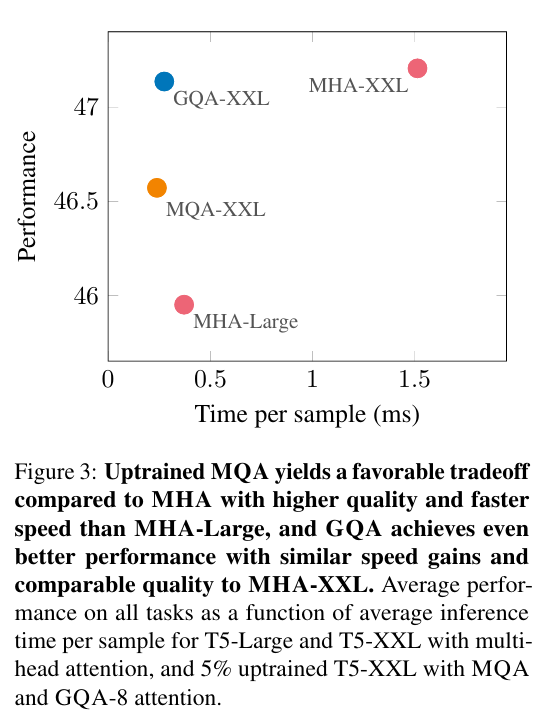

# **`Flash Attention`**

**Flash Attention 的主要目的是加速和节省内存，主要贡献包括：**

- 计算 softmax 时候不需要全量 input 数据，可以分段计算；
- 反向传播的时候，不存储 attention matrix (𝑁2 的矩阵)，而是只存储 softmax 归一化的系数。

## 1. **动机**

> **不同硬件模块之间的带宽和存储空间有明显差异，例如下图中左边的三角图，最顶端的是 GPU 种的 `SRAM`，它的容量非常小但是带宽非常大，以 A100 GPU 为例，它有 108 个流式多核处理器，每个处理器上的片上 SRAM 大小只有 192KB，因此 A100 总共的 SRAM 大小是$192KB\times 108 = 20MB$，但是其吞吐量能高达 19TB/s。而 A100 GPU `HBM`（High Bandwidth Memory 也就是我们常说的 GPU 显存大小）大小在 40GB\~80GB 左右，但是带宽只与 1.5TB/s。**

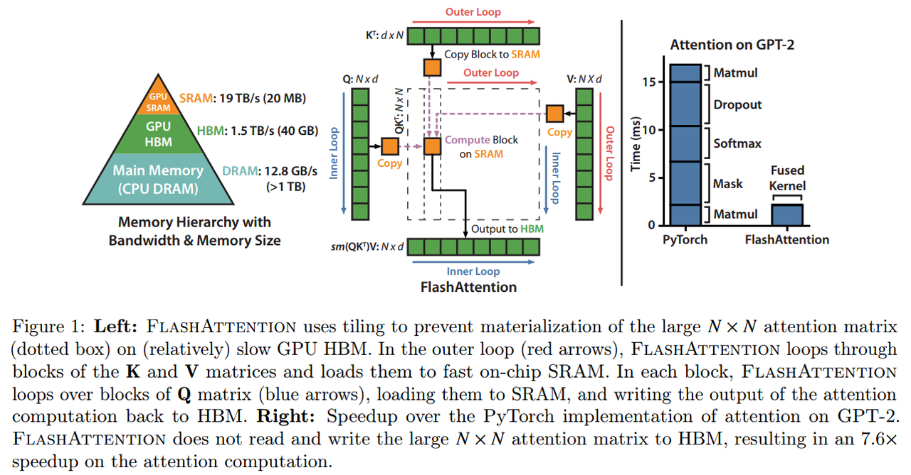

右图给出了标准的注意力机制的实现流程，可以看到因&#x4E3A;**`HBM`**&#x7684;大小更大，**我们平时写 pytorch 代码的时候最常用到的就是 HBM，所以对于 HBM 的读写操作非常频繁，而 SRAM 利用率反而不高**。

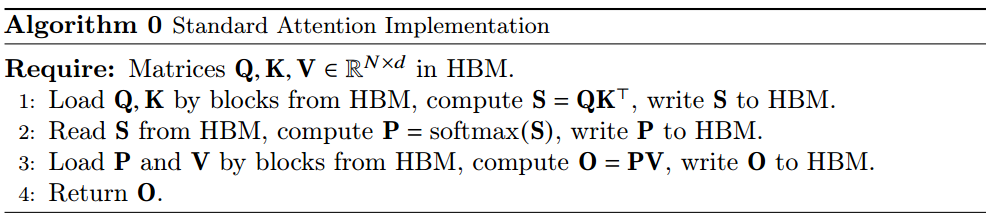

## 2. **Softmax Tiling**

在介绍具体的计算算法前，我们首先需要了解一下 Softmax Tiling。

### 2.1 **数值稳定**

**Softmax**包含指数函数，所以为了避免数值溢出问题，可以将每个元素都减去最大值，如下图示，最后计算结果和原来的 Softmax 是一致的。

$$
m(x):=\max {i} ~ x{i} \ f(x):=\left[\begin{array}{llll}e^{x_{1}-m(x)} & \ldots & e^{x_{B}-m(x)}\end{array}\right] \ \ell(x):=\sum_{i} f(x)_{i} \ \operatorname{softmax}(x):=\frac{f(x)}{\ell(x)}
$$

### 2.2 **分块计算 softmax**

因为 Softmax 都是按行计算的，所以我们考虑一行切分成两部分的情况，即原本的一行数据

$$
x \in \mathbb{R}^{2 B}=\left[x^{(1)}, x^{(2)}\right]
$$

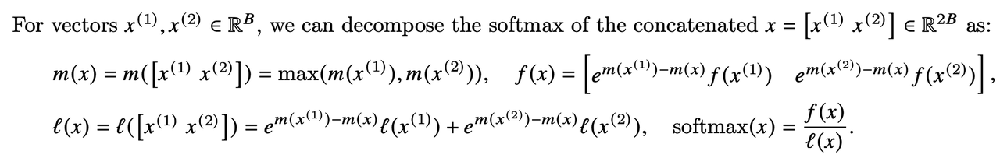

可以看到计算不同块的$f(x)$值时，乘上的系数是不同的，但是最后化简后的结果都是**指数函数**减去了整行的最大值。以

$$
x^{(1)}
$$

为例，$

$$
\begin{aligned} m^{m\left(x^{(1)}\right)-m(x)} f\left(x^{(1)}\right) & =e^{m\left(x^{(1)}\right)-m(x)}\left[e^{x_{1}^{(1)}-m\left(x^{(1)}\right)}, \ldots, e^{x_{B}^{(1)}-m\left(x^{(1)}\right)}\right] \ & =\left[e^{x_{1}^{(1)}-m(x)}, \ldots, e^{x_{B}^{(1)}-m(x)}\right]\end{aligned}
$$

### 2.3 **算法流程**

**FlashAttention 旨在避免从 HBM（High Bandwidth Memory）中读取和写入注意力矩阵，这需要做到**：

> 1. **目标一：**&#x5728;不访问整个输入的情况下计算 softmax 函数的缩减；**将输入分割成块，并在输入块上进行多次传递，从而以增量方式执行 softmax 缩减**。
> 2. **目标二：**&#x5728;后向传播中不能存储中间注意力矩阵。标准 Attention 算法的实现需要将计算过程中的 S、P 写入到 HBM 中，而这些中间矩阵的大小与输入的序列长度有关且为二次型，因此**Flash Attention 就提出了不使用中间注意力矩阵，通过存储归一化因子来减少 HBM 内存的消耗。**

**FlashAttention 算法流程如下图所示：**

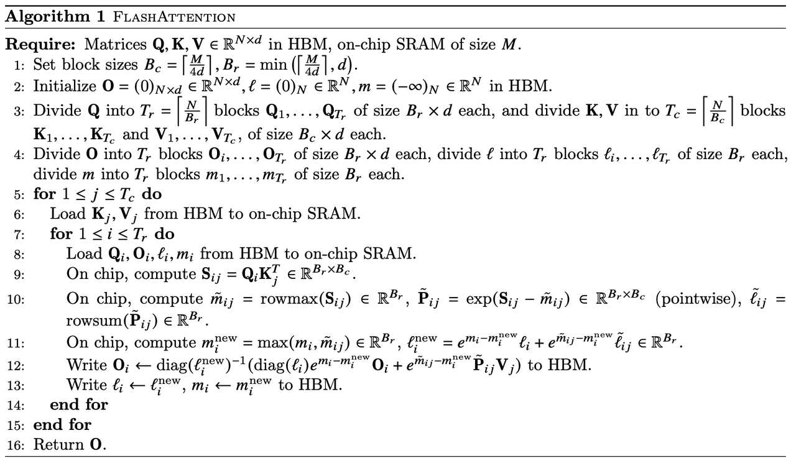

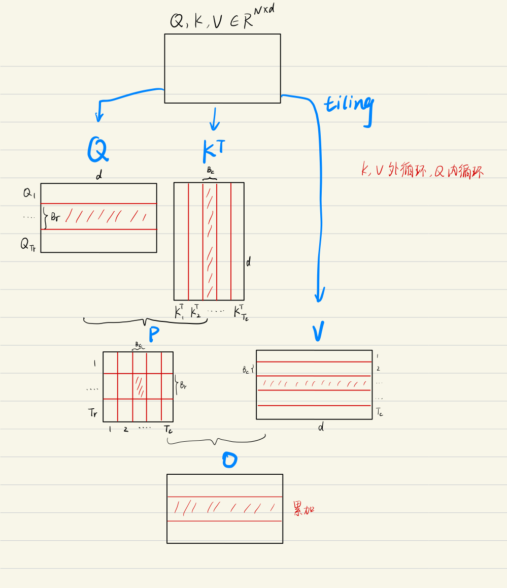

为方便理解，上图&#x5C06;**`FlashAttention`**&#x7684;计算流程可视化出来了，简单理解就是每一次只计算一个 block 的值，通过多轮的双 for 循环完成整个注意力的计算。

# **`Transformer`常见问题**

## 1. **`Transformer`和 `RNN`**

**最简单情况：没有残差连接、没有 layernorm、 attention 单头、没有投影**

**看和 RNN 区别：**

- attention 对输入做一个加权和，加权和 进入 point-wise MLP。（画了多个红色方块 MLP， 是一个权重相同的 MLP）
- point-wise MLP 对 每个输入的点 做计算，得到输出。
- attention 作用：把整个序列里面的信息抓取出来，做一次汇聚 aggregation

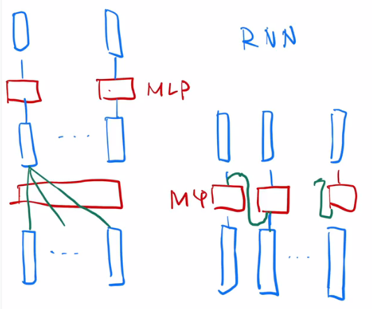

> - RNN 跟 transformer **异：如何传递序列的信**息
>
> RNN 是把上一个时刻的信息输出传入下一个时候做输入。Transformer 通过一个 attention 层，去全局的拿到整个序列里面信息，再用 MLP 做语义的转换。
>
> - RNN 跟 transformer **同：语义空间的转换 + 关注点**
>
> 用一个线性层 or 一个 MLP 来做语义空间的转换。
>
> - **关注点**：怎么有效的去使用序列的信息。

## 2. **一些细节**

### **Transformer 为何使用多头注意力机制？**（为什么不使用一个头）

- 多头保证了 transformer 可以注意到不同子空间的信息，捕捉到更加丰富的特征信息。可以类比 CNN 中同时使用**多个滤波器**的作用，直观上讲，多头的注意力**有助于网络捕捉到更丰富的特征/信息。**

### **Transformer 为什么 Q 和 K 使用不同的权重矩阵生成，为何不能使用同一个值进行自身的点乘？** （注意和第一个问题的区别）

- 使用 Q/K/V 不相同可以保证在不同空间进行投影，增强了表达能力，提高了泛化能力。
- 同时，由 softmax 函数的性质决定，实质做的是一个 soft 版本的 arg max 操作，得到的向量接近一个 one-hot 向量（接近程度根据这组数的数量级有所不同）。如果令 Q=K，那么得到的模型大概率会得到一个类似单位矩阵的 attention 矩阵，**这样 self-attention 就退化成一个 point-wise 线性映射**。这样至少是违反了设计的初衷。

### **Transformer 计算 attention 的时候为何选择点乘而不是加法？两者计算复杂度和效果上有什么区别？**

- K 和 Q 的点乘是为了得到一个 attention score 矩阵，用来对 V 进行提纯。K 和 Q 使用了不同的 W_k, W_Q 来计算，可以理解为是在不同空间上的投影。正因为有了这种不同空间的投影，增加了表达能力，这样计算得到的 attention score 矩阵的泛化能力更高。
- 为了计算更快。矩阵加法在加法这一块的计算量确实简单，但是作为一个整体计算 attention 的时候相当于一个隐层，整体计算量和点积相似。在效果上来说，从实验分析，两者的效果和 dk 相关，dk 越大，加法的效果越显著。

### **为什么在进行 softmax 之前需要对 attention 进行 scaled（为什么除以 dk 的平方根）**，并使用公式推导进行讲解

- 这取决于 softmax 函数的特性，如果 softmax 内计算的数数量级太大，会输出近似 one-hot 编码的形式，导致梯度消失的问题，所以需要 scale
- 那么至于为什么需要用维度开根号，假设向量 q，k 满足各分量独立同分布，均值为 0，方差为 1，那么 qk 点积均值为 0，方差为 dk，从统计学计算，若果让 qk 点积的方差控制在 1，需要将其除以 dk 的平方根，是的 softmax 更加平滑

### **为什么在进行多头注意力的时候需要对每个 head 进行降维？**（可以参考上面一个问题）

- 将原有的**高维空间转化为多个低维空间**并再最后进行拼接，形成同样维度的输出，借此丰富特性信息

  - 基本结构：Embedding + Position Embedding，Self-Attention，Add + LN，FN，Add + LN

### **为何在获取输入词向量之后需要对矩阵乘以 embedding size 的开方？意义是什么？**

- embedding matrix 的初始化方式是 xavier init，这种方式的方差是 1/embedding size，因此乘以 embedding size 的开方使得 embedding matrix 的方差是 1，在这个 scale 下可能更有利于 embedding matrix 的收敛。

### **简单介绍一下 Transformer 的位置编码？有什么意义和优缺点？**

- 因为 self-attention 是位置无关的，无论句子的顺序是什么样的，通过 self-attention 计算的 token 的 hidden embedding 都是一样的，这显然不符合人类的思维。因此要有一个办法能够在模型中表达出一个 token 的位置信息，transformer 使用了固定的 positional encoding 来表示 token 在句子中的绝对位置信息。

### **你还了解哪些关于位置编码的技术，各自的优缺点是什么？**

- 相对位置编码（RPE）1.在计算 attention score 和 weighted value 时各加入一个可训练的表示相对位置的参数。2.在生成多头注意力时，把对 key 来说将绝对位置转换为相对 query 的位置 3.复数域函数，已知一个词在某个位置的词向量表示，可以计算出它在任何位置的词向量表示。前两个方法是词向量+位置编码，属于亡羊补牢，复数域是生成词向量的时候即生成对应的位置信息。

### **简单讲一下 Transformer 中的残差结构以及意义。**

- 就是 ResNet 的优点，解决梯度消失

### **为什么 transformer 块使用 LayerNorm 而不是 BatchNorm？LayerNorm 在 Transformer 的位置是哪里？**

- LN：针对每个样本序列进行 Norm，没有样本间的依赖。对一个序列的不同特征维度进行 Norm
- CV 使用 BN 是认为 channel 维度的信息对 cv 方面有重要意义，如果对 channel 维度也归一化会造成不同通道信息一定的损失。而同理 nlp 领域认为句子长度不一致，并且各个 batch 的信息没什么关系，因此只考虑句子内信息的归一化，也就是 LN。

### **简单讲一下 BatchNorm 技术，以及它的优缺点。**

- 优点：

  - 第一个就是可以解决内部协变量偏移，简单来说训练过程中，各层分布不同，增大了学习难度，BN 缓解了这个问题。当然后来也有论文证明 BN 有作用和这个没关系，而是可以使**损失平面更加的平滑**，从而加快的收敛速度。
  - 第二个优点就是缓解了**梯度饱和问题**（如果使用 sigmoid 激活函数的话），加快收敛。
- 缺点：

  - 第一个，batch_size 较小的时候，效果差。这一点很容易理解。BN 的过程，使用 整个 batch 中样本的均值和方差来模拟全部数据的均值和方差，在 batch_size 较小的时候，效果肯定不好。
  - 第二个缺点就是 BN 在 RNN 中效果比较差。

### **简单描述一下 Transformer 中的前馈神经网络？使用了什么激活函数？相关优缺点？**

- ReLU

$$
FFN(x)=max(0,~ xW_1+b_1)W_2+b_2
$$

### **Encoder 端和 Decoder 端是如何进行交互的？**（在这里可以问一下关于 seq2seq 的 attention 知识）

- Cross Self-Attention，Decoder 提供 Q，Encoder 提供 K，V

### **Decoder 阶段的多头自注意力和 encoder 的多头自注意力有什么区别？**（为什么需要 decoder 自注意力需要进行 sequence mask)

- 让输入序列只看到过去的信息，不能让他看到未来的信息

### **Transformer 的并行化体现在哪个地方？Decoder 端可以做并行化吗？**

- Encoder 侧：模块之间是串行的，一个模块计算的结果做为下一个模块的输入，互相之前有依赖关系。从每个模块的角度来说，注意力层和前馈神经层这两个子模块单独来看都是可以并行的，不同单词之间是没有依赖关系的。
- Decode 引入 sequence mask 就是为了并行化训练，Decoder 推理过程没有并行，只能一个一个的解码，很类似于 RNN，这个时刻的输入依赖于上一个时刻的输出。

### **简单描述一下 wordpiece model 和 byte pair encoding，有实际应用过吗？**

- 传统词表示方法无法很好的处理未知或罕见的词汇（OOV 问题），传统词 tokenization 方法不利于模型学习词缀之间的关系”
- BPE（字节对编码）或二元编码是一种简单的数据压缩形式，其中最常见的一对连续字节数据被替换为该数据中不存在的字节。后期使用时需要一个替换表来重建原始数据。
- 优点：可以有效地平衡词汇表大小和步数（编码句子所需的 token 次数）。
- 缺点：基于贪婪和确定的符号替换，不能提供带概率的多个分片结果。

### **Transformer 训练的时候学习率是如何设定的？Dropout 是如何设定的，位置在哪里？Dropout 在测试的需要有什么需要注意的吗？**

- Dropout 测试的时候记得对输入整体呈上 dropout 的比率

### **引申一个关于 bert 问题，bert 的 mask 为何不学习 transformer 在 attention 处进行屏蔽 score 的技巧？**

- BERT 和 transformer 的目标不一致，bert 是语言的预训练模型，需要充分考虑上下文的关系，而 transformer 主要考虑句子中第 i 个元素与前 i-1 个元素的关系。
