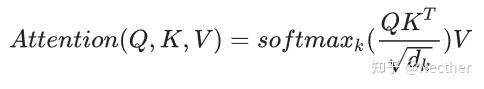

    询问一个新东西：这个本质是什么（一个技术，一个架构，一个向量）位于模型或网络的哪一层，他的输入输出是什么，能否训练，怎么训练，什么东西会用他，用他来解决什么问题

一个概念：先简单两句话总结，再介绍相关概念，并对概念做出扩展，以及这些东西用在哪里，为了防止或改善什么，最后再次总结核心要点，并举个生活中的例子

一个创新：这东西是什么，干什么的，基于什么创新，哪里有改进，改进后和改进前的变化，解决或缓解了什么问题，其核心思想和原理是什么，为什么会有这样的效果，这种改进的原理在其他模型或架构有没有使用或类似的地方

## python 写题思路方向

华为 choice02：问一共有几种可能，并且计算量不是很大，那就算出每个结果，再 set 去重后返回。

华为 choice03：一个东西对应多个量，然后有顺序，考虑字典，具体排序方法使用 sorted(dict.items(),key = lambda x: ……)

choice07：旅行商问题，使用 from itertools import permutations，利用全排列得到所有路径然后判断最短路径

08：最长公共子串，用动态规划，得到长度，长度的末尾用一个 end 记录，那么最后直到最长距离和结束位置，就能用 end 控制字符串输出。

11:采用递归

12:对 list 直接取 set 会丢失重复元素，注意看题目能不能取

17:一个 dfs 的好题，利用 dfs 返回的东西直接计算

22.数组中心位置，直接返回中位数的位置即可

看到"时间限制+资源限制+优化目标" → 想到贪心+优先队列

# 总体模型分析

因为东西太多了，新开一个专题写一些真题，这里面会问的比较细一点，还没想好怎么标注。

首先，大模型是个接近于黑箱的东西，人类很难分析清楚这东西完整的工作原理

模型方面，最根本的目标都是**提高效果**，以及尽量**不增加过多计算量**

**提高效果（增加建模能力）**：

1. 增加数据量，多利用一些特征，这样一来，模型自然可以学到更多的信息，从而提高模型的效果，利用一些被隐藏或者被忽视的特征
2. 避免信息冗余：有时候多的冗余信息会造成干扰（并不绝对），或者本身就是无效信息（比如需要不一样的信息，但是给了一样的信息）
3. 提高泛化能力，接受的信息要多种多样，能处理不同的情况，和第一条有点像，利用了不同的特征自然能提高模型的泛化能力
4. 不同方法的选择：从计算方便和性能入手
5. 控制参数范围：对参数进行缩放，可以让模型更加稳定，避免方差过大，方差大了则数据离散，会影响模型稳定性，收敛速度等
6. 避免无关噪声：为了避免无意义运算，常用方法是 Mask 一些输入，让模型忽略这些位置
7. 增加建模能力，并行计算，往往是相关的，比如使用多头和降维都是为了实现这个目的。
8. 增加容错性，提高稳定性，避免完全依赖某个值，要的是美美与共和而不同，不要独裁，多个模块协同工作时有可能。
9. Transformer 需要额外考虑一下上下文信息。
10. 缓解梯度消失
11. 促进特征复用
12. 

**加快计算：**

1. 并行计算
2. 降维，因为降维会减少计算量，维度降低，高维空间里被浪费的信息不存在了，都剩下有用信息，而且可以并行。
3. 

**为什么先是这层，然后是那层：**

1. 因为后面的层要使用前面层的信息。比如 Transformer 中 Encoder 的多头自注意力和 FFN。

---

## 深度学习方面

1. softmax 如何防止指数上溢

指数上溢会被存为无穷大，从而影响后续的计算，Softmax 通过减去输入向量中的最大值（称为“最大值平移”）来防止指数上溢。这一操作在不改变计算结果的前提下，将指数运算的输入范围限制在零或负数，从而避免产生过大而溢出的指数值。

平移后的最大值被归一化为 1，其他值按比例缩小，按理说这样可能有下溢风险，但实际中分母不为零，这个概率也仍然有效，框架也会对这个现象优化。

- **核心问题** ：Softmax 函数中的指数运算 $e^{z_i}$ 在 $z_i$ 很大时会产生极大的值，超出计算机的数值表示范围，导致 **上溢** ，结果为 `inf`或 `nan`。
- **核心解决方案** ：使用 **最大值平移技巧** ，即从所有输入中减去其最大值 $m$（$z_i \rightarrow z_i - m$）。这是一个 **数学上的等价变换** ，不会改变 Softmax 的输出结果。
- **为何有效** ：平移后将最大的指数项 $e^{m-m}$ 限制为 1，所有其他指数项都小于 1，从而 **彻底消除了指数项上溢的可能性** ，同时也在一定程度上改善了数值精度和下溢问题。
- **普遍应用** ：这是所有稳健的 Softmax 实现的 **标准做法** ，被集成在现代深度学习框架中，用户通常无需手动实现。

**上溢** ： 当计算的数值超过计算机数据类型所能表示的最大值时发生。对于 `float32`，最大值约为 $3.4 \times 10^{38}$。如果 $e^{z_i}$ 的结果大于这个值，它会被存储为 `inf`（无穷大），导致后续计算失效（如 `inf / inf = nan`）。

**下溢** ： 当计算的数值小于计算机数据类型所能表示的最小正值时发生。对于 `float32`，最小值约为 $1.2 \times 10^{-38}$。如果 $e^{z_i}$ 的结果小于这个值，它会被存储为 `0`。这虽然不会直接导致报错，但可能导致除法结果为 0 或后续取对数时得到 `-inf`。

2. **[Transformer](https://zhida.zhihu.com/search?content_id=236362854&content_type=Article&match_order=1&q=Transformer&zhida_source=entity)中的 positional encoding**

positional encoding 位置编码（PE)是一种为 Transformer 模型注入序列顺序信息的机制，是一种绝对性的位置编码，用的是正弦余弦位置编码（直接通过公式得到）

位置编码在最底层，在词嵌入（Word Embedding）之后，立即将位置编码与词嵌入向量相加，然后将这个合并后的向量送入第一层 Encoder 或 Decoder 中进行处理。

因为自注意力只是计算 token 的关注度，（其具有置换不变形），而自然语言是有顺序的，PE 负责为模型提供这个顺序，让其他的多头自注意力可以感知到序列顺序。、

**`输入嵌入 -> 与位置编码相加 -> 进入一个由N层组成的Encoder栈 -> (每个Encoder层包含：层归一化 + 多头自注意力 + 残差连接 -> 层归一化 + FFN前馈网络 + 残差连接) -> Encoder输出`**

多头自注意力：让序列中的每个词元都“查看”序列中的所有其他词元，并根据相关性加权汇总信息。它学习的是 **token 之间的上下文依赖关系** 。

FFN：可以理解为在每个位置应用同一个小型神经网络，用于 **提炼和增强特征** 。

3. **求似然函数步骤**

求似然函数的步骤核心是：首先，根据假设的概率分布模型，写出整个样本集出现的联合概率（或概率密度）；然后，将这个联合概率视为关于模型参数的函数，即得似然函数。其目的是找到能使当前观测样本出现概率最大的参数值。

似然函数是一种关于统计模型参数的函数。它表示在给定参数下，观察到当前样本数据的可能性。通常用 $L(\theta | x)$ 表示，其中 $\theta$ 是模型参数，$x$ 是观测到的数据。——最大似然估计，就是寻找最有可能产生当前观测数据的参数值。

4. **HMM 和 CRF 区别**
   **隐马尔科夫模型和条件随机场**

联合概率 P(X, Y):考虑 X 和 Y 同时发现的概率

- 它考虑的是**所有可能组合**的出现概率。
- **思维过程** ：遍历所有可能的(X, Y)对，找出其中概率最大的那一对。

条件概率 P(Y|X)：已经观测到 X，在 X 存在的条件下，Y 最有可能是什么

- **思维过程** ：世界已经固定（X 已确定），只需要在 Y 的空间里寻找最优解。

HMM 是 **生成式模型** ，对联合概率 P(X, Y)进行建模，认为系统是一个马尔可夫过程，但存在一个隐藏的、不可见的状态序列（如词性），这个状态序列会以一定的概率生成一个可见的观测序列（如单词）。

CRF 是 **判别式模型** ，直接定义在观测序列 X 条件下，整个状态序列 Y 的**条件概率** P(Y|X) 的模型。它是一种无向图模型，直接对条件概率 P(Y|X)进行建模，它打破了观测独立的假设，可以容纳任意复杂的上下文特征，建模能力更强、更灵活。

HMM 是概率有向图，CRF 是概率无向图，不能认为条件概率就是有向图，而联合概率就是无向图，因为其用处会影响其内在用法。

HMM 求解过程很依赖前一个状态和当前单词，求解的可能是局部最优；CRF**利用整个序列的全局上下文信息进行决策**是全局最优

7. 空洞卷积实现

6. **训练过程中发现 loss 快速增大应该从哪些方面考虑?**

学习率是否过大，导致收敛越过最优点，然后发散

梯度方向反了，应该是参数 = 参数 - 学习率 \* 梯度

有坏数据，未归一化，编码错误等

模型结构问题，激活函数使用不当

7. **Pytorch 和 TensorFlow 区别**

图是计算图，节点代表操作或变量，边代表数据（tensor）

动态图的优势是灵活易调试，而静态图通常运行效率更高

图生成: pytorch 动态图, tensorflow 早期是静态图,但 2.0 以后默认支持动态图，如今二者功能趋于同质化。
设备管理： pytorch cuda, tensorflow 自动化

8. **model.eval vs 和 torch.no_grad 区别**

- model.eval: 依然计算梯度，但是不反传；dropout 层保留概率为 1；batchnorm 层使用全局的 mean 和 var
- with torch.no_grad: 不计算梯度

9. 每个卷积层的 FLOPS 计算

对于输出的宽和高：

总体计算公式：

$FLOPs = (2 × K × K × C_{in}) × (C_{out} × H_{out} × W_{out})$

10. PCA 主成分分析

一种无监督线性降维方法，通过**最大化投影方差**找到数据中最主要的方面，用最主要的方面来代替原始数据。

对数据的**协方差矩阵**进行**特征值分解**或对数据矩阵进行 **SVD** ，取最大特征值对应的特征向量作为投影方向（主成分）。

**主要用途** ： **可视化** 、 **去噪** 、**压缩数据**以加速后续计算、 **消除多重共线性** 。

PCA 是一种无监督的线性降维技术，其核心思想是通过线性投影，将高维数据映射到低维空间中，并确保降维后的数据能最大程度地保留原始数据的变异信息（方差）。它通过计算数据协方差矩阵的特征向量（主成分）来实现这一目标，将数据转换到以主成分方向为坐标轴的新坐标系中。

流程：基于特征值分解协方差矩阵和基于奇异值分解 SVD 分解协方差矩阵。
（1）对所有样本进行中心化
（2）计算样本的协方差矩阵 XX^T
（3）对协方差矩阵进行特征值分解
（4）取出最大的 n'个特征值对应的特征向量，将所有特征向量标准化，组成特征向量矩阵 W
（5）对样本集中的每一个样本 x^(i)转化为新的样本 z^(i)=W^T x^(i)，即将每个原数据样本投影到特征向量组成的空间上
（6）得到输出的样本集 z^(1)、z^(2)...

11. **K-means 如何改进**

K-means 是无监督聚类算法，先随机指定 k 个质心，将不同的数据归到一个质心上，然后拿重新计算新的质心，直到质心为止不再变化。

当前 K-mean 是最主要的缺点是：

- k 个初始化的质心对最后的聚类效果有很大影响
- 对离群点和孤立点敏感
- K 值人为设定

**[K-means++](https://zhida.zhihu.com/search?content_id=236362854&content_type=Article&match_order=1&q=K-means%2B%2B&zhida_source=entity)** ：从数据集随机选择一个点作为第一个聚类中心，对于数据集中每一个点计算和该中心的距离，选择下一个聚类中心，优先选择和上一个聚类中心距离较大的点。重复上述过程，得到 k 个聚类中心。

**ISODATA** ，又称为迭代自组织数据分析法，是为了解决 K 值需要人为设定的问题。核心思想：当属于某个类别的样本数过少时或者类别之间靠得非常近就将该类别去除；当属于某个类别的样本数过多时，把这个类别分为两个子类别。

12. **Dropout 实现，其能否和 BatchNorm 一起用**

有概率 P 让神经元失活，也就是让其激活函数的输出值为 0，所以会改变方差，方差衡量的是数据的偏移程度。

可以一起用，但是只能将 Dropout 放在 Batch norm 之后使用。因为 Dropout 训练时会改变输入 X 的方差，从而影响 Batch norm 训练过程中统计的滑动方差值；而测试时没有 Dropout，输入 X 的方差和训练时不一致，这就导致 Batch norm 测试时期望的方差和训练时统计的有偏差。

**12.5 BatchNorm**

针对的是输入数据或隐藏层的激活值，让数据分布更集中，（减小方差），针对的不是模型权重，

BatchNorm 对每个批次（batch）中的数据按特征通道（channel）独立执行：

**标准化：使数据分布均值为 0，方差为 1（即标准化为标准正态分布）**

**缩放平移：** **引入通过两个可训练的参数 γ（缩放因子）和 β（平移因子）对标准化后的数据进行调整，允许模型恢复原始数据的表达能力（如果标准化有害，可通过学习 γ≈σ、β≈μ 抵消标准化）。**

- BatchNorm 的目标是标准化输入数据的分布（使其均值为 0，方差为 1），从而缓解内部协变量偏移（Internal Covariate Shift），加速训练收敛。

  **常见位置** ：

  **全连接层后** ：

  在全连接层的输出后应用 BatchNorm（如 `Linear → BatchNorm → ReLU`）。
- **卷积层后** ：

  - 在卷积层的输出后应用（如 `Conv → BatchNorm → ReLU`），此时标准化是按通道（channel）进行的。
- **激活函数前** ：

  - 传统做法：`Linear/Conv → BatchNorm → Activation`（更常见）。
  - 激活函数后也能用，但是很少，可能影响非线性效果。

13. **梯度消失和我读爆炸**

**梯度消失的原因和解决办法**

（1）隐藏层的层数过多

反向传播求梯度时的链式求导法则，某部分梯度小于 1，则多层连乘后出现梯度消失

（2）采用了不合适的激活函数

如 sigmoid 函数的最大梯度为 1/4，这意味着隐藏层每一层的梯度均小于 1（权值小于 1 时），出现梯度消失。

解决方法：1、relu 激活函数，使导数衡为 1 ；2、batch norm ；3、残差结构

梯度爆炸的原因和解决办法

（1）隐藏层的层数过多，某部分梯度大于 1，则多层连乘后，梯度呈指数增长，产生梯度爆炸。

（2）权重初始值太大，求导时会乘上权重

解决方法：1、梯度裁剪； 2、权重 L1/L2 正则化； 3、残差结构 ；4、batch norm

14. depth-wise separable conv (深度可分离卷积)

标准卷积的**滤波**就是逐元素相乘再求和，随后再**通道组合**形成新的通道。

而深度可分离卷积：

1. **解耦思想** ：将标准卷积的**滤波**和**通道组合**两大功能分离，由深度卷积和逐点卷积分别高效完成。
2. **极致高效** ：核心目标是 **大幅降低计算复杂度和参数量** ，通常是标准卷积的 `1/8` 到 `1/9`。
3. **性能权衡** ：用轻微的性能（精度）损失，换取巨大的效率提升，非常适合轻量级模型。

常规卷积：

深度可分离卷积：

## Transformer 方面

用户的自然语言输入先根据词表来对应成一个数字，词表是模型训练的一部分（映射字典或查找表）在训练前就固定了，不可学习。假设是（50000 个）

然后把根据词表对应的张量传送给词嵌入矩阵，（假设是 50000 个 512 维向量），一个词序号对应一个向量，这个词嵌入矩阵是**学习**出来的，是存在模型的核心参数，这个转换就叫**词嵌入。**

嵌入完成后，再计算**位置编码**（与词嵌入无关，位置编码是独立的），用词嵌入向量再加上位置信息，将这个新的**向量矩阵**送给第一个 encoder 层了。

一个 Encoder 层主要由两个核心子层构成：**多头自注意力和 FFN**（前馈神经网络），每个子层都使用了**残差连接（Residual Connection）** 和**层归一化（Layer Normalization）** 来稳定训练。

Encoder（编码器）：处理输入序列，每个位置都能看到整个输入序列（包括左右上下文），所以是双向的。

Decoder（解码器）：用于生成输出序列（如翻译），为了防止“偷看未来”，使用了掩码自注意力（masked self-attention），即每个位置只能看到自己和之前的位置，不能看到未来的位置 → 单向。——更确切的来说，这个是 Decoder 第一层掩码注意力的作用（qkv 全来自上一层 Decoder 的输出，第一个 Decoder 的 qkv 来目标序列加入位置编码后的输入），其还有第二层注意力机制，是交叉注意力，kv 来自源语言，也就是 encoder，q 则来自上一层 Decoder 的输出。

也就是说，encoder 和 Decoder 的通信只发生在 Decoder 的交叉注意力上。

FFN 是一个简单的两层全连接网络，通常中间有一个激活函数（如 ReLU 或 GELU）。它在每个位置（每个 Token 上）**独立地**进行运算。

$FFN(x) = max(0, xW_1 + b_1)W_2 + b_2$

标准 FFN（有时称为 MLP）存在参数量大、计算成本高的问题。许多新论文提出了更高效的替代方案，符合下面特点的都能叫 MLP

- MLP 是一种经典的神经网络结构，由**至少一个输入层、一个输出层以及一个或多个隐藏层**组成，其中每个层都是 **全连接层（Dense 或 Linear Layer）** 。
- **关键特性** ：层与层之间通常使用 **非线性激活函数** （如 Sigmoid, Tanh, ReLU）进行连接，这使得 MLP 能够学习并模拟复杂的非线性关系。

1. Transformer 为何使用多头注意力机制？（为什么不使用一个头）
   ——为了在不减少运算速度时提高性能。

   多头注意力指的是使用多个头来并行计算注意力，而不是使用单个头。不同的头可以捕捉不同的依赖关系和特征，更好捕捉信息间的关联，多头注意力也是为了提高性能。而且计算时间

   这里的头指的是一个独立的注意力计算单元，每个头是独立的，但最终会合并结果，让模型同时掌握多种关联模式。

   至于计算量问题，维度拆分抵消了头数增加，以前单头，但是信息冗杂，计算量同样不小，现在并行加维度拆分，计算量并不会增加。

   进一步来说，计算量主要来自$QK^T$点积对和最后的加权求和，模型的维度是$d$,序列长度是$n$，则$QK^T$的计算量为$O(n^2d)$，单头计算会降低维度 d

   - ：：不同的头有不同的作用，协同工作，一个头的输出可能是下一层注意力头的输入
   - 一个注意力头可能像我们上面讨论的那样，将代词与名词匹配。
   - 一个注意力头可能用于解决像“bank”这样的同音异义词的意义。
   - 第三个注意力头可能将两个词的短语如“Joe Biden”连接在一起。
2. Transformer 为什么 Q 和 K 使用不同的权重矩阵生成，为何不能使用同一个值进行自身的点乘？——**避免信息冗余、提升模型泛化能力、解决输入输出长度不一致问题**

   如果使用相同权重，则 Q 和 K 一样，$Score = QK^T = KK^T$，这是个对称矩阵，意味着“位置 A 对位置 B 的关注度” = “位置 B 对位置 A 的关注度”，但现实中这种对称关系很少成立。另外也很好理解，多了一组权重矩阵，模型自然能学到更多的信息和特征表示。

   对于句子长短问题，Q 和 K 使用相同权重矩阵会让模型无法正确匹配编码器和解码器的信息，且二者本身功能定位存在本质差异

   Q 是提问，K 是标签，Q 和 K 的独立性是 Transformer 强大的关键之一，它让模型能够像“智能问答系统”一样，精准匹配“问题”和“答案”，而非盲目对称关联。
3. Transformer 计算 attention 的时候为何选择点乘而不是加法？两者计算复杂度和效果上有什么区别？

   K 和 Q 的点乘是为了得到一个 attention score 矩阵，用来对 V 进行提纯。K 和 Q 使用了不同的$W_k, W_Q$来计算，可以理解为是在不同空间上的投影。正因为有了这种不同空间的投影，增加了表达能力，这样计算得到的 attention score 矩阵的泛化能力更高。

   加法是多层投影，慢，而点乘是矩阵乘法，相对更快，并且额外参数少，而且点乘效果好，内积天然衡量向量间的相似性
4. **为什么在进行 softmax 之前需要对 attention 进行 scaled（为什么除以 dk 的平方根），并使用公式推导进行讲解**

   在 Transformer 的缩放点乘注意力（Scaled Dot-product Attention）中，在 softmax 之前对点乘结果除以根号下 dk (根号下 dk 是键向量 K 的维度)，的核心目的是**控制点乘分数的方差，防止梯度消失或爆炸**，从而稳定训练过程。

   

   点乘分数太大了范围就会大，导致波动过大，不同取值的差值大，通过除 dk 的平方根能有效缩放，稳定梯度，没有这个可能会波动太大，从而不收敛（原论文写的）
5. **在计算 attention score 的时候如何对 padding 做 mask 操作？**

   在计算注意力分数（Attention Score）时，对 Padding（填充符）进行 Mask 操作的目的是让模型忽略填充位置，避免无意义的计算。

   - 未 Mask 时：Padding 位置可能被分配到微小的注意力权重（如 0.01），干扰模型。
   - Mask 后：Padding 位置的权重强制为 0，模型仅聚焦有效词。
6. **为什么在进行多头注意力的时候需要对每个 head 进行降维？**

   对每个头（head）进行降维的核心目的是通过“分而治之”的策略，在保持总参数量的前提下，显著提升模型的表达能力和计算效率。
   这个降维就是多头的前提，假如是八个头，原始的是(512,512),降维降成 8 个（512。64），然后才是每个头有自己的 qkv 开始计算，也就构成了多头注意力——所以，降维就是为了实现多头注意力。

   因为所有信息都在一个空间中，难以捕捉不同方向的复杂模式(感觉和使用多头注意力机制有点像，如果只用一个头，也是用一个头获得所有信息的依赖关系，效果不好。)而降维了就是离散化信息，可以捕捉不同关系，并且高维空间会有稀疏性，存在大量的 0，降维后本就降低计算量，外加可以并行.

   通过降维和多头设计，Transformer 在几乎不增加参数量的情况下，大幅提升了模型对复杂语言模式的建模能力。
7. **大概讲一下 Transformer 的 Encoder 模块？**

   “编码”（Encoding）的核心目的是**将输入的原始序列（如文本、音频等）转换为富含上下文信息的连续向量表示**，使模型能够理解序列中元素的语义、语法和位置关系，从而支持后续的任务。编码后的信息不止单个符号的信息还有其在序列上下文中的位置信息和与上下文的关联，这个操作在编码器中完成。

   Transformer 的 Encoder 模块是模型的核心部分，负责将输入序列编码为包含上下文信息的隐层表示。其设计通过自注意力机制（Self-Attention）和残差连接（Residual Connection），实现了对长距离依赖的高效建模。

   Encoder 模块由多个编码器层（Sub-Layer）组成，往往是 6 个，每个编码器层主要包括两个子层:

**多头自注意力层（Multi-Head Self-Attention）：** 动态地聚合所有词的信息 ，生成一个新的、**融合了全局上下文信息的向量表示**
每个头都有三组不同的可学习矩阵，$W_Q^i， W_K^i， W_V^i$，将输入向量 X 分别投影成 **查询（Query）** 、 **键（Key）** 、**值（Value）** 三个向量。——注，X 是完整的输入经过处理后的矩阵。

$Q = X * W_Q^i$，**寻求信息** 。它代表当前某个位置（例如句子中的某个词）想要关注其他部分（包括自己）的“意愿”或“需求”。

$K = X * W_K^i$，**被检索的索引** 。它代表每个位置（词元）所“拥有”的信息的标签或摘要。当 Query 来寻求信息时，Key 负责与 Query 进行匹配，判断自己是否相关。

$V = X * W_V^i$，**提供实际的价值信息** 。它是最聚合和输出的原始信息。注意力权重（由 Q 和 K 计算得出）决定了从每个 Value 中提取多少信息。

$Score = QK^T / sqrt(d_k)$，**计算注意力分数** 。两个向量的点积越大，说明两个向量越相关。缩放是为了防止点积过大，从而 Softmax 梯度消失。缩放后的注意力分数会重新变为均值为 0、方差为 1 的分布。

$d_k = d_{model} / h$，$h$ 为头数，$d_{model}$ 为模型维度。

**梯度消失解释如下：**

$Weight = softmax(Score)$，**计算注意力权重** （和为 1）。注意力权重是通过 Softmax 函数计算得到的，它代表了每个词对当前词的注意力分数的贡献度。

$head_i = Weight * V$，**将注意力权重作用到 Value 上** 。将注意力权重作用到 Value 上，得到的 $head_i$ 指的是第 i 个注意力头的输出。

单个头的输出:$Head_i = Attention(Q_i, K_i, V_i) = softmax(Q_i * K_i^T / √d_k) * V_i$

$Z = Concat(Head_1, Head_2, ..., Head_h) * W_O$，Z 它是由所有注意力头从不同角度观察后，投票并混合出的一个更强大、更丰富的表示。

**点式前馈网络层（Position-wise Feed-Forward Network, FFN）：**对**每个位置**的向量进行独立的、非线性的变换。可以理解为对注意力机制输出的上下文信息进行**进一步的处理和整合。**

注意力机制本质是线性的加权和，FFN 引入非线性，提高模型的表达能力。

在注意力头在词向量之间传递信息之后，有一个前馈网络 来“思考”每个词向量并尝试预测下一个词。在这个阶段，词之间没有交换信息：前馈层独立地分析每个词。然而，前馈层确实可以访问任何先前被注意力头复制的任何信息

1. 输入嵌入：将原始文字转换为数字向量（如“猫”→[0.1, -0.3, ...]）。
2. 位置编码：给每个词贴上“位置标签”（如第一个词、第二个词）。
3. 多头注意力：让每个词“查看”其他词，理解上下文（如“它”指代“猫”）。
4. 前馈网络：对每个词的表示进行深度加工（如提取“猫”的动物特征）。
5. 堆叠层：重复上述过程，逐步提炼更抽象的信息。

每个子层后都接有残差连接（Residual Connection）和层归一化（Layer Normalization），形成“子层 + 残差 + 层归一化”的标准结构。

：：原来的层归一化是 Post-LN：LayerNorm( X + Sublayer(X) )，是对整个残差结果进行层归一化，但是后来被发现 Pre-LN 效果更好，其 X + Sublayer( LayerNorm(X) )，LN 作用于子层的输入。

8. 为何在获取输入词向量之后需要对矩阵乘以 embedding size 的开方？

对输入词向量（通过 Embedding 层得到）乘以嵌入维度（embedding size）的平方根($\sqrt{d_{model}}$)是一个关键操作，其核心目的是调整向量的方差尺度，使其在后续的模型计算中保持数值稳定性，从而加速收敛并提升性能。

因为点乘的结果是模长，模长越大，越容易造成梯度消失或爆炸，因此需要对模长进行缩放，使得模长在一定范围内,显示的控制了方程，使其不依赖于$d_{model}$的具体大小。

9. 简单介绍一下 Transformer 的位置编码？有什么意义和优缺点？

Transformer 的位置编码（Positional Encoding, PE）是解决自注意力机制（Self-Attention）无法感知序列顺序问题的核心设计，往往将位置作为偏置注入到内容表示，减小计算复杂度。

因为自注意力只看 token，不看其位置，但语言本身是有顺序的，这个顺序的体现就是位置编码，位置编码的作用就是给每个词贴上“位置标签”，使得模型能够捕捉到词与词之间的位置关系，如“A→B”和“B→A”的注意力权重分布不同

缺点:长序列性能退化，参数不可学习，绝对位置依赖。

10. 你还了解哪些关于位置编码的技术，各自的优缺点是什么？

    1. 原始 transformer 用的是正弦-余弦编码，其是绝对性位置编码，且不可学习
    2. 由于其不可学习，因此有了可学习的绝对位置编码，用在 BERT 中，将编码作为可训练矩阵，跟着模型一起优化。
    3. 相对位置编码:直接建模 token 间的相对距离，而非绝对位置。显式建模相对关系，适合长序列，但是有最大距离限制
11. 简单讲一下 Transformer 中的残差结构以及意义。

    残差结构（Residual Connection）是一种常用的网络结构，其目的是为了解决深度神经网络梯度消失或爆炸的问题。

    残差连接相当于为模型提供了一条“快速通道”，使信息可在层间自由流动，而非被迫通过每一层的“瓶颈”。

    主要用在自注意力和 FFN 层:残差结构是 Transformer 能够训练深层网络的关键设计，通过恒等映射解决梯度消失，通过特征复用提升表达能力，最终实现端到端的序列建模突破。
12. 为什么 transformer 块使用 LayerNorm 而不是 BatchNorm？LayerNorm 在 Transformer 的位置是哪里？

    BN 是 BatchNorm，对每个批次的同一通道（channel）的所有样本进行归一化（均值 0、方差 1），假设同一通道内的特征分布具有一致性，在 CV 中效果好，但是在 NLP 中有缺陷。

    - 序列长度不一致，NLP 任务的输入是边长序列，BN 要 padding 到相同长度
    - 批次内样本无关，强制归一化会导致信息丢失。
    - 通道维度敏感，若对 NLP 的“通道”（如词向量维度）归一化，会破坏词向量的语义空间（如“king”和“queen”的向量差异可能被归一化消除）

    换个思路，BN 的归一化方向为(N,C,H,W)中的 C 维度(N 为批次大小)，而 Transformer 的输入是$(N,L,d_{model})$，$d_{model}$维度是词向量维度，因此不能对$d_{model}$维度进行归一化。

    LayerNorm 对单个样本的所有特征进行归一化，边长序列友好，语义空间稳定。其位置位于自注意力和 FFN 的输出后，在**残差链接之后，非线性变化前**。这是实验结果的选择，如果要解释的话，那就是在残差后面能保持稳定。

    输入 X → Self-Attention → Add & LN → FFN → Add & LN → 输出
13. 简答讲一下 BatchNorm 技术，以及它的优缺点。

    BatchNorm 是一种针对批量数据（Batch）的归一化技术，其目的是为了解决深度神经网络训练过程中，输入数据分布不一致的问题。

    - 加速收敛
    - 正则化隐式减少过拟合
    - 减少梯度消失或爆炸
14. 简单描述一下 Transformer 中的前馈神经网络？使用了什么激活函数？相关优缺点？

    ffn 其实就是全链接层加 relu 再加全连接层而已，作用就是再对特征变换一次，而且因为是全链接，所以在 Transformer 中的参数是最多的，占内存大。

    FFN 是 Transformer 中引入非线性的关键模块，通过两层线性变换和激活函数增强模型表达能力，与自注意力机制形成互补。

    $FFN(x) = max(0, xW_1 + b_1)W_2 + b_2$

    原始 Transformer 采用 ReLU，后续模型（如 BERT）倾向 GELU 以提升性能；扩维比例需权衡计算成本与模型容量。

    缺点:计算量大，激活函数本身的局限性，ReLU 部分神经元可能永久失效
15. **Encoder 端和 Decoder 端是如何进行交互的？**

    交互核心是通过交叉注意力子层（decoder 注意力的第二层）实现，其核心是让 Decoder 在生成目标序列时，能够动态参考 Encoder 提供的源序列（如输入句子）的全局信息
16. **Decoder 阶段的多头自注意力和 encoder 的多头自注意力有什么区别？**

**所有注意力机制几乎都有 qkv**

Decoder 的核心任务是进行**自回归**（Autoregressive）的序列生成，所谓自回归，就是指一步步地生成输出序列的每一个 token（词），在生成第 i 个 token 时，**只能依赖于已经生成的前 i-1 个 token** 和 Encoder 提供的全部输入信息。

    MHA:多头自注意力机制，是一种自注意力机制，特指每个头的 qkv 都不一样，可以同时关注不同位置的输入序列元素，并对其进行加权。

    -**Encoder MHA** 是 **无约束的自注意力** ，专注于输入序列的全局建模。
    - **Decoder MHA** 包含两种机制：
      1. **掩码自注意力** ：通过因果掩码实现自回归生成。(自回归指指输出单向，输出不依赖后面的)，**唯一目的是让模型关注已经生成出来的输出序列** 。

- **Q, K, V 的来源** ：全部来自 **上一层的 Decoder 输出** （第一层就是经过位置编码的目标序列嵌入）

2. **交叉注意力** /encoder-decoder attention：这是 Decoder 的第二层注意力，也是 **连接 Encoder 和 Decoder 的桥梁** 。它的任务是： **让 Decoder 在生成当前词的时候，能够有选择地去关注输入序列中最相关的部分** 。

- **Query (Q)** ：来自于 **上一层的 Decoder 输出** （即 Masked Self-Attention 层的输出）。**Key (K) 和 Value (V)** ：来自于 **Encoder 的最终输出** ！——那是一个富含信息的上下文矩阵，K 和 V 就是这个矩阵的投影。

：：**两次注意力后还是 FFN**

17. Transformer 的并行化提现在哪个地方？

    主要体现在自注意力机制上。输入序列的所有 token 会被同时输入到模型中，多头注意力和降维后的运算都是并行的。

    - Transformer 的并行化主要源于自注意力机制的全矩阵运算设计，使其能一次性处理整个序列，摆脱 RNN 的递归依赖。
    - 多头注意力、位置编码、FFN 等组件共同支持了高效并行化，使 Transformer 在训练长序列时具有显著优势。
    - 并行化的代价是显存占用较高，但通过稀疏注意力等优化可部分缓解。
18. Transformer 训练的时候学习率是如何设定的？Dropout 是如何设定的，位置在哪里？Dropout 在测试的需要有什么需要注意的吗？

    使用 Adam 优化器，学习率初始为 1e-4 到 5e-5,其采用学习率预热和后续衰减策略，从小到大再小。

    Dropout 不直接针对“重要”神经元，而是通过随机性迫使所有神经元竞争重要性。主要应用在自注意力权重、残差连接输出、FFN 中间层，丢弃率 p=0.1。

    - 为了破坏过度集中的注意力分布，所以在注意力应用权重设置 Dropout
    - 在残差连接和 FFN 中应用 Dropout，防止梯度通过少数神经元垄断更新

    测试时需关闭（通过 model.eval() 或 training=False），框架自动处理输出稳定性。
19. BERT 的 mask 为何不学习 transformer 在 attention 处进行屏蔽 score 的技巧？

    Transformer（因果模型）：防止模型“看到”未来的信息（如生成任务中，第 i 个词不能依赖第 i+1 个词）。

    BERT：无需屏蔽未来信息，但需处理输入中的[MASK]标记（表示被掩码的词）。

    因为需求不一样，BERT 是双向上下文建模，如“The cat [MASK] on the mat”需结合“cat”和“mat”推断“sat”）。而且 BERT 的 mask 学习技巧是：在训练时，模型学习到“看到”未来的信息会降低模型的性能

    若在 Attention 中屏蔽被掩码词自身的信息（如 Transformer 的因果掩码），BERT 将无法利用被掩码词右侧的上下文（如“mat”无法参与预测“[MASK]”）。因此，BERT 必须保留被掩码词在输入中的存在

    - BERT 知道[MASK]是一个占位符，但需要通过上下文推断其内容。
    - Transformer 不知道未来位置的内容（因被显式屏蔽）。
20. Transformer 全局建模和因果性的"矛盾"?

    Transformer 的“全局建模能力”：Self-Attention 机制本身支持任意位置间的关系建模，这是其强大的核心。

    “因果性”的实现：在生成任务中，通过下三角掩码主动限制信息流，强制模型遵循单向依赖（左 → 右），从而满足自回归生成的逻辑。

    - 输入阶段：编码器（或解码器的输入部分）通过无掩码 Attention 建模所有 token 的两两关系，捕获全局上下文。
    - 输出阶段：解码器通过下三角掩码强制实现因果性，确保生成顺序的正确性（从前往后，单向依赖）。
    - 核心设计：Transformer 通过分离编码器和解码器（或仅解码器加掩码），在输入和输出阶段分别满足“全局理解”和“顺序生成”的需求。

- One attention head might match pronouns with nouns, as we discussed above.一个注意力头可能像我们上面讨论的那样，将代词与名词匹配。
- Another attention head might work on resolving the meaning of homonyms like bank.另一个注意力头可能用于解决像“bank”这样的同音异义词的意义。
- A third attention head might link together two-word phrases like “Joe Biden.”第三个注意力头可能将两个词的短语如“Joe Biden”连接在一起。
- One attention head might match pronouns with nouns, as we discussed above.一个注意力头可能像我们上面讨论的那样，将代词与名词匹配。
- Another attention head might work on resolving the meaning of homonyms like bank.另一个注意力头可能用于解决像“bank”这样的同音异义词的意义。
- A third attention head might link together two-word phrases like “Joe Biden.”第三个注意力头可能将两个词的短语如“Joe Biden”连接在一起。

21. Swin Transformer

**是通用视觉骨干网络** ，几乎可以替代所有 CNN 骨干网络（如 ResNet）的位置

原来的 ViT 是每个 patch 都要对其他所有 patch 建模依赖关系(**全局自注意力机制**)**，**自然很慢，现在的 Swin Transformer 时划分多个**局部窗口(W-MSA)，每个窗口的 patch 建模，而后通过移位窗口**(SW-MSA,移动窗口，改变窗口内的 patch) **，实现了信息的聚合和传播**

层次化设计：像 CNN 一样构建多尺度特征金字塔，使其成为通用视觉骨干。

移位窗口机制：核心创新。通过局部窗口计算实现线性复杂度，通过层级间的窗口移位实现跨窗口连接和全局建模，在效率和表达能力间取得完美平衡。

里程碑意义：它证明了经过巧妙设计的 Transformer 不仅可以超越 CNN 的性能，还能在效率上与之竞争，真正打开了 Transformer 在视觉领域广泛应用的大门。

## 其他问题

1. 为什么 Decoder-only 逐渐流行，其相比于 Encoder-Decoder 架构有什么优势？

   Encoder-Decoder 架构:他的目的是翻译和摘要，训练目标是去噪，此时 Decoder 需要同时理解输入和生成输出。

   Decoder-only 架构:如 GPT，LLaMA，他的目的是自回归语言建模，不断预测下一个词。给定一句话“今天天气很”，模型的任务就是预测出下一个最可能的词，比如“好”。它总是在已有的序列基础上生成下一个内容。

   Decoder-only 的一个巨大优势是训练目标和下游任务统一，其训练和下游任务(对话，补充，代码生成)的事完全一样，所以模型的能力可以被充分激发。

   另外，由于其 Decoder-only 架构，只需要优化一个模型，比同时协调 Encoder 和 Decoder 要简单不少。

   另外，还是 Decoder-only 本身的特点，其需要再训练时引入先验知识，减少胡编乱造和逻辑错误，除了训练时输入好数据，还有 RAG 和 Prompt。同时他也需要用更多的数据量来训练，因此:在数据量有限（或任务有明确输入-输出对）的情况下，Encoder-Decoder 架构通常确实更有优势，效果很可能更好。
2. 大模型的幻觉问题，为什么会产生，怎么缓解

   大模型的“幻觉”问题，即生成内容看似合理但实际错误或无依据的现象。原因有以下三个方面的因素，但是根本原因是大模型本身就可能不准确，Decoder-Only 是根据前面的预测后面，并非一定准确。

- 数据层面：
  - 训练数据中可能包含错误信息、重复内容或社会偏见，模型会学习并放大这些偏见。
  - 预训练数据存在时效性和领域局限性，模型无法掌握最新信息或长尾知识
  - 模型倾向于高频模式，对罕见问题或复杂语境处理能力不足
- 训练层面：
  - 模型通过预测下一个词生成内容，核心目标是文本连贯性而非事实准确性。为保持流畅性，可能牺牲正确性
  - 训练时使用真实历史文本作为输入，而推理时依赖自身生成内容，导致误差累积
  - 为迎合人类偏好，模型可能牺牲真实性
- 推理层面：
  - 高温度或高随机性采样（如 Top-p）可能生成不合逻辑的内容
  - 用户不合理的诱导性提问或 Prompt

缓解办法：数据优化，更多更好的数据；训练改进，多任务学习与知识蒸馏；推理增强，使用 RAG（检索增强生成），使用外部知识，进行后校验，使用更好的 Prompt

3. 计算一个卷积层的 FLOPs，假设输入尺寸是 64*32*32，输出通道是 128，卷积核大小为 3，步长为 1，没有填充

- **输入特征图 (Input Feature Map)** : 64 × 32 × 32
- 含义：通道数 ($C_{in}$) = 64，高度 (H) = 32，宽度 (W) = 32
- **输出通道 (Output Channels)** : 128 (即 $C_{out}$ = 128)
- **卷积核大小 (Kernel Size)** : 3 × 3 (K = 3)
- **步长 (Stride)** : 1 (S = 1)
- **填充 (Padding)** : 0 (P = 0，即"No Padding")
- **偏置 (Bias)** : 假设没有（通常计算 FLOPs 时偏置项可忽略或单独考虑）

首先计算输出的高度和宽度，其公式基本一样

$H_{out} = \frac{H_{in} - K + 2P}{S} + 1$ = 30

$W_{out} = \frac{W_{in} - K + 2P}{S} + 1$ = 30

所以输出特征图尺寸是 128×30×30

对于特征图上每个带你，都有一次加法和乘法（多个乘积结果相加，n 个数需要 n+1 次加法）

**完成一个输出点的一次卷积操作的总 FLOPs**：

乘法次数 + 加法次数 =

$ (K × K × C*{in}) + (K × K × C*{in} - 1) = 2 × K × K × C\_{in} - 1$

一般会把这个减 1 省略，因为有偏置时刚好要额外一次加法，就把这个-1 抵消了

**$FLOPs = (2 × K × K × C_{in}) × (C_{out} × H_{out} × W_{out})$**

4. 在进行 PTQ（训练后量化）时，**最关键的步骤是校准（Calibration）**

   PTQ: Post-Training Quantization，是一种在训练后对模型进行量化的技术。其目的是减少模型大小，提升推理速度，同时保持模型精度。

   校准过程通过分析未量化模型在代表性数据上的激活值分布，来确定每一层的最佳量化参数（scale 和 zero-point）。这些参数直接影响：

   - 截断范围：如何取舍分布中的极端值（ outliers）
   - 量化分辨率：如何在有限的量化级别（如 256 个 int8 值）中最佳地表示原始浮点范围

   PTQ 关键步骤排名:校准，量化粒度选择，量化策略选择
5. 关于网络池化层，其可以保持平移不变形，可以减少特征图尺寸，可以提取多尺度特征，通常放在卷积后使用。

   池化（尤其是最大池化）会从一个小区域中选取最大值（或平均值）。这意味着，只要目标的关键特征（如猫的耳朵、眼睛）还在这个池化区域内，即使目标在输入图像中有几个像素的平移，输出值也会保持不变。

   例如，一个 2x2 池化层配合步长 2，会将输入尺寸（H, W, C）变为（H/2, W/2, C）。高度和宽度减半，通道数不变。

   通过堆叠多个“卷积+池化”模块，网络可以逐层提取从低级到高级、从局部到全局的特征。

   卷积层负责探测特征（通过滤波器），而池化层负责聚合和压缩这些特征信息。先探测再聚合是一个符合逻辑的流程。如果先池化，会过早地丢失掉很多用于特征探测的细节信息。
6. 什么是 embeding，关于 Embedding 层在深度学习中的作用

**Embedding（嵌入）** 是一种将离散数据（如文本、类别特征等）转换为连续、低维且稠密向量表示的技术，其核心目的是让机器学习模型能够高效处理非数值型数据。在深度学习中，**Embedding 层**是实现这一转换的关键组件，通常作为神经网络的第一层或预处理步骤。

Embedding 是一个技术，Embedding 层是**可学习的**，其通常位于神经网络的最底层，直接接收离散输入（如单词 ID），**实现离散到连续的映射，算是预处理层**，给每个非数值型数据生成向量，模型通过学习向量之间的大小和方向，可以对向量进行归类和识别，从而“理解”这个单词的含义。（比如水果都有类似的向量大小和方向，而汽车就没有，这样机器就能区分这些东西）

对于向量的相似性，具体由距离来度量（余弦相似度或欧式距离），距离越近越相似。

Embedding 最早起源于 NLP 自然语言处理，

| 方面             | 核心要点                                                                                                                                                           |
| ---------------- | ------------------------------------------------------------------------------------------------------------------------------------------------------------------ |
| **是什么** | 一种将离散符号映射到连续向量空间的技术， 向量值由模型学习得到。                                                                                               |
| **为什么** | 让计算机能够以计算数值的方式处理类别符号， 捕捉符号间的语义和关系。                                                                                           |
| **怎么用** | 作为神经网络的输入层，参数随模型训练而优化。                                                                                                                       |
| **用在哪** | **NLP** （词、句向量）、 **推荐系统** （用户、物品向量）、  **CV** （图像向量）、 **图算法** （节点向量）、**类别特征处理**等。 |

7. 在训练大规模推荐模型时，以下哪些是参数高效（Parameter-Efficient）的设计？

LORA 方法，其核心思想是：**不直接更新原始模型的全部参数，而是通过引入两个低秩矩阵 A 和 B，将模型参数的更新量表示为这两个矩阵的乘积**。训练一个新矩阵，将训练的矩阵加上原本的参数，所以可以大大减少训练量和内存占用。W'=W+ΔW=W+BA

Adapter：Adapter（适配器）是一种非常重要的**参数高效微调（Parameter-Efficient Fine-Tuning, PEFT）** 技术。它的核心思想是在预训练模型的内部插入一些小型、轻量的神经网络模块，在微调时 **冻结原始预训练模型的绝大部分参数** 。在预训练模型的某些层（通常是 Transformer 层的 FFN 之后或 Attention 之后）插入一个轻量级的 Adapter 模块。在下游任务训练时，只有 Adapter 模块的参数被更新，预训练模型的原始参数保持冻结。——其是插入了新的小型模块，而 LoRA 是改变了原来的方法。

**Prefix Tuning：在预训练模型的输入层之前添加一系列可训练的连续向量（即前缀 Prefix），这些前缀作为额外的输入与原始输入一起被模型处理。** Prefix Tuning 通过优化前缀向量的参数，使模型学会生成适应新任务输出的提示，而无需改变模型的主要参数。——不被认为是参数高效设计。

**7.5 SwiGLU,对FFN的改进**

**：：改进Transformer并非Transformer独有，但却在这里发扬光大。**

**标准 FFN 的公式是：先对输入 `x` 做一层全连接（升维） + ReLU（或 GELU）激活，再做一层全连接（降维），最终得到一个与输入维度相同的输出向量，用于后续层的计算。**

**SwiGLU 中，输入 `x` 并行经过两条路径：一条生成“门控信号”（经 Swish 激活），一条生成“内容信号”；二者逐元素相乘实现门控调制，再通过一层输出投影降维回 $d_{model}$ ，最终得到一个表达能力更强的非线性变换输出。**

想象你是一个翻译：

* 输入：一句中文（`d_model` 维，比如 4096）
* 你要理解它 → 先“展开思路”（升维到 14336 维），联想各种语义、上下文、情感；
* 然后“提炼总结”（降维回 4096 维），输出一句精准英文。

→ **升维是为了“更充分地表达”，降维是为了“标准化输出，便于下一层使用”。**

SwiGLU用更高效且性能更好的激活函数和门控机制取代标准的 `ReLU` 激活，其架构更好，原来的relu只有开或者关,被替换成了**Swish**，但最核心的创新是门控，这个可以更好地控制特征强度（0-1+内任意值）

**SwiGLU具有动态性**和 **上下文感知能力** 。不同的输入对应不同的门控信号，而这个好的门控规则是学习到的，采用w1和b1，是在这时候使用Swish激活函数，如果把这个使用成ReLU仍然可以，使用起来也比原来好很好。

> **“门控” = Swish(xW₁ + b₁)，**
>
> * Swish 函数输出范围 ≈ [0, 1+]（比 sigmoid 略大），可以看作“软门”；
> * 它对内容信号 `(xW₂ + b₂)` 做**逐元素缩放**

1. **两条并行通路** ：

* **通路一（Value通路）** ： `xW2`
  * 这条通路类似于标准FFN的第一个线性层，它产生了需要被处理的“原始信息”或“值（Value）”。
* **通路二（Gate通路）** ： `Swish(xW1)`
  * 这条通路产生了  **“门”（Gate）** 。Swish激活函数将其输出值压缩到一个平滑的范围（大致在0到1之间，但实际可能略大于1）。

2. **门控操作（Gating）** ： `⊗` (逐元素乘法)

* 这是最关键的一步。**用Gate通路的输出（门信号）逐元素地去乘Value通路的输出。**
* **算法意义** ：对于Value向量中的每一个维度，Gate向量中对应的维度值就像一个  **“阀门”** 。
  * 如果Gate值  **接近1** ，则表示“ **允许Value的这个维度信息完全通过** ”。
  * 如果Gate值  **接近0** ，则表示“ **关闭阀门，阻止Value的这个维度信息通过** ”。
  * 如果Gate值  **是0.5** ，则表示“ **只允许一半的信息量通过** ”。——这里的一半指的是强度，会削弱这个特征的信号强度

8. MoE 介绍

MoE：多个专家构建一个统一的大模型，只有部分专家被激活，从而提高速度，总参数量大，但是激活少，这个模型在推荐模型很常用，不同的专家可以有不同的侧重。——主要是针对 FFN 层，因为其参数最多，有多个 FFN 层，每层根据情况激活需要的那几个，这样增加了参数量，但可以用更低的算力来运行，相当于用空间换时间？以及为什么在推荐模型中好用，因为推荐模型针对用户，用户行为高度稀疏且异构，适合用不同的专家建模。

**门控路由算法 = 一个轻量级分类器，为每个 token 动态选择最相关的 1~2 个专家，并通过噪声+负载均衡损失确保专家被公平、高效地利用。**

每个 MoE 层包含：

* **N 个专家（Experts）** ：通常是独立的 FFN 网络（如 SwiGLU）。
* **1 个门控网络（Gating Network）** ：轻量级线性层 + 激活函数，输出每个专家的“得分”或“概率”

常用路由算法：——为了得到好的MoE，需要保持负载均衡和计算稀疏性，让每个专家都得到训练，都有上场的机会。至于计算稀疏性，则是每次只选择top-k个专家，降低计算成本。

**- 1。 Noisy Top-K Gating**： token选择专家，计算初始的门控值Gx，然后为其添加噪声，得到Hx，对添加后的门控分数取top-k，其他的置为-∞，然后对处理后的分数进行Softmax，得到最后的门控权重，只在前k个专家非0（噪声强度系数在训练时大于0，在推理时等于0）

路由需要鼓励探索和负载均衡——噪声产生变化，帮助token不总是选择一个热门专家，Noisy Top-K使用的是一个辅助损失函数，鼓励专家被平均使用。

**-2。Expert Choice：** 由专家选择token，这样会天然负载均衡，专家基于**语义相似度或偏好匹配度**选择相关的token，每个专家在训练时就有一个偏向的方向（梯度下降的目标不同），所以在推理时就会更多的响应这个方向。

同一个 token 可以被多个专家选中 → 多专家并行处理 → 输出加权融合

**-3。基于任务的路由，Task Based Routing**

这个不看token内容，而是只看用户本身的信息，这东西不适合纯在Transformer里面用，适合推荐与补充和下面的。

* 推荐系统（尤其是带用户画像的）
* 多任务学习
* 个性化生成
* 冷启动缓解

所以在实际应用中，这个东西往往和其他的结合，

* 在 decoder 的某些 MoE 层，用 user_id 路由到“你的偏好专家”；
* 其他层仍用标准语义路由

| 维度                       | EXPERT CHOICE (专家选 TOKEN               | Task Based Routing                         |
| -------------------------- | ----------------------------------------- | ------------------------------------------ |
| **路由发起方**       | 专家（Expert-Centric）                    | Token / 输入样本（Token-Centric）          |
| **路由依据**         | 专家对 token embedding 的打分（语义匹配） | 任务 ID、用户画像、领域标签、上下文特征等  |
| **“相似度”对象**   | token 语义向量 vs 专家路由向量            | token/样本特征 vs 任务/用户/领域嵌入       |
| **是否可学习**       | ✅ 专家路由头端到端训练                   | ✅ 通常可学习（如 Embedding Lookup + MLP） |
| **负载均衡**         | ✅ 天然均衡（每个专家选固定 M 个 token）  | ⚠️ 需设计（如加 loss 或采样策略）        |
| **稀疏性控制**       | 每个专家选 M 个 → token 激活数不固定     | 通常每个 token 选 K 个专家 → 激活数固定   |
| **适用场景**         | 通用大模型、长序列、多语义场景            | 推荐系统、多任务学习、个性化建模           |
| **是否需要额外输入** | ❌ 只需 token embedding                   | ✅ 需要任务 ID、用户 ID、领域标签等元信息  |

那这样的的话，采用更多的专家模型，对这两部分都建模，效果会更好吧

9. 扩散模型介绍

而是 **通过模拟数据从噪声中逐步去噪的过程，学习真实数据的分布规律，从而能够从随机噪声中生成全新的、高质量的数据样本** 。

其前向扩散是加噪，反向扩散是去噪，逐步加噪和去噪来训练模型，从而恢复原本图像。常用于数据生成，学习数据分布，提高数据质量。——图像生成，文本生成，数据增强，插帧等。

9. 概率相关公式及关系，P(A|B\) = P(B|A) = 2/3,

10. 卷积计算公式

**点乘不是矩阵乘法** ：矩阵乘法是行与列的点积组合，而点乘是两个向量的逐元素乘积求和。

**这个是矩阵乘法：** 左竖右横需要相等，得到左横右竖，计算时左横乘右竖

上图最终得到 一个 2 \* 2 的 矩阵（左横右竖）

上图是矩阵相乘，与卷积操作还不一样。

卷积操作 **不是矩阵间的整体点乘** ，而是**滑动窗口内的局部点积求和，**

得到

记得要统一输入和卷积核的 kernel,conv2d 接受的是 3 维或 4 维输入

11. 为 Transformer 引入哪些记忆增强机制可以提高模型能力。

记忆增强机制也相当于挂载一个知识库来提高性能，实现对超长序列的高效处理和对长程依赖关系的可靠建模，其他类似的还有 RAG，知识图谱，神经图灵机，记忆网络

记忆增强机制是一种通过引入外部可读写存储单元（记忆库）来扩展模型固有上下文窗口的方法，旨在解决 Transformer 模型因自注意力机制计算复杂度高而难以有效处理超长序列的问题。它通常不作为标准 Transformer 的某一独立层存在，而是以附加模块的形式与编码器-解码器层交互，或通过修改注意力机制本身来实现。

线性注意力（如 Performer、Linear Transformer）通过近似技巧将注意力计算复杂度从 O(N²)降低到 O(N)，从而允许处理更长序列。但它本质上是计算效率的优化，而非显式的记忆增强机制

在 Transformer 架构中，引入记忆增强机制确实能够提升模型处理长序列和捕捉长依赖关系的能力，下面三种是可行的，线性注意力一般不被视为记忆增强机制:**记忆增强注意力、记忆网络、动态记忆注意力。**

记忆增强注意力（如 Memory-Augmented Transformer）通过外部记忆模块（例如可读写的记忆矩阵）来存储和检索历史信息，显著扩展了模型的记忆容量，从而更好地处理长序列和长依赖关系。

记忆网络（Memory Networks）通过外部记忆库存储信息，并与 Transformer 结合（例如 Memory Transformer、MemTransformer），显式地增强了模型的记忆能力，使其能够更好地处理长依赖和复杂推理任务。

动态记忆注意力（例如 Dynamic Memory Networks）通过动态更新记忆模块（如基于输入选择性地读取和写入记忆）来增强模型对长序列和上下文的理解，是一种有效的记忆增强机制。

12. 概率图模型

概率图模型是一种结合图论与概率论的强大框架，它用图形化的节点和边来表示随机变量之间的依赖关系和条件独立性。其主要分为两大流派：**贝叶斯网络使用有向无环图(DAG)**表达变量间的因果依赖，而**马尔可夫网络则使用无向图**表达变量间的相关关系。

假设有两个随机变量 X 和 Y，分别表示天气和是否出门。x 可以取值为“晴”或“雨”，Y 可以取值为“是”或“否”。则联合概率 P（晴，是）表示天气晴朗且出门的概率。

- 生成模型为解释数据如何产生，常用有向图，条件概率
- 判别模型为直接进行预测，大多无向图，联合概率
- 贝叶斯网络:因为……所以……，有向边，生成模型
- 马尔科夫网:……和……有关，无向变，判别模型

正是因为贝叶斯网络采用基于 **条件概率** （蕴含顺序和方向）的分解方式，它才选择了 **有向边** 。(生成模型)

正是因为马尔可夫网络采用基于 **因子** （蕴含对称和互动）的分解方式，它才选择了 **无向边** 。(判别模型)

13. TP,TN,FP,FN 哪个很少被使用

**TN (True Negative)** 是四个指标中最少被单独强调和使用的，因为它通常数量庞大且不直接关联分类问题中最受关注的“正例”和“错误”。

PN 代表预测的是什么，TF 表示预测的对不对

$\text{Precision} = \frac{TP}{TP + FP}$，预正正

$\text{Recall} = \frac{TP}{TP + FN}$，实正正

$\text{Accuracy} = \frac{TP + TN}{\text{Total}} = \frac{TP + TN}{TP + TN + FP + FN}$，在所有图片中，模型预测正确的占多大比例。在**数据极度不平衡**的数据集上，准确率会变得 **极度不可靠** 。

$\text{F1 Score} = 2 \times \frac{Precision \times Recall}{Precision + Recall}$

14. **OOM,out of Memory，为什么出现，怎么处理,以 deepseek 为例**

- DeepSeek 网页端 OOM = 浏览器前端内存累积过大 ，不是 GPU OOM。
- **刷新页面能恢复 = 内存被清空** 。
- **GPT 很少 OOM** ，是因为它的前端做了更多优化：消息折叠、虚拟列表、分页加载、只保留必要上下文。

**对于模型训练：其模型参数量大，以及需要额外内存存储中间结果和计算，配置不当回让显卡爆 OOM**

- 对于网页端的 OOM：
- **浏览器端消息堆积**

  - DeepSeek 网页端会把整个对话历史（包括多轮消息、富文本、可能还有上下文缓存）都保存在 **前端内存（JS heap）** 里。
  - 当消息很多时，浏览器 JS 引擎（V8/SpiderMonkey）分配的堆空间被占满，就会报 OOM。
- **大模型返回的文本块过大**

  - DeepSeek 回复往往比较长，如果启用了 **流式渲染** ，就会不断往前端字符串累加。字符串在 JS 中是不可变对象，会频繁创建新副本，也容易膨胀内存。
- **和 GPT 网页端的差异**

  - GPT 网页端（比如 ChatGPT）也要维护上下文，但它做了更多的优化：
    - 只在前端渲染有限条消息，旧消息折叠或分页；
    - 聊天历史保存在服务端数据库，不强依赖前端一次性加载；
    - 前端组件渲染有内存回收策略。
  - DeepSeek 目前的网页实现更轻量，可能没做 aggressive 的前端内存管理，所以长对话下更容易 OOM。

为什么刷新网页会好，因为刷新页面时：

- **前端内存状态被清空** （JS heap 重置）。
- 浏览器重新加载网页，只会重新渲染有限的消息（通常从服务端拉取最新几条，或者重新开始会话）。
- 所以 OOM 状态自然消失。

15. 常用的色彩空间

RGB 和 HSV。

- **RGB 色彩空间** ：是**面向硬件**的模型，基于三原色光加法混色的原理，是屏幕显示和图像存储的底层标准。它非常直观，但 **不直观于人类对颜色的感知** 。
- **HSV 色彩空间** ：是**面向用户**的模型，将颜色分解为 **色调（Hue）、饱和度（Saturation）、明度（Value）** 。它更符合人类描述和感知颜色的方式，在颜色选择、图像处理和分析中极其有用。
  - 选择 **什么颜色** ？ -> 调节 **H** ，直接就能选出颜色
  - 这个颜色有多 **鲜艳** ？ -> 调节 **S** 。
  - 这个颜色有多 **亮** ？ -> 调节 **V** 或 **L** 。
  - **解耦性** ：这三个分量相对独立。比如，你想调整图像的亮度而不影响颜色本身，只需修改 V 通道即可，这在对照片进行后期处理时非常方便。

另外，

- **Lab 色彩空间** ：一种**与设备无关**的色彩模型，其核心目标是 **感知上的均匀性** 。这意味着数字上的差值能尽可能接近地反映人眼感觉到的颜色差异。主要用于颜色科学、精确的颜色测量和高端图像处理。
- **YUV 色彩空间** ：一种**用于电视广播和视频编码**的色彩模型，其核心思想是 **将亮度信息与颜色信息分离** ，从而实现对视频数据的高效压缩和传输。

16. 对于循环体的执行效率,下述说法正确的是()

在多重循环中，应将最忙的循环放在最内层

循环体内工作量最小化

尽量减少循环的嵌套层次

避免在循环体内做无谓的判断语句，将循环语句置于判读语句的代码块之中

17. 关于 Adam 优化函数的特点有

下降速度比 SGD 快——对，因为有动量和自适应学习率
引入了一阶动量和二阶动量——对
相比 SGD 更易达到全局最优解——错，可能早停，反而 SGD 震荡能力强，更可能找到全局最优
自适应学习率——对，这个 RMSProp 也有，但 Adam 做出了改进

Adam 就是带了动量的改进 RMSProp

18. PPO 中哪些模型在强化学习训练阶段会进行在线更新

PPO：**近端策略优化，**是一种用于强化学习的优化算法，其核心目标是在策略更新过程中保持稳定性，防止因策略更新幅度过大而导致学习过程不稳定。在强化学习训练阶段，PPO 算法本身会进行在线更新

reference model——错，参考模型，是模型最初的样子，固定不更新。

policy model——对，**策略模型**是要学习的智能体，也是优化的直接目标

reward model——错，PPO 的单次训练循环不更新**奖励模型,**更新奖励模型需要额外的人类反馈数据收集和训练步骤，这与 PPO 在线更新策略和价值模型的过程是分开的。

value model——对，**价值模型，** 好的参数可以减少策略梯度的方程，需要更新

19. 同步与异步训练

**同步和异步是分布式机器学习（尤其是深度学习模型训练）中用于协调多个计算节点（如 GPU/TPU）协作训练模型的核心策略** 。它们的核心目标是 **高效利用计算资源** ，同时 **平衡训练速度与模型准确性** 。以下是详细解释：

同步训练：同步训练是指所有 Worker 在**同一个训练步（Step）** 上，使用**不同的小批量数据**计算梯度，然后 **等待所有 Worker 都计算完成后** ，将所有梯度进行聚合（例如求平均），最后用聚合后的梯度**进行一次**全局模型更新。——保证训练一致性但效率受慢节点影响，适用小规模

异步训练：步训练的核心思想就是**不关心**其他工作节点（Worker）的计算步调。——随时更新，硬件利用率高，可能参数冲突，使用大规模

**在异步训练中，服务器端的模型参数更新也是异步进行的.**

参数服务器接收来自不同 Worker 的梯度更新请求是**随到随处理**的。当一个 Worker 的梯度到达时，服务器会立即用它来更新全局参数，而不会等待其他 Worker 的梯度。因此，服务器端的更新在时间上是交错和异步的。

20. B-Cubed Precision（聚类评估指标）

其关注每个样本的精度

21. 在 Transformer 模型中，注意力头数为 h，嵌入向量和隐藏状态维度均为 d，那么一个多头注意力层所含的参数量

参数量主要来自自线性变换矩阵

22. Sigmoid

非零中心化，输出都大于 0

可能梯度小数，因为 sigmoid 梯度最大是 0.25

可以压缩数据到 01 之间

23. 一幅二值图像,前景灰度值是 255,背景灰度值为 0,下面哪种操作可以去除小面积的前景区域?

直方图均衡化——不适合，增强对比度，重新分布像素强度值

形态学腐蚀——适合，就是用来移除细小物体的，**用结构元素在图像上滑动，并取局部最小值**

拉普拉斯滤波——边缘检测，边缘检测，边缘在图像中表现为灰度值的 **突变** （即二阶导数过零点），因为其尖锐会检像素值变化较大的地方

$P(x) = \frac{1}{2b} \exp\left(-\frac{|x-\mu|}{b}\right)$

高斯滤波——线性平滑滤波器，抑制噪声。以高斯函数为权重，计算像素领域的加权平均。

$P(x) = \frac{1}{\sqrt{2\pi}\sigma} \exp\left(-\frac{(x-\mu)^2}{2\sigma^2}\right)$

24. 根据扩散模型 DDIM（Denoising Diffusion Implicit Models）与 DDPM（Denoising Diffusion Probabilistic Models）的比较，

A 扩散过程必须符合马尔可夫过程：错误。DDIM 放松了马尔可夫过程的限制，允许非马尔可夫的前向过程，这是 DDIM 的一个关键改进。

B 与 DDPM 的前向训练过程存在差别，不完全一致：错误。DDIM 与 DDPM 在训练过程中使用相同的目标函数和前向过程，因此训练过程是一致的，差别仅在于采样过程。

C 可以采用“跳步”采样：正确。DDIM 允许通过减少采样步骤（即“跳步”采样）来加速图像生成，而不需要重新训练模型，这是 DDIM 的核心优势。

D 生成图像的速度是相当的：错误。DDIM 的生成速度显著快于 DDPM，因为 DDIM 可以用更少的采样步骤生成高质量图像。

| **维度**     | **DDPM**                       | **DDIM**                       |
| ------------------ | ------------------------------------ | ------------------------------------ |
| **数学基础** | 马尔可夫链（每一步依赖前一步）       | 非马尔可夫链（允许跳跃采样）         |
| **采样效率** | 低（需大量步数）                     | 高（可跳步，步数减少 10-50 倍）      |
| **生成质量** | 高（但计算成本大）                   | 与 DDPM 相当（但效率更高）           |
| **随机性**   | 生成过程随机（相同噪声可能不同结果） | 生成过程可确定性（相同噪声固定结果） |

25. 节点向量（Knot Vector）在 NURBS 曲线的作用

**NURBS 曲线** ：Non-Uniform Rational B-Spline（非均匀有理 B 样条）的缩写。它是计算机图形学中表示曲线和曲面的一种强大且通用的数学模型，而节点向量是确定曲线的参数化和分段，具体来说，控**制哪一段轨道受哪些控制点影响。**

控制点：会把曲线拉向这个点的位置，但一般不会穿过，权重越大，拉的越近。

26. 用分治法处理最近点对的优化。

最近点对：在点集中，找出距离最近的两个点及其欧几里得距离。

**最关键的优化是：合并阶段仅考虑跨越中线的 O(n)个点**，不用考虑全部的点。**对于中线附近的任何一个点，只需要检查它另一边相邻的有限个点（通常是 6 个）** ，而不需要检查所有 n/2 个点。

27. 在构建检索增强生成（RAG）系统时，发现检索结果与生成内容语义不连贯，应优先检查:**向量数据库的相似度阈值设置**

生成阶段的 temperature 参数——不对，温度控制的是随机性，越高则更随机

向量数据库的相似度阈值设置——对，这个过高和过低都不好

检索器的嵌入维度大小——不对，维度决定了向量捕捉语义信息的容量和精细度（在 word2vec 中很明显），维度越高则越能承载信息，则模型能区分出相近的词。

大模型的层归—化参数——属于超参数，调整就相当于重新训练模型，成本极高。

检索结果和语义不连贯，往往是**检索器没能提供最相关的上下文**，而大语言模型以给定的上下文生成答案，若是检索的文档不好，则可能会有幻觉现象。

**相似度阈值：Top-K，** 决定了只有和查询问题相似度达到一定分数的文档才会返回给模型。

- **阈值过低** ：会放过很多低相关性、噪音很大的文档。LLM 试图从这些不相关的信息中强行拼凑答案，导致生成内容与问题意图偏离，造成不连贯。
- **阈值过高** ：可能导致检索到的文档数量过少甚至为空（`top-k=0`）。此时 LLM 在没有足够上下文的情况下“自由发挥”，极易产生幻觉，生成的内容同样与检索结果脱节。

28. 以下哪些是 Python 中的错误处理机制——都是对的

使用 finally 子句确保资源释放

使用 raise 语句抛出异常

使用 assert 语句进行断言

使用 try-except 语句捕获异常

29. 机器学习是这样一门学科，它致力于研究如何通过计算的手段，利用经验来改善系统自身的性能。下列的说法哪个是错误的？

有了学习算法，我们把经验数据提供给它，它就能基于这些数据产生模型。——没问题，通过计算，利用经验，改善性能。

机器学习是研究关于数据的学科，而不是“算法”的学问。——错的，数据重要，但算法更是核心。

机器学习所研究的主要内容，是关于在计算机上从数据中产生"模型"(model)的算法即"学习算法"(learning algorithm).——正确

在面对新的情况时(例如看到一个没剖开的西瓜) ,模型会给我们提供相应的判断(例如好瓜)——正确

30. 在 CNN 中，批归一化的作用是什么。

批归一化，就是 BN，用于归一化输入数据或隐藏层的激活值，也就是让这些值更集中，所以可以：

加速训练——减少了协变量偏移，输入根据稳定，所以可以使用更大的学习率

减少对初始化权重的依赖——对输入进行标准化，对权重不再那么敏感，稳定训练过程

提高泛化能力：具有一定正则化效果，减少过拟合，**在训练过程中，每个样本的激活值都会受到当前 mini-batch 中所有其他样本的“扰动”** 。

31. 支持向量机（Support Vector Machine, SVM）是一类监督学习（supervised learning）方式对数据进行二元分类 （binary
    classification）的广义线性分类器（generalized linear classifier）。下列说法错误的是？

- 支持向量机的求解通常是借助于凸优化技术，例如 SMO。——凸优化是说局部最小值就是全局最小值，SMO是专门求解SVM对偶问题的算法
- 支持向量机的决策边界是对学习样本求解的最大边距超平面（maximum-margin hyperplane)——**这正是 SVM 最核心的定义和追求的目标。SVM 试图找到一个能最大化两个类别支持向量之间间隔（Margin）的超平面作为决策边界。**
- 核函数直接决定了支持向量机与核方法的最终性能，但遗憾的是，核函数的选择是一个没有解决的问题。
- SVM 使用交叉熵损失函数（Cross Entropy loss)计算经验风险（empirical risk)并在求解系统中加入了正则化项以优化结构风险
  (structural risk)，是一个具有稀疏性和稳健性的分类器。——错，不用交叉熵，用的是**合页损失 Hinge(只看那些支持向量，其他的损失为 0，所以 SVM 具有稀疏性，模型页只依赖于支持向量)，交叉熵是逻辑回归**
  - 稀疏性：对于绝大多数不是支持向量的样本，即使把它们从训练集中全部删除，重新训练得到的决策边界也 **完全不会改变** 。

32. CF技术，协同过滤技术，是一种推荐技术，核心思想是，物以类聚人以群分。

有两个假设

* **用户相似性假设** ：如果用户A和用户B在过去对某些物品的看法（如评分）一致，那么他们将来对其它物品的看法也很有可能一致。
* **物品相似性假设** ：如果用户喜欢一个物品A，那么他也很可能会喜欢与A相似的物品B

主要包括基于邻域的方法（如用户-用户或物品-物品的相似度计算）、

基于矩阵分解的模型（如SVD、ALS等）

基于关联分析的模型（如挖掘用户-物品之间的关联规则）。

而基于打分模型并不是独立CF技术，这个打分会对物体显式评分，CF利用这些分数来进行推荐，可以说是一个辅助作用。

33. 关于K-fold交叉验证的说法错误的是

将数据集均匀分成k份，轮流选择其中的k-1份作为训练集，剩下的一份作验证——对

k折交叉验证在进行k次交叉验证之后，使用k次平均成绩来作为整个模型的得分——对

k折交叉验证只能适用于规模较大的数据集——**错的，常用于小数据集，**因为小数据集不能提供足够训练集和验证集

每个数据在验证集中出现一次，并且在训练中出现k-1次——对，每个样本都会恰好一次作为验证集，其余k-1次作为训练集。

34. **朴素贝叶斯假设各个特征独立，这是一种对特征的约束**，正是因此，其对缺失数据不太敏感，算法简单，适合于文本分类
35. ResNet-50 不止50层，50是指带权重的层数，包括49哥个卷积层和一个全链接层。
36. 特征值和特征向量

特征向量不一定正交。只有对于对称矩阵（或正规矩阵）的特征向量才是正交的。

特征值代表了在相应特征向量上数据的分布散度，实对称矩阵才能进行协方差分析，例如PCA

特征向量是一个向量，当在它上面应用线性变换时其方向保持不变。

37. 在基于深度学习的OCR流程中，文本区域检测（Text Detection）模块负责定位图像中的文本区域（如边界框或多边形）。其典型操作包括：

* **文本区域边框计算** ：生成文本区域的边界框（如通过回归或分割）。
* **卷积特征提取** ：使用CNN backbone（如ResNet、VGG）提取图像特征，用于后续文本检测。
* **基于网格的文本行检测** ：例如基于Anchor的方法（如Faster R-CNN）或分割方法（如PSENet）来检测文本行。

而 **序列标注** 不属于文本区域检测的操作，它是 **序列文字识别** （Text Recognition）模块的核心技术（如使用CTC或Attention进行逐字符/单词的序列预测）。

## 华为AI问题

2。神经网络中反向传播算法的主要作用：根据损失函数的梯度来更新网络参数

3。集成学习是stacking中，第二层model（Meta-model）的作用是：将基模型的预测结果作为输入，学习它们的组合方式。

Stacking 是一种集成方法——用多个基模型再组合出一个模型，用这个模型来组合基模型的预测，学习组合方式。

* 第一层：多个基模型（base models）对训练集做预测。
* 第二层：将这些基模型的预测结果作为输入特征，训练一个“元模型”（meta-model），用来组合这些预测。
  * 加权平均 → 可能是简单集成的方式，但不是 stacking 中 meta-model 的本质（它可以是非线性的、复杂的组合）
  * 优化基模型参数 → 不是，meta-model 不改变基模型参数
  * 特征组合 → 不准确，它组合的是“预测结果”，而不是原始特征

θ是无偏估计量，说明E[θ] = θ

5，逻辑回归概率预测

对于k均值聚类，先给每个点根据距离划出其所在的簇，再拿簇中所有点的横纵坐标求平均，得到新的簇中心，然后再重新划分

对于这道题，ab被分到一个簇，cd被分到另一个簇，再求平均得到新的聚类中心是

7。**监督、无监督、半监督、强化学习的正确说法**

* **A. 半监督学习结合少标记样本和大量未标记样本，以降低标注成本并提升性能。**
  ✅ 正确！这是半监督学习的标准定义和优势。
* **B. 强化学习通过从带标签的数据集中学习输入到输出的映射关系，以最小化预测误差。**
  ❌ 错误！这是监督学习的描述。强化学习是通过与环境交互、获得奖励信号来学习策略，没有“带标签数据”。
* **C. 无监督学习的目标是根据输入特征预测离散类标签，常用于分类任务。——** 无监督一般是聚类，降维，分类和回归一般是有监督的
  ❌ 错误！这是监督学习中的分类任务。无监督学习目标是发现数据结构（如聚类、降维），不涉及标签。
* **D. 监督学习通过环境奖励信号训练智能体，常见于游戏和机器人控制。**
  ❌ 错误！这是强化学习的描述。监督学习依赖标签数据，不是奖励信号。

8，指数分布常用于非负随机变量事件发生的时间间隔,例如用户下次访问网站的等待时间。关于指数分布,下列哪项说法是错误的？
A.如果一系列事件的发生次数服从泊松分布，那么这些事件之间的时间间隔服从指数分布。
B.指数分布的期望和方差是相等的。——**错误**，期望和方差不相等

C.指数分布的概率密度函数在定义域内是单调递减的。
D.指数分布具有“无记忆性”，即等待了多久不影响未来还需要等待多久的概率分布。

---

---

---

---

---

---
